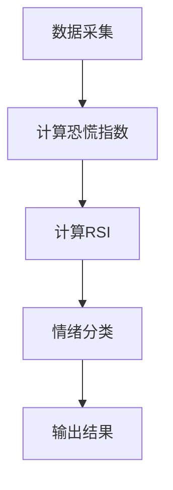
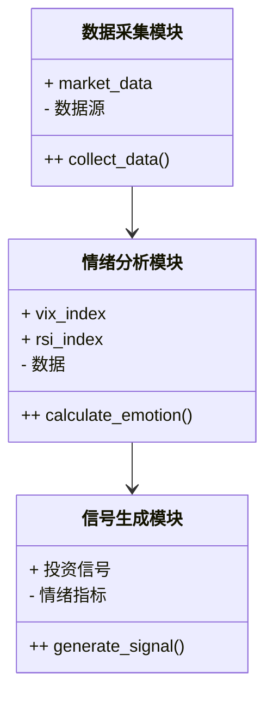
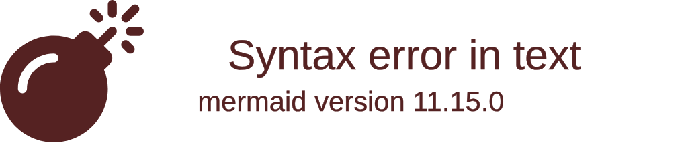

                 


# 巴菲特的逆向投资思维：贪婪与恐惧

> **关键词**：逆向投资思维、巴菲特、贪婪、恐惧、市场情绪、投资策略、价值投资

> **摘要**：本文深入探讨了巴菲特的逆向投资思维，重点分析了贪婪与恐惧这两种情绪在投资决策中的作用。通过结合心理学、技术分析和系统设计，本文详细阐述了如何利用贪婪与恐惧进行投资策略的制定与实施。从理论到实践，本文为投资者提供了系统的指导，帮助他们在市场波动中做出明智的决策。

---

## 第一部分：逆向投资思维的背景与核心概念

### 第1章：逆向投资思维的起源与巴菲特的投资理念

#### 1.1 逆向投资思维的起源

逆向思维是一种与传统思维相反的思维方式，它强调在别人犹豫不决时采取行动，在别人疯狂时保持冷静。这种思维模式在投资领域中尤为重要，因为它帮助投资者避免了情绪化决策的陷阱。逆向思维的起源可以追溯到古典哲学，但真正将其系统应用于投资领域的是沃伦·巴菲特。

#### 1.2 巴菲特的投资策略

巴菲特的投资理念以价值投资为核心，他强调购买被市场低估的资产，并长期持有。逆向思维在巴菲特的投资策略中扮演了重要角色，他常常在市场恐慌时买入，在市场疯狂时卖出。

#### 1.3 贪婪与恐惧的心理学分析

- **贪婪的定义与特点**：贪婪是一种强烈渴望获得更多利益的情绪，它可能导致投资者过度冒险，忽视潜在风险。贪婪通常出现在市场上涨阶段，投资者对未来的收益预期过高，容易产生非理性决策。
  
- **恐惧的定义与特点**：恐惧是害怕损失的心理状态，可能导致投资者在市场下跌时急于卖出，错失长期收益的机会。恐惧通常出现在市场下跌阶段，投资者对未来的不确定性感到担忧。

**对比分析表：**

| 情绪 | 表现 | 影响 |
|------|------|------|
| 贪婪 | 过度自信，追求高回报 | 导致市场泡沫，投资者可能高位买入 |
| 恐惧 | 过度谨慎，避免损失 | 导致市场恐慌，投资者可能低位卖出 |

---

### 第2章：贪婪与恐惧在投资中的具体表现

#### 2.1 贪婪的表现与影响

- **贪婪的表现**：投资者在市场繁荣时不断加仓，追求短期收益，忽视长期风险。
- **贪婪的影响**：市场过度投机，资产价格虚高，容易引发泡沫破裂。

#### 2.2 恐惧的表现与影响

- **恐惧的表现**：投资者在市场下跌时急于抛售，担心进一步损失。
- **恐惧的影响**：市场流动性下降，资产价格被低估，错失长期投资机会。

#### 2.3 贪婪与恐惧的对比分析

- **心理机制对比**：贪婪源于对收益的渴望，而恐惧源于对损失的担忧。
- **市场行为对比**：贪婪导致买入行为增加，恐惧导致卖出行为增加。
- **市场阶段对比**：贪婪常见于牛市顶部，恐惧常见于熊市底部。

---

## 第二部分：算法原理讲解

### 第3章：市场情绪分析算法

#### 3.1 贪婪与恐惧的量化指标

- **恐慌指数（VIX）**：衡量市场波动性的指标，数值越高，市场情绪越恐慌。
- **相对强弱指数（RSI）**：衡量资产价格的超买或超卖状态，帮助识别市场情绪。

#### 3.2 市场情绪分析的算法步骤

1. 数据采集：获取历史价格数据和市场指标。
2. 指标计算：计算恐慌指数和RSI等情绪指标。
3. 情绪分类：根据指标值将市场情绪分为贪婪或恐惧。

**mermaid流程图：**



#### 3.3 Python实现

```python
import pandas as pd
import numpy as np

def calculate_vix(closes, opens, highs, lows):
    # 计算VIX指标
    returns = np.log(highs / lows)
    vix = pd.Series.rolling(returns, window=20).std() * np.sqrt(252)
    return vix

def calculate_rsi(close_prices, window=14):
    # 计算RSI指标
    delta = close_prices - close_prices.shift(1)
    up = delta.where(delta > 0, 0)
    down = -delta.where(delta < 0, 0)
    sma_up = up.rolling(window).mean()
    sma_down = down.rolling(window).mean()
    rsi = 100 - (sma_up / (sma_up + sma_down)) * 100
    return rsi

# 示例数据
data = {'close': [100, 102, 101, 103, 104],
        'open': [98, 99, 100, 101, 102],
        'high': [105, 106, 107, 108, 109],
        'low': [95, 96, 97, 98, 99]}
df = pd.DataFrame(data)

vix = calculate_vix(df['close'], df['open'], df['high'], df['low'])
rsi = calculate_rsi(df['close'])

print("VIX:", vix)
print("RSI:", rsi)
```

---

### 第4章：数学模型

#### 4.1 贪婪与恐惧的数学建模

恐慌指数（VIX）的计算公式为：

$$ VIX = \sqrt{252} \times \sigma_{\ln(\text{high}/\text{low})} $$

其中，$\sigma$ 表示标准差，$\ln$ 表示自然对数。

相对强弱指数（RSI）的计算公式为：

$$ RSI = 100 - \frac{100}{1 + \frac{\text{SMA}_{\text{up}}}{\text{SMA}_{\text{down}}}} $$

其中，$\text{SMA}_{\text{up}}$ 和 $\text{SMA}_{\text{down}}$ 分别表示上涨和下跌的平均值。

#### 4.2 数学模型的实现

通过上述公式，我们可以量化市场情绪，进而制定投资策略。

---

## 第三部分：系统分析与架构设计方案

### 第5章：基于贪婪与恐惧的投资系统设计

#### 5.1 系统功能设计

- **数据采集模块**：实时采集市场数据。
- **情绪分析模块**：计算恐慌指数和RSI。
- **信号生成模块**：根据情绪指标生成买入或卖出信号。

**mermaid类图：**



#### 5.2 系统架构设计

采用分层架构，包括数据层、业务逻辑层和应用层。

**mermaid架构图：**



---

## 第四部分：项目实战

### 第6章：投资系统实现与案例分析

#### 6.1 环境安装

安装必要的Python库，如pandas、numpy、matplotlib。

```bash
pip install pandas numpy matplotlib
```

#### 6.2 核心算法实现

实现情绪分析模块的Python代码。

```python
import pandas as pd
import numpy as np

def calculate_vix(highs, lows):
    returns = np.log(highs / lows)
    vix = returns.rolling(20).std() * np.sqrt(252)
    return vix

def calculate_rsi(close_prices, window=14):
    delta = close_prices - close_prices.shift(1)
    up = delta.where(delta > 0, 0)
    down = -delta.where(delta < 0, 0)
    sma_up = up.rolling(window).mean()
    sma_down = down.rolling(window).mean()
    rsi = 100 - (sma_up / (sma_up + sma_down)) * 100
    return rsi

# 示例数据
data = {'close': [100, 102, 101, 103, 104],
        'high': [105, 106, 107, 108, 109],
        'low': [95, 96, 97, 98, 99]}
df = pd.DataFrame(data)

vix = calculate_vix(df['high'], df['low'])
rsi = calculate_rsi(df['close'])

print("VIX:", vix)
print("RSI:", rsi)
```

#### 6.3 案例分析

以某段时间的市场数据为例，展示系统如何根据情绪指标生成投资信号。

---

## 第五部分：总结与最佳实践

### 第7章：总结与注意事项

#### 7.1 小结

逆向投资思维帮助投资者在市场波动中保持冷静，避免贪婪与恐惧的干扰。通过量化市场情绪，投资者可以制定更为科学的投资策略。

#### 7.2 最佳实践 tips

- **长期视角**：避免短期波动的干扰，坚持长期投资。
- **风险管理**：合理配置资产，分散投资风险。
- **持续学习**：保持对市场动态的敏感性，不断优化投资策略。

---

## 作者信息

**作者：AI天才研究院 & 禅与计算机程序设计艺术**

本文由AI天才研究院与禅与计算机程序设计艺术联合撰写，结合人工智能与投资心理学，为您提供专业的技术指导与投资建议。

---

**声明：本文为原创内容，未经授权不得转载。**

