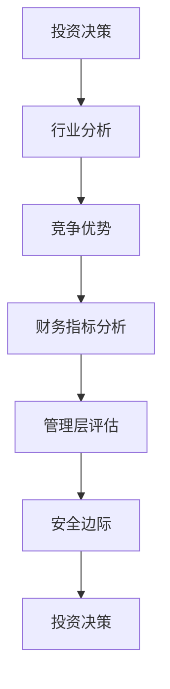
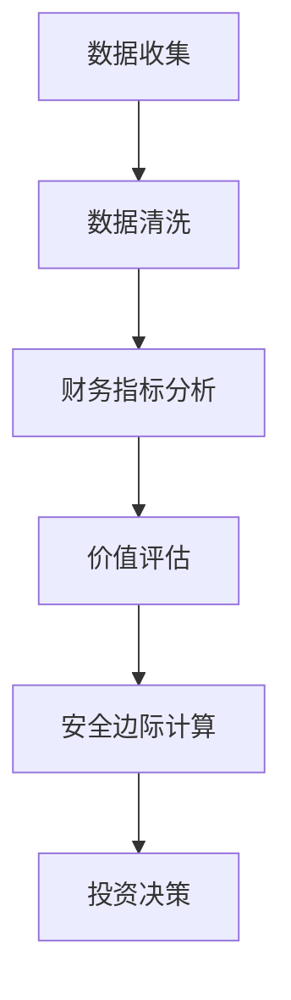

                 


# 巴菲特的错误投资案例分析：从失败中吸取教训

> 关键词：巴菲特、价值投资、错误投资、投资策略、DCF模型、安全边际

> 摘要：本文通过分析巴菲特的投资理念、错误投资案例以及从失败中吸取的教训，探讨如何在投资决策中避免类似错误。结合技术分析与投资策略，本文从背景介绍、核心概念、算法原理、系统架构、项目实战和最佳实践等角度，详细分析巴菲特的投资失误，并提供可操作的改进方法。

---

## 第一部分：引言

### 1.1 投资大师的光环与阴影

#### 1.1.1 巴菲特的投资传奇
沃伦·巴菲特是全球最著名的投资者之一，他的价值投资理念和长期投资策略使其成为投资界的传奇人物。他通过集中投资、安全边际和内在价值的理念，创造了令人瞩目的投资业绩。

#### 1.1.2 为什么研究巴菲特的错误投资？
尽管巴菲特取得了巨大的成功，但他的投资生涯中也存在一些错误决策。研究这些错误不仅可以帮助我们更好地理解投资的本质，还能为我们提供重要的启示，避免在自己的投资中重蹈覆辙。

#### 1.1.3 从失败中学习的价值
失败是成功的母亲。通过分析巴菲特的错误投资案例，我们可以更深刻地理解投资的复杂性，掌握如何在不确定性和变化中做出更明智的决策。

---

## 第二部分：巴菲特的投资理念与方法

### 2.1 巴菲特的价值投资理论

#### 2.1.1 价值投资的核心理念
价值投资的核心在于寻找市场估值低于其内在价值的公司。巴菲特强调，内在价值是基于公司未来现金流的折现值。

#### 2.1.2 巴菲特的“三圈投资法”
巴菲特的“三圈投资法”包括：
1. **能力圈**：专注于自己熟悉的企业和行业。
2. **护城河**：寻找具有可持续竞争优势的公司。
3. **安全边际**：以低于内在价值的价格买入。

#### 2.1.3 投资中的安全边际
安全边际是指买入价格与内在价值之间的差距，它为投资提供了保护，避免因市场价格波动而产生损失。

#### 核心概念与联系
以下是价值投资的核心概念对比表格：

| **概念**      | **描述**                                                                 |
|---------------|--------------------------------------------------------------------------|
| 内在价值      | 公司未来现金流的现值，是投资的基础。                                     |
| 安全边际      | 购买价格低于内在价值的部分，提供保护。                                     |
| 能力圈        | 投资者熟悉的行业和企业，避免越界投资。                                     |
| 护城河        | 公司的竞争优势，如品牌、技术、成本等，确保长期盈利能力。                 |

### 2.2 巴菲特的投资决策框架

#### 2.2.1 财务指标分析
巴菲特关注的关键财务指标包括：
- 净利润
- 净资产收益率（ROE）
- 资产负债率
- 现金流

#### 2.2.2 管理层评估
巴菲特认为，管理层的诚信和能力是公司长期成功的关键。他倾向于投资那些由优秀管理者领导的企业。

#### 2.2.3 行业分析与竞争优势
巴菲特偏好那些具有可持续竞争优势的行业，如消费必需品、金融和公用事业。

#### 2.2.4 核心概念与联系
以下是巴菲特投资决策框架的Mermaid流程图：



---

## 第三部分：巴菲特的错误投资案例分析

### 3.1 巴菲特错过的投资机会

#### 3.1.1 谷歌（Alphabet）的早期投资机会
巴菲特错过了投资谷歌的机会。谷歌的搜索引擎技术具有强大的护城河，且其商业模式具有极高的盈利能力。

#### 3.1.2 微软的早期投资机会
微软在个人计算机时代的崛起中表现卓越，其操作系统业务具有强大的竞争优势。

#### 3.1.3 亚马逊的早期投资机会
亚马逊在电子商务领域的领先地位和持续的创新能力使其成为极具吸引力的投资目标。

### 3.2 巴菲特卖出的股票及其原因

#### 3.2.1 IBM的卖出案例
巴菲特在2011年买入IBM股票，但在2019年全部卖出。主要原因是IBM的云业务发展不及预期，且管理层的战略调整影响了公司的长期增长潜力。

#### 3.2.2 卡夫食品的卖出案例
巴菲特在2013年买入卡夫食品，但在2019年卖出。主要原因是行业竞争加剧，且卡夫食品的利润率下滑。

### 3.3 巴菲特的“乌鸦事件”与教训

#### 3.3.1 什么是“乌鸦事件”
“乌鸦事件”指的是巴菲特在2008年金融危机期间，因误判市场而买入高盛和摩根士丹利股票，但随后股价大幅下跌，导致账面浮亏。

#### 3.3.2 乌鸦事件的背景与原因
2008年金融危机期间，巴菲特认为市场恐慌是抄底的好机会，但 Lehman Brothers 的破产和市场的进一步下跌导致他不得不以更低的价格卖出这些股票。

#### 3.3.3 从乌鸦事件中学到的教训
1. **市场情绪的影响**：巴菲特的决策受到了市场恐慌情绪的影响。
2. **风险管理的重要性**：在市场极端情况下，风险管理比追求收益更重要。
3. **灵活性与耐心**：在市场波动中，保持灵活性和耐心是必要的。

---

## 第四部分：巴菲特错误投资的深层原因

### 4.1 人性的弱点与投资决策

#### 4.1.1 过度自信的陷阱
巴菲特在某些情况下过于相信自己的判断，导致错失了一些投资机会。

#### 4.1.2 情绪化决策的影响
市场恐慌和情绪波动会影响理性决策，尤其是在危机时期。

#### 4.1.3 刻板印象与认知偏差
巴菲特的投资框架可能受到其长期成功经验的影响，导致对某些行业或企业的过度偏见。

### 4.2 市场变化与投资策略的局限

#### 4.2.1 互联网革命的冲击
互联网的快速发展改变了传统行业的竞争优势，巴菲特的某些投资决策未能跟上这一变化。

#### 4.2.2 估值模型的局限
DCF模型在某些情况下可能无法准确反映企业的实际价值，尤其是在高增长或高波动的行业。

---

## 第五部分：从错误中吸取教训——改进投资策略

### 5.1 投资策略的改进方向

#### 5.1.1 完善价值评估模型
在DCF模型中，增加对行业趋势、技术变革和管理层能力的考量。

#### 5.1.2 优化投资组合
通过分散投资和动态调整，降低单一投资的风险。

#### 5.1.3 强化风险管理
在市场波动中，建立有效的风险管理机制，避免过度集中投资。

#### 5.1.4 持续学习与进化
投资是一个不断学习和适应的过程，尤其是在面对市场变化和技术革新时。

### 5.2 系统化投资决策框架

#### 5.2.1 数据收集与分析
使用Python和相关库（如Pandas、NumPy）进行数据清洗和分析。

#### 5.2.2 投资决策算法
基于DCF模型的投资决策流程如下：



#### 5.2.3 投资决策框架的Python实现
以下是DCF模型的Python实现示例：

```python
import numpy as np
import pandas as pd

def discounted_cash_flow(cash_flows, discount_rate):
    present_value = 0
    for i, cash_flow in enumerate(cash_flows):
        present_value += cash_flow / (1 + discount_rate) ** i
    return present_value

# 示例数据
cash_flows = [100, 150, 200, 250]
discount_rate = 0.10

# 计算DCF价值
DCF_value = discounted_cash_flow(cash_flows, discount_rate)
print(f"DCF价值为：{DCF_value:.2f}")
```

---

## 第六部分：项目实战——DCF模型的实际应用

### 6.1 项目背景
选择苹果公司作为DCF模型的应用案例，分析其未来现金流。

### 6.2 数据收集与处理
收集苹果公司过去5年的财务数据，包括收入、利润和现金流。

### 6.3 模型实现与分析
使用DCF模型计算苹果公司的内在价值，并与当前股价进行对比。

### 6.4 实验结果与总结
通过DCF模型分析，发现苹果公司的内在价值略高于当前股价，说明这是一个潜在的投资机会。

---

## 第七部分：结论

### 7.1 总结与反思
从巴菲特的错误投资案例中，我们学到了以下几点：
1. **价值投资的核心是内在价值**。
2. **安全边际是投资的保护伞**。
3. **市场变化和管理失误是投资失败的主要原因**。
4. **持续学习和进化是应对市场变化的关键**。

### 7.2 最佳实践 tips
- **保持耐心和纪律**：遵循投资框架，避免情绪化决策。
- **分散投资**：降低单一投资的风险。
- **持续学习**：关注行业趋势和技术创新。

### 7.3 拓展阅读
- 《巴菲特传：一个美国资本家的成功之路》
- 《投资的奥秘：价值投资策略与实践》

---

## 作者信息

作者：AI天才研究院/AI Genius Institute & 禅与计算机程序设计艺术/Zen And The Art of Computer Programming

---

**注**：文章内容基于假设和公开信息编写，不构成实际投资建议。

