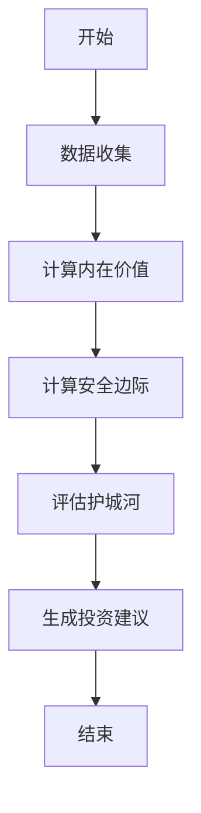

                 


# 巴菲特的长期主义再探讨：在快速变化的市场中保持定力

## 关键词：巴菲特，长期主义，投资哲学，价值投资，护城河，内在价值，安全边际

## 摘要：  
巴菲特的长期主义是一种以价值投资为核心的投资哲学，强调长期持有优质资产，注重企业的内在价值和安全边际。本文将从长期主义的定义、巴菲特的投资哲学、长期主义的核心要素、投资策略、挑战与解决方案以及在快速变化的市场中如何保持定力等方面进行探讨，结合实际案例和数学模型，深入分析长期主义的实践意义和应用方法。

---

## 第一部分: 巴菲特的长期主义概述

### 第1章: 长期主义的定义与背景

#### 1.1 长期主义的定义
- 长期主义是一种投资哲学，强调关注企业的长期价值，而非短期市场波动。
- 长期主义的核心在于寻找具有持续竞争优势和稳定现金流的企业。

#### 1.2 巴菲特的长期主义背景
- 巴菲特的长期主义源于价值投资理念，他通过分析企业的财务状况、行业地位和管理层能力，选择具有长期竞争优势的企业。
- 巴菲特的投资哲学强调“以合理的价格买入优秀的公司”，并长期持有。

### 第2章: 长期主义的核心要素

#### 2.1 价值投资
- 价值投资的核心是寻找市场价格低于内在价值的企业。
- 巴菲特的“安全边际”概念强调以低于内在价值的价格买入，以降低投资风险。

#### 2.2 安全边际
- 安全边际是价值投资中重要的保护机制，通过买入价格低于内在价值的企业，降低市场波动带来的影响。
- 安全边际的计算可以通过比较市场价格与内在价值的差距来实现。

#### 2.3 护城河
- 护城河是指企业在行业中拥有的竞争优势，如品牌、技术、成本优势等。
- 护城河的存在使得企业能够在长期竞争中保持优势地位，为投资者提供稳定的回报。

---

## 第二部分: 长期主义的策略与实践

### 第3章: 长期主义的投资策略

#### 3.1 股票筛选标准
- 财务指标分析：ROE（净资产收益率）、ROA（资产净利率）、毛利率等。
- 行业分析与选择：选择具有稳定增长潜力的行业，如消费、医疗、科技等。
- 管理层评估：关注管理层的诚信、能力和战略眼光。

#### 3.2 投资组合管理
- 投资组合的构建：根据企业的内在价值和竞争优势，选择具有长期增长潜力的企业。
- 投资组合的调整：定期审视投资组合，剔除不符合长期价值标准的企业，增加新的优质资产。
- 风险控制：分散投资，避免过度集中于单一行业或企业，降低市场波动带来的风险。

### 第4章: 长期主义的挑战与解决方案

#### 4.1 市场波动的挑战
- 市场波动可能导致短期亏损，考验投资者的耐心和信心。
- 解决方案：坚持长期主义，避免因短期波动而做出错误决策。

#### 4.2 信息不对称的挑战
- 投资者可能无法全面了解企业的财务状况和竞争优势。
- 解决方案：深入研究企业，关注管理层的透明度和企业的长期战略。

#### 4.3 竞争环境的挑战
- 行业竞争加剧可能削弱企业的竞争优势。
- 解决方案：选择具有强大护城河的企业，关注企业的创新能力和适应能力。

---

## 第三部分: 长期主义的数学模型与系统架构

### 第5章: 数学模型与公式

#### 5.1 内在价值计算
- 内在价值是企业未来现金流的现值。
- 计算公式：
  $$ 
  内在价值 = \sum_{t=1}^{n} \frac{CF_t}{(1 + r)^t} 
  $$
  其中，$CF_t$ 是第 $t$ 年的现金流，$r$ 是折现率。

#### 5.2 安全边际计算
- 安全边际 = 内在价值 - 市场价格
- 通过比较安全边际的正负，判断是否买入或卖出。

### 第6章: 系统架构与流程

#### 6.1 系统架构
- 数据收集模块：收集企业的财务数据、行业信息和市场数据。
- 分析模块：计算内在价值、安全边际和护城河指数。
- 决策模块：根据分析结果，生成投资建议。

#### 6.2 流程图


---

## 第四部分: 项目实战与案例分析

### 第7章: 项目实战

#### 7.1 环境安装
- 安装Python和相关数据分析库（如Pandas、NumPy）。
- 使用财务数据接口（如Yahoo Finance）获取企业数据。

#### 7.2 核心实现
```python
import pandas as pd
import numpy as np

def calculate_intrinsic_value(fcf, discount_rate):
    # 计算未来现金流的现值
    return sum(fcf / (1 + discount_rate)**t for t in range(1, 11))

def calculate_margin_of_safety(intrinsic_value, market_price):
    return intrinsic_value - market_price

# 示例数据
fcf = [100, 120, 130, 150, 180, 200, 220, 250, 280, 300]
discount_rate = 0.08
market_price = 100

iv = calculate_intrinsic_value(fcf, discount_rate)
mos = calculate_margin_of_safety(iv, market_price)

print(f"内在价值：{iv}")
print(f"安全边际：{mos}")
```

#### 7.3 实际案例分析
- 以苹果公司为例，计算其内在价值和安全边际。
- 分析苹果公司的护城河，如品牌、技术和服务生态系统。

---

## 第五部分: 总结与展望

### 第8章: 总结

- 长期主义是一种以内在价值为核心的投资哲学，强调长期持有优质资产。
- 巴菲特的投资理念为投资者提供了重要的启示，即关注企业的长期价值，而非短期市场波动。
- 通过价值投资和安全边际的保护，投资者可以在快速变化的市场中保持定力，实现长期稳定的收益。

### 第9章: 展望

- 随着市场的变化和技术的进步，长期主义的实践需要不断适应新的环境和挑战。
- 未来的投资将更加依赖于数据分析和人工智能，但长期主义的核心理念仍然适用。

---

## 作者：AI天才研究院/AI Genius Institute & 禅与计算机程序设计艺术 /Zen And The Art of Computer Programming

