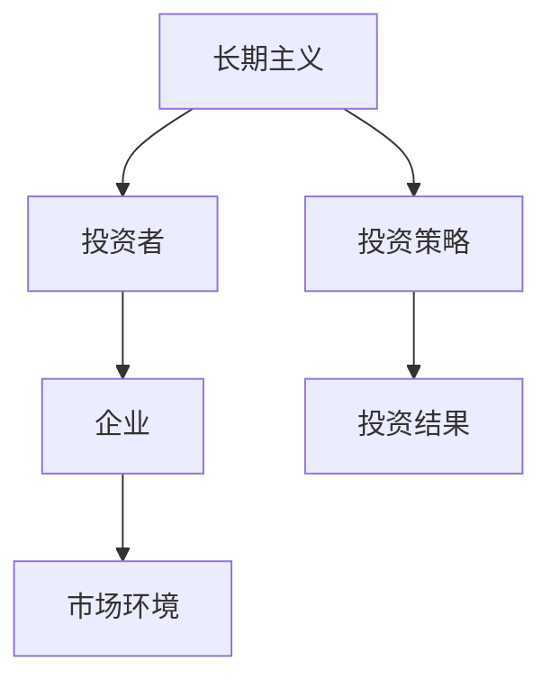
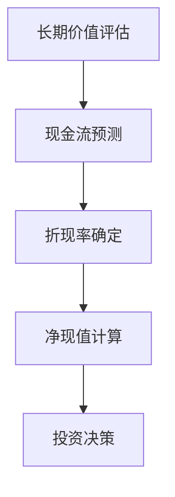
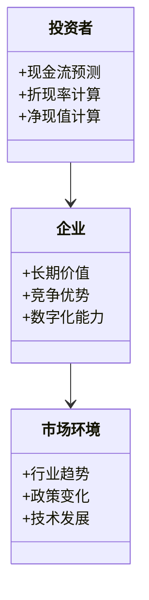
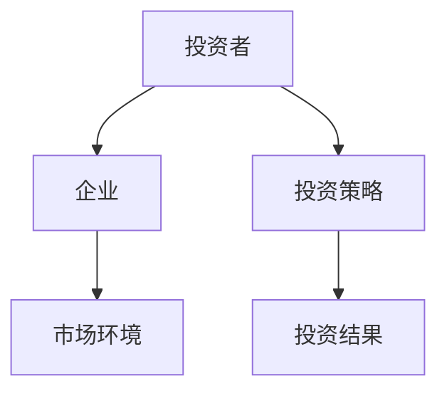

                 


# 巴菲特的长期主义在快速迭代的数字经济中的调整

## 关键词：长期主义，巴菲特，数字经济，投资策略，价值投资，风险管理

## 摘要：  
本文探讨了巴菲特的长期主义投资理念在快速迭代的数字经济中的调整与应用。通过对长期主义核心概念的重新解读、数学模型的建立、系统架构的设计以及实际案例的分析，本文试图为投资者和企业管理者提供在数字经济环境下如何实践长期主义的指导。文章从背景介绍、核心概念、算法原理、系统分析、项目实战到小结，逐步展开，深入剖析长期主义在数字经济中的调整与优化。

---

## 第一部分：背景介绍

### 第1章：长期主义的核心概念与背景

#### 1.1 长期主义的定义与演变  
- **长期主义的定义**：以长期价值为核心的投资理念，强调企业基本面、竞争优势和持续盈利能力。  
- **长期主义的演变**：从传统制造业到信息技术产业，再到当前的数字经济，长期主义的内涵逐步扩展，从关注企业盈利能力到关注企业数字化转型能力。  

#### 1.2 数字经济的特点与挑战  
- **数字经济的特点**：数据驱动、技术创新、快速迭代、全球化。  
- **数字经济的挑战**：技术风险、市场不确定性、政策变化对企业长期价值的影响。  
- **长期主义与数字经济的结合**：在数字经济中，长期主义需要关注企业的技术创新能力、数据资产的价值以及数字化转型的可持续性。  

#### 1.3 长期主义在数字经济中的重要性  
- **长期主义的核心作用**：在数字经济中，长期主义可以帮助投资者识别真正具备竞争优势的企业，避免短期波动的干扰。  
- **长期主义与企业战略的结合**：企业需要通过长期主义理念制定战略，抓住数字经济中的发展机遇。  

---

## 第二部分：长期主义的核心概念与联系

### 第2章：长期主义的核心原理与概念属性

#### 2.1 长期主义的核心原理  
- **长期主义的哲学基础**：追求长期价值而非短期收益。  
- **长期主义的经济学解释**：基于基本面分析和企业竞争优势的投资策略。  
- **长期主义与价值投资的关系**：长期主义是价值投资的核心理念，强调企业的内在价值和长期增长潜力。  

#### 2.2 长期主义的概念属性特征对比  
| 概念 | 长期主义 | 短期主义 | 风险投资 | 趋势投资 |  
|------|----------|----------|----------|----------|  
| 时间跨度 | 长期（5年以上） | 短期（1-3年） | 中期（3-5年） | 长期与中期结合 |  
| 投资目标 | 企业长期价值 | 企业短期收益 | 技术创新与市场机会 | 行业趋势与周期 |  
| 风险承受 | 高 | 低 | 中 | 高 |  

#### 2.3 长期主义的ER实体关系图  


---

## 第三部分：长期主义的算法原理讲解

### 第3章：长期主义的数学模型与公式

#### 3.1 长期主义的数学模型  
- **长期价值计算模型**：基于现金流折现法（DCF模型）。  
  公式：$$V = \sum_{t=1}^{\infty} \frac{CF_t}{(1+r)^t}$$  
  其中，\(CF_t\) 是第 \(t\) 年的现金流，\(r\) 是折现率。  

- **投资回报预测模型**：基于资产的未来现金流折现。  
  公式：$$NPV = \sum_{t=1}^{n} \frac{CF_t}{(1+r)^t} - Initial\ Investment$$  

- **风险调整后的长期收益模型**：基于风险调整的资本资产定价模型（CAPM）。  
  公式：$$E(R_i) = R_f + \beta_i (R_m - R_f)$$  

#### 3.2 算法流程图（Mermaid）  


---

## 第四部分：系统分析与架构设计方案

### 第4章：数字经济中的长期主义系统分析

#### 4.1 问题场景介绍  
- **问题描述**：在数字经济中，企业价值的评估需要考虑数据资产、技术壁垒和数字化转型能力。  
- **边界与外延**：长期主义的系统分析需要涵盖企业内部的数字化能力、外部的市场环境以及政策环境。  

#### 4.2 系统功能设计（领域模型）  


#### 4.3 系统架构设计（Mermaid）  


---

## 第五部分：项目实战与案例分析

### 第5章：数字经济中的长期主义项目实战

#### 5.1 环境安装与数据准备  
- **环境安装**：安装Python、Pandas、Matplotlib等工具。  
- **数据准备**：收集企业的财务数据、市场数据和数字化能力指标。  

#### 5.2 系统核心实现源代码  
```python
def calculate_long_term_value(cash_flows, discount_rate):
    present_value = 0
    for t in range(len(cash_flows)):
        present_value += cash_flows[t] / (1 + discount_rate) ** t
    return present_value

# 示例数据
cash_flows = [100, 200, 300, 400]
discount_rate = 0.1

lt_value = calculate_long_term_value(cash_flows, discount_rate)
print(f"长期价值：{lt_value}")
```

#### 5.3 代码应用解读与分析  
- **代码功能**：计算企业在不同年份的现金流折现值，评估其长期价值。  
- **应用案例**：以一家科技公司为例，分析其数字化能力对企业长期价值的影响。  

---

## 第六部分：小结与展望

### 第6章：小结与展望

#### 6.1 最佳实践 tips  
- **长期主义的核心**：关注企业的长期价值创造能力，而非短期收益。  
- **数字经济的挑战**：在数字经济中，长期主义需要结合企业的数字化转型能力和技术创新能力。  
- **风险管理**：在数字经济中，长期主义需要结合风险投资的思路，关注企业的风险控制能力。  

#### 6.2 展望  
- **未来趋势**：随着技术的进步和市场的变化，长期主义在数字经济中的应用将更加广泛和深入。  
- **技术创新**：人工智能和大数据技术将为长期主义的实践提供更多的工具和方法。  

---

## 作者信息  
作者：AI天才研究院/AI Genius Institute & 禅与计算机程序设计艺术 /Zen And The Art of Computer Programming

