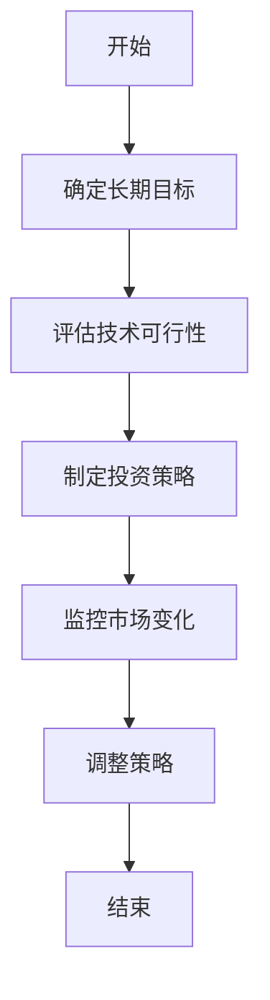
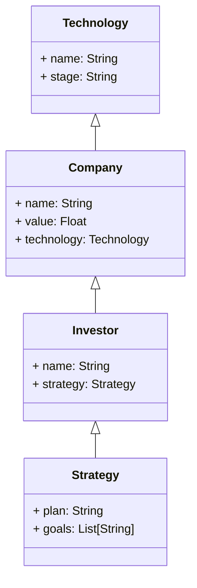
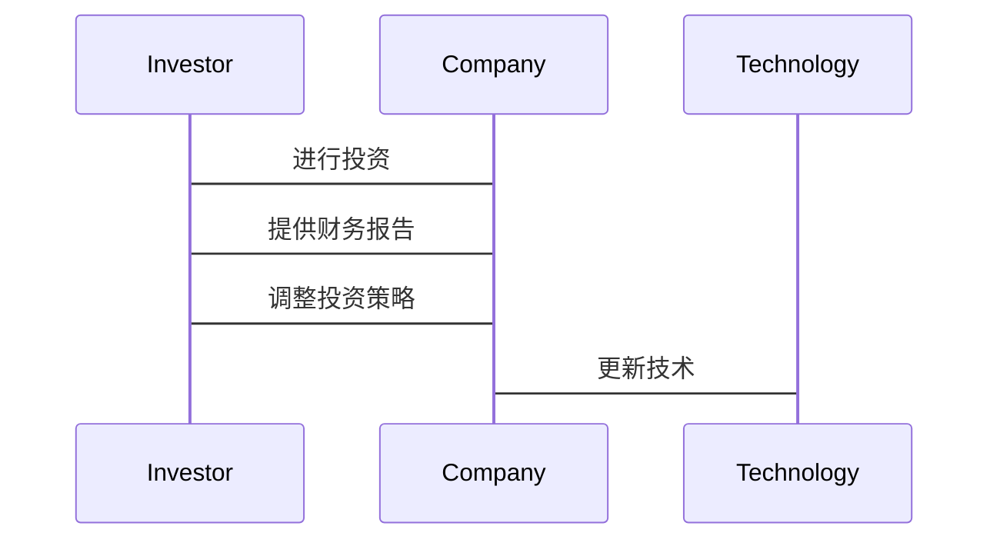
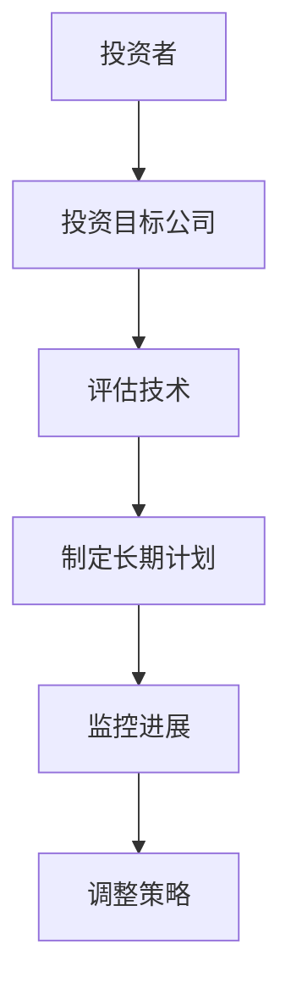

                 


# 巴菲特的长期主义在快速迭代的生物技术领域的调整

> 关键词：长期主义，巴菲特，生物技术，投资策略，快速迭代，价值投资，技术分析

> 摘要：本文探讨了巴菲特的长期主义投资理念在快速迭代的生物技术领域的应用与调整。通过分析生物技术行业的特点，结合长期主义的核心理念，提出了在快速变化的环境中如何调整投资策略的方法，包括系统架构设计、算法实现和实际案例分析。

---

## 正文

### 第一部分：背景介绍

#### 第1章：长期主义的基本概念

##### 1.1 长期主义的定义与核心理念

长期主义是一种投资和管理策略，强调关注长期目标和可持续发展，而非短期收益。其核心理念包括价值投资、风险管理、耐心资本和持续创新。长期主义认为，短期波动不应影响长期战略的制定和执行，通过持续积累和优化实现最终目标。

##### 1.2 巴菲特的投资理念

巴菲特是长期主义的代表人物，他的投资策略基于以下几个核心原则：
- **价值投资**：寻找具有长期竞争优势和良好管理的公司，关注其内在价值。
- **风险管理**：避免高风险投资，确保投资组合的稳健性。
- **长期持有**：长期持有优质资产，避免频繁交易。

##### 1.3 生物技术领域的现状与挑战

生物技术领域具有高度的不确定性和快速迭代的特点。技术创新、政策变化和市场波动都可能对企业的生存和发展产生重大影响。此外，生物技术的研发周期长、成本高，且失败率较高，这些特点对长期主义的应用提出了新的挑战。

#### 1.4 长期主义在生物技术中的重要性

在生物技术领域，长期主义可以帮助投资者和企业在波动中保持战略定力，关注技术创新和市场渗透的长期价值。通过长期投资，企业可以积累技术和资源，应对快速变化的市场环境。

---

### 第二部分：核心概念与联系

#### 第2章：长期主义与生物技术的核心概念

##### 2.1 长期主义与生物技术的关系

长期主义强调的长期价值与生物技术的长期研发周期相契合。通过长期投资，企业可以支持创新，应对技术挑战，最终实现可持续发展。

##### 2.2 核心概念的对比分析

以下是长期主义与快速迭代在生物技术中的对比分析：

| 对比维度      | 长期主义              | 快速迭代              |
|---------------|-----------------------|-----------------------|
| 时间跨度      | 强调长期目标           | 强调短期快速变化       |
| 投资策略      | 价值投资，长期持有     | 灵活调整，快速反应     |
| 风险管理      | 侧重长期风险管理       | 侧重短期风险控制       |
| 创新驱动      | 技术创新为核心         | 快速试错，快速迭代     |

##### 2.3 实体关系图

以下是长期主义与生物技术领域的关系的ER图：

```mermaid
erDiagram
    company : 公司
    investor : 投资者
    technology : 技术
    market : 市场
    strategy : 策略
    company --> technology : 拥有
    company --> market : 受影响于
    investor --> company : 投资于
    investor --> strategy : 制定
    technology --> strategy : 支持
```

---

### 第三部分：算法原理

#### 第3章：长期主义在生物技术中的算法实现

##### 3.1 算法流程图

以下是长期主义在生物技术中的算法流程图：



##### 3.2 数学模型与公式

以下是用于评估生物技术公司长期价值的数学模型：

$$ V = \frac{CF}{r - g} $$

其中：
- \( V \) 是公司的价值
- \( CF \) 是公司的自由现金流
- \( r \) 是折现率
- \( g \) 是现金流增长率

##### 3.3 Python代码实现

以下是用于预测生物技术公司价值的Python代码：

```python
def calculate_value(cf, r, g):
    return cf / (r - g)

# 示例数据
cf = 100  # 自由现金流
r = 0.10  # 折现率
g = 0.05  # 增长率

value = calculate_value(cf, r, g)
print(f"公司价值：{value:.2f}")
```

---

### 第四部分：系统架构设计

#### 第4章：长期主义策略的系统架构

##### 4.1 系统功能设计

以下是长期主义策略的系统功能设计：



##### 4.2 系统架构图

以下是系统的架构图：

```mermaid
container 生物技术领域 {
    Company
    Technology
    Investor
    Strategy
}
```

##### 4.3 接口设计与交互

以下是投资者与公司之间的交互流程图：



---

### 第五部分：项目实战

#### 第5章：长期主义在生物技术中的实际应用

##### 5.1 案例分析

以某生物技术公司为例，分析长期主义的应用：



##### 5.2 项目小结

通过实际案例分析，展示了长期主义在生物技术中的应用，强调了长期投资和技术创新的重要性。

---

### 第六部分：最佳实践

#### 第6章：长期主义在生物技术中的最佳实践

##### 6.1 小结

长期主义在生物技术领域的应用需要结合技术、市场和管理的多方面因素，注重长期价值的创造和积累。

##### 6.2 注意事项

- 风险管理是长期投资的重要部分
- 技术创新是长期发展的核心
- 市场变化需要及时调整策略

##### 6.3 拓展阅读

建议阅读以下书籍和文章：
- 巴菲特的《股东的资本主义》
- 技术分析相关书籍

---

作者：AI天才研究院/AI Genius Institute & 禅与计算机程序设计艺术 /Zen And The Art of Computer Programming

