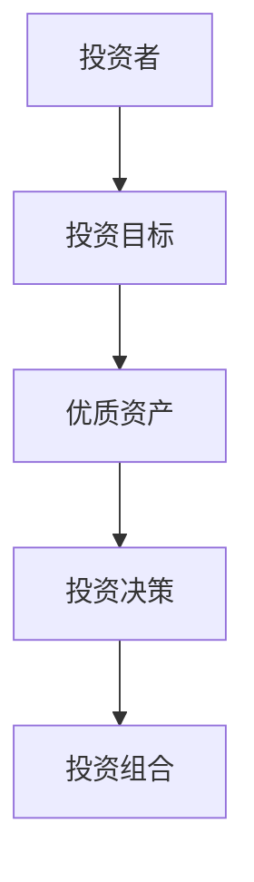
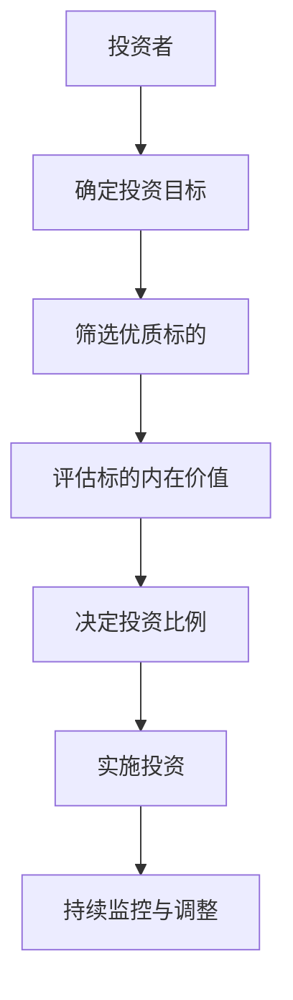
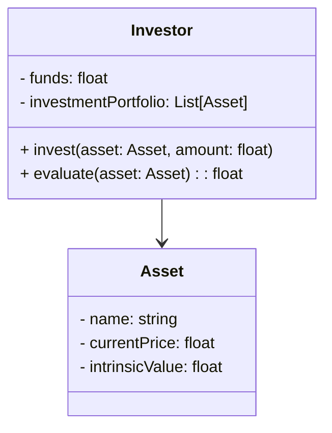
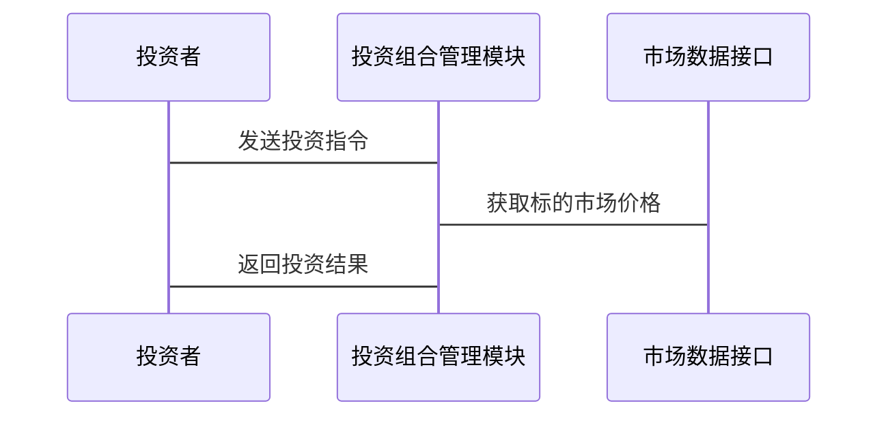

                 


# 巴菲特的集中投资理念

> 关键词：集中投资、巴菲特、价值投资、投资策略、投资理念

> 摘要：本文深入探讨巴菲特的集中投资理念，从基本概念、核心原理、算法模型到系统架构，结合实际案例，详细分析集中投资的策略、方法及其在投资实践中的应用。通过本文，读者将能够理解集中投资的内在逻辑、数学模型、系统架构，并通过实际案例掌握其在投资组合优化中的应用。

---

## 第一部分: 巴菲特的集中投资理念概述

### 第1章: 投资的基本概念

#### 1.1 投资的基本定义
- **投资的定义与分类**
  - 投资是指将资金投入某个项目或资产，以期望在未来获得收益或资本增值。
  - 投资可以分为股票、债券、房地产等多种形式。
- **投资的基本原则**
  - 长期视角：投资不是短期的交易，而是长期的价值创造。
  - 风险控制：投资需考虑本金的安全性，避免过高风险。
  - 价值评估：投资需基于对标的内在价值的准确评估。
- **投资与投机的区别**
  - 投资：基于基本面分析，追求长期稳定的回报。
  - 投机：基于市场情绪和短期价格波动，风险较高。

#### 1.2 巴菲特的投资哲学
- **巴菲特的生平简介**
  - 巴菲特是世界著名投资家，伯克希尔·哈撒韦公司创始人，以价值投资理念闻名。
- **巴菲特的投资理念核心**
  - 长期持有优质资产，追求内在价值的增长。
  - 集中投资于少数优质企业，降低投资组合的风险。
- **巴菲特的投资风格分析**
  - 价值投资：寻找被市场低估的企业。
  - 长期持有：避免频繁交易，减少成本。
  - 集中投资：将资金集中在少数优质企业上。

---

### 第2章: 集中投资的背景与问题背景

#### 2.1 集中投资的定义与特点
- **集中投资的定义**
  - 集中投资是指将大部分资金投资于少数优质标的，以获得超额回报。
- **集中投资的核心要素**
  - 选择优质企业：具备强大的竞争优势和持续的盈利能力。
  - 长期持有：等待企业内在价值的增长。
  - 集中配置：将资金集中在少数优质企业上。
- **集中投资的边界与外延**
  - 边界：集中投资的核心是选择优质企业，避免投资于低质量资产。
  - 外延：集中投资可以应用于股票、债券等多种资产类别。

#### 2.2 集中投资的问题背景
- **投资者分散投资的误区**
  - 分散投资可能导致收益稀释，难以获得超额回报。
  - 分散投资增加了管理成本，降低了投资效率。
- **集中投资的风险与挑战**
  - 集中投资的风险在于市场波动可能导致短期亏损。
  - 集中投资需要投资者具备较高的市场判断能力和心理承受能力。
- **集中投资的适用场景**
  - 当市场中存在明显的低估企业时，集中投资是有效的策略。
  - 当市场处于稳定增长阶段时，集中投资可以获取更高的收益。

---

### 第3章: 集中投资的核心概念与联系

#### 3.1 核心概念原理
- **集中投资的内在逻辑**
  - 集中投资的核心是通过选择优质企业，降低投资组合的风险。
  - 优质企业具备强大的竞争优势和持续的盈利能力。
- **集中投资与分散投资的对比**
  - 集中投资：收益高，风险高。
  - 分散投资：收益低，风险低。
- **集中投资的数学模型**
  - 集中投资的收益取决于优质企业的内在价值增长。
  - 数学模型：$ V = \sum_{t=1}^{n} \frac{CF_t}{(1 + r)^t} $

#### 3.2 核心概念属性特征对比表格
| 投资策略 | 集中投资 | 分散投资 |
|----------|----------|----------|
| 投资标的数量 | 少        | 多        |
| 风险水平    | 高        | 低        |
| 收益潜力    | 高        | 中        |
| 管理成本    | 低        | 高        |

#### 3.3 实体关系图（ER图）架构


---

### 第4章: 集中投资的算法原理讲解

#### 4.1 算法原理概述
- **集中投资的决策流程**
  - 确定投资目标：选择具备竞争优势和持续盈利能力的企业。
  - 评估标的内在价值：计算企业的现值和未来现金流。
  - 决定投资比例：根据企业的内在价值和市场估值，决定投资比例。
  - 实施投资：将资金集中投向优质企业。
  - 持续监控与调整：定期评估投资组合，根据市场变化进行调整。
- **投资组合优化的数学模型**
  - 现值公式：$$ V = \sum_{t=1}^{n} \frac{CF_t}{(1 + r)^t} $$
  - 内在价值公式：$$ IV = \sum_{t=1}^{\infty} \frac{CF_t}{(1 + r)^t} $$

#### 4.2 算法流程图（Mermaid）


---

### 第5章: 数学模型与公式

#### 5.1 投资价值评估模型
- **现值公式**
  $$ V = \sum_{t=1}^{n} \frac{CF_t}{(1 + r)^t} $$
- **内在价值公式**
  $$ IV = \sum_{t=1}^{\infty} \frac{CF_t}{(1 + r)^t} $$

#### 5.2 投资组合优化公式
- **马科维茨投资组合理论**
  $$ \text{Minimize } \sigma^2 \text{ subject to } \mu \geq \text{目标收益} $$

---

### 第6章: 系统分析与架构设计方案

#### 6.1 问题场景介绍
- **投资者面临的挑战**
  - 市场波动大，投资标的选择困难。
  - 分散投资难以获得超额收益。
- **集中投资的解决方案**
  - 选择优质企业，集中投资，降低风险。

#### 6.2 系统功能设计
- **领域模型（Mermaid类图）**


#### 6.3 系统架构设计
- **系统架构（Mermaid架构图）**
```mermaid
container 投资者系统 {
    module 投资者界面
    module 投资组合管理
    module 市场数据接口
}
```

#### 6.4 系统交互设计
- **系统交互（Mermaid序列图）**


---

## 第七章: 项目实战

### 7.1 环境安装
- **安装Python环境**
  - 使用Anaconda安装Python 3.8或更高版本。
- **安装相关库**
  - 使用pip安装numpy、pandas、scipy等库。

### 7.2 核心实现源代码
```python
import numpy as np
import pandas as pd

def calculate_intrinsic_value(cash_flows, discount_rate):
    """
    计算企业内在价值的函数
    """
    return np.npv(discount_rate, cash_flows)

def investment_strategy(stocks, weights):
    """
    集中投资策略实现
    """
    portfolio = pd.DataFrame({'股票': stocks, '权重': weights})
    return portfolio

# 示例数据
cash_flows = [100, 150, 200, 250]
discount_rate = 0.08

iv = calculate_intrinsic_value(cash_flows, discount_rate)
print(f"内在价值: {iv}")

stocks = ['AAPL', 'MSFT', 'BRK.B']
weights = [0.4, 0.4, 0.2]
portfolio = investment_strategy(stocks, weights)
print("投资组合:\n", portfolio)
```

### 7.3 代码应用解读与分析
- **代码功能解读**
  - `calculate_intrinsic_value`函数用于计算企业的内在价值。
  - `investment_strategy`函数用于构建投资组合。
- **代码实现细节**
  - 使用numpy和pandas进行数据处理和计算。
  - 示例数据展示了如何计算内在价值和构建集中投资组合。

### 7.4 实际案例分析
- **案例分析：巴菲特投资可口可乐**
  - 可口可乐的内在价值：通过现金流折现法计算。
  - 投资比例：巴菲特将大量资金投入可口可乐，体现了集中投资的理念。
- **详细讲解剖析**
  - 可口可乐的内在价值计算：
    $$ IV = \sum_{t=1}^{\infty} \frac{CF_t}{(1 + r)^t} $$
  - 投资组合优化：
    - 选择具备强大竞争优势的企业。
    - 集中投资，降低风险。

### 7.5 项目小结
- **项目总结**
  - 集中投资策略的核心是选择优质企业，集中投资，降低风险。
  - 通过数学模型和实际案例，验证了集中投资的有效性。

---

## 第八章: 最佳实践 tips、小结、注意事项、拓展阅读

### 8.1 最佳实践 tips
- **分散风险，集中投资**
  - 集中投资需要选择优质企业，避免投资于低质量资产。
- **长期持有，避免短期波动**
  - 长期持有优质企业，获取内在价值增长带来的收益。
- **定期评估，动态调整**
  - 定期评估投资组合，根据市场变化进行调整。

### 8.2 小结
- 本文全面介绍了巴菲特的集中投资理念，从基本概念、核心原理到实际应用，详细分析了集中投资的优势和风险。
- 通过数学模型和实际案例，验证了集中投资的有效性。

### 8.3 注意事项
- **风险提示**
  - 集中投资的风险较高，需谨慎选择标的。
  - 市场波动可能导致短期亏损，需具备较强的心理承受能力。
- **投资纪律**
  - 遵循投资理念，避免情绪化投资。
  - 长期持有，避免频繁交易。

### 8.4 拓展阅读
- **推荐书籍**
  - 《巴菲特致股东的信》
  - 《投资的艺术》
- **推荐阅读文献**
  - 《价值投资入门》
  - 《投资学原理》

---

## 作者：AI天才研究院/AI Genius Institute & 禅与计算机程序设计艺术 /Zen And The Art of Computer Programming

---

本文通过系统化的分析和实际案例的讲解，深入探讨了巴菲特的集中投资理念。从理论到实践，从模型到代码，帮助读者全面理解集中投资的策略和方法。希望本文能够为投资者提供有价值的参考，帮助他们在投资实践中取得成功。

