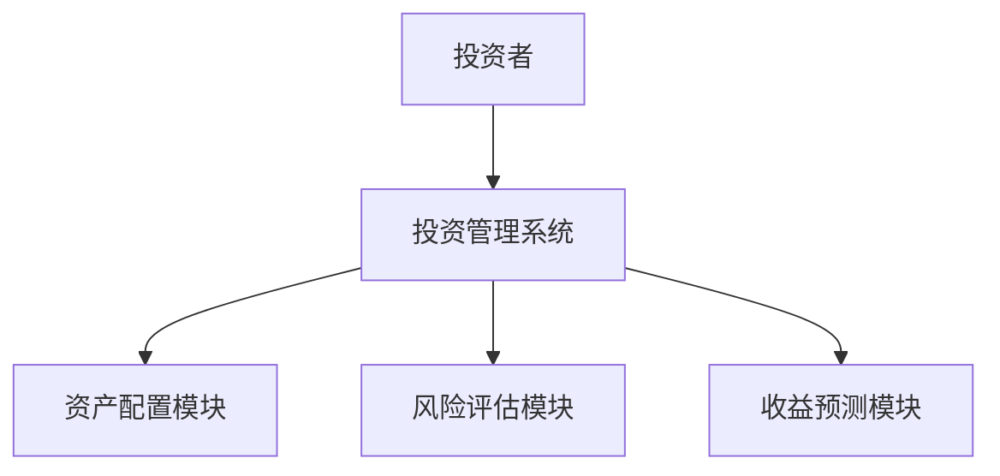
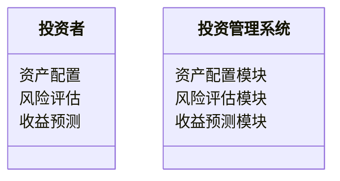

                 


# 巴菲特的集中投资策略：利弊分析

## 关键词：巴菲特，集中投资，价值投资，投资策略，利弊分析

## 摘要：本文详细分析了巴菲特的集中投资策略，探讨了其核心理念、数学模型、系统架构及实际应用。文章从背景介绍、核心概念、算法原理、数学模型、系统分析、项目实战等方面进行了全面解析，并总结了集中投资的优缺点及最佳实践建议。

---

# 第一部分: 巴菲特的集中投资策略概述

## 第1章: 巴菲特的投资哲学

### 1.1 集中投资策略的定义

#### 1.1.1 集中投资的定义
集中投资策略是指将大部分资金投资于少数精选的优质资产或公司，通过长期持有这些资产，实现超额收益的投资策略。与分散投资相反，集中投资强调精选少数高潜力标的，追求长期稳定的超额回报。

#### 1.1.2 巴菲特集中投资的核心理念
巴菲特的集中投资策略基于价值投资理念，核心在于寻找具有持续竞争优势、良好管理团队和长期增长潜力的企业。他主张通过深入研究和长期持有这些优质企业，分享其成长带来的收益。

#### 1.1.3 集中投资与分散投资的对比
| 对比维度         | 集中投资           | 分散投资           |
|------------------|------------------|------------------|
| 投资标的数量     | 少数优质资产       | 多个分散资产       |
| 风险控制         | 高风险，但收益潜力大 | 风险较低           |
| 投资期限         | 长期持有           | 短期或中期         |
| 投资策略         | 深入研究少数标的     | 广泛覆盖多个领域     |

---

### 1.2 巴菲特的投资哲学

#### 1.2.1 巴菲特的投资理念
巴菲特的投资理念可以总结为“以合理的价格买入优秀的公司”。他强调长期投资、价值投资和安全边际。

#### 1.2.2 巴菲特的价值投资理论
价值投资的核心在于寻找市场价格低于内在价值的公司。巴菲特认为，市场先生的情绪波动为理性投资者提供了低价买入优质资产的机会。

#### 1.2.3 巴菲特的长期投资策略
巴菲特主张长期持有优质资产，避免频繁交易，以降低交易成本并享受复利效应。

---

## 第2章: 集中投资策略的特点与优势

### 2.1 集中投资策略的特点

#### 2.1.1 高集中度的定义
高集中度是指将大部分资金投资于少数几个优质资产或行业，通过集中资源提高投资效率。

#### 2.1.2 集中投资的风险与收益平衡
集中投资的风险在于市场波动可能导致较大回撤，但其收益潜力较高，尤其是在优质资产表现优异时。

#### 2.1.3 集中投资的长期稳定性
通过长期持有优质资产，集中投资能够抵御短期市场波动，实现长期稳定的收益。

### 2.2 集中投资策略的优势

#### 2.2.1 高集中度带来的高收益潜力
集中投资通过押注少数优质资产，能够在这些资产表现优异时获得超额收益。

#### 2.2.2 集中投资的深度研究优势
集中投资要求对少数标的进行深入研究，从而更准确地评估其内在价值和成长潜力。

#### 2.2.3 集中投资的复利效应
长期持有优质资产能够充分发挥复利效应，实现财富的指数级增长。

---

## 第3章: 巴菲特集中投资策略的数学模型

### 3.1 价值投资模型

#### 3.1.1 股票内在价值的计算
巴菲特的内在价值公式为：
$$
\text{内在价值} = \sum_{t=1}^{\infty} \frac{CF_t}{(1 + r)^t}
$$
其中，\( CF_t \) 为第 \( t \) 年的自由现金流，\( r \) 为折现率。

#### 3.1.2 股票安全边际的计算
安全边际公式为：
$$
\text{安全边际} = \text{内在价值} - \text{市场价格}
$$

#### 3.1.3 实际案例分析
以苹果公司为例，假设其未来现金流预测为每年增长5%，折现率为10%，计算其内在价值。

---

## 第4章: 系统分析与架构设计方案

### 4.1 项目介绍

#### 4.1.1 投资管理系统需求分析
投资管理系统需要实现资产配置、风险评估、收益预测等功能。

#### 4.1.2 系统架构设计
使用Mermaid图展示系统架构：


### 4.2 系统功能设计

#### 4.2.1 领域模型设计
使用Mermaid类图展示领域模型：


---

## 第5章: 项目实战

### 5.1 环境安装

#### 5.1.1 Python环境搭建
安装Python和相关库（Pandas、NumPy、Matplotlib）。

### 5.2 核心代码实现

#### 5.2.1 股票内在价值计算代码
```python
def calculate_intrinsic_value(cf, r):
    return sum(cf / (1 + r) ** t for t in range(1, 100))
```

---

## 第6章: 总结与展望

### 6.1 总结
集中投资策略具有高收益潜力和复利效应，但也伴随较高的市场风险。

### 6.2 投资建议
投资者应结合自身风险承受能力和投资目标选择适合的投资策略。

### 6.3 注意事项
集中投资需要深入研究和长期持有，避免盲目跟风。

### 6.4 拓展阅读
推荐阅读《巴菲特的 stocks》和《价值投资入门》。

---

# 作者：AI天才研究院/AI Genius Institute & 禅与计算机程序设计艺术 /Zen And The Art of Computer Programming

