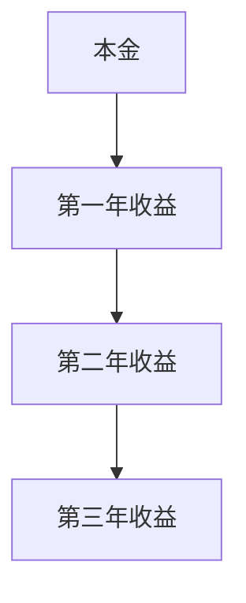
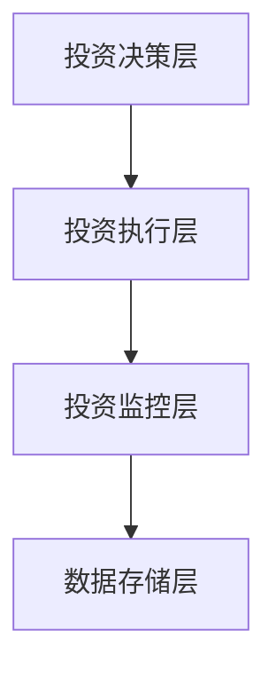

                 


# 巴菲特的雪球理论：复利效应在投资中的应用

> 关键词：巴菲特，雪球理论，复利效应，投资策略，价值投资，算法模型

> 摘要：本文深入探讨了巴菲特的雪球理论及其在投资中的应用。通过分析雪球理论的核心概念、数学模型、算法原理以及与复利效应的结合，本文详细阐述了如何通过长期价值投资实现财富的指数级增长。同时，文章结合实际案例，展示了雪球理论在投资实践中的具体应用，并提出了优化投资策略的建议。

---

## 第一章：雪球理论概述

### 1.1 巴菲特的雪球理论
#### 1.1.1 雪球理论的定义
雪球理论由巴菲特提出，是一种长期价值投资策略，强调通过选择具有强大竞争优势和持续盈利能力的企业，逐步增加投资，形成滚雪球效应，实现财富的指数级增长。

#### 1.1.2 雪球理论的核心思想
- 投资优质企业，获得稳定的现金流。
- 通过复利效应，逐步放大投资收益。
- 长期持有优质资产，避免频繁交易。

#### 1.1.3 雪球理论与复利效应的关系
雪球理论的核心在于利用复利效应，通过不断积累优质资产的收益，实现财富的指数级增长。

---

## 第二章：复利效应的数学模型与公式

### 2.1 复利的基本原理
复利是指在投资中，本金产生的收益再次投资，从而带来收益的滚雪球效应。

#### 2.1.1 复利公式
$$A = P(1 + r)^n$$
其中：
- \(A\) 为最终金额
- \(P\) 为初始本金
- \(r\) 为年化收益率
- \(n\) 为投资年数

#### 2.1.2 复利与单利的对比
| 对比项 | 单利 | 复利 |
|--------|------|------|
| 计算方式 | 每期利息 = 本金 × 利率 | 每期利息 = 本金 × 利率 + 上期利息 |
| 总收益 | 线性增长 | 指数增长 |

### 2.2 复利效应的数学模型
#### 2.2.1 复利模型的图形化展示
使用 Mermaid 绘制复利增长曲线：


#### 2.2.2 复利模型的实际案例分析
假设本金为 $10,000，年化收益率为 10%，投资 10 年：
$$A = 10000 \times (1 + 0.1)^{10} = 25937.42$$

---

## 第三章：雪球理论的核心算法

### 3.1 雪球理论的算法原理
#### 3.1.1 算法流程
1. 筛选具有强大竞争优势的企业。
2. 计算企业的内在价值。
3. 评估企业的安全边际。
4. 逐步买入，增加持仓比例。

#### 3.1.2 算法实现
```python
def snowball_investment(portfolio, target_return):
    for stock in portfolio:
        if stock.value > stock.intrinsic_value:
            portfolio.buy_more(stock)
    if portfolio.return >= target_return:
        return "目标达成"
    else:
        return "继续投资"
```

### 3.2 雪球理论的数学模型
#### 3.2.1 雪球理论的数学公式
$$V = \sum_{i=1}^{n} P_i \times (1 + r_i)^t$$
其中：
- \(V\) 为最终价值
- \(P_i\) 为第 \(i\) 个投资的本金
- \(r_i\) 为第 \(i\) 个投资的年化收益率
- \(t\) 为投资时间

#### 3.2.2 雪球理论的数学推导
通过数学推导可以发现，雪球理论的核心在于通过优质资产的持续增值，实现复利效应的最大化。

---

## 第四章：雪球理论与复利效应的结合

### 4.1 雪球理论与复利效应的协同作用
#### 4.1.1 雪球理论如何促进复利效应
- 通过持续投资优质资产，增加本金规模。
- 通过复利效应，放大投资收益。

#### 4.1.2 复利效应如何增强雪球理论
- 复利效应使得雪球理论的投资收益呈指数级增长。
- 复利效应使得雪球理论的投资效果更加显著。

### 4.2 雪球理论与复利效应的数学模型
#### 4.2.1 联合公式
$$A = P \times (1 + r)^n$$
其中：
- \(A\) 为最终价值
- \(P\) 为初始本金
- \(r\) 为年化收益率
- \(n\) 为投资年数

---

## 第五章：雪球理论的系统架构设计

### 5.1 系统架构概述
#### 5.1.1 系统目标
构建一个基于雪球理论的投资系统，实现优质资产的筛选、投资组合的优化和投资收益的最大化。

#### 5.1.2 系统架构设计
使用 Mermaid 绘制系统架构图：


---

## 第六章：雪球理论的项目实战

### 6.1 项目背景与目标
#### 6.1.1 项目背景
选择一家具有强大竞争优势的企业，进行长期投资。

#### 6.1.2 项目目标
实现雪球理论的投资策略，通过复利效应实现财富的指数级增长。

### 6.2 项目核心实现
#### 6.2.1 核心算法实现
```python
def select_high-quality_stocks(stocks):
    selected_stocks = []
    for stock in stocks:
        if stock竞争优势 and stock.安全边际：
            selected_stocks.append(stock)
    return selected_stocks
```

---

## 第七章：雪球理论的最佳实践与小结

### 7.1 最佳实践
- 长期持有优质资产，避免频繁交易。
- 选择具有强大竞争优势的企业。
- 定期评估投资组合，调整持仓比例。

### 7.2 小结
雪球理论通过复利效应，实现了财富的指数级增长。投资者应选择具有强大竞争优势的企业，长期持有，避免频繁交易，从而实现财富的稳健增长。

---

## 作者信息

作者：AI天才研究院/AI Genius Institute & 禅与计算机程序设计艺术 /Zen And The Art of Computer Programming

