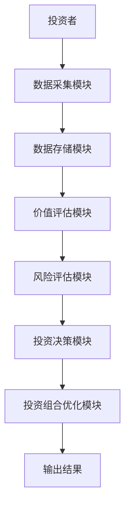
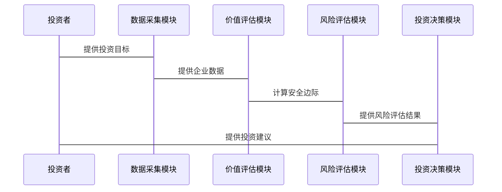

                 

# 巴菲特的风险管理：如何避免永久性资本损失

> 关键词：巴菲特，风险管理，永久性资本损失，价值投资，安全边际

> 摘要：本文深入探讨了巴菲特的风险管理策略，重点分析了如何通过安全边际、价值评估和分散投资等方法避免永久性资本损失。文章从巴菲特的投资哲学出发，详细讲解了他的风险管理原则和实践案例，并提供了系统的分析和实用的建议，帮助投资者在复杂多变的市场中稳健投资。

---

## 第一部分：背景介绍

### 1.1 巴菲特的投资哲学

巴菲特是全球著名的价值投资者，他的投资哲学以“安全边际”为核心，强调长期投资和价值评估。他认为投资的本质是寻找具有持续竞争优势的企业，并以合理的价格买入并长期持有。

#### 1.1.1 价值投资的定义与核心思想

价值投资是一种投资策略，强调以低于内在价值的价格买入优质资产。巴菲特的价值投资理念包括以下几点：

- **寻找具有持续竞争优势的企业**：选择那些能够在长期市场中保持竞争优势的企业。
- **注重企业的财务健康状况**：确保企业的财务状况稳健，具有良好的盈利能力。
- **关注管理层的能力与诚信**：管理层的能力和诚信直接影响企业的长期发展。

#### 1.1.2 风险管理的重要性

在巴菲特看来，风险管理是投资过程中最重要的环节之一。他强调避免永久性资本损失，而不是追求短期收益的最大化。他将风险管理视为保护投资者本金的核心任务。

### 1.2 风险管理的核心概念

风险管理的核心是识别和控制可能的投资风险，避免因市场波动或企业基本面变化导致的永久性资本损失。巴菲特提出的风险管理原则包括：

- **安全边际**：以低于企业内在价值的价格买入资产。
- **分散投资**：通过投资于多个优质企业来降低风险。
- **长期投资**：避免短期市场波动的影响，专注于企业的长期价值。

---

## 第二部分：核心概念与联系

### 2.1 安全边际的概念与应用

#### 2.1.1 安全边际的定义

安全边际是指资产的市场价格低于其内在价值的部分。巴菲特认为，安全边际的存在能够有效降低投资风险，确保在市场波动中不会出现永久性资本损失。

#### 2.1.2 安全边际的计算方法

安全边际可以通过以下公式计算：

$$ \text{安全边际} = \text{内在价值} - \text{市场价格} $$

如果安全边际为正，说明市场价格低于内在价值，投资风险较低。

#### 2.1.3 安全边际与投资决策

安全边际是巴菲特选择投资标的的重要依据。他倾向于投资那些具有较高安全边际的企业，以确保投资本金的安全。

### 2.2 价值评估与市场波动

#### 2.2.1 价值评估的核心步骤

价值评估是通过分析企业的财务状况、行业地位和竞争优势，估算其内在价值。主要包括以下步骤：

1. **分析财务报表**：评估企业的盈利能力、资产负债状况和现金流。
2. **行业分析**：了解企业的行业地位和竞争优势。
3. **管理层评估**：评估管理层的能力和诚信。

#### 2.2.2 市场波动对投资决策的影响

市场波动可能导致资产价格短期偏离其内在价值。巴菲特认为，投资者应以长期视角看待市场波动，避免因短期价格波动而做出错误决策。

### 2.3 分散投资与资产配置

#### 2.3.1 分散投资的原则

分散投资是指将资金分配到多个不同的资产或行业中，以降低单一投资的风险。

#### 2.3.2 资产配置的重要性

资产配置是通过合理分配资金到不同资产类别，以实现风险与收益的平衡。

#### 2.3.3 巴菲特的分散投资策略

巴菲特通过投资于多个具有竞争优势的企业来分散风险，避免将所有资金集中于单一资产。

---

## 第三部分：算法原理

### 3.1 价值评估算法

#### 3.1.1 价值评估模型

巴菲特常用的价值评估模型包括：

- **股息折现模型（DDM）**：通过预测未来股息的现值来估算企业价值。
- **贴现现金流模型（DCF）**：通过预测企业未来现金流的现值来估算企业价值。

#### 3.1.2 安全边际计算

根据价值评估结果，计算资产的安全边际：

$$ \text{安全边际} = \text{内在价值} - \text{市场价格} $$

---

## 第四部分：系统分析与架构设计

### 4.1 系统功能设计

设计一个基于巴菲特风险管理策略的投资系统，包括以下功能模块：

- **数据采集**：收集企业的财务数据和市场数据。
- **价值评估**：使用价值评估模型计算企业内在价值。
- **风险评估**：计算安全边际，评估投资风险。
- **投资决策**：根据风险评估结果制定投资策略。

### 4.2 系统架构设计

以下是系统的架构图：

### 4.3 系统交互设计

以下是系统的交互序列图：

---

## 第五部分：项目实战

### 5.1 实战案例：投资可口可乐

#### 5.1.1 案例背景

可口可乐是一家具有强大竞争优势的企业，巴菲特在1988年投资该公司，并长期持有。

#### 5.1.2 价值评估

根据DCF模型计算可口可乐的内在价值，假设其未来现金流为100亿美元，贴现率为10%：

$$ \text{内在价值} = \frac{100}{(1 + 0.1)^5} = 59.53 \text{亿美元} $$

#### 5.1.3 安全边际计算

假设市场价格为60亿美元，安全边际为：

$$ \text{安全边际} = 59.53 - 60 = -0.47 \text{亿美元} $$

此时，安全边际为负，说明市场价格高于内在价值，不适合投资。

---

## 第六部分：最佳实践与小结

### 6.1 最佳实践

- **坚持价值投资**：选择具有竞争优势的企业进行投资。
- **注重安全边际**：以合理价格买入资产。
- **分散投资**：降低投资风险。

### 6.2 小结

巴菲特的风险管理策略以安全边际为核心，通过价值评估和分散投资来避免永久性资本损失。投资者应以长期视角看待市场波动，注重基本面分析，选择优质企业进行投资。

---

## 参考文献

1. 巴菲特股东大会讲话
2. 《巴菲特投资思想》
3. 《价值投资实战策略》

---

## 作者

作者：AI天才研究院/AI Genius Institute & 禅与计算机程序设计艺术 /Zen And The Art of Computer Programming

