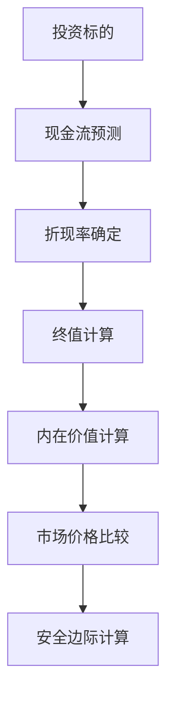
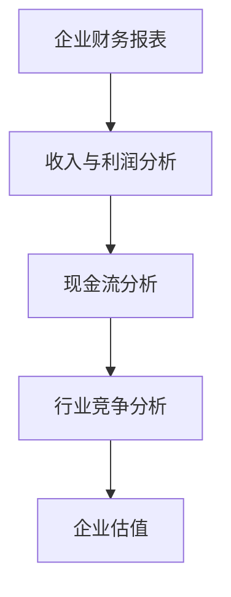
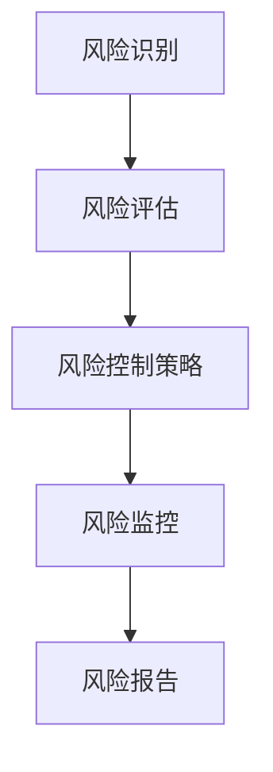
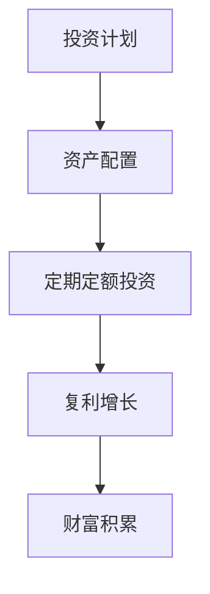

                 

# 巴菲特的首要投资原则：永远不要亏损

> 关键词：巴菲特投资原则，安全边际，价值评估，风险管理，长期投资策略，投资心理学

> 摘要：本文深入探讨了巴菲特“永远不要亏损”的投资原则，从安全边际、价值评估、投资组合构建、风险管理等多个维度进行详细分析。结合技术分析方法，本文通过数学模型、系统架构设计、案例分析等手段，帮助读者理解如何在投资中避免亏损，并实现长期稳健的投资回报。同时，本文还探讨了投资心理与行为对投资决策的影响，以及如何优化投资策略以应对市场变化。

---

## 目录

1. [引言](#引言)
2. [安全边际：巴菲特的护城河](#安全边际-巴菲特的护城河)
3. [价值评估：找到市场的内在价值](#价值评估-找到市场的内在价值)
4. [投资组合构建：分散风险与优化回报](#投资组合构建-分散风险与优化回报)
5. [风险管理：如何避免重大亏损](#风险管理-如何避免重大亏损)
6. [投资心理学：克服情绪化决策](#投资心理学-克服情绪化决策)
7. [长期投资策略：复利的力量](#长期投资策略-复利的力量)
8. [优化投资策略：动态调整与持续学习](#优化投资策略-动态调整与持续学习)
9. [总结与展望](#总结与展望)

---

## 引言

投资市场的本质是不确定性与风险并存的环境。巴菲特的“永远不要亏损”原则，不仅仅是一种投资策略，更是一种投资哲学。本文将从技术分析的角度，结合数学模型和系统设计，深入探讨这一原则的核心要素，并通过案例分析和系统设计，帮助读者理解如何在实际投资中避免亏损，实现稳健回报。

---

## 安全边际：巴菲特的护城河

### 1.1 安全边际的定义与计算

安全边际是巴菲特投资理念的核心概念之一。它是指股票的市场价格与其内在价值之间的差距。通过计算安全边际，投资者可以确保在买入股票时，有足够的安全空间来抵御市场波动和潜在的估值误差。

#### 1.1.1 安全边际的计算公式

$$\text{安全边际} = \text{内在价值} - \text{市场价格}$$

其中，内在价值可以通过 discounted cash flow (DCF) 模型进行计算：

$$\text{内在价值} = \sum_{t=1}^{n} \frac{\text{现金流}}{(1 + r)^t} + \frac{\text{终值}}{(1 + r)^n}$$

其中，$r$ 是折现率，$n$ 是投资期限。

#### 1.1.2 安全边际的系统架构

以下是安全边际计算的系统架构图：

通过上述系统架构，投资者可以系统地计算安全边际，并确保投资决策的科学性。

---

## 价值评估：找到市场的内在价值

### 2.1 价值评估的方法与工具

价值评估是投资决策的核心环节。巴菲特认为，只有通过深入分析企业的基本面，才能准确评估其内在价值。以下是几种常用的价值评估方法：

#### 2.1.1 基本面分析

基本面分析包括对企业财务报表（收入、利润、现金流等）的分析，以及对行业竞争环境的评估。以下是基本面分析的流程图：

#### 2.1.2 DCF 模型的应用

DCF 模型是评估企业内在价值的常用工具。以下是 DCF 模型的实现步骤：

1. 预测未来现金流：根据企业的历史数据和行业趋势，预测未来五年的现金流。
2. 计算终值：使用永续增长率公式计算终值。
3. 折现：将未来现金流和终值按折现率折现，得到内在价值。

#### 2.1.3 行业分析与竞争分析

行业分析包括对行业市场规模、增长潜力、竞争格局的分析。以下是行业分析的步骤：

1. 收集行业数据：包括市场规模、增长率、主要竞争对手等。
2. 分析行业趋势：识别行业周期性、技术进步对行业的影响。
3. 评估企业的竞争优势：分析企业在行业中的地位、核心竞争力等。

---

## 投资组合构建：分散风险与优化回报

### 3.1 资产配置的基本原则

资产配置是投资组合构建的核心环节。以下是资产配置的步骤：

1. 确定投资目标：明确投资期限、风险承受能力和收益目标。
2. 分散投资：通过配置不同资产类别（股票、债券、现金等）来分散风险。
3. 定期再平衡：根据市场变化和个人财务状况，定期调整投资组合。

#### 3.1.1 资产配置的数学模型

$$\text{投资组合收益} = \sum_{i=1}^{n} w_i \times r_i$$

其中，$w_i$ 是第 $i$ 种资产的权重，$r_i$ 是第 $i$ 种资产的预期收益。

### 3.2 投资组合优化的算法实现

投资组合优化可以通过均值-方差优化模型实现。以下是优化步骤：

1. 计算各资产的预期收益和方差。
2. 确定目标函数（如最大化收益或最小化风险）。
3. 使用优化算法（如拉格朗日乘数法）求解最优投资组合。

---

## 风险管理：如何避免重大亏损

### 4.1 风险评估与控制策略

风险管理是投资过程中不可忽视的环节。以下是风险管理的步骤：

1. 识别风险来源：包括市场风险、流动性风险、信用风险等。
2. 评估风险影响：量化各风险因素对投资组合的影响。
3. 制定风险控制策略：如设定止损点、分散投资等。

#### 4.1.1 风险管理的系统架构

以下是风险管理的系统架构图：

---

## 投资心理学：克服情绪化决策

### 5.1 投资心理与行为分析

投资心理是影响投资决策的重要因素。以下是常见的情绪化决策及其影响：

1. **贪婪**：盲目追求高收益，忽视潜在风险。
2. **恐惧**：在市场下跌时过度反应，错失投资机会。
3. **从众心理**：盲目跟随市场趋势，忽视个人判断。

#### 5.1.1 克服情绪化决策的策略

1. **制定投资计划**：明确投资目标和策略，避免随市场波动调整决策。
2. **定期回顾与反思**：分析投资决策的正确性，总结经验教训。
3. **分散投资**：通过分散投资降低情绪化决策的影响。

---

## 长期投资策略：复利的力量

### 6.1 复利效应的数学模型

复利效应是长期投资的重要驱动力。以下是复利计算公式：

$$\text{终值} = P \times (1 + r)^n$$

其中，$P$ 是本金，$r$ 是年化收益率，$n$ 是投资年数。

### 6.2 长期投资的系统设计

以下是长期投资的系统设计图：

---

## 优化投资策略：动态调整与持续学习

### 7.1 投资策略的动态调整

投资环境不断变化，投资者需要根据市场变化调整投资策略。以下是动态调整的步骤：

1. 定期评估投资组合的表现。
2. 根据市场变化和自身目标调整资产配置。
3. 优化投资策略以适应新环境。

#### 7.1.1 动态调整的数学模型

$$\text{新权重} = \text{旧权重} \times (1 + \text{调整因子})$$

其中，调整因子根据市场变化确定。

---

## 总结与展望

巴菲特的“永远不要亏损”原则，不仅仅是投资策略，更是一种投资哲学。通过本文的分析，我们可以看到，这一原则涵盖了安全边际、价值评估、投资组合构建、风险管理等多个方面。在实际投资中，投资者需要结合技术分析、系统设计和心理调节，才能真正实现稳健的投资回报。

未来，随着市场的变化和技术的进步，投资者需要不断优化自己的投资策略，以应对新的挑战和机遇。通过持续学习和实践，投资者可以更好地理解和应用巴菲特的投资原则，实现长期稳健的投资回报。

---

**作者：AI天才研究院/AI Genius Institute & 禅与计算机程序设计艺术 /Zen And The Art of Computer Programming**

