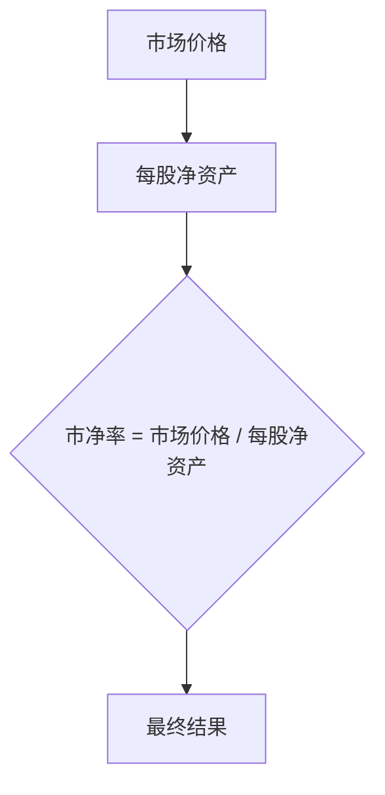
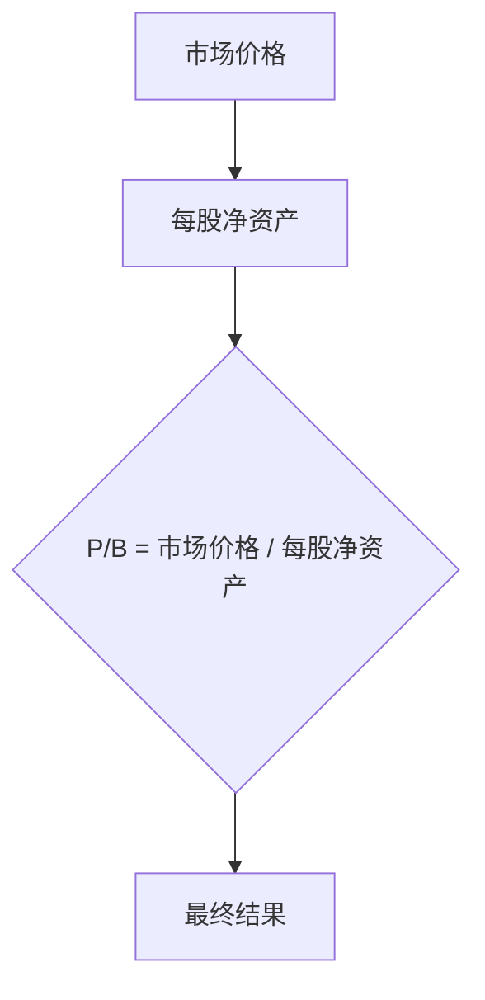
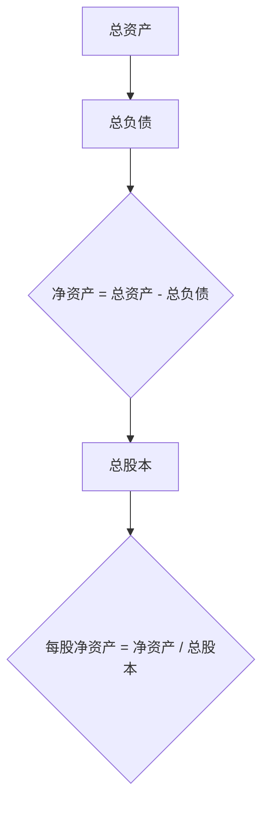
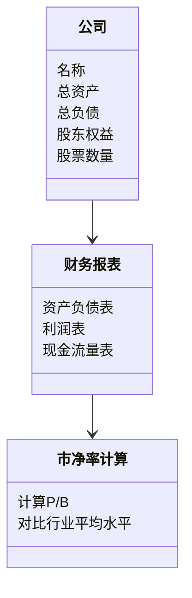
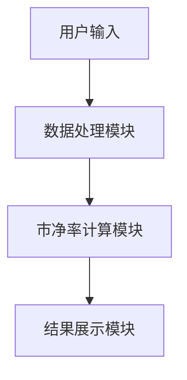

                 


# 市净率（P/B）分析：资产基础估值的应用

## 关键词：
市净率，资产估值，P/B，企业价值，财务指标

## 摘要：
市净率（P/B）是评估企业价值的重要指标之一，尤其在资产密集型行业具有重要意义。本文从市净率的基本概念出发，结合实际案例，详细讲解市净率的计算方法、核心算法、系统分析与架构设计，并通过项目实战展示其应用。最后，本文将总结市净率在资产估值中的最佳实践，帮助读者全面掌握这一估值方法。

---

## 第1章: 市净率（P/B）的基本概念与背景

### 1.1 市净率的定义与核心要素

#### 1.1.1 市净率的定义
市净率（P/B，Price-to-Book Ratio）是指股票的市场价格与每股净资产的比率。它是衡量企业价值的重要指标之一，尤其适用于资产密集型行业（如银行、房地产等）。

$$P/B = \frac{Market\ Price}{Book\ Value\ Per\ Share}$$

**图1.1 市净率的计算流程图**


#### 1.1.2 市净率的核心要素
| 核心要素 | 描述 |
|----------|------|
| 市场价格 | 股票的当前市场价格 |
| 每股净资产 | 每股的账面价值，即总资产减去总负债后的净值除以总股本 |
| 资产质量 | 资产的流动性、变现能力等 |

#### 1.1.3 市净率与企业价值的关系
市净率反映了市场对企业资产价值的评估。当市净率低于1时，通常意味着市场认为企业的资产价值被低估。

---

### 1.2 市净率与其他估值指标的对比

#### 1.2.1 市盈率（P/E）的定义与特点
市盈率（P/E）是股票的市场价格与每股收益（EPS）的比率，主要衡量企业盈利能力。

$$P/E = \frac{Market\ Price}{Earnings\ Per\ Share}$$

#### 1.2.2 市销率（P/S）的定义与特点
市销率（P/S）是股票的市场价格与每股销售收入的比率，适用于高成长性企业。

$$P/S = \frac{Market\ Price}{Revenue\ Per\ Share}$$

#### 1.2.3 市净率与市盈率、市销率的对比分析
| 指标 | 市盈率（P/E） | 市销率（P/S） | 市净率（P/B） |
|------|----------------|----------------|----------------|
| 适用场景 | 盈利稳定的公司 | 高成长性公司 | 资产密集型行业 |
| 优点 | 反映盈利能力 | 反映成长性 | 反映资产价值 |
| 局限性 | 受利润波动影响较大 | 受收入波动影响较大 | 受资产质量影响较大 |

---

### 1.3 市净率的应用场景与局限性

#### 1.3.1 市净率适用的行业与场景
| 行业 | 特点 |
|------|------|
| 银行 | 资产密集，贷款业务为主 |
| 房地产 | 资产规模大，土地、建筑资产占比高 |
| 制造业 | 设备、存货等资产较多 |

#### 1.3.2 市净率的局限性与不足
| 问题 | 描述 |
|------|------|
| 资产质量 | 市净率不考虑资产的质量，仅关注账面价值 |
| 行业差异 | 不同行业的资产结构差异大，市净率的可比性有限 |
| 偏见性 | 市净率仅反映资产价值，不考虑未来盈利能力 |

#### 1.3.3 市净率与其他估值方法的结合
- 结合市盈率：评估企业资产与盈利能力的综合价值。
- 结合市销率：适用于高成长性且资产密集的企业。

---

## 第2章: 市净率的计算与核心公式

### 2.1 市净率的计算公式

#### 2.1.1 市净率（P/B）的数学表达式
$$P/B = \frac{Market\ Price}{Book\ Value\ Per\ Share}$$

**图2.1 市净率计算的流程图**


#### 2.1.2 每股净资产的计算公式
$$Book\ Value\ Per\ Share = \frac{Total\ Book\ Value}{Number\ of\ Shares}$$

**图2.2 每股净资产计算的流程图**


---

### 2.2 市净率的核心算法原理

#### 2.2.1 资产负债表数据的提取与处理
- 数据来源：企业财务报表（资产负债表、利润表、现金流量表）。
- 数据清洗：处理缺失值、异常值。

#### 2.2.2 净资产的计算与调整
- 净资产 = 总资产 - 总负债。
- 调整：考虑无形资产、商誉等虚资产的影响。

#### 2.2.3 市净率的计算与标准化处理
- 计算：根据公式计算P/B。
- 标准化：将P/B与行业平均水平对比。

---

## 第3章: 市净率的资产基础估值应用

### 3.1 资产估值的基本原理

#### 3.1.1 资产评估的核心概念
- 资产评估：基于资产的账面价值或市场价值进行估值。
- 资产质量：资产的流动性、变现能力。

#### 3.1.2 资产估值的主要方法
| 方法 | 描述 |
|------|------|
| 历史成本法 | 基于历史交易价格进行估值 |
| 市场价值法 | 基于市场交易价格进行估值 |
| 可变现净值法 | 基于未来现金流折现进行估值 |

#### 3.1.3 资产估值与企业价值的关系
企业价值 = 股东权益 + 债务价值 - 现金及等价物。

---

### 3.2 市净率在资产估值中的应用

#### 3.2.1 市净率与资产价值的关联
市净率反映了市场对资产价值的评估。当P/B < 1时，通常意味着资产价值被低估。

#### 3.2.2 市净率在不同资产类别中的应用
| 资产类别 | 应用 |
|----------|------|
| 固定资产 | 适用于制造业、房地产等行业 |
| 无形资产 | 适用于科技、软件等行业 |

#### 3.2.3 市净率与资产质量
- 资产质量高的企业，市净率通常较低。
- 资产质量低的企业，市净率通常较高。

---

## 第4章: 系统分析与架构设计方案

### 4.1 问题场景介绍

#### 4.1.1 项目介绍
假设我们正在评估某银行的资产价值，需要使用市净率进行估值。

---

### 4.2 系统功能设计

#### 4.2.1 领域模型设计


#### 4.2.2 系统架构设计


#### 4.2.3 系统接口设计
- 输入接口：财务报表数据。
- 输出接口：市净率计算结果。

---

### 4.3 项目实战

#### 4.3.1 环境安装
- 安装Python和Pandas库：
  ```bash
  pip install pandas
  ```

#### 4.3.2 核心代码实现

```python
import pandas as pd

# 假设财务数据存储在Excel文件中
df = pd.read_excel('financial_data.xlsx')

# 计算每股净资产
book_value_per_share = df['Total Assets'].iloc[0] - df['Total Liabilities'].iloc[0]
book_value_per_share = book_value_per_share / df['Total Shares'].iloc[0]

# 计算市净率
market_price = df['Market Price'].iloc[0]
p_b = market_price / book_value_per_share

print(f"市净率 = {p_b:.2f}")
```

#### 4.3.3 实际案例分析
假设某银行的财务数据如下：
- 总资产：100亿元
- 总负债：70亿元
- 股票数量：1亿股
- 市场价格：10元/股

计算P/B：
$$P/B = \frac{10}{(100 - 70)/1} = 0.33$$

---

## 第5章: 最佳实践与小结

### 5.1 小结
市净率是资产基础估值的重要工具，适用于资产密集型行业。通过本文的分析，我们可以更好地理解市净率的计算方法和应用场景。

### 5.2 注意事项
- 市净率仅反映资产价值，不考虑盈利能力。
- 不同行业的市净率具有不同的参考价值。

### 5.3 拓展阅读
- 市盈率（P/E）的分析
- 市销率（P/S）的分析
- 资产评估的其他方法

---

## 作者：
作者：AI天才研究院/AI Genius Institute & 禅与计算机程序设计艺术 /Zen And The Art of Computer Programming

