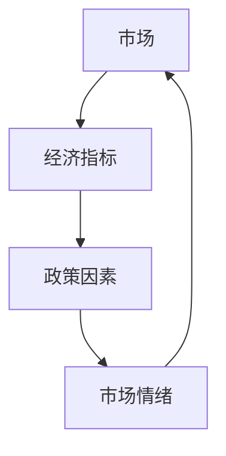
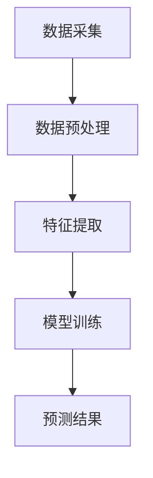
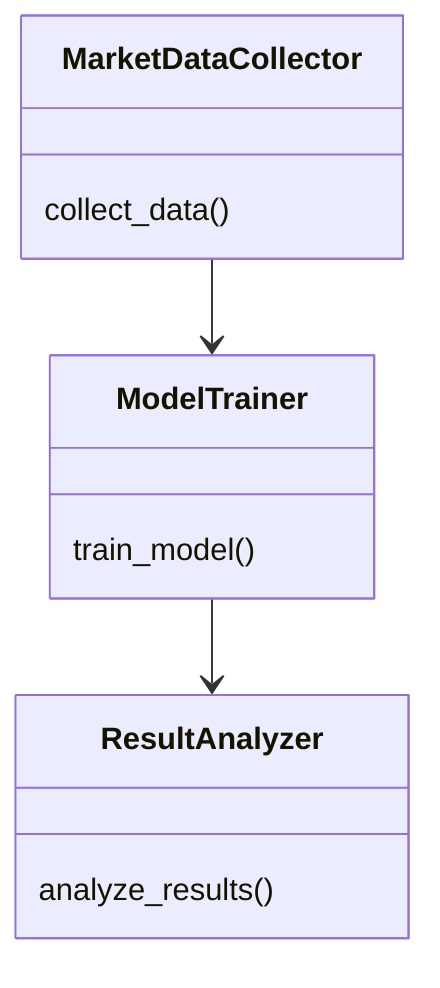
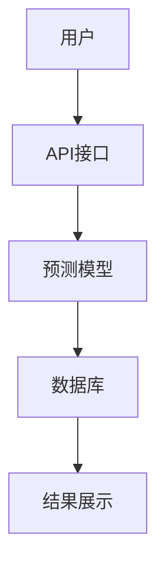
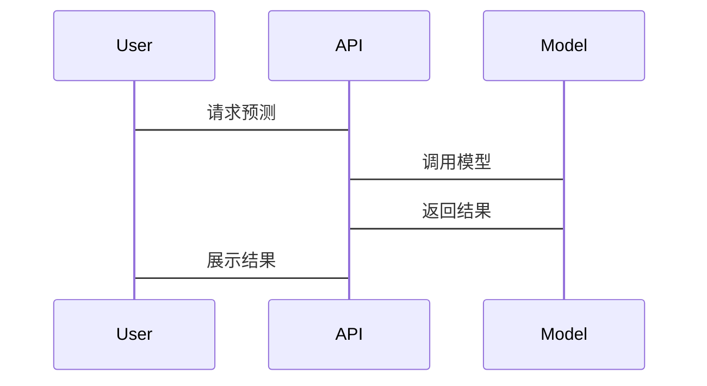

                 


# 市场周期理论：理解牛熊交替的规律

## 关键词：市场周期，牛熊交替，经济预测，投资策略，数据驱动

## 摘要：  
市场周期理论是理解金融市场波动的核心，本文通过技术方法分析市场周期的规律，探讨如何利用统计和机器学习模型预测周期变化，并提供投资策略建议。

---

# 第一部分：背景介绍

## 第1章：市场周期的基本概念

### 1.1 市场周期的定义与特征
#### 1.1.1 市场周期的定义  
市场周期是指市场在一定时间内价格、成交量等指标的波动规律，通常分为牛市（上涨）和熊市（下跌）。

#### 1.1.2 市场周期的核心特征  
- **周期性**：市场波动呈现周期性规律。  
- **波动性**：周期中的波动幅度不一。  
- **非线性**：市场周期受多种因素影响，呈现非线性特征。

#### 1.1.3 市场周期与经济周期的关系  
市场周期与经济周期密切相关，但市场波动往往领先于经济指标变化。

### 1.2 市场周期的历史演变  
#### 1.2.1 历史上的市场周期回顾  
- 20世纪初的经济危机。  
- 2008年金融危机。  
- 近年的科技股泡沫。

#### 1.2.2 不同经济体制下的市场周期特点  
- 资本主义市场周期波动较大。  
- 计划经济市场周期相对稳定。

#### 1.2.3 市场周期的周期性规律总结  
市场周期的平均长度约为5-7年，波动幅度与经济政策密切相关。

### 1.3 市场周期的影响因素  
#### 1.3.1 经济基本面因素  
- GDP增长率。  
- 就业率。  
- 利率水平。

#### 1.3.2 政策因素  
- 财政政策。  
- 货币政策。  
- 监管政策。

#### 1.3.3 市场情绪与心理因素  
- 投资者情绪。  
- 媒体舆论。  
- 市场参与度。

---

## 第2章：市场周期的核心概念与联系

### 2.1 市场周期的核心概念  
#### 2.1.1 市场周期的驱动因素  
- 经济基本面。  
- 政策环境。  
- 市场情绪。

#### 2.1.2 市场周期的波动规律  
- 牛市和熊市的交替。  
- 周期长度与波动幅度的关系。  
- 市场周期的非线性特征。

#### 2.1.3 市场周期的预测模型  
- 时间序列分析。  
- 机器学习模型。  
- 统计套利策略。

### 2.2 市场周期的核心原理  
#### 2.2.1 市场周期的数学模型  
- **ARIMA模型**：用于时间序列预测。  
  $$ ARIMA(p, d, q) $$
- **GARCH模型**：用于波动性预测。  
  $$ GARCH(p, q) $$

#### 2.2.2 市场周期的经济理论基础  
- 马克思的剩余价值理论。  
- � 凯恩斯的有效需求理论。  
- 货币主义的通货膨胀理论。

#### 2.2.3 市场周期与投资策略的关系  
- 投资者如何利用市场周期制定策略。  
- 市场周期对资产配置的影响。

### 2.3 市场周期的ER实体关系图  


---

## 第3章：市场周期的算法原理

### 3.1 市场周期预测的算法概述  
#### 3.1.1 时间序列分析  
- ARIMA模型：用于预测未来的价格走势。  
- LSTM网络：用于捕捉长期依赖关系。

#### 3.1.2 机器学习算法  
- 支持向量机（SVM）。  
- 随机森林（Random Forest）。  
- 神经网络（NN）。

#### 3.1.3 统计套利策略  
- 均值回归策略。  
- 股差交易策略。

### 3.2 市场周期预测的流程  


### 3.3 市场周期预测的数学模型  
#### 3.3.1 ARIMA模型  
$$ ARIMA(p, d, q) $$
- p：自回归阶数。  
- d：差分阶数。  
- q：移动平均阶数。

#### 3.3.2 LSTM网络  
$$ LSTM(t) = \sigma(g(x_t + U h_{t-1} + W c_{t-1})) $$

### 3.4 市场周期预测的代码实现  
```python
from statsmodels.tsa.arima_model import ARIMA

def predict_market_price(data, order):
    model = ARIMA(data, order=order)
    model_fit = model.fit()
    forecast = model_fit.forecast(steps=5)
    return forecast
```

---

# 第四部分：系统分析与架构设计方案

## 第4章：系统架构设计

### 4.1 项目介绍  
- 项目目标：构建市场周期预测系统。  
- 项目范围：涵盖数据采集、模型训练和结果展示。

### 4.2 系统功能设计  


### 4.3 系统架构设计  


### 4.4 系统接口设计  
- 输入接口：数据接口、模型接口。  
- 输出接口：预测结果接口、可视化接口。

### 4.5 系统交互设计  


---

## 第5章：项目实战

### 5.1 环境安装  
- Python 3.8以上版本。  
- 安装必要的库：pandas、numpy、statsmodels。

### 5.2 系统核心实现  
```python
import pandas as pd
import numpy as np
from statsmodels.tsa.arima_model import ARIMA

def main():
    data = pd.read_csv('market_data.csv')
    model = ARIMA(data['price'], order=(5,1,0))
    model_fit = model.fit()
    forecast = model_fit.forecast(steps=10)
    forecast_df = pd.DataFrame({'date': pd.date_range('2024-01-01', periods=10), 'forecast_price': forecast})
    forecast_df.to_csv('forecast.csv', index=False)
    print("预测结果已保存为forecast.csv")

if __name__ == '__main__':
    main()
```

### 5.3 代码应用解读与分析  
- 数据预处理：缺失值处理、归一化。  
- 模型训练：选择合适参数。  
- 结果分析：预测准确率评估。

### 5.4 案例分析  
- 数据来源：历史股价数据。  
- 预测结果：未来10天的股价预测。  
- 结果可视化：折线图展示实际与预测价格。

---

## 第6章：总结与展望

### 6.1 总结  
- 本文通过技术方法分析了市场周期的规律。  
- 提供了预测模型和投资策略建议。

### 6.2 注意事项  
- 数据质量影响预测结果。  
- 模型需定期更新。  
- 投资需谨慎，避免过度依赖模型。

### 6.3 拓展阅读  
- 推荐阅读《金融市场中的时间序列分析》。  
- 参考文献：[1] 布鲁克·阿特金森：《市场周期》。

---

## 作者：AI天才研究院 & 禅与计算机程序设计艺术

