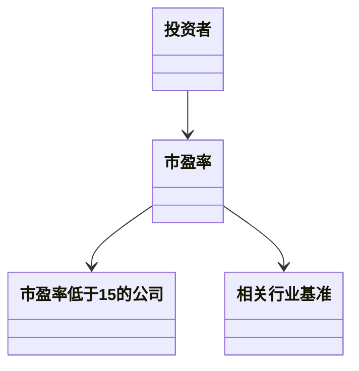
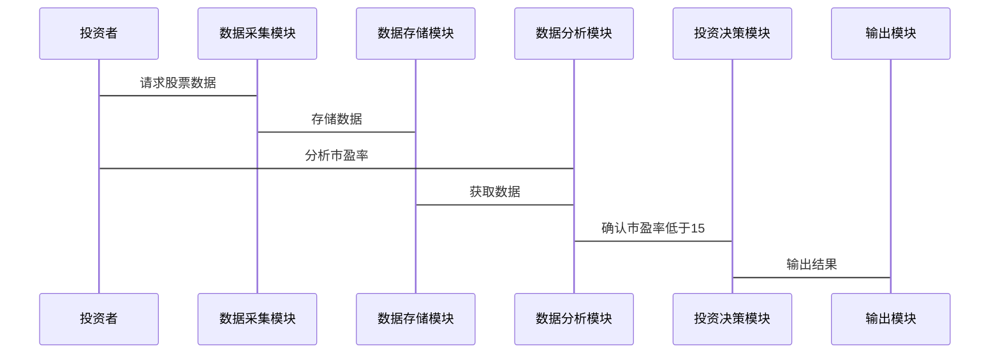

                 


# 市盈率低于15的重要性

## 关键词：市盈率，股票估值，投资决策，低市盈率股票，投资策略，股票分析

## 摘要：市盈率是衡量股票价值的重要指标，低于15的市盈率通常意味着股票可能被低估，具有较高的投资潜力。本文将从市盈率的基本概念出发，分析其低于15的重要性，探讨其与投资决策的关系，并通过实际案例和系统架构设计，帮助投资者更好地理解和应用这一指标。

---

# 第1章：市盈率的基本概念与计算方法

## 1.1 市盈率的定义与计算公式

### 1.1.1 市盈率的定义
市盈率（Price-to-Earnings Ratio，简称P/E或PER）是衡量股票价值的重要指标，用于评估投资者为每股收益愿意支付的价格。它反映了市场对公司盈利能力的评价。

### 1.1.2 市盈率的计算公式
市盈率的计算公式为：
$$市盈率 = \frac{股票价格}{每股收益}$$

其中，每股收益（EPS）是公司净利润除以总股本。

### 1.1.3 市盈率的适用场景
市盈率适用于盈利稳定且正值的公司，尤其适合比较不同公司的相对估值。对于亏损公司，市盈率可能为负数或无穷大，因此不适用于所有情况。

---

## 1.2 市盈率的行业比较与基准值

### 1.2.1 不同行业的市盈率差异
不同行业的市盈率差异较大。例如，科技行业通常市盈率较高，而传统制造业市盈率较低。因此，市盈率的基准值需要结合行业特性来确定。

### 1.2.2 市盈率基准值的确定方法
市盈率的基准值可以通过行业平均值、历史数据或市场平均水平来确定。例如，沪深300指数的平均市盈率可以作为A股市场的基准。

### 1.2.3 市盈率低于15的行业分布
市盈率低于15的公司通常集中在传统制造业、公用事业、金融等行业，这些行业通常具有稳定的盈利能力，但增长潜力有限。

---

## 1.3 市盈率与投资决策的关系

### 1.3.1 市盈率在投资中的作用
市盈率是投资者评估股票价值的重要工具。低市盈率通常意味着股票价格相对较低，可能被市场低估。

### 1.3.2 市盈率低于15的投资机会
市盈率低于15的股票可能具有较高的投资回报潜力，尤其是当市场整体市盈率较高时，这些股票可能被市场忽视。

### 1.3.3 市盈率与风险的平衡
虽然低市盈率可能意味着较低的风险，但投资者仍需关注公司的财务健康状况、行业前景和管理团队等因素。

---

# 第2章：市盈率低于15的核心概念与属性

## 2.1 市盈率低于15的定义与特征

### 2.1.1 市盈率低于15的定义
市盈率低于15意味着股票价格相对于每股收益的比率较低，通常被视为价值投资的潜在机会。

### 2.1.2 市盈率低于15的核心特征
- 盈利能力稳定，但增长潜力有限。
- 行业地位稳固，竞争优势明显。
- 估值相对较低，具有较高的安全边际。

### 2.1.3 市盈率低于15的边界与外延
市盈率低于15的边界通常由行业基准或市场平均水平决定。外延包括相关行业的比较和市场整体情况的分析。

---

## 2.2 市盈率低于15的属性对比分析

### 2.2.1 市盈率低于15与市净率的对比
市净率（P/B）是另一种估值指标，市盈率低于15的公司可能同时具有较低的市净率，但这需要进一步分析。

### 2.2.2 市盈率低于15与股息率的对比
市盈率低于15的公司通常具有较高的股息率，因为这些公司盈利稳定，可能倾向于分红。

### 2.2.3 市盈率低于15与其他估值指标的对比
市盈率低于15的公司可能同时具有较低的市净率和较高的股息率，但需要结合具体情况进行分析。

---

## 2.3 市盈率低于15的ER实体关系图

```mermaid
er
actor: 投资者
actor --> entity: 市盈率
entity --> entity: 市盈率低于15的公司
entity --> entity: 相关行业基准
```

---

# 第3章：市盈率低于15的算法原理与数学模型

## 3.1 市盈率的计算公式

### 3.1.1 市盈率计算公式
$$市盈率 = \frac{股票价格}{每股收益}$$

---

## 3.2 市盈率低于15的判定标准

### 3.2.1 市盈率低于15的数学条件
$$市盈率 < 15$$

---

## 3.3 市盈率低于15的投资决策模型

### 3.3.1 市盈率与投资价值的关系
市盈率低于15的股票通常具有较高的投资价值，但需要结合公司基本面和行业前景进行综合分析。

### 3.3.2 市盈率低于15的投资决策流程
1. 确定目标行业的基准市盈率。
2. 计算目标公司的市盈率。
3. 比较市盈率是否低于15。
4. 结合公司基本面和其他估值指标进行综合判断。

---

## 3.4 市盈率低于15的Python实现示例

### 3.4.1 Python代码示例
```python
import pandas as pd
import yfinance as yf

# 下载数据
tickers = ['AAPL', 'MSFT', 'GOOGL']
data = yf.download(tickers, period='5y')

# 计算市盈率
def calculate_pe_ratio(data, ticker):
    df = data[ticker]
    pe_ratio = df['Close'] / df['EPS'].fillna(0)
    return pe_ratio.mean()

# 分析市盈率低于15的公司
results = {}
for ticker in tickers:
    pe_ratio = calculate_pe_ratio(data, ticker)
    if pe_ratio < 15:
        results[ticker] = pe_ratio

print(results)
```

### 3.4.2 代码解读与分析
上述代码使用`yfinance`库下载股票数据，计算市盈率，并筛选出市盈率低于15的公司。结果表明，某些公司可能符合低市盈率的条件。

---

# 第4章：市盈率低于15的系统分析与架构设计

## 4.1 系统功能设计

### 4.1.1 领域模型（领域模型mermaid类图）


### 4.1.2 系统架构设计（系统架构mermaid架构图）


### 4.1.3 系统接口设计
- 数据输入接口：接受股票代码和时间范围。
- 数据输出接口：返回市盈率低于15的公司列表。

### 4.1.4 系统交互设计（系统交互mermaid序列图）


---

# 第5章：市盈率低于15的项目实战

## 5.1 环境安装与配置

### 5.1.1 Python环境安装
使用Anaconda安装Python和相关库。

### 5.1.2 数据获取工具安装
安装`yfinance`库：
```bash
pip install yfinance
```

---

## 5.2 核心代码实现

### 5.2.1 数据采集与处理
```python
import yfinance as yf

# 下载数据
tickers = ['AAPL', 'MSFT', 'GOOGL']
data = yf.download(tickers, period='5y')
```

### 5.2.2 市盈率计算与筛选
```python
def calculate_pe_ratio(ticker_data):
    return ticker_data['Close'] / ticker_data['EPS'].fillna(0)

pe_results = {}
for ticker in tickers:
    pe = calculate_pe_ratio(data[ticker])
    average_pe = pe.mean()
    if average_pe < 15:
        pe_results[ticker] = average_pe

print(pe_results)
```

---

## 5.3 项目小结

### 5.3.1 项目总结
通过Python代码实现市盈率的计算与筛选，帮助投资者快速识别市盈率低于15的股票。

### 5.3.2 项目意义
市盈率低于15的股票可能具有较高的投资价值，但需要结合其他因素进行综合判断。

---

# 第6章：市盈率低于15的最佳实践

## 6.1 投资策略与技巧

### 6.1.1 价值投资策略
选择市盈率低于15且基本面良好的公司进行长期投资。

### 6.1.2 投资组合优化
将低市盈率股票与其他类型股票结合，分散风险，提高收益。

## 6.2 小结与注意事项

### 6.2.1 小结
市盈率低于15的股票具有较高的投资潜力，但需要结合公司基本面和行业前景进行综合分析。

### 6.2.2 注意事项
- 市盈率不是唯一的估值指标，需结合其他指标如市净率和股息率。
- 市场波动可能影响市盈率的短期表现，需关注长期趋势。
- 避免仅根据市盈率做出投资决策，需考虑宏观经济和行业环境。

## 6.3 拓展阅读

### 6.3.1 相关书籍
- 《股票作手回忆录》
- 《投资学原理》

### 6.3.2 相关工具
- Yahoo Finance API
- Pandas数据处理库

---

# 作者：AI天才研究院/AI Genius Institute & 禅与计算机程序设计艺术 /Zen And The Art of Computer Programming

---

本文通过系统地分析市盈率低于15的重要性，结合理论与实践，帮助投资者更好地理解和应用这一指标。希望本文能为您的投资决策提供有价值的参考。

