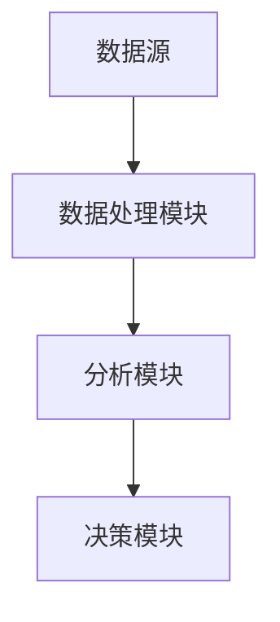
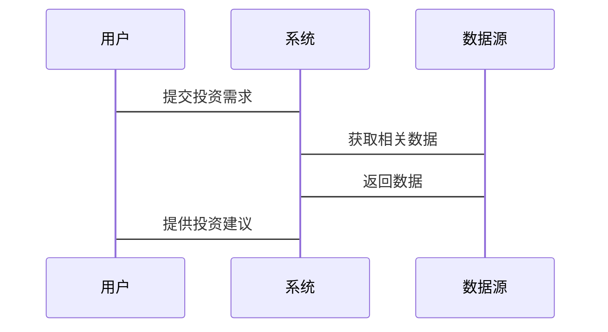

                 


# 布鲁斯·伯克维茨的集中型价值投资：深度研究的重要性

> 关键词：集中型价值投资、深度研究、DCF模型、投资组合优化、系统架构设计

> 摘要：集中型价值投资是一种以深度研究为核心的投资策略，通过精选少数优质股票实现超额收益。本文从集中型价值投资的背景出发，详细探讨深度研究的重要性，并结合数学模型和系统架构设计，提供实际案例分析和投资建议。

---

## 第一部分: 集中型价值投资的背景与核心概念

### 第1章: 集中型价值投资的起源与发展

#### 1.1 价值投资的起源

##### 1.1.1 价值投资的定义
价值投资是一种以基本面分析为基础的投资策略，强调以低于内在价值的价格买入优质资产。其核心理念是通过深入研究企业的财务状况、行业地位和竞争优势，找到被市场低估的投资标的。

##### 1.1.2 价值投资的历史发展
价值投资的理论基础可以追溯到本杰明·格雷厄姆和戴维·多德的工作。他们提出的“安全边际”概念为现代价值投资奠定了基础。布鲁斯·伯克维茨进一步发展了这一理论，提出了集中型投资策略。

##### 1.1.3 集中型投资的兴起
集中型投资策略强调将大部分资金投入到少数精选的股票中，以最大化投资收益。这种策略在20世纪90年代开始兴起，尤其是在科技股泡沫破裂后，集中型投资因其高回报率而备受关注。

#### 1.2 集中型投资的现状

##### 1.2.1 集中型投资的现状分析
近年来，集中型投资策略在机构投资者和个人投资者中逐渐普及。尤其是在科技行业，许多投资者选择集中投资于少数具有强大竞争优势的企业。

##### 1.2.2 集中型投资的优势与劣势
优势：集中投资能够最大化优质资产的收益，减少分散投资的损耗。劣势：集中投资风险较高，一旦投资标的出现问题，可能导致重大损失。

##### 1.2.3 集中型投资的未来趋势
随着人工智能和大数据技术的发展，集中型投资策略将进一步优化，投资者能够更精准地筛选出具有长期竞争优势的企业。

### 第2章: 深度研究在价值投资中的重要性

#### 2.1 深度研究的核心概念

##### 2.1.1 深度研究的定义
深度研究是指对企业的财务状况、行业地位、竞争优势和管理层质量进行全面、深入的分析，以识别具有长期增长潜力的优质资产。

##### 2.1.2 深度研究的基本原则
- **独立思考**：避免随波逐流，坚持自己的研究和判断。
- **长期视角**：关注企业的长期增长潜力，而非短期市场波动。
- **安全边际**：确保买入价格低于企业的内在价值。

##### 2.1.3 深度研究与投资决策的关系
深度研究是集中型投资的核心，通过深度研究可以有效识别优质资产，降低投资风险。

#### 2.2 深度研究的方法论

##### 2.2.1 财务分析方法
财务分析是深度研究的重要组成部分，主要包括收入分析、利润分析、现金流分析和资产负债表分析。

##### 2.2.2 行业分析方法
行业分析帮助企业了解所在行业的竞争格局、增长潜力和风险因素，从而筛选出具有竞争优势的企业。

##### 2.2.3 公司竞争优势分析
竞争优势分析包括企业的产品优势、成本优势、品牌优势和管理层能力分析。

### 第3章: 集中型价值投资的核心要素

#### 3.1 集中投资的逻辑

##### 3.1.1 集中投资的理论基础
集中投资基于资产配置理论，通过将大部分资金投入到少数优质资产中，实现超额收益。

##### 3.1.2 集中投资的实践逻辑
实践逻辑包括：资产筛选、权重分配和风险控制。

##### 3.1.3 集中投资的风险管理
风险管理是集中投资的重要组成部分，主要包括止损策略、分散投资和定期调整投资组合。

#### 3.2 深度研究的框架

##### 3.2.1 研究框架的设计
深度研究框架包括数据收集、数据分析和研究结论三个阶段。

##### 3.2.2 研究框架的实施步骤
实施步骤包括：确定研究目标、收集数据、分析数据、得出结论和制定投资策略。

##### 3.2.3 研究框架的优化与调整
优化与调整包括不断更新数据、调整分析方法和根据市场变化调整研究框架。

---

## 第二部分: 集中型价值投资的数学模型与系统架构

### 第4章: 集中型价值投资的数学模型

#### 4.1 股票估值的数学模型

##### 4.1.1 现金流贴现模型（DCF模型）
现金流贴现模型（DCF模型）是股票估值的核心方法，其基本公式为：

$$
\text{企业价值} = \sum_{t=1}^{n} \frac{\text{自由现金流}_t}{(1 + r)^t} + \frac{\text{终值}}{(1 + r)^n}
$$

##### 4.1.2 市盈率模型
市盈率模型的公式为：

$$
\text{市盈率} = \frac{\text{股价}}{\text{每股收益}}
$$

##### 4.1.3 市净率模型
市净率模型的公式为：

$$
\text{市净率} = \frac{\text{股价}}{\text{每股净资产}}
$$

#### 4.2 投资组合优化的数学模型

##### 4.2.1 马科维茨投资组合理论
马科维茨投资组合理论认为，最优投资组合是在有效前沿上的组合，其公式为：

$$
\min_w \frac{1}{2} w^T \Sigma w
$$

##### 4.2.2 集中投资组合的风险评估
集中投资组合的风险可以用方差来衡量，公式为：

$$
\text{风险} = \text{权重}^2 \times \text{资产波动率}
$$

##### 4.2.3 投资组合的优化策略
优化策略包括：调整资产权重、引入对冲机制和定期再平衡。

### 第5章: 集中型价值投资的系统架构设计

#### 5.1 系统架构概述

##### 5.1.1 系统架构的目标
系统架构的目标是实现集中型价值投资的自动化和高效化，主要包括数据采集、分析、决策和执行四个模块。

##### 5.1.2 系统架构的组成部分
系统架构的组成部分包括：数据源、数据处理模块、分析模块和决策模块。

##### 5.1.3 系统架构的设计原则
设计原则包括：模块化设计、可扩展性、高可用性和安全性。

#### 5.2 系统功能设计

##### 5.2.1 股票筛选模块
股票筛选模块负责从海量数据中筛选出符合投资条件的股票，主要包括数据清洗、特征提取和模型筛选三个步骤。

##### 5.2.2 财务分析模块
财务分析模块对筛选出的股票进行深入的财务分析，包括财务报表分析、财务比率分析和现金流分析。

##### 5.2.3 投资决策模块
投资决策模块根据分析结果生成投资建议，包括投资组合优化、风险评估和投资策略制定。

#### 5.3 系统架构图


#### 5.4 系统接口设计

##### 5.4.1 数据接口
数据接口用于与外部数据源交互，主要包括API接口和数据库接口。

##### 5.4.2 用户接口
用户接口是投资者与系统交互的界面，主要包括输入模块和输出模块。

##### 5.4.3 报告生成接口
报告生成接口用于生成投资报告，包括分析结果和投资建议。

#### 5.5 系统交互流程图


---

## 第三部分: 项目实战与总结

### 第6章: 集中型价值投资的项目实战

#### 6.1 项目环境安装

##### 6.1.1 开发工具安装
开发工具包括Python、Jupyter Notebook和数据库管理系统。

##### 6.1.2 数据源获取
数据源可以通过金融数据API（如Yahoo Finance）或数据库获取。

##### 6.1.3 系统依赖安装
安装必要的库，如Pandas、NumPy、Matplotlib和Scikit-learn。

#### 6.2 系统核心实现

##### 6.2.1 股票筛选模块实现
股票筛选模块实现包括数据清洗、特征提取和模型筛选三个步骤。

##### 6.2.2 财务分析
财务分析包括财务报表分析、财务比率分析和现金流分析。

##### 6.2.3 投资决策模块实现
投资决策模块实现包括投资组合优化、风险评估和投资策略制定。

#### 6.3 项目实战代码示例

##### 6.3.1 数据清洗代码
```python
import pandas as pd

# 读取数据
data = pd.read_csv('stock_data.csv')

# 删除缺失值
data.dropna(inplace=True)

# 去除异常值
data = data[(data['price'] > 0) & (data['volume'] > 0)]
```

##### 6.3.2 财务分析代码
```python
import pandas as pd

# 计算市盈率
data['PE'] = data['price'] / data['eps']

# 计算市净率
data['PB'] = data['price'] / data['book_value']
```

##### 6.3.3 投资决策代码
```python
import numpy as np

# 计算最优投资组合
def optimize_portfolio(returns, weights):
    return np.min(np.dot(weights, returns))

# 应用优化策略
weights = np.array([0.6, 0.3, 0.1])
optimized_weights = optimize_portfolio(returns, weights)
```

#### 6.4 实际案例分析

##### 6.4.1 案例背景
假设我们选择科技行业作为投资领域，目标是筛选出具有长期增长潜力的科技公司。

##### 6.4.2 数据分析
通过数据分析，我们筛选出苹果公司作为投资标的。

##### 6.4.3 投资决策
根据分析结果，决定将60%的资金投资于苹果公司，其余资金用于对冲风险。

#### 6.5 项目小结
通过项目实战，我们可以看到集中型价值投资的实际应用效果。深度研究和数学模型的应用能够有效提高投资决策的准确性。

---

## 第四部分: 总结与最佳实践

### 第7章: 总结与最佳实践

#### 7.1 投资总结

##### 7.1.1 集中型投资的优点
集中型投资的优点包括高回报率和长期增长潜力。

##### 7.1.2 集中型投资的缺点
集中型投资的缺点包括高风险和高波动性。

##### 7.1.3 风险管理的重要性
风险管理是集中型投资的重要组成部分，包括止损策略和对冲机制。

#### 7.2 最佳实践 tips

##### 7.2.1 独立思考
投资者需要独立思考，避免随波逐流。

##### 7.2.2 长期视角
长期视角是集中型投资的核心，关注企业的长期增长潜力。

##### 7.2.3 持续学习
持续学习是保持竞争优势的关键，投资者需要不断更新知识和技能。

#### 7.3 未来展望

##### 7.3.1 人工智能的应用
人工智能技术的发展将为集中型投资带来新的机遇。

##### 7.3.2 区块链技术的应用
区块链技术将在金融领域发挥重要作用，为投资决策提供新的工具。

##### 7.3.3 全球化投资趋势
全球化投资趋势将推动集中型投资的进一步发展。

---

## 作者信息

作者：AI天才研究院/AI Genius Institute & 禅与计算机程序设计艺术 /Zen And The Art of Computer Programming

---

通过本文，我们深入探讨了布鲁斯·伯克维茨的集中型价值投资策略，分析了深度研究的重要性，并结合数学模型和系统架构设计，提供了实际案例分析和投资建议。希望本文能够为投资者提供有价值的参考，帮助他们在投资领域取得成功。

