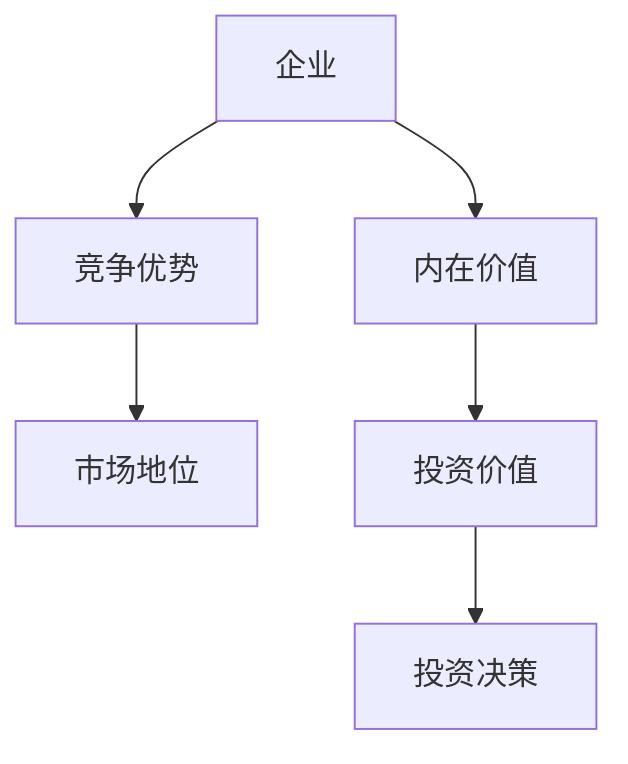
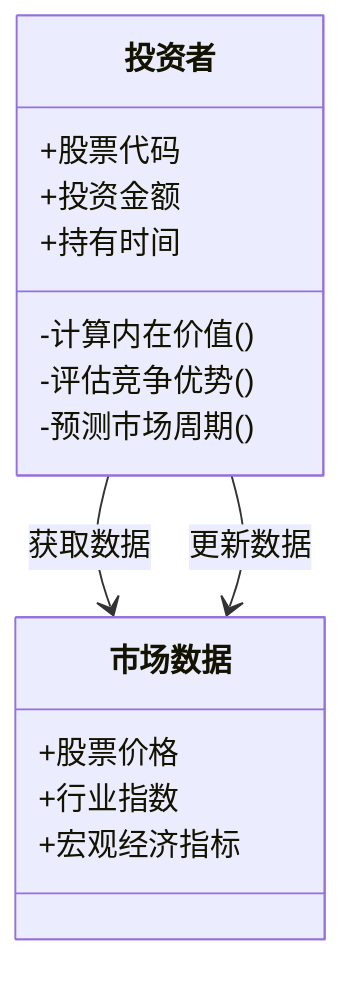

                 


# 布鲁斯·格林沃尔德的隐藏价值投资法

> 关键词：隐藏价值投资法、价值投资、格林沃尔德、投资策略、市场分析、竞争优势

> 摘要：本文系统地介绍了布鲁斯·格林沃尔德的隐藏价值投资法，从其背景、核心概念、数学模型到系统架构和实际案例进行了详细分析。文章通过逐步推理和实例解读，揭示了隐藏价值投资法的精髓，为投资者提供了深入的理论支持和实践指导。

---

## 第一部分: 隐藏价值投资法的背景与基础

### 第1章: 价值投资的起源与发展

#### 1.1 价值投资的起源

##### 1.1.1 价值投资的定义与核心理念

价值投资是一种以公司基本面分析为核心的长期投资策略，其核心理念是寻找市场价格低于其内在价值的股票进行投资。这种方法强调对公司财务状况、行业地位、竞争优势等多方面的深入分析，以识别出具有长期增长潜力的优质企业。

##### 1.1.2 价值投资的历史发展

价值投资的起源可以追溯到20世纪初，本杰明·格雷厄姆和戴维·多德是这一投资理念的先驱。他们提出的“安全边际”概念奠定了价值投资的基础。随后，沃伦·巴菲特进一步发展了这一理论，将其应用于实际投资，并取得了巨大成功。布鲁斯·格林沃尔德则在这一基础上，提出了隐藏价值投资法，为价值投资领域注入了新的思路。

##### 1.1.3 布鲁斯·格林沃尔德的贡献

布鲁斯·格林沃尔德是哥伦比亚大学商学院的教授，他在价值投资领域有着深厚的造诣。他的隐藏价值投资法强调在市场中寻找那些尚未被广泛发现的潜在价值，即“隐藏价值”。这种方法不仅关注企业的内在价值，还注重市场周期和竞争优势的动态变化，为投资者提供了更为灵活和实用的投资策略。

---

### 第2章: 隐藏价值投资法的核心概念

#### 2.1 隐藏价值投资法的定义

隐藏价值投资法是一种基于对公司内在价值深入分析的投资方法，其核心在于识别市场中被低估的企业，并通过长期持有这些企业，实现超额收益。这种方法不仅关注企业的财务表现，还强调企业在行业中的竞争优势和市场地位。

#### 2.2 核心概念与联系

##### 2.2.1 核心概念原理

隐藏价值投资法的核心概念包括内在价值、竞争优势和市场周期。内在价值是企业在正常经营状态下未来现金流的现值，竞争优势是企业在行业中相对于竞争对手的独特优势，市场周期则是指市场整体波动对投资决策的影响。

##### 2.2.2 核心概念属性特征对比表

| 概念       | 属性               | 特征                             |
|------------|--------------------|----------------------------------|
| 内在价值   | 计算方式           | 现金流折现法                     |
|            | 时间维度           | 长期                            |
| 竞争优势   | 类型               | 成本优势、品牌优势、技术优势等  |
|            | 持续性             | 长期                            |
| 市场周期   | 阶段               | 上升、下降、盘整                 |
|            | 影响因素           | 市场情绪、宏观经济指标等         |

##### 2.2.3 实体关系图（ER图）



---

#### 2.3 隐藏价值投资法与传统价值投资的区别

隐藏价值投资法与传统价值投资的主要区别在于其更加注重市场周期和竞争优势的动态变化。传统价值投资更关注于企业内在价值的静态评估，而隐藏价值投资法则强调在不同市场周期下，竞争优势对企业价值的影响。

---

### 第3章: 隐藏价值投资法的数学模型与公式

#### 3.1 内在价值的计算公式

内在价值的计算公式是隐藏价值投资法的核心之一。以下是计算公式：

$$
\text{内在价值} = \sum_{t=1}^{n} \frac{\text{自由现金流}_t}{(1 + r)^t}
$$

其中，$r$ 是折现率，$n$ 是预测的现金流期限。

#### 3.2 竞争优势的评估模型

竞争优势的评估模型可以通过以下步骤进行：

1. 确定企业的竞争优势类型（如成本优势、品牌优势等）。
2. 对每种竞争优势进行量化评估，例如成本优势可以用$ \text{成本优势} = \frac{\text{行业平均成本} - \text{企业成本}}{\text{行业平均成本}} $。
3. 综合评估企业的竞争优势强度。

---

### 第4章: 算法原理与实现

#### 4.1 竞争优势分析的算法实现

以下是竞争优势分析的算法实现：

```python
def calculate_competitive_edge(risk_free_rate, market_risk_premium):
    # 计算折现率
    discount_rate = risk_free_rate + market_risk_premium
    # 计算竞争优势
    competitive_edge = (discount_rate - risk_free_rate) / discount_rate
    return competitive_edge
```

#### 4.2 市场周期预测的算法模型

市场周期预测的算法模型可以通过以下步骤实现：

1. 收集宏观经济指标（如GDP增长率、失业率等）。
2. 建立多元回归模型，预测市场周期。
3. 根据预测结果调整投资策略。

---

### 第5章: 系统分析与架构设计

#### 5.1 系统功能设计

以下是隐藏价值投资法的系统功能设计：



---

### 第6章: 项目实战

#### 6.1 环境安装与配置

以下是投资分析工具的安装步骤：

1. 安装Python和必要的库（如Pandas、NumPy）。
2. 下载历史股价数据（如通过Yahoo Finance API）。
3. 配置投资策略参数。

---

### 第7章: 总结与最佳实践

#### 7.1 本章小结

隐藏价值投资法通过深入分析企业的内在价值、竞争优势和市场周期，帮助投资者在市场中发现被低估的投资机会。这种方法不仅适用于长期投资，还可以在不同市场周期下灵活调整投资策略。

---

## 作者：AI天才研究院/AI Genius Institute & 禅与计算机程序设计艺术 /Zen And The Art of Computer Programming

---

这篇文章系统地介绍了布鲁斯·格林沃尔德的隐藏价值投资法，从其背景、核心概念到系统设计和实际案例进行了详细分析。通过逐步推理和实例解读，揭示了隐藏价值投资法的精髓，为投资者提供了深入的理论支持和实践指导。

