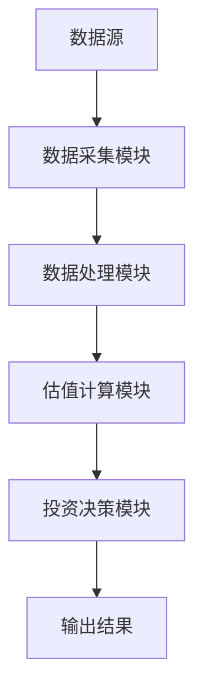
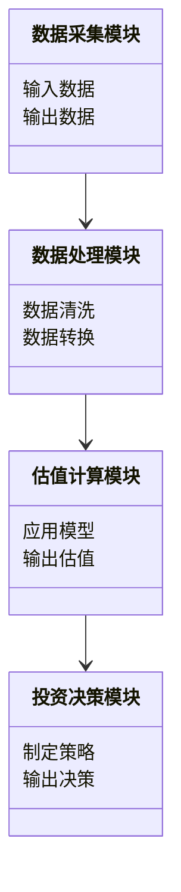

                 


# 布鲁斯·格林沃尔德的隐藏资产价值投资：发掘被低估的资产

## 关键词：隐藏资产、价值投资、资产评估、投资策略、风险管理、系统架构、案例分析

## 摘要：  
在投资领域，隐藏资产是指那些未被市场充分认知或估值被低估的资产。布鲁斯·格林沃尔德的隐藏资产价值投资方法通过深入分析和评估这些资产，发现其潜在价值，并制定相应的投资策略。本文将详细探讨隐藏资产的定义、评估方法、投资策略、风险管理以及系统架构设计，帮助投资者更好地识别和利用隐藏资产。

---

## 第1章: 隐藏资产的定义与特征

### 1.1 隐藏资产的定义与分类  
隐藏资产是指那些在市场中未被充分发现或估值被低估的资产。这些资产可能由于市场信息不对称、投资者认知偏差或市场波动等原因，其真实价值未被体现。  

#### 1.1.1 什么是隐藏资产  
隐藏资产可以是企业、房地产、金融资产或其他类型的资产。它们通常具有以下特征：  
1. 估值低于其实际价值。  
2. 市场关注度较低，流动性不足。  
3. 具有较高的增长潜力。  

#### 1.1.2 隐藏资产的分类  
隐藏资产可以分为以下几类：  
- **企业资产**：未被充分评估的企业股权或项目。  
- **金融资产**：低估的股票、债券或其他金融工具。  
- **实物资产**：未被发现的房地产、艺术品等。  

#### 1.1.3 隐藏资产的特征  
- **低估值**：市场价格低于内在价值。  
- **低流动性**：交易不活跃，市场参与者较少。  
- **高潜力**：具有较高的增长潜力或重组价值。  

### 1.2 隐藏资产的价值投资背景  
价值投资是一种通过寻找市场价格低于内在价值的资产进行投资的策略。隐藏资产是价值投资的核心对象之一。  

#### 1.2.1 传统价值投资的局限性  
传统价值投资方法在实践中面临以下挑战：  
1. 市场波动导致资产价格频繁变化。  
2. 信息不对称使得投资者难以发现真正的隐藏资产。  
3. 高额的竞争使得低估资产难以长期保持低估。  

#### 1.2.2 隐藏资产投资的兴起  
随着市场的成熟和投资者对深度分析的需求增加，隐藏资产投资逐渐兴起。这种方法特别适合那些能够深入分析市场并发现低估资产的专业投资者。  

#### 1.2.3 隐藏资产投资的核心理念  
隐藏资产投资的核心理念是通过深入分析和研究，发现市场价格低于内在价值的资产，并在合适的时间买入，等待其价值回归。

---

## 第2章: 隐藏资产的价值评估方法

### 2.1 隐藏资产的评估指标  
评估隐藏资产时，常用的指标包括市盈率（P/E）、市净率（P/B）等。  

#### 2.1.1 市盈率（P/E）  
市盈率是股票的市场价格与每股收益的比率。低市盈率通常意味着股票可能被低估。  

公式：$$P/E = \frac{\text{股价}}{\text{每股收益}}$$  

#### 2.1.2 市净率（P/B）  
市净率是股票的市场价格与每股净资产的比率。低市净率可能表明股票被低估。  

公式：$$P/B = \frac{\text{股价}}{\text{每股净资产}}$$  

#### 2.1.3 企业价值（EV）与息税折旧及摊销前利润（EBITDA）  
企业价值是公司整体价值的度量，EBITDA是衡量企业盈利能力的指标。低EV/EBITDA比率可能意味着企业价值被低估。  

公式：$$EV/EBITDA = \frac{\text{企业价值}}{\text{EBITDA}}$$  

### 2.2 隐藏资产的评估模型  
评估隐藏资产时，常用的方法包括现金流折现模型（DCF）和相对估值法。  

#### 2.2.1 现金流折现模型（DCF）  
DCF模型通过将未来现金流折现为现值来评估资产的价值。  

步骤：  
1. 预测未来现金流。  
2. 选择适当的折现率。  
3. 计算现值。  

公式：$$\text{现值} = \sum_{t=1}^{n} \frac{\text{现金流}_t}{(1 + r)^t}$$  

#### 2.2.2 股权自由现金流模型  
股权自由现金流模型用于评估企业股权价值。  

公式：$$\text{股权价值} = \frac{\text{股权自由现金流}}{\text{折现率} - \text{增长率}}$$  

#### 2.2.3 相对估值法（可比公司分析）  
相对估值法通过比较可比公司的估值指标来评估目标资产的价值。  

### 2.3 隐藏资产的评估流程  
评估隐藏资产的流程包括数据收集、指标计算、模型应用和结果分析。  

步骤：  
1. 数据收集与整理。  
2. 计算评估指标。  
3. 应用估值模型。  
4. 分析结果并调整。  

---

## 第3章: 隐藏资产投资的策略与实践

### 3.1 隐藏资产的投资策略  
隐藏资产的投资策略包括价值型投资、成长型投资和混合型投资。  

#### 3.1.1 价值型投资策略  
价值型投资策略注重寻找市场价格低于内在价值的资产。  

#### 3.1.2 成长型投资策略  
成长型投资策略关注具有高增长潜力的资产。  

#### 3.1.3 混合型投资策略  
混合型投资策略结合价值和成长因素，寻找具有低估和高增长潜力的资产。  

### 3.2 隐藏资产投资的组合管理  
投资组合管理包括构建组合、风险分散和定期调整。  

#### 3.2.1 投资组合的构建  
构建投资组合时，应考虑资产的多样性和互补性。  

#### 3.2.2 风险分散与收益平衡  
通过分散投资降低风险，同时平衡收益和风险。  

#### 3.2.3 定期调整与优化  
根据市场变化和资产表现，定期调整投资组合。  

---

## 第4章: 隐藏资产投资的风险管理

### 4.1 隐藏资产投资的主要风险  
隐藏资产投资面临市场风险、信用风险、流动性风险和操作风险。  

#### 4.1.1 市场风险  
市场波动可能导致资产价格下跌。  

#### 4.1.2 信用风险  
债券等信用类资产可能面临发行人违约的风险。  

#### 4.1.3 流动性风险  
某些资产流动性差，可能导致难以快速变现。  

#### 4.1.4 操作风险  
操作失误或欺诈行为可能影响投资收益。  

### 4.2 风险管理的工具与方法  
风险管理工具包括风险评估矩阵、风险对冲策略和风险预警机制。  

#### 4.2.1 风险评估矩阵  
风险评估矩阵用于评估不同风险的严重性和可能性。  

#### 4.2.2 风险对冲策略  
通过衍生工具对冲部分风险。  

#### 4.2.3 风险预警机制  
建立预警机制，及时发现和应对风险。  

---

## 第5章: 隐藏资产投资的系统架构与流程

### 5.1 隐藏资产投资系统的模块划分  
隐藏资产投资系统通常包括数据采集、数据处理、估值计算和投资决策四个模块。  

#### 5.1.1 数据采集模块  
数据采集模块负责收集市场数据和公司信息。  

#### 5.1.2 数据处理模块  
数据处理模块对数据进行清洗和转换。  

#### 5.1.3 估值计算模块  
估值计算模块应用各种模型计算资产价值。  

#### 5.1.4 投资决策模块  
投资决策模块根据估值结果制定投资策略。  

### 5.2 系统架构设计  
系统架构设计包括数据流、功能模块和交互流程。  

#### 5.2.1 数据流设计  
数据从外部输入，经过处理后，生成估值结果，最终输出投资决策。  



#### 5.2.2 功能模块设计  
功能模块包括数据采集、数据处理、估值计算和投资决策。  



---

## 第6章: 隐藏资产投资的项目实战

### 6.1 项目介绍  
本项目旨在通过隐藏资产的价值投资方法，发现被低估的资产并制定投资策略。  

### 6.2 系统核心实现  
系统核心实现包括数据采集、估值计算和投资决策。  

#### 6.2.1 数据采集  
数据采集模块通过API获取市场数据。  

```python
import requests

url = "https://api.example.com/data"
response = requests.get(url)
data = response.json()
```

#### 6.2.2 估值计算  
估值计算模块应用现金流折现模型计算资产价值。  

```python
def calculate_dcf(cash_flows, discount_rate):
    return sum(flow / (1 + discount_rate)**t for t, flow in enumerate(cash_flows))
```

#### 6.2.3 投资决策  
投资决策模块根据估值结果制定投资策略。  

```python
if valuation > market_price:
    print("买入")
else:
    print("卖出")
```

### 6.3 实际案例分析  
通过具体案例分析隐藏资产的投资机会和风险。  

### 6.4 项目小结  
总结项目实施过程中的经验和教训，提出改进建议。  

---

## 第7章: 总结与展望

### 7.1 总结  
本文详细探讨了隐藏资产的价值投资方法，包括定义、评估、策略和风险管理。  

### 7.2 展望  
未来，随着技术的进步和市场的变化，隐藏资产投资将更加依赖于数据科学和人工智能。投资者需要不断学习和适应，以抓住隐藏资产的投资机会。

---

## 作者：AI天才研究院/AI Genius Institute & 禅与计算机程序设计艺术 /Zen And The Art of Computer Programming

