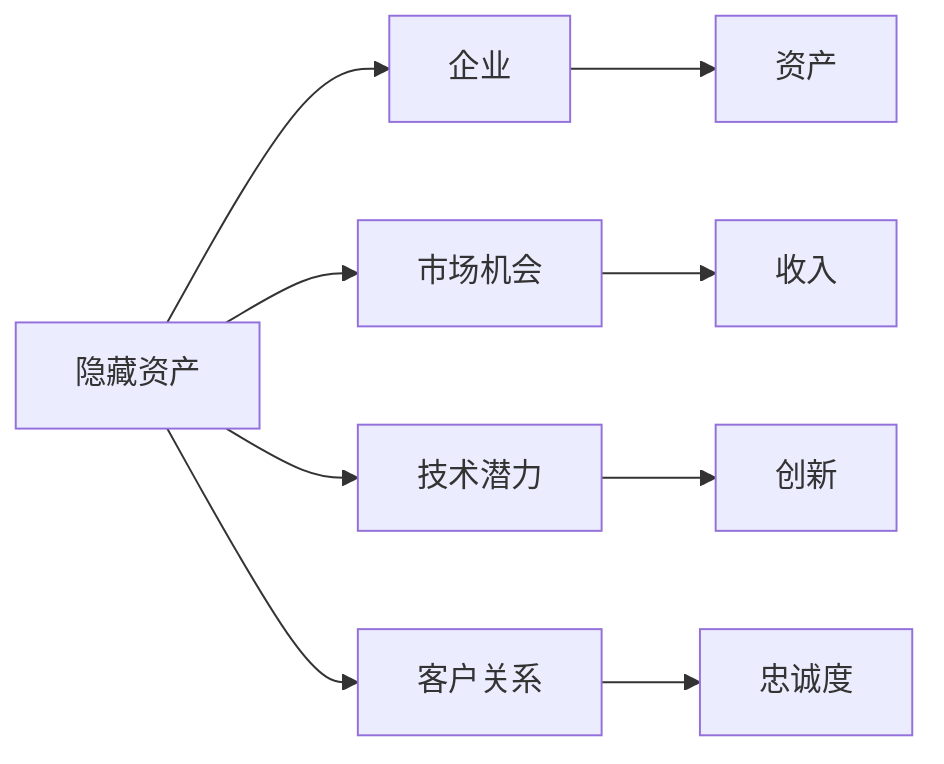
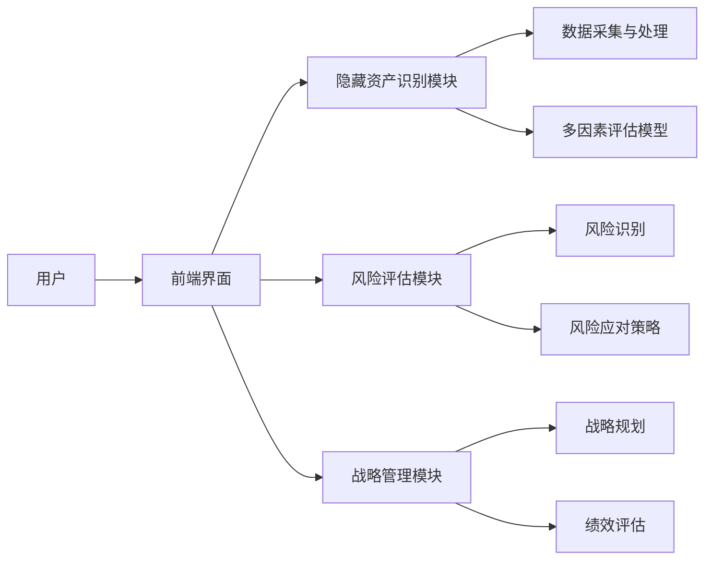

                 


# 布鲁斯·贝克威斯的隐藏资产价值发掘

## 关键词：隐藏资产、价值评估、资产识别、资产量化、风险管理

## 摘要：本文深入探讨隐藏资产的概念、特征及其在企业中的重要性，结合实例分析和系统设计，提出了一套完整的隐藏资产价值评估方法。通过算法原理、系统架构和项目实战的详细讲解，帮助读者掌握如何识别和量化隐藏资产，从而提升企业的整体价值。

---

## 第1章 隐藏资产的定义与特征

### 1.1 隐藏资产的基本概念

#### 1.1.1 什么是隐藏资产
隐藏资产是指那些不易被直接观察或测量，但对企业的价值和未来发展具有重要影响的资源。它们通常包括无形资产、潜在机会和未被充分利用的资源。

#### 1.1.2 隐藏资产的分类
- **无形资产**：如品牌价值、客户关系、技术诀窍。
- **潜在资产**：如未开发的市场机会、未充分利用的员工潜力。
- **动态资产**：如实时数据流、网络影响力。

#### 1.1.3 隐藏资产的特征
- **动态性**：价值随时间变化。
- **隐式性**：不易被识别和量化。
- **复杂性**：涉及多个因素，难以单独评估。

### 1.2 隐藏资产的识别与评估

#### 1.2.1 隐藏资产的识别方法
- **数据分析法**：通过数据挖掘识别隐藏的模式和机会。
- **定性评估法**：通过专家判断和市场分析识别潜在资产。
- **综合评估法**：结合定量和定性方法进行全面评估。

#### 1.2.2 隐藏资产的评估标准
- **经济价值**：对企业的财务贡献。
- **战略价值**：对长期战略目标的支持。
- **风险价值**：在风险管理和应对中的作用。

#### 1.2.3 隐藏资产的量化模型
- **多因素评估模型**：综合考虑多个因素，如市场潜力、竞争优势等。
- **加权评分法**：根据各因素的重要性进行加权评分。

---

## 第2章 隐藏资产的价值与意义

### 2.1 隐藏资产对企业价值的影响

#### 2.1.1 隐藏资产对企业竞争力的作用
- **提升核心竞争力**：通过优化资源配置，增强企业的市场地位。
- **降低经营风险**：通过识别潜在风险，制定应对策略。

#### 2.1.2 隐藏资产对资产增值的推动
- **提升资产整体价值**：通过挖掘隐藏资产的潜力，提升整体资产的回报率。
- **增强市场估值**：在资本市场中，隐藏资产的价值会被重新评估，提升企业市值。

#### 2.1.3 隐藏资产在企业风险管理中的作用
- **风险识别与预警**：通过识别隐藏资产中的潜在风险，提前采取措施。
- **风险应对策略**：通过优化隐藏资产的管理，降低风险对企业的影响。

### 2.2 隐藏资产在不同领域的应用

#### 2.2.1 隐藏资产在金融领域的应用
- **评估企业价值**：在并购和投资中，隐藏资产的价值是重要的评估因素。
- **风险管理**：识别隐藏资产中的潜在风险，制定风险管理策略。

#### 2.2.2 隐藏资产在科技领域的应用
- **技术创新**：通过识别隐藏资产中的技术潜力，推动技术创新。
- **知识产权管理**：保护和利用隐藏的知识产权，提升企业的竞争力。

#### 2.2.3 隐藏资产在企业运营中的应用
- **优化资源配置**：通过识别隐藏资产，优化资源配置，提高运营效率。
- **提升员工潜力**：通过识别员工的隐藏潜力，制定个性化的发展计划，提升员工绩效。

---

## 第3章 隐藏资产的核心概念与原理

### 3.1 隐藏资产的核心概念

#### 3.1.1 隐藏资产的动态性
- 隐藏资产的价值随时间和环境变化而变化，需要动态评估和管理。

#### 3.1.2 隐藏资产的隐式性
- 隐藏资产通常不被直接观察，需要通过间接的方法进行识别和评估。

#### 3.1.3 隐藏资产的复杂性
- 隐藏资产涉及多个因素，评估过程中需要综合考虑多种因素。

### 3.2 隐藏资产的属性特征对比

#### 3.2.1 隐藏资产与显性资产的对比
| 特性      | 隐藏资产          | 显性资产          |
|-----------|-------------------|-------------------|
| 可见性     | 低                | 高                |
| 评估难度   | 高                | 低                |
| 管理复杂度 | 高                | 低                |

#### 3.2.2 隐藏资产与无形资产的对比
| 特性      | 隐藏资产          | 无形资产          |
|-----------|-------------------|-------------------|
| 定义       | 未被直接观察的资产 | 无实物形态的资产  |
| 例子       | 市场机会、员工潜力 | 品牌、专利          |

#### 3.2.3 隐藏资产与潜在资产的对比
| 特性      | 隐藏资产          | 潜在资产          |
|-----------|-------------------|-------------------|
| 状态       | 已存在但未被识别  | 未被开发的潜力    |
| 评估方法   | 需要识别和评估    | 需要开发和利用    |

### 3.3 隐藏资产的实体关系图



---

## 第4章 隐藏资产的评估与管理策略

### 4.1 隐藏资产的评估框架

#### 4.1.1 多因素评估模型
$$ V = \sum_{i=1}^{n} w_i \cdot f_i $$
其中，$V$ 是总价值，$w_i$ 是第 $i$ 个因素的权重，$f_i$ 是第 $i$ 个因素的评分。

#### 4.1.2 评估步骤
1. **识别隐藏资产**：通过数据分析和市场调研识别潜在的隐藏资产。
2. **评估各因素**：根据多因素评估模型，对各因素进行评分和加权。
3. **综合评估**：计算总价值，得出隐藏资产的综合评估结果。

### 4.2 隐藏资产的管理策略

#### 4.2.1 动态管理
- 定期评估隐藏资产的价值，及时调整管理策略。
- 根据市场变化和企业战略调整隐藏资产的管理重点。

#### 4.2.2 风险管理
- 识别隐藏资产中的潜在风险，制定风险应对策略。
- 建立风险管理机制，降低隐藏资产对企业的影响。

#### 4.2.3 战略管理
- 将隐藏资产纳入企业战略规划，提升企业的核心竞争力。
- 通过优化隐藏资产的管理，推动企业的长期发展。

---

## 第5章 隐藏资产的系统设计与实现

### 5.1 系统功能设计

#### 5.1.1 隐藏资产识别模块
- 数据采集与处理：通过数据分析工具采集相关数据，识别隐藏资产。
- 模型建立与评估：建立多因素评估模型，对隐藏资产进行评分和加权。

#### 5.1.2 风险评估模块
- 风险识别：通过数据分析和市场调研，识别隐藏资产中的潜在风险。
- 风险评估：对风险进行量化评估，制定风险应对策略。

#### 5.1.3 战略管理模块
- 战略规划：将隐藏资产纳入企业战略规划，制定长期发展目标。
- 绩效评估：定期评估隐藏资产的管理效果，优化管理策略。

### 5.2 系统架构设计



### 5.3 系统实现代码

#### 5.3.1 环境安装
```bash
pip install pandas numpy scikit-learn
```

#### 5.3.2 核心代码实现
```python
import pandas as pd
from sklearn.metrics import mean_squared_error

def calculate_hidden_assets_value(data, weights):
    factors = data.columns.tolist()
    value = 0
    for i in range(len(factors)):
        factor_value = data[factors[i]].values[0]
        weighted_value = factor_value * weights[i]
        value += weighted_value
    return value

# 示例数据
data = pd.DataFrame({
    '市场机会': [0.8],
    '技术潜力': [0.7],
    '客户关系': [0.9]
})

weights = [0.4, 0.3, 0.3]

value = calculate_hidden_assets_value(data, weights)
print("隐藏资产价值:", value)
```

---

## 第6章 项目实战与案例分析

### 6.1 项目背景介绍
某科技公司希望通过识别和评估隐藏资产，提升企业的核心竞争力和市场价值。隐藏资产包括未开发的市场机会和技术潜力。

### 6.2 项目实施过程

#### 6.2.1 数据采集与处理
通过市场调研和数据分析，采集相关数据，建立多因素评估模型。

#### 6.2.2 模型建立与评估
根据采集的数据，建立多因素评估模型，对隐藏资产进行评分和加权，计算总价值。

#### 6.2.3 风险评估与应对
识别隐藏资产中的潜在风险，制定风险应对策略，降低风险对企业的影响。

#### 6.2.4 战略规划与实施
将隐藏资产纳入企业战略规划，制定长期发展目标，优化管理策略。

### 6.3 项目成果与总结

#### 6.3.1 成果展示
通过项目实施，识别了多个未被充分利用的市场机会和技术潜力，提升了企业的核心竞争力和市场价值。

#### 6.3.2 成功经验总结
- 通过系统化的识别和评估方法，提升了隐藏资产的管理水平。
- 建立了动态评估机制，能够及时调整管理策略，应对市场变化。

#### 6.3.3 挑战与启示
- 隐藏资产的识别和评估过程复杂，需要结合定量和定性方法。
- 隐藏资产的管理需要动态调整，及时应对市场变化和企业战略调整。

---

## 第7章 最佳实践与注意事项

### 7.1 最佳实践
1. **系统化识别与评估**：通过系统化的识别和评估方法，确保隐藏资产的全面性和准确性。
2. **动态管理**：定期评估隐藏资产的价值，及时调整管理策略，应对市场变化。
3. **风险管理**：识别隐藏资产中的潜在风险，制定风险应对策略，降低风险对企业的影响。

### 7.2 注意事项
1. **数据质量**：确保数据的准确性和完整性，避免因数据问题导致评估结果偏差。
2. **模型选择**：根据实际情况选择合适的评估模型，避免盲目应用复杂的模型。
3. **团队协作**：隐藏资产的识别和评估需要多部门协作，确保信息共享和资源整合。

### 7.3 小结
隐藏资产是企业的重要资源，其价值和潜力需要通过系统化的识别和评估方法才能被挖掘和利用。通过本文的分析和实践，读者可以掌握隐藏资产的识别与评估方法，提升企业的整体价值和竞争力。

### 7.4 拓展阅读
- 推荐阅读《企业风险管理与内部控制》、《资产评估与价值管理》等相关书籍，深入理解隐藏资产的管理策略和实践方法。

---

## 作者：AI天才研究院 & 禅与计算机程序设计艺术

---

以上是《布鲁斯·贝克威斯的隐藏资产价值发掘》的技术博客文章的完整目录和内容。文章详细讲解了隐藏资产的定义、特征、评估方法和管理策略，并通过实际案例分析和系统设计，帮助读者掌握隐藏资产的价值发掘方法。

