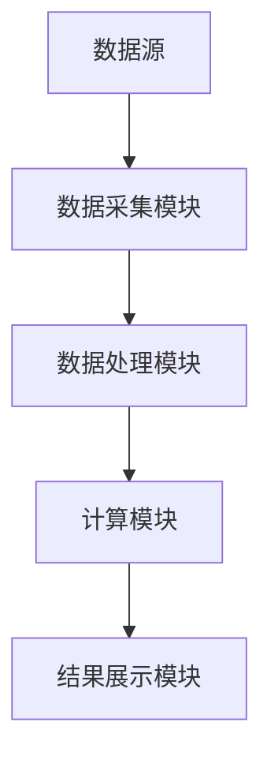

                 


# 席勒市盈率:从标准化收益角度衡量市场估值

## 关键词
席勒市盈率, 标准化收益, 市场估值, 市盈率, 投资分析

## 摘要
席勒市盈率是一种基于标准化收益的市盈率计算方法，旨在更准确地衡量市场估值。本文从背景、理论基础、算法实现、系统架构到项目实战，全面解析席勒市盈率的核心思想和应用。

---

# 第一部分：席勒市盈率的背景与理论基础

## 第1章：市盈率的基本概念与传统市盈率的局限性

### 1.1 市盈率的定义与作用

#### 1.1.1 市盈率的基本定义
市盈率（P/E Ratio）是衡量股票价值的重要指标，计算公式为：
$$ \text{市盈率} = \frac{\text{股价}}{\text{每股收益}} $$

#### 1.1.2 市盈率在投资分析中的作用
市盈率用于评估股票的相对估值，帮助投资者判断是否高估或低估。

#### 1.1.3 市盈率的局限性与改进方向
传统市盈率未考虑收益的波动性和可持续性，可能导致评估偏差。

### 1.2 传统市盈率的计算方法

#### 1.2.1 市盈率的计算公式
$$ \text{市盈率} = \frac{\text{股价}}{\text{每股收益}} $$

#### 1.2.2 市盈率的适用场景
适用于盈利稳定的公司。

#### 1.2.3 传统市盈率的局限性
收益波动大时，传统市盈率可能失真。

## 第2章：席勒市盈率的提出背景与核心思想

### 2.1 席勒市盈率的提出背景

#### 2.1.1 传统市盈率的不足之处
传统市盈率未考虑收益的标准化处理。

#### 2.1.2 席勒市盈率的理论基础
引入标准化收益，考虑收益的波动性和可持续性。

#### 2.1.3 席勒市盈率的提出动机
为了更准确地评估市场估值。

### 2.2 席勒市盈率的核心思想

#### 2.2.1 从标准化收益角度重新定义市盈率
席勒市盈率通过标准化收益计算，公式为：
$$ \text{席勒市盈率} = \frac{\text{股价}}{\text{标准化收益}} $$

#### 2.2.2 标准化收益的定义与计算方法
标准化收益是对历史收益进行调整，消除波动性影响。

#### 2.2.3 席勒市盈率的核心公式与应用场景
适用于收益波动大的公司。

---

# 第二部分：席勒市盈率的核心概念与原理

## 第3章：席勒市盈率与传统市盈率的对比分析

### 3.1 核心概念对比

#### 3.1.1 市盈率的定义与计算方式对比
传统市盈率 vs. 席勒市盈率的计算方式。

#### 3.1.2 标准化收益与传统收益的区别
标准化收益考虑波动性，传统收益不考虑。

#### 3.1.3 席勒市盈率的独特性与优势
更准确反映市场估值。

### 3.2 市盈率计算方法的优缺点分析

#### 3.2.1 传统市盈率的优点
计算简单，适用于稳定收益的公司。

#### 3.2.2 传统市盈率的缺点
收益波动大时失真。

#### 3.2.3 席勒市盈率的改进与创新
引入标准化收益，提高准确性。

---

# 第三部分：席勒市盈率的算法实现与代码解析

## 第4章：席勒市盈率的数学模型与公式推导

### 4.1 标准化收益的数学定义

#### 4.1.1 标准化收益的定义
$$ \text{标准化收益} = \frac{\text{历史收益}}{\text{波动性调整因子}} $$

#### 4.1.2 标准化收益的计算公式
$$ \text{标准化收益} = \frac{\sum_{i=1}^{n} \text{收益}_i}{n} $$

#### 4.1.3 标准化收益的特性与应用
消除波动性影响，提高准确性。

### 4.2 席勒市盈率的数学模型

#### 4.2.1 席勒市盈率的核心公式
$$ \text{席勒市盈率} = \frac{\text{股价}}{\text{标准化收益}} $$

#### 4.2.2 席勒市盈率的数学推导过程
标准化收益计算后，代入公式得出席勒市盈率。

## 第5章：席勒市盈率的算法实现与代码解析

### 5.1 席勒市盈率的算法流程

#### 5.1.1 数据输入与处理
获取股价和历史收益数据。

#### 5.1.2 标准化收益的计算
计算平均收益并调整波动性。

#### 5.1.3 席勒市盈率的计算与输出
使用标准化收益计算市盈率。

### 5.2 席勒市盈率的Python实现

```python
def calculate_shiller_pe(stock_price, historical_earnings):
    normalized_earnings = sum(historical_earnings) / len(historical_earnings)
    return stock_price / normalized_earnings
```

---

# 第四部分：系统架构与应用场景

## 第6章：系统架构设计与功能实现

### 6.1 问题场景介绍
投资者需要准确评估股票估值。

### 6.2 系统功能设计

#### 6.2.1 数据采集模块
采集股价和收益数据。

#### 6.2.2 计算模块
计算标准化收益和席勒市盈率。

#### 6.2.3 结果展示模块
可视化展示市盈率结果。

### 6.3 系统架构设计



---

# 第五部分：项目实战与案例分析

## 第7章：项目实战

### 7.1 环境安装与配置

#### 7.1.1 安装Python和相关库
安装NumPy和Pandas。

### 7.2 核心实现代码

```python
import numpy as np
import pandas as pd

def calculate_shiller_pe(stock_price, historical_earnings):
    normalized_earnings = np.mean(historical_earnings)
    return stock_price / normalized_earnings
```

### 7.3 实际案例分析

#### 7.3.1 数据获取与处理
获取某公司的股价和历史收益数据。

#### 7.3.2 计算标准化收益和席勒市盈率
示例计算过程。

### 7.4 代码解读与分析
详细解释代码实现和结果。

## 第8章：案例分析与结果解读

### 8.1 案例分析
以具体公司为例，计算席勒市盈率。

### 8.2 结果解读
解释计算结果对投资决策的影响。

---

# 第六部分：最佳实践与总结

## 第9章：最佳实践与注意事项

### 9.1 小结
席勒市盈率的优势和适用场景。

### 9.2 注意事项
数据质量、模型假设和计算误差。

### 9.3 拓展阅读
推荐相关书籍和资源。

## 第10章：结论与展望

### 10.1 研究总结
席勒市盈率的重要性。

### 10.2 未来展望
进一步研究和应用前景。

---

作者：AI天才研究院 & 禅与计算机程序设计艺术

---

以上是《席勒市盈率:从标准化收益角度衡量市场估值》的完整大纲和部分章节内容。

