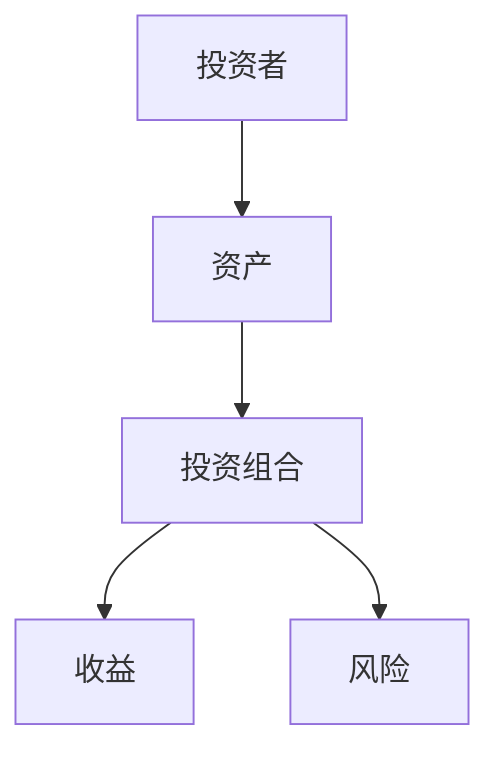
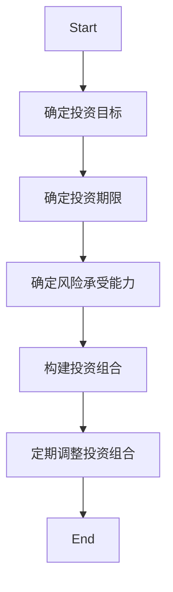
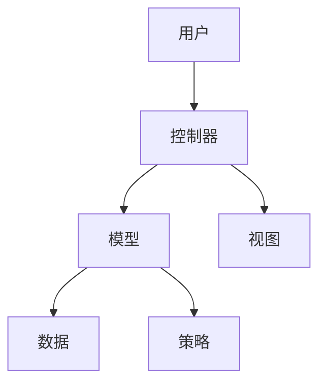

                 


# 平均分配投资：巴菲特的风险管理策略

## 关键词：巴菲特、平均分配投资、风险管理、投资策略、资产配置、概率论、统计学

## 摘要： 巴菲特的平均分配投资策略是一种以风险管理为核心的投资方法，通过分散投资降低风险，同时实现稳健的收益。本文将从背景、理论、算法、系统设计和实战等方面详细分析这一策略，帮助读者理解其原理和应用。

---

# 第一部分: 平均分配投资的背景与核心概念

## 第1章: 巴菲特的平均分配投资概述

### 1.1 巴菲特的生平与投资理念

#### 1.1.1 巴菲特的生平简介

沃伦·巴菲特（Warren Buffett），生于1934年，是世界著名投资家、企业家，被誉为“股神”。他通过长期价值投资，积累了巨额财富，成为全球知名富豪。巴菲特的投资理念以稳健、长期和价值为导向，强调安全边际和风险控制。

#### 1.1.2 巴菲特的投资哲学

巴菲特的投资哲学可以概括为以下几点：

- **长期投资**：避免短期市场波动的干扰，专注于企业的长期价值。
- **价值投资**：寻找具有持续竞争优势和良好管理的企业，以低于其内在价值的价格买入。
- **分散投资**：通过分散投资降低风险，避免过度依赖单一资产或行业。

#### 1.1.3 巴菲特的平均分配投资策略

平均分配投资（Dollar-cost averaging，DCA）是一种投资策略，即定期定额地买入资产，不论市场处于高点或低点。通过这种方式，投资者可以逐步建立仓位，降低整体投资成本，减少市场波动对投资组合的影响。

---

### 1.2 平均分配投资的背景

#### 1.2.1 投资市场的波动性

投资市场具有高度的不确定性和波动性，价格波动往往难以预测。尤其是在股市中，短期波动可能导致投资者决策失误，平均分配投资能够帮助投资者在市场波动中保持理性。

#### 1.2.2 投资者的风险偏好

不同投资者对风险的承受能力不同。对于风险厌恶型投资者，平均分配投资是一种稳健的投资策略，能够在不确定的市场中平滑波动，降低投资风险。

#### 1.2.3 平均分配投资的起源

平均分配投资策略并非巴菲特首创，但他在实践中将其发扬光大。该策略最初用于定期定额投资指数基金，后来被广泛应用于其他资产类别，如房地产、债券等。

---

### 1.3 平均分配投资的核心概念

#### 1.3.1 什么是平均分配投资

平均分配投资是指在一定时间内，定期定额地买入特定资产，以分摊投资成本并降低市场波动风险。这种方法通过系统化的方式，帮助投资者避免情绪化决策，实现长期稳健的投资收益。

#### 1.3.2 平均分配投资的特点

| 特性 | 描述 |
|------|------|
| 分散性 | 通过定期投资，降低单次投资的市场风险。 |
| 稳定性 | 平滑市场波动，减少投资组合的波动性。 |
| 简易性 | 操作简单，适合长期投资者。 |

#### 1.3.3 平均分配投资与其他投资策略的对比

| 对比点 | 平均分配投资 | 集中投资 | 定时定额投资 |
|--------|--------------|----------|--------------|
| 风险控制 | 高 | 低 | 中 |
| 收益潜力 | 中 | 高 | 中 |
| 操作复杂度 | 低 | 高 | 中 |

#### 1.4 巴菲特平均分配投资的数学模型

##### 1.4.1 投资组合的期望收益公式

$$
E(r) = \sum w_i r_i
$$

其中，\( w_i \) 是资产 \( i \) 的权重，\( r_i \) 是资产 \( i \) 的预期收益率。

##### 1.4.2 投资组合的风险公式

$$
\sigma^2 = \sum w_i^2 \sigma_i^2 + 2\sum w_i w_j \sigma_{ij}
$$

其中，\( \sigma_i^2 \) 是资产 \( i \) 的方差，\( \sigma_{ij} \) 是资产 \( i \) 和 \( j \) 的协方差。

##### 1.4.3 实体关系图



---

## 第2章: 巴菲特平均分配投资的算法原理

### 2.1 平均分配投资的算法步骤

#### 2.1.1 确定投资目标

- 确定投资期限（短期、中期、长期）。
- 设定可承受的风险水平（保守、稳健、积极）。

#### 2.1.2 确定投资期限

- 根据投资目标选择合适的资产配置比例，例如股票、债券、现金等。

#### 2.1.3 确定风险承受能力

- 通过风险承受能力测试评估投资者的承受能力。

#### 2.1.4 构建投资组合

- 根据资产配置比例分配资金，定期定额买入目标资产。

#### 2.1.5 定期调整投资组合

- 定期回顾投资组合的表现，根据市场变化和个人财务状况进行调整。

### 2.2 平均分配投资的算法流程图



---

## 第3章: 巴菲特平均分配投资的系统分析与架构设计

### 3.1 投资系统功能设计

#### 3.1.1 投资目标设定

- 设定投资目标（如保本、稳健收益、高风险高收益）。
- 确定投资期限（短期、中期、长期）。

#### 3.1.2 投资组合构建

- 根据资产配置模型构建投资组合。
- 确定投资金额和频率。

#### 3.1.3 投资组合调整

- 定期审视市场变化和财务状况。
- 调整投资组合以适应新的目标。

#### 3.1.4 投资效果评估

- 定期评估投资组合的表现。
- 调整策略以优化收益。

### 3.2 投资系统架构设计

#### 3.2.1 系统功能模块

- 用户界面：供投资者输入信息和查看投资组合。
- 数据处理模块：处理市场数据和投资组合调整指令。
- 投资组合管理模块：根据用户设定构建和调整投资组合。
- 风险评估模块：评估投资组合的风险和潜在收益。

#### 3.2.2 系统架构图



---

## 第4章: 巴菲特平均分配投资的项目实战

### 4.1 环境安装

- 安装Python和必要的库（如numpy、pandas、matplotlib）。

### 4.2 核心实现代码

```python
import numpy as np
import matplotlib.pyplot as plt

def average_cost_investing(r, w):
    # 计算期望收益
    expected_return = np.sum(w * r)
    # 计算风险
    variance = np.sum(w**2 * np.var(r)) + 2 * np.sum(w * w[:, np.newaxis] * np.cov(r))
    return expected_return, np.sqrt(variance)

# 示例数据
r = np.array([0.1, 0.05, 0.08, 0.03, 0.12])
w = np.array([0.4, 0.3, 0.2, 0.05, 0.05])

er, risk = average_cost_investing(r, w)
print(f"期望收益: {er}%")
print(f"风险: {risk}%")

# 可视化
plt.figure(figsize=(10, 6))
plt.plot(np.cumsum(r), label='投资组合收益')
plt.xlabel('时间')
plt.ylabel('累计收益')
plt.legend()
plt.show()
```

### 4.3 实际案例分析

假设投资者有1000美元，计划在5个月中每个月投入200美元，平均分配到4种资产。通过代码计算，最优投资组合可能在资产配置上进行调整，以最大化期望收益并最小化风险。

---

## 第5章: 巴菲特平均分配投资的最佳实践

### 5.1 小结

平均分配投资是一种适合大多数投资者的风险管理策略，通过系统化的投资方式，分散风险，实现稳健的收益。

### 5.2 注意事项

- 定期审视和调整投资组合，根据市场变化和个人财务状况进行优化。
- 选择适合的资产类别和投资工具，避免过于集中在高风险资产上。
- 考虑税收和费用对投资收益的影响。

### 5.3 拓展阅读

- 《投资最重要的事情》——沃伦·巴菲特
- 现代投资组合理论（MPT）的相关文献

---

## 作者：AI天才研究院/AI Genius Institute & 禅与计算机程序设计艺术/Zen And The Art of Computer Programming

---

这篇技术博客文章从背景、理论、算法、系统设计和项目实战等多个方面详细分析了巴菲特的平均分配投资策略，帮助读者全面理解其原理和应用。文章结合实际案例和代码实现，提供了一种系统化的投资方法，适用于不同风险偏好的投资者。

