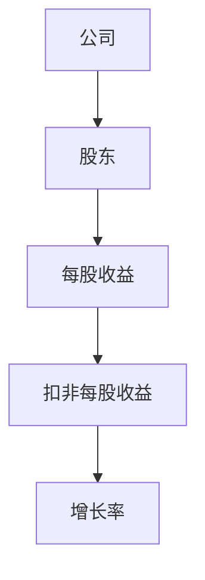
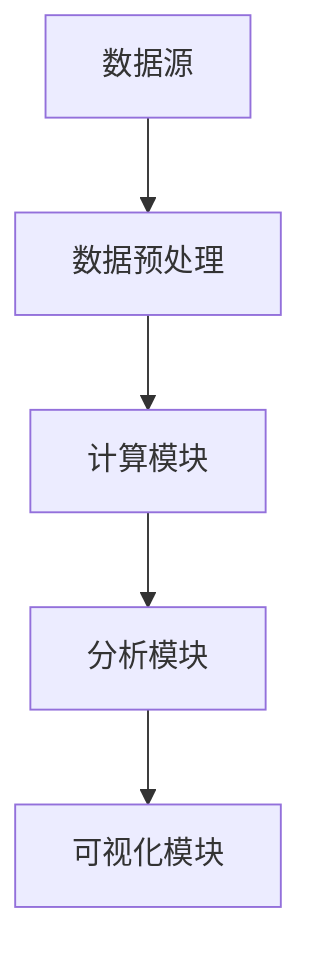

                 


# 10年扣非每股收益增长率的意义

## 关键词：
- 扣非每股收益增长率
- 财务指标
- 企业价值
- 投资决策
- 非经常性损益

## 摘要：
扣非每股收益增长率是衡量公司持续盈利能力的重要财务指标，它通过扣除非常性损益后的每股收益的年增长率来反映企业的财务健康状况。本文深入分析了这一指标的背景、意义、计算方法及其在企业价值评估和投资决策中的应用，结合实际案例和系统设计，为投资者和企业管理者提供实用的分析工具。

---

## 第一部分: 扣非每股收益增长率的核心概念与意义

### 第1章: 扣非每股收益增长率的背景与定义

#### 1.1 每股收益的基本定义
每股收益（Earnings Per Share, EPS）是衡量企业盈利能力的重要指标，计算公式为：
$$ EPS = \frac{\text{净利润}}{\text{总股本}} $$
然而，净利润可能包含非常性损益，如出售资产收益或法律诉讼赔偿，这些损益不代表公司持续经营的核心利润。

#### 1.2 扣非每股收益的特殊性
为了更准确地反映公司持续盈利能力，投资者通常关注扣除非常性损益后的每股收益，即扣非每股收益（Normalized EPS）。

#### 1.3 扣非每股收益增长率的背景
扣非每股收益增长率通过分析过去10年的扣非每股收益变化趋势，评估公司的盈利稳定性。这一指标在长期投资决策中尤为重要。

---

### 第2章: 扣非每股收益增长率的意义

#### 2.1 财务指标的核心作用
扣非每股收益增长率不仅衡量了公司的盈利增长，还能识别公司管理层的业绩质量。例如，稳定的增长率可能意味着公司具备持续的创新能力。

#### 2.2 与企业价值评估的关系
企业价值评估常用的方法包括市盈率和市净率，而扣非每股收益增长率是市盈率中的关键因素。例如，假设A公司过去10年的扣非每股收益增长率为15%，其市盈率可能比增长率较低的公司更具吸引力。

#### 2.3 对长期投资决策的影响
长期投资者通常关注企业的持续盈利能力，扣非每股收益增长率可以帮助识别那些具备稳定增长潜力的公司。

---

### 第3章: 扣非每股收益增长率的核心概念与联系

#### 3.1 核心概念的原理
扣非每股收益增长率为：
$$ \text{增长率} = \frac{\text{今年扣非每股收益} - \text{去年扣非每股收益}}{\text{去年扣非每股收益}} \times 100\% $$

#### 3.2 概念属性特征对比
| 指标 | 定义 | 与扣非每股收益增长率的关系 |
|------|------|----------------------------|
| 净利润 | 未扣除非常性损益的利润 | 扣非每股收益增长率是净利润的修正版本 |
| 收入增长率 | 收入的年增长率 | 两者均反映公司增长，但扣非每股收益增长率更关注盈利能力 |
| 市盈率 | 每股股价除以每股收益 | 扣非每股收益增长率影响市盈率的合理性 |

#### 3.3 ER实体关系图


---

## 第二部分: 扣非每股收益增长率的算法原理与数学模型

### 第4章: 扣非每股收益增长率的计算方法

#### 4.1 扣非每股收益的计算公式
扣非每股收益计算公式为：
$$ \text{扣非每股收益} = \frac{\text{净利润 - 非经常性损益}}{\text{总股本}} $$

#### 4.2 扣非每股收益增长率的计算步骤
1. 计算每年的扣非每股收益。
2. 使用公式计算年增长率：
$$ \text{增长率} = \frac{\text{今年扣非每股收益} - \text{去年扣非每股收益}}{\text{去年扣非每股收益}} \times 100\% $$

#### 4.3 影响因素分析
- 净利润的稳定性：净利润波动小的公司，扣非每股收益更稳定。
- 非经常性损益的波动性：经常性损益越多，扣非每股收益越能反映真实情况。

---

### 第5章: 扣非每股收益增长率的系统分析与架构设计

#### 5.1 问题场景介绍
设计一个系统来计算和分析过去10年的扣非每股收益增长率，帮助投资者进行决策。

#### 5.2 功能模块设计
- 数据收集模块：从财务报表中提取数据。
- 计算模块：计算扣非每股收益和增长率。
- 分析模块：生成可视化图表。

#### 5.3 系统架构设计


---

### 第6章: 项目实战：扣非每股收益增长率的计算与分析

#### 6.1 环境安装
安装Python和Pandas库，用于数据处理和计算。

#### 6.2 核心代码实现
```python
import pandas as pd

# 假设df是包含财务数据的DataFrame，包含'year', 'net_income', 'non_recurring_items'列
df['normalized_eps'] = (df['net_income'] - df['non_recurring_items']) / df['total_shares']
df['growth_rate'] = ((df['normalized_eps'] - df.shift(1)['normalized_eps']) / df.shift(1)['normalized_eps']) * 100
```

#### 6.3 案例分析
分析某公司过去10年的扣非每股收益增长率，发现其稳定增长，说明公司具备良好的盈利能力。

---

### 第7章: 总结与展望

#### 7.1 总结
扣非每股收益增长率是评估公司持续盈利能力的重要指标，通过分析过去10年的数据，投资者可以做出更明智的投资决策。

#### 7.2 展望
未来，随着人工智能和大数据技术的发展，扣非每股收益增长率的计算和分析将更加智能化和精准化。

---

## 作者：AI天才研究院/AI Genius Institute & 禅与计算机程序设计艺术 /Zen And The Art of Computer Programming

