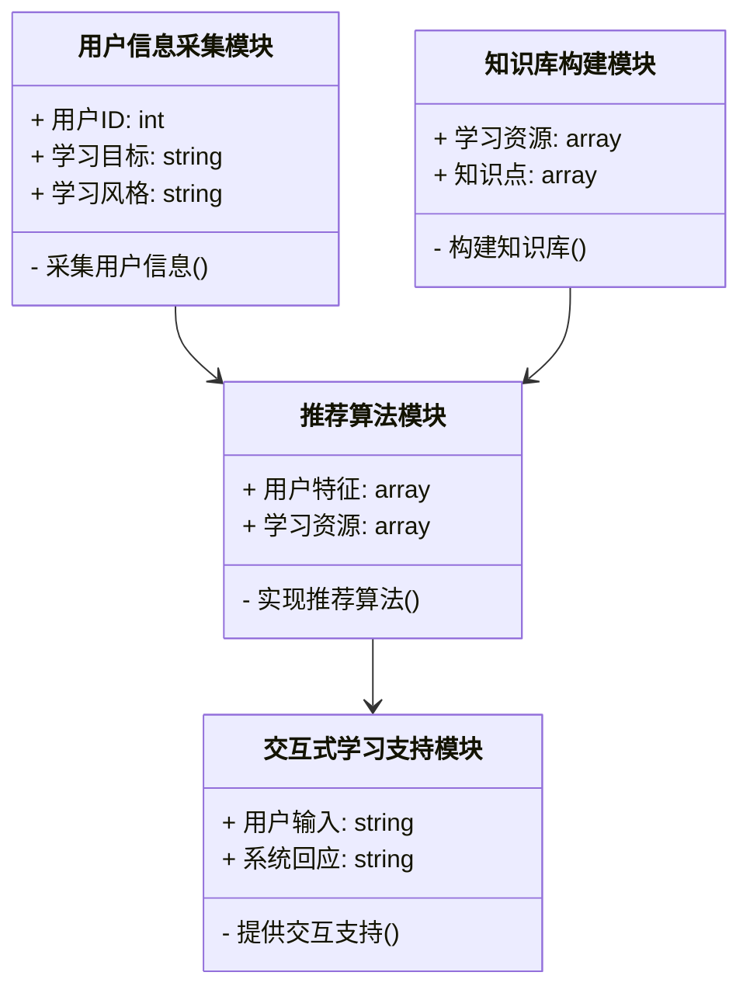
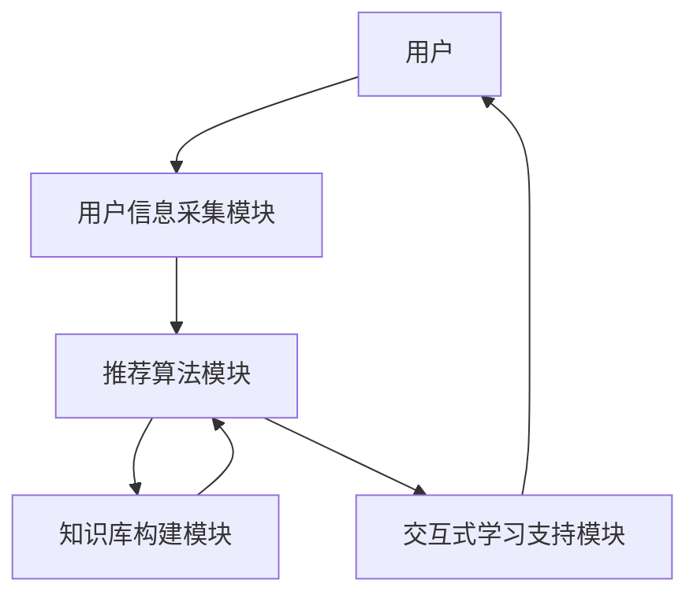
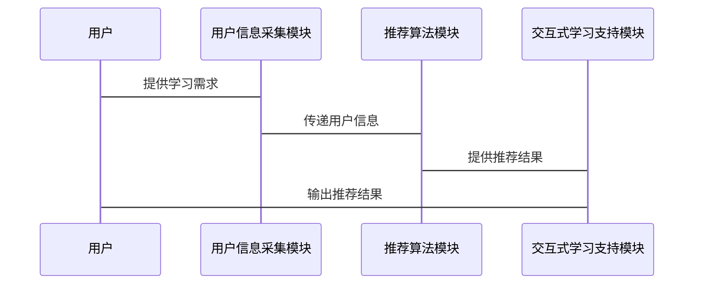

                 


# 开发AI Agent的个性化学习助手系统

---

## 关键词  
AI Agent, 个性化学习助手, 自然语言处理, 推荐算法, 系统架构, 项目实战

---

## 摘要  
本文详细探讨了开发AI Agent个性化学习助手系统的各个方面，从背景和概念出发，逐步深入到算法原理、系统架构设计、项目实战及优化。文章结合理论与实践，通过丰富的图表和代码示例，帮助读者理解并掌握AI Agent个性化学习助手系统的核心技术与实现方法。  

---

## 第1章: AI Agent与个性化学习助手系统概述  

### 1.1 AI Agent的基本概念  
#### 1.1.1 AI Agent的定义与特点  
AI Agent（人工智能代理）是指能够感知环境、自主决策并执行任务的智能实体。其特点包括：  
1. **自主性**：能够在没有外部干预的情况下独立运行。  
2. **反应性**：能够实时感知环境并做出响应。  
3. **目标导向性**：具备明确的目标，能够优化决策以实现目标。  

#### 1.1.2 个性化学习助手的核心功能  
个性化学习助手是AI Agent的一种具体应用，其核心功能包括：  
1. **用户需求分析**：通过自然语言处理技术理解用户的学习目标和偏好。  
2. **个性化推荐**：基于用户特征和学习内容，推荐最优的学习资源。  
3. **交互式学习支持**：通过对话形式为用户提供学习指导和答疑服务。  

#### 1.1.3 系统开发背景与意义  
随着在线教育的普及，学习者的需求日益多样化。传统的学习助手无法满足个性化需求，而AI Agent通过智能化的推荐和交互能力，能够为用户提供更高效、更精准的学习支持，从而提升学习效率和体验。  

---

### 1.2 个性化学习的需求分析  
#### 1.2.1 学习者需求的多样性  
不同学习者的学习目标、知识水平和学习风格存在显著差异。例如：  
- **目标差异**：有的学生希望快速掌握某一知识点，有的则希望系统性地学习某一领域。  
- **知识水平差异**：部分学生可能需要基础辅导，而另一些学生则需要高级拓展内容。  
- **学习风格差异**：有的学生偏好视频学习，有的则更适合文本阅读。  

#### 1.2.2 个性化学习的目标与挑战  
个性化学习的目标是为每个学习者量身定制学习计划和资源推荐。然而，实现这一目标面临以下挑战：  
1. **数据获取与处理**：需要收集和处理大量异构数据，包括学习者的行为数据、知识掌握情况等。  
2. **算法复杂性**：推荐算法需要在实时性和准确性之间找到平衡。  
3. **系统可扩展性**：随着用户数量的增加，系统需要具备良好的扩展性。  

#### 1.2.3 系统设计的核心问题  
个性化学习助手系统的核心问题可以归结为：如何基于学习者的特征和行为数据，设计高效的推荐算法，以实现精准的个性化推荐。  

---

## 第2章: AI Agent的核心概念与技术原理  

### 2.1 AI Agent的基本原理  
#### 2.1.1 智能体的结构与功能  
AI Agent的结构通常包括感知层、推理层和执行层：  
- **感知层**：通过传感器或数据接口获取环境信息。  
- **推理层**：基于知识库和推理规则，对感知到的信息进行分析和推理。  
- **执行层**：根据推理结果执行具体操作或输出决策。  

#### 2.1.2 知识表示与推理机制  
知识表示是AI Agent的核心技术之一，常用的表示方法包括：  
1. **语义网络**：通过节点和边表示概念及其关系。  
2. **逻辑表示法**：使用逻辑公式表示知识。  
3. **规则表示法**：通过预定义的规则描述知识。  

推理机制则基于知识表示，通过逻辑推理或概率推理生成新的知识。  

#### 2.1.3 自然语言处理在AI Agent中的应用  
自然语言处理（NLP）技术在AI Agent中的应用主要体现在：  
- **意图识别**：通过NLP技术识别用户的意图。  
- **对话生成**：基于上下文生成自然的对话回应。  
- **信息抽取**：从文本中提取关键信息。  

---

### 2.2 个性化推荐算法  
#### 2.2.1 基于协同过滤的推荐算法  
协同过滤是一种常见的推荐算法，主要包括：  
- **用户协同过滤**：基于用户的行为相似性推荐内容。  
- **物品协同过滤**：基于物品的相似性推荐内容。  

#### 2.2.2 基于内容的推荐算法  
基于内容的推荐算法通过分析物品的属性（如文本内容、标签等）进行推荐，适用于推荐内容具有丰富属性的场景。  

#### 2.2.3 混合推荐算法  
混合推荐算法结合了用户协同过滤和基于内容的推荐方法，能够兼顾用户行为和内容特征，提高推荐的准确性和多样性。  

---

### 2.3 系统的核心技术  
#### 2.3.1 自然语言处理技术  
自然语言处理技术是个性化学习助手系统的核心，主要应用于：  
- **用户意图识别**：通过NLP技术理解用户的查询意图。  
- **文本生成**：生成自然流畅的对话回应。  

#### 2.3.2 个性化推荐算法  
个性化推荐算法是系统的核心技术，主要用于根据用户特征和行为数据推荐学习资源。  

#### 2.3.3 知识库构建与管理  
知识库是系统的重要组成部分，用于存储和管理学习资源、用户数据等信息。  

---

## 第3章: 个性化学习助手系统的算法原理  

### 3.1 推荐算法的数学模型  
#### 3.1.1 基于矩阵分解的推荐算法  
基于矩阵分解的推荐算法通过将用户-物品矩阵分解为两个低维矩阵，实现推荐。常用的矩阵分解方法包括：  
- **奇异值分解（SVD）**：将矩阵分解为三个低维矩阵。  
- **非负矩阵分解（NMF）**：要求分解后的矩阵元素为非负数。  

#### 3.1.2 基于深度学习的推荐算法  
基于深度学习的推荐算法通过神经网络模型学习用户和物品的隐含特征，常用模型包括：  
- **深度神经网络（DNN）**：通过多层神经网络提取特征。  
- **卷积神经网络（CNN）**：适用于处理文本等结构化数据。  

#### 3.1.3 算法的优缺点对比  
| 算法类型      | 优点                          | 缺点                          |
|---------------|-------------------------------|-------------------------------|
| 协同过滤      | 简单易实现，适合中小数据规模 | 对冷启动问题敏感，推荐结果可能不够个性化 |
| 基于内容的推荐 | 推荐结果与内容高度相关        | 需要大量高质量的内容特征       |
| 混合推荐       | 结合了协同过滤和内容推荐的优点 | 实现复杂，计算成本较高          |

---

### 3.2 算法实现的步骤与流程  
#### 3.2.1 数据预处理  
数据预处理是推荐算法实现的基础，主要包括：  
- **数据清洗**：去除噪声数据。  
- **特征提取**：从原始数据中提取有用的特征。  
- **数据标准化**：对数据进行标准化处理，确保不同特征的可比性。  

#### 3.2.2 模型训练  
模型训练是推荐算法的核心步骤，主要包括：  
- **选择算法**：根据具体场景选择合适的推荐算法。  
- **参数调优**：通过交叉验证优化模型参数。  
- **模型评估**：通过指标（如准确率、召回率）评估模型性能。  

#### 3.2.3 结果输出与优化  
结果输出是模型训练的最终目标，主要包括：  
- **推荐结果输出**：将推荐结果返回给用户。  
- **结果优化**：根据用户反馈优化推荐算法。  

---

### 3.3 算法的优化与调优  
#### 3.3.1 参数调整  
参数调整是优化推荐算法的重要手段，常用的参数包括：  
- **学习率**：控制模型更新的速度。  
- **正则化系数**：防止模型过拟合。  

#### 3.3.2 模型评估与验证  
模型评估是验证推荐算法性能的重要步骤，常用的评估指标包括：  
- **准确率（Precision）**：推荐结果中正确项的比例。  
- **召回率（Recall）**：推荐结果中所有正确项的比例。  
- **F1值（F1 Score）**：准确率和召回率的调和平均值。  

#### 3.3.3 算法的可扩展性设计  
算法的可扩展性设计是确保系统能够处理大规模数据的关键，主要包括：  
- **分布式计算**：利用分布式计算框架（如MapReduce）处理大规模数据。  
- **增量式训练**：支持在线增量训练，提高系统的实时性。  

---

## 第4章: 系统架构与设计  

### 4.1 系统的功能模块划分  
个性化学习助手系统的功能模块主要包括：  
1. **用户信息采集模块**：采集用户的基本信息和学习行为数据。  
2. **知识库构建模块**：构建和管理学习资源库。  
3. **推荐算法模块**：实现个性化推荐算法。  
4. **交互式学习支持模块**：提供实时的对话交互功能。  

---

### 4.2 系统架构设计  
系统架构设计是实现个性化学习助手系统的关键，主要包括：  
#### 4.2.1 领域模型设计  
领域模型是系统设计的重要组成部分，主要用于描述系统的功能和交互关系。  



---

### 4.3 系统架构设计  
系统架构设计是实现个性化学习助手系统的关键，主要包括：  



---

### 4.4 系统接口设计  
系统接口设计是实现模块间通信的关键，主要包括：  
- **API接口**：提供RESTful API，供前端调用。  
- **消息队列**：用于异步处理推荐请求。  

---

### 4.5 系统交互设计  
系统交互设计是实现用户与系统互动的关键，主要包括：  



---

## 第5章: 项目实战  

### 5.1 环境安装与配置  
个性化学习助手系统的开发环境主要包括：  
- **编程语言**：Python 3.8+  
- **框架与库**：Flask、TensorFlow、Keras、NLTK  
- **开发工具**：Jupyter Notebook、VS Code  

---

### 5.2 核心代码实现  
#### 5.2.1 数据预处理代码  
```python
import pandas as pd
from sklearn.feature_extraction.text import TfidfVectorizer

# 加载数据
data = pd.read_csv('学习资源.csv')

# 提取文本特征
vectorizer = TfidfVectorizer()
X = vectorizer.fit_transform(data['内容'])
```

#### 5.2.2 推荐算法实现  
```python
from sklearn.metrics.pairwise import cosine_similarity

# 计算余弦相似度
similarity_matrix = cosine_similarity(X)
```

#### 5.2.3 交互式学习支持实现  
```python
from flask import Flask, request, jsonify

app = Flask(__name__)

@app.route('/recommend', methods=['POST'])
def recommend():
    user_input = request.json['input']
    # 处理用户输入并生成回应
    response = generate_response(user_input)
    return jsonify({'response': response})

def generate_response(input_text):
    # 实现自然语言处理逻辑
    pass

if __name__ == '__main__':
    app.run(debug=True)
```

---

### 5.3 实际案例分析  
以一个简单的学习资源推荐场景为例，假设用户希望学习“机器学习”的相关内容。系统会基于用户的输入，推荐相关的学习资源，如书籍、视频和文章。  

---

## 第6章: 系统优化与扩展  

### 6.1 系统优化策略  
#### 6.1.1 提升推荐效果  
通过引入深度学习模型（如BERT）提高推荐的准确性。  

#### 6.1.2 实现多模态输入  
支持图片、视频等多种形式的输入，提高系统的交互性。  

#### 6.1.3 提高系统可扩展性  
通过分布式架构和容器化技术（如Docker）提高系统的可扩展性。  

---

## 作者：AI天才研究院/AI Genius Institute & 禅与计算机程序设计艺术 /Zen And The Art of Computer Programming

