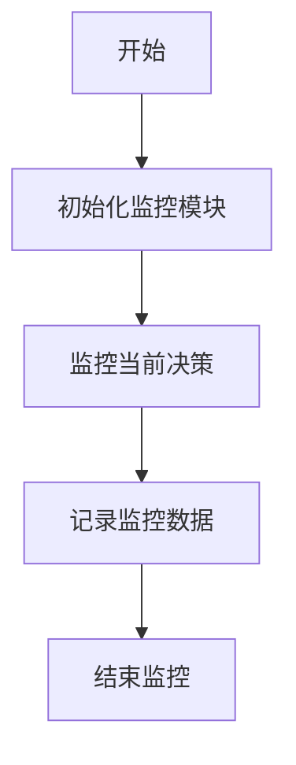
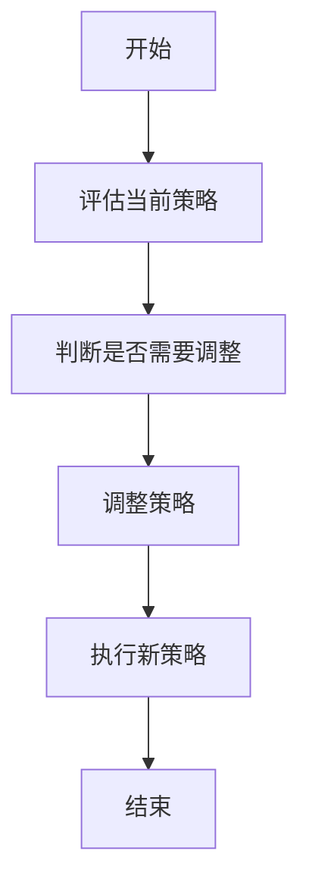
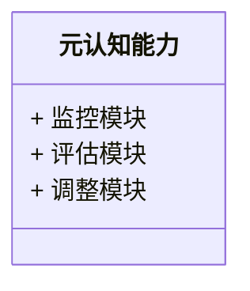
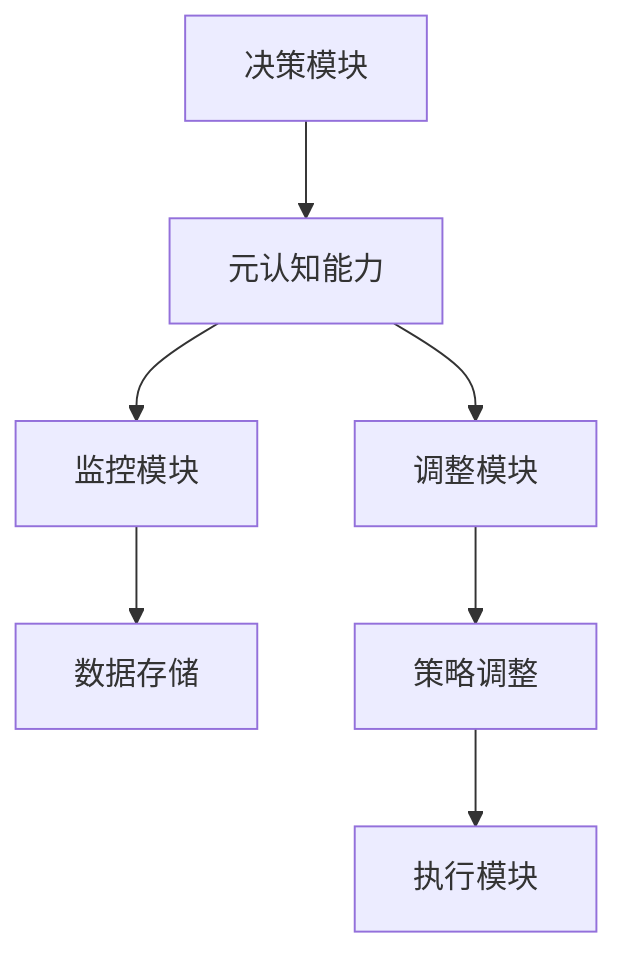

                 


# 开发AI Agent的元认知能力：自我监控和调整

**关键词**：AI Agent、元认知能力、自我监控、自我调整、算法原理、系统架构

**摘要**：本文探讨AI Agent的元认知能力，即自我监控和调整的能力，分析其在AI Agent中的作用，从算法原理到系统架构，结合实际案例，详细讲解实现方法。

---

# 第一部分: 背景与基本概念

## 第1章: 元认知能力的定义与AI Agent的关系

### 1.1 元认知能力的定义与特点

元认知能力是指个体对自身认知过程的认知和调控能力，包括自我监控、自我评估和自我调整。在AI Agent中，元认知能力使其能够监控自身的决策过程并进行调整，从而提高适应性和准确性。

### 1.2 AI Agent的基本概念

AI Agent是一种智能实体，能够感知环境、自主决策并执行任务。元认知能力使AI Agent能够监控自身的决策过程，识别错误并进行调整，从而提升整体性能。

---

## 第2章: 元认知能力在AI Agent中的作用

### 2.1 元认知能力的重要性

元认知能力在AI Agent中至关重要，因为它能够：
- **自我监控**：实时跟踪决策过程，识别潜在错误。
- **自我调整**：根据监控结果调整策略，优化决策。
- **适应性提升**：在动态环境中保持高效运作。

### 2.2 元认知能力的应用场景

- **自适应学习**：AI Agent根据反馈调整学习策略。
- **动态决策**：在复杂环境中实时调整决策。
- **错误修正**：识别并纠正错误决策。

---

## 第3章: 元认知能力的背景与挑战

### 3.1 元认知能力的发展背景

随着AI技术的进步，AI Agent需要更高的自主性和适应性，元认知能力成为关键能力。

### 3.2 元认知能力面临的挑战

- **技术挑战**：实现高效的自我监控和调整机制。
- **理论挑战**：理解元认知能力的本质和结构。
- **应用挑战**：在实际场景中有效应用元认知能力。

---

# 第二部分: 核心概念与联系

## 第4章: 元认知能力的核心原理

### 4.1 元认知能力的原理分析

- **自我监控机制**：持续跟踪决策过程。
- **自我评估机制**：评估监控结果。
- **自我调整机制**：根据评估结果调整策略。

### 4.2 元认知能力的属性特征对比

| 属性 | 特征 |
|------|------|
| 监控范围 | 决策过程 |
| 调整方式 | 策略优化 |
| 评估标准 | 效果和效率 |

## 第5章: 元认知能力的ER实体关系图

```mermaid
erDiagram
    actor 元认知能力
    actor 监控模块
    actor 调整模块
    actor 评估模块
    元认知能力 -> 监控模块 : 调用
    监控模块 -> 评估模块 : 传递数据
    评估模块 -> 调整模块 : 发出调整指令
    调整模块 -> 元认知能力 : 反馈调整结果
```

---

# 第三部分: 元认知能力的算法原理

## 第6章: 元认知能力的算法实现

### 6.1 自我监控机制的算法



#### Python代码实现

```python
class Monitor:
    def __init__(self):
        self.data = []
    
    def monitor_decision(self, decision):
        self.data.append(decision)
        return self.data
    
def main():
    monitor = Monitor()
    decision = "选择A"
    result = monitor.monitor_decision(decision)
    print(result)

if __name__ == "__main__":
    main()
```

### 6.2 自我调整算法



#### Python代码实现

```python
class Adjuster:
    def __init__(self):
        self.current_strategy = "默认策略"
    
    def adjust_strategy(self, feedback):
        if feedback == "错误":
            self.current_strategy = "新策略"
            return self.current_strategy
        return self.current_strategy
    
def main():
    adjuster = Adjuster()
    feedback = "错误"
    result = adjuster.adjust_strategy(feedback)
    print(result)

if __name__ == "__main__":
    main()
```

## 第7章: 元认知能力的数学模型

### 7.1 强化学习模型

数学公式：
$$ R(s, a) = \text{奖励函数} $$

### 7.2 元认知调整模型

数学公式：
$$ \text{新策略} = \text{旧策略} + \text{调整量} $$

---

# 第四部分: 系统架构与设计

## 第8章: 系统分析与架构设计方案

### 8.1 问题场景介绍

AI Agent需要在动态环境中做出决策，元认知能力帮助其监控和调整决策过程。

### 8.2 系统功能设计

- **监控模块**：实时监控决策过程。
- **评估模块**：评估决策效果。
- **调整模块**：根据评估结果调整策略。



---

## 第9章: 系统架构设计

### 9.1 系统架构图



---

# 第五部分: 项目实战

## 第10章: 项目实战

### 10.1 环境安装

安装Python和必要的库，如`mermaid`和`numpy`。

### 10.2 核心代码实现

```python
import numpy as np

class AI-Agent:
    def __init__(self):
        self.strategy = "初始策略"
    
    def monitor(self, decision):
        return decision
    
    def adjust(self, feedback):
        if feedback == "错误":
            self.strategy = "新策略"
        return self.strategy
    
    def execute(self):
        decision = "选择B"
        feedback = self.monitor(decision)
        result = self.adjust(feedback)
        print(result)

agent = AI-Agent()
agent.execute()
```

---

## 第11章: 实际案例分析

### 11.1 案例分析

AI Agent在动态市场中的决策调整，展示元认知能力如何帮助其优化策略。

---

# 第六部分: 总结与展望

## 第12章: 总结与展望

### 12.1 最佳实践

- 定期监控和调整AI Agent的决策过程。
- 使用强化学习优化元认知能力。

### 12.2 小结

元认知能力是AI Agent实现自我监控和调整的关键，能够提升其适应性和准确性。

### 12.3 注意事项

- 确保元认知机制的有效性。
- 定期更新和优化元认知模型。

### 12.4 拓展阅读

推荐相关书籍和论文，深入学习元认知能力和AI Agent的知识。

---

**作者：AI天才研究院 & 禅与计算机程序设计艺术**

