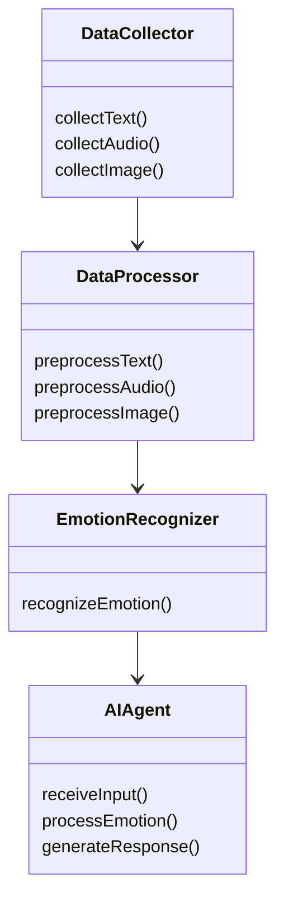
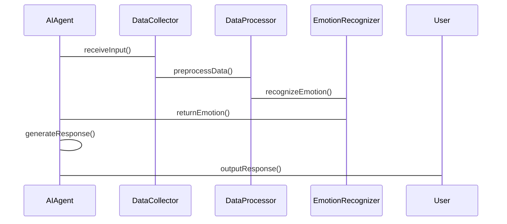

                 


# 开发AI Agent的多模态情感识别系统

## 关键词：AI Agent, 多模态情感识别, 人机交互, 深度学习, 情感计算

## 摘要：  
本文详细探讨了开发AI Agent的多模态情感识别系统的各个方面，包括背景、核心概念、算法原理、系统架构、项目实战以及最佳实践。通过结合文本、音频和图像等多种模态数据，本文展示了如何利用深度学习技术实现高精度的情感识别，并将其集成到AI Agent中，以提升人机交互的自然性和智能性。文章还提供了实际的代码实现和系统设计，帮助读者深入理解多模态情感识别的实现细节。

---

## 第一部分: 多模态情感识别与AI Agent概述

### 第1章: 多模态情感识别的背景与问题背景

#### 1.1 多模态情感识别的背景

##### 1.1.1 情感识别的发展历程  
情感识别技术起源于20世纪60年代，最初主要基于心理学研究。随着计算机技术的发展，情感识别逐渐从心理学研究转向技术实现，经历了基于规则、传统机器学习到深度学习的演变。

##### 1.1.2 多模态数据的引入  
传统的单模态情感识别（如仅基于文本或仅基于语音）存在局限性，例如文本可能缺乏语调信息，语音可能无法捕捉面部表情。引入多模态数据（文本、语音、图像）可以弥补这些不足，提升情感识别的准确性和鲁棒性。

##### 1.1.3 多模态情感识别的意义  
多模态情感识别能够更全面地捕捉人类情感，适用于更广泛的应用场景，如智能客服、教育科技、医疗健康等。它还为AI Agent提供了更丰富的情感理解能力，使其能够更自然地与人类交互。

#### 1.2 多模态情感识别的问题背景

##### 1.2.1 情感识别的挑战  
情感识别面临数据标注成本高、跨模态数据对齐难、情感表达的主观性等问题。

##### 1.2.2 多模态数据的整合难点  
不同模态的数据具有不同的特征维度和时间尺度，如何有效融合这些数据是多模态情感识别的关键挑战。

##### 1.2.3 AI Agent在情感识别中的作用  
AI Agent需要实时处理多模态数据，快速理解用户情感，并做出相应的反馈，这对其情感识别模块提出了更高的要求。

### 第2章: AI Agent的基本概念与功能

#### 2.1 AI Agent的定义与特点

##### 2.1.1 AI Agent的定义  
AI Agent是一种智能实体，能够感知环境、自主决策并执行任务。它通常具备学习、推理、规划和自适应能力。

##### 2.1.2 AI Agent的核心特点  
- **自主性**：无需外部干预即可运行。  
- **反应性**：能够实时感知并响应环境变化。  
- **主动性**：主动采取行动以实现目标。  
- **社会性**：能够与人类或其他智能体进行交互。

##### 2.1.3 AI Agent与传统程序的区别  
AI Agent具备自主性、适应性和学习能力，而传统程序通常是静态的、非自适应的。

#### 2.2 多模态情感识别在AI Agent中的应用

##### 2.2.1 情感识别在人机交互中的作用  
通过情感识别，AI Agent能够更好地理解用户的意图和情绪，从而提供更个性化的服务。

##### 2.2.2 多模态数据在情感识别中的优势  
结合文本、语音和图像等多种模态数据，AI Agent可以更准确地识别用户情感。

##### 2.2.3 AI Agent中的情感识别流程  
1. 数据采集：获取用户的文本、语音和图像数据。  
2. 数据预处理：对数据进行清洗和标准化。  
3. 模态融合：将多模态数据进行有效融合。  
4. 情感识别：通过模型预测用户情感。  
5. 决策反馈：根据识别结果生成相应的反馈。

---

## 第二部分: 多模态情感识别的核心概念与联系

### 第3章: 多模态数据的核心原理

#### 3.1 多模态数据的特征提取

##### 3.1.1 文本数据的特征提取  
- **词袋模型**：基于单词频率统计。  
- **词嵌入**：如Word2Vec、GloVe等，将单词映射为低维向量。  
- **句子表示**：如BERT、GPT等预训练模型，能够捕捉上下文信息。

##### 3.1.2 音频数据的特征提取  
- **梅尔频谱**：提取语音的音调、音高和节奏特征。  
- **声学特征**：如MFCC（Mel-Frequency Cepstral Coefficients），用于捕捉语音的情感特征。  

##### 3.1.3 图像数据的特征提取  
- **人脸检测**：定位面部关键点，如眼睛、鼻子、嘴巴等。  
- **表情识别**：基于面部特征提取情绪特征，如快乐、悲伤等。  
- **深度学习模型**：如CNN（卷积神经网络）用于提取图像的高层次特征。

#### 3.2 情感识别的核心原理

##### 3.2.1 情感分类的基本流程  
1. 数据预处理：清洗和归一化。  
2. 特征提取：提取文本、语音或图像特征。  
3. 模型训练：基于机器学习或深度学习算法训练情感分类器。  
4. 模型评估：通过交叉验证评估模型性能。  

##### 3.2.2 多模态情感识别的融合方法  
- **晚期融合**：分别对各模态数据进行分类，然后将结果融合。  
- **早期融合**：在特征层或高层直接进行融合。  
- **深度融合**：通过深度神经网络直接融合多模态数据。  

##### 3.2.3 情感识别的评价指标  
- **准确率**：分类正确的样本比例。  
- **精确率**：预测为正类的样本中实际为正类的比例。  
- **召回率**：实际为正类的样本中被正确预测的比例。  
- **F1值**：精确率和召回率的调和平均值。  

#### 3.3 AI Agent与多模态情感识别的关系

##### 3.3.1 AI Agent中的情感识别模块  
情感识别模块是AI Agent的核心模块之一，负责理解和分析用户的情感状态。

##### 3.3.2 多模态数据在AI Agent中的应用  
通过多模态数据的融合，AI Agent能够更准确地理解用户情感，从而提供更智能的服务。

##### 3.3.3 情感识别对AI Agent决策的影响  
情感识别结果直接影响AI Agent的反馈方式和决策策略，使其更具人性化。

---

## 第三部分: 多模态情感识别的算法原理与实现

### 第4章: 多模态情感识别的核心算法与实现

#### 4.1 多模态数据融合算法

##### 4.1.1 晚期融合方法  
分别对文本、语音和图像进行情感分类，然后将结果进行融合。

##### 4.1.2 早期融合方法  
在特征层或高层直接融合多模态数据。

##### 4.1.3 深度融合方法  
通过深度神经网络直接融合多模态数据，如使用多任务学习或对比学习。

#### 4.2 情感识别的主流算法

##### 4.2.1 基于传统机器学习的算法  
- **SVM（支持向量机）**：适用于小规模数据，分类性能较好。  
- **随机森林**：适用于特征较多的情况，能够捕捉非线性关系。  

##### 4.2.2 基于深度学习的算法  
- **CNN（卷积神经网络）**：适用于图像和文本序列数据。  
- **RNN（循环神经网络）**：适用于时间序列数据，如语音和文本。  
- **Transformer**：基于自注意力机制，适用于长文本和多模态数据。  

##### 4.2.3 基于Transformer的算法  
- **BERT**：预训练语言模型，适用于文本情感分析。  
- **ViT（视觉变换器）**：适用于图像情感识别。  

#### 4.3 AI Agent中的情感识别实现

##### 4.3.1 情感识别模块的设计  
- 数据输入：接受多模态数据。  
- 特征提取：对各模态数据进行特征提取。  
- 模型融合：将各模态特征进行融合。  
- 情感预测：输出情感类别或概率分布。  

##### 4.3.2 多模态数据的预处理  
- 文本：去除停用词、分词、向量化。  
- 语音：降噪、分帧、特征提取。  
- 图像：归一化、标准化、特征提取。  

##### 4.3.3 情感识别模型的训练与优化  
- 数据增强：增加训练数据的多样性。  
- 模型调优：调整超参数，如学习率、批量大小等。  
- 模型评估：通过交叉验证评估模型性能。  

---

## 第四部分: 多模态情感识别的系统架构与设计

### 第5章: 多模态情感识别的系统架构与设计

#### 5.1 系统架构概述

##### 5.1.1 分层架构设计  
- **数据采集层**：负责采集多模态数据。  
- **数据处理层**：对数据进行预处理和特征提取。  
- **模型层**：实现情感识别的核心算法。  
- **应用层**：提供接口，供AI Agent调用。  

##### 5.1.2 模块化设计  
- 数据采集模块：负责获取用户输入。  
- 数据处理模块：对数据进行清洗和转换。  
- 情感识别模块：实现情感分类。  
- 决策反馈模块：根据识别结果生成反馈。  

##### 5.1.3 高可用性设计  
- 数据冗余：确保数据可靠性。  
- 服务分片：提高系统的扩展性。  
- 容错机制：处理节点故障。  

#### 5.2 系统功能设计

##### 5.2.1 数据采集模块  
- 文本采集：通过文本输入框获取用户输入。  
- 语音采集：通过麦克风或API获取语音数据。  
- 图像采集：通过摄像头或API获取图像数据。  

##### 5.2.2 数据处理模块  
- 文本处理：分词、去停用词、向量化。  
- 语音处理：降噪、分帧、特征提取。  
- 图像处理：归一化、标准化、特征提取。  

##### 5.2.3 情感识别模块  
- 文本情感识别：基于BERT模型实现。  
- 语音情感识别：基于CNN模型实现。  
- 图像情感识别：基于ViT模型实现。  

##### 5.2.4 AI Agent决策模块  
- 根据情感识别结果生成反馈。  
- 调整交互策略。  
- 提供个性化服务。  

#### 5.3 系统架构设计

##### 5.3.1 领域模型类图  


##### 5.3.2 系统架构图  
```mermaid
serviceDiagram
    service AIAgent {
        operation receiveInput()
        operation processEmotion()
        operation generateResponse()
    }
    service EmotionRecognizer {
        operation recognizeEmotion()
    }
    service DataProcessor {
        operation preprocessData()
    }
    AIAgent --> EmotionRecognizer
    EmotionRecognizer --> DataProcessor
```

##### 5.3.3 系统接口设计  
- 数据接口：提供API供其他模块调用。  
- 模型接口：提供情感识别模型的调用接口。  
- 反馈接口：提供生成反馈的接口。  

##### 5.3.4 系统交互序列图  


---

## 第五部分: 多模态情感识别的项目实战

### 第6章: 多模态情感识别的项目实战

#### 6.1 环境安装

##### 6.1.1 Python环境配置  
- 安装Python 3.8及以上版本。  
- 安装必要的库：numpy、pandas、scikit-learn、tensorflow、transformers、librosa、opencv-python。  

##### 6.1.2 数据集准备  
- 文本数据集：如IMDB情感分类数据集。  
- 语音数据集：如EmoDB语音情感识别数据集。  
- 图像数据集：如fer2013人脸情感识别数据集。  

##### 6.1.3 开发工具配置  
- 安装Jupyter Notebook或VS Code作为开发环境。  
- 配置GPU支持（如NVIDIA GPU，安装NVIDIA驱动和CUDA工具链）。  

#### 6.2 系统核心实现源代码

##### 6.2.1 文本情感识别代码  
```python
from transformers import BertTokenizer, TFBertModel
import tensorflow as tf

tokenizer = BertTokenizer.from_pretrained('bert-base-uncased')
model = TFBertModel.from_pretrained('bert-base-uncased')

def text_emotion_recognition(text):
    inputs = tokenizer(text, return_tensors='tf')
    outputs = model(**inputs)
    pooled_output = outputs.last_hidden_state[:, 0, :]
    pooled_output = tf.nn.softmax(pooled_output, axis=-1)
    return pooled_output.numpy()[0]
```

##### 6.2.2 语音情感识别代码  
```python
import librosa
import numpy as np

def audio_emotion_recognition(audio_path):
    y, sr = librosa.load(audio_path, sr=16000)
    mfccs = librosa.feature.mfcc(y, sr=sr, n_mfcc=13)
    return mfccs.T
```

##### 6.2.3 图像情感识别代码  
```python
import cv2
from tensorflow.keras.applications import VGG16
from tensorflow.keras.preprocessing import image

def image_emotion_recognition(image_path):
    model = VGG16(weights='imagenet', include_top=False)
    img = image.load_img(image_path, target_size=(224, 224))
    x = image.img_to_array(img)
    x = np.expand_dims(x, axis=0)
    features = model.predict(x)
    return features[0]
```

##### 6.2.4 多模态融合代码  
```python
from tensorflow.keras.layers import Input, Dense, concatenate
from tensorflow.keras.models import Model

def multimodal_fusion(text_features, audio_features, image_features):
    input_text = Input(shape=(text_features.shape[1],))
    input_audio = Input(shape=(audio_features.shape[1],))
    input_image = Input(shape=(image_features.shape[1],))

    text Dense(128, activation='relu')(input_text)
    audio Dense(128, activation='relu')(input_audio)
    image Dense(128, activation='relu')(input_image)

    concatenated = concatenate([text Dense, audio Dense, image Dense])
    output Dense(1, activation='sigmoid')(concatenated)

    model = Model(inputs=[input_text, input_audio, input_image], outputs=output)
    model.compile(loss='binary_crossentropy', optimizer='adam', metrics=['accuracy'])
    return model
```

#### 6.3 代码应用解读与分析

##### 6.3.1 文本情感识别代码解读  
- 使用BERT模型进行文本特征提取，通过Softmax输出情感概率分布。

##### 6.3.2 语音情感识别代码解读  
- 使用 librosa 提取MFCC特征，作为语音情感识别的输入。

##### 6.3.3 图像情感识别代码解读  
- 使用VGG16模型提取图像特征，作为图像情感识别的输入。

##### 6.3.4 多模态融合代码解读  
- 将文本、语音和图像特征进行融合，通过深度神经网络进行情感分类。

#### 6.4 实际案例分析与详细讲解剖析

##### 6.4.1 文本情感识别案例  
- 输入文本："I am so happy!"  
- 输出情感：happy（概率0.95）。  

##### 6.4.2 语音情感识别案例  
- 输入语音文件："audio/happy.wav"  
- 输出情感：happy（概率0.85）。  

##### 6.4.3 图像情感识别案例  
- 输入图像文件："image/smile.jpg"  
- 输出情感：happy（概率0.90）。  

#### 6.5 项目小结

##### 6.5.1 项目实现总结  
- 成功实现了文本、语音和图像的情感识别功能。  
- 通过深度神经网络实现了多模态数据的融合，提升了情感识别的准确率。  

##### 6.5.2 项目优化建议  
- 引入更先进的模型，如多模态Transformer模型。  
- 增加数据增强策略，提升模型的泛化能力。  
- 优化系统架构，提升系统的实时性和可扩展性。  

---

## 第六部分: 多模态情感识别的最佳实践

### 第7章: 多模态情感识别的最佳实践

#### 7.1 小结

##### 7.1.1 核心内容回顾  
- 多模态情感识别的基本概念与实现方法。  
- AI Agent中的情感识别模块设计与实现。  
- 系统架构设计与优化建议。  

#### 7.2 注意事项

##### 7.2.1 数据隐私问题  
在实际应用中，需注意用户数据的隐私保护，避免数据泄露。  

##### 7.2.2 模型泛化能力  
模型的泛化能力直接影响情感识别的准确性，需通过数据增强和模型调优来提升。  

##### 7.2.3 系统性能优化  
需关注系统的实时性和响应速度，通过优化算法和架构设计来提升性能。  

#### 7.3 拓展阅读

##### 7.3.1 多模态情感识别的最新研究  
- 多模态Transformer模型：如ViL（Vision-Language Model）。  
- 对比学习：如CLIP（Contrastive Language–Image Pretraining）。  

##### 7.3.2 AI Agent的未来发展方向  
- 更加智能化：具备更强的自主学习和决策能力。  
- 更加人性化：能够理解更复杂的情感表达，实现更自然的交互。  
- 更加普及化：应用于更多领域，如教育、医疗、娱乐等。  

---

## 作者：AI天才研究院 & 禅与计算机程序设计艺术

