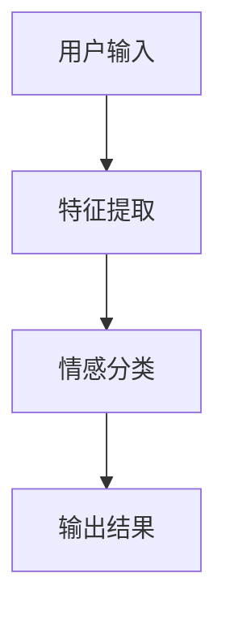

                 


# 开发AI Agent的多语言情感分析引擎

> 关键词：AI Agent，多语言情感分析，自然语言处理，机器学习，深度学习

> 摘要：本文详细探讨了开发AI Agent的多语言情感分析引擎的背景、核心概念、算法原理、系统架构设计、项目实现及最佳实践。文章从背景介绍入手，逐步分析情感分析的核心原理，深入讲解多语言情感分析的挑战与解决方案，结合实际项目案例，提供详细的系统架构设计和代码实现，最后总结开发中的注意事项和未来展望。

---

## 第一部分: AI Agent与多语言情感分析引擎的背景介绍

### 第1章: AI Agent与情感分析概述

#### 1.1 AI Agent的基本概念
- **1.1.1 AI Agent的定义与特点**
  - AI Agent（智能体）是指能够感知环境并采取行动以实现目标的实体。其特点包括自主性、反应性、目标导向和社会能力。
- **1.1.2 情感分析的基本概念**
  - 情感分析是自然语言处理中的一个重要任务，旨在判断文本中的情感倾向（如正面、负面或中性）。
- **1.1.3 多语言情感分析的背景与重要性**
  - 随着全球化的发展，跨语言情感分析需求日益增长。不同语言的文本处理需要考虑文化差异和语言结构的多样性。

#### 1.2 多语言情感分析的背景与挑战
- **1.2.1 多语言情感分析的背景**
  - 全球化背景下，企业需要处理多种语言的用户反馈，以提升用户体验和市场竞争力。
- **1.2.2 多语言情感分析的挑战**
  - 语言间的差异性：不同语言的语法、词汇和文化背景不同，增加了处理的复杂性。
  - 数据获取与标注的困难：多语言数据的获取和标注需要大量资源和时间。
  - 模型训练的复杂性：跨语言模型需要处理语言间的映射和迁移问题。

---

## 第二部分: 多语言情感分析的核心概念与联系

### 第3章: 情感分析的核心概念与原理

#### 3.1 情感分析的基本原理
- **3.1.1 特征提取**
  - 从文本中提取有用的特征，如关键词、句法结构和语义信息。
- **3.1.2 分类算法**
  - 常见的分类算法包括朴素贝叶斯、支持向量机（SVM）和深度学习模型（如LSTM、BERT）。
- **3.1.3 模型评估**
  - 使用准确率、召回率和F1值等指标评估模型性能。

#### 3.2 多语言情感分析的特殊性
- **3.2.1 语言间的共性与差异**
  - 不同语言在情感表达上可能存在共性，但文化差异也导致差异性。
- **3.2.2 跨语言情感迁移的原理**
  - 利用一种语言的模型参数初始化另一种语言的模型，通过迁移学习提升性能。
- **3.2.3 跨语言特征提取的方法**
  - 使用跨语言词嵌入（如多语言BERT）或基于语言的特征提取方法。

#### 3.3 情感分析的核心算法对比
- **3.3.1 基于传统机器学习的算法对比**
  - 朴素贝叶斯：简单高效，但特征工程依赖人工经验。
  - SVM：性能稳定，但计算复杂度较高。
- **3.3.2 基于深度学习的算法对比**
  - LSTM：适合处理长文本，但训练时间较长。
  - Transformer：基于注意力机制，性能优越，但需要大量计算资源。
- **3.3.3 跨语言情感分析算法对比**
  - 单语言模型：适用于单一语言场景，无法处理多语言数据。
  - 跨语言模型：如多语言BERT，能够同时处理多种语言。

---

### 第4章: 情感分析模型的ER实体关系图

#### 4.1 情感分析模型的实体关系


---

## 第三部分: 多语言情感分析算法的数学模型与实现

### 第5章: 情感分析的数学模型

#### 5.1 基于特征向量的情感分析模型
- **5.1.1 特征向量的构建**
  - 使用词袋模型或词嵌模型（如Word2Vec）生成词向量。
  - 示例：
    - 词袋模型：将文本表示为词汇表中词的出现与否（二进制向量）。
    - 词嵌模型：通过训练生成词向量，捕捉语义信息。
- **5.1.2 分类器的数学表达**
  - 使用线性分类器，如逻辑回归：
    $$ P(y=1|x) = \frac{1}{1 + e^{-\beta x}} $$
    其中，$\beta$是模型参数，$x$是输入特征向量。
- **5.1.3 模型的训练与优化**
  - 使用梯度下降法优化参数：
    $$ \beta^{(t+1)} = \beta^{(t)} - \eta \frac{\partial L}{\partial \beta} $$
    其中，$\eta$是学习率，$L$是损失函数。

#### 5.2 跨语言情感分析的数学模型
- **5.2.1 跨语言特征提取的数学表达**
  - 使用多语言词嵌模型，如多语言BERT，生成跨语言特征向量。
- **5.2.2 跨语言情感迁移的数学模型**
  - 基于迁移学习，将一种语言的特征向量映射到另一种语言：
    $$ f_{target}(x) = g_{source}(x) \cdot W $$
    其中，$W$是映射矩阵。

---

## 第四部分: 多语言情感分析系统的架构设计

### 第6章: 多语言情感分析系统的架构

#### 6.1 系统功能设计
- **6.1.1 领域模型类图**
  ```mermaid
  classDiagram
      class TextProcessor {
          - inputText
          - processedFeatures
          + process()
      }
      class EmotionClassifier {
          - model
          - features
          + classify(features)
      }
      class EmotionAnalyzer {
          + analyze(text)
      }
      TextProcessor --> EmotionClassifier
      EmotionAnalyzer --> TextProcessor
  ```

- **6.1.2 系统架构设计**
  ```mermaid
  architecture
      - 前端：接收输入并调用后端服务
      - 后端：处理请求，调用文本处理器和情感分类器
      - 数据存储：存储模型和训练数据
  ```

- **6.1.3 系统接口设计**
  - API接口：提供HTTP接口，供前端调用情感分析功能。
  - 数据接口：与数据库交互，存储和检索数据。

- **6.1.4 系统交互流程**
  ```mermaid
  sequenceDiagram
      Frontend -> Backend: 发送文本进行情感分析
      Backend -> TextProcessor: 处理文本并提取特征
      TextProcessor -> EmotionClassifier: 分类情感
      EmotionClassifier -> Backend: 返回结果
      Backend -> Frontend: 返回最终结果
  ```

---

## 第五部分: 多语言情感分析引擎的项目实现

### 第7章: 项目实战

#### 7.1 环境安装与配置
- **安装Python环境**
  - 使用Anaconda或虚拟环境，安装Python 3.8+。
- **安装依赖库**
  - `pip install transformers`
  - `pip install scikit-learn`

#### 7.2 核心代码实现
- **特征提取代码**
  ```python
  from transformers import pipeline

  nlp = pipeline("text-classification", model="bert-base-multilingual")
  def extract_features(text):
      return nlp(text)
  ```

- **情感分类代码**
  ```python
  def classify_emotion(features):
      # 假设features是特征向量
      model = LogisticRegression()
      model.fit(train_features, train_labels)
      return model.predict(features)
  ```

#### 7.3 案例分析与解读
- **案例：中文和英文情感分析对比**
  - 中文文本：“这部电影太差了。”
  - 英文文本：“This movie is terrible.”
  - 分别分析情感倾向，中文和英文都为负面情感。

#### 7.4 项目小结
- 通过项目实战，验证了多语言情感分析引擎的可行性和实用性。
- 强调了跨语言模型的优势和实际应用中的注意事项。

---

## 第六部分: 最佳实践与总结

### 第8章: 最佳实践与总结

#### 8.1 性能优化 tips
- 使用高效的特征提取方法，如预训练的词嵌模型。
- 优化模型参数，如调整学习率和批量大小。

#### 8.2 小结
- 多语言情感分析引擎的开发需要结合理论和实践。
- 关注跨语言模型的性能优化和实际应用中的边界条件。

#### 8.3 注意事项
- 数据标注的准确性对模型性能至关重要。
- 跨语言模型的迁移效果受数据质量和数量的影响。

#### 8.4 拓展阅读
- 推荐阅读《多语言自然语言处理》和《深度学习入门》等书籍。

---

## 作者：AI天才研究院/AI Genius Institute & 禅与计算机程序设计艺术/Zen And The Art of Computer Programming

---

通过以上思考过程，我详细规划了文章的结构和内容，确保每个部分都符合用户的要求，并涵盖了从背景介绍到项目实现的各个方面。接下来，我会根据这个大纲逐步撰写完整的文章。

