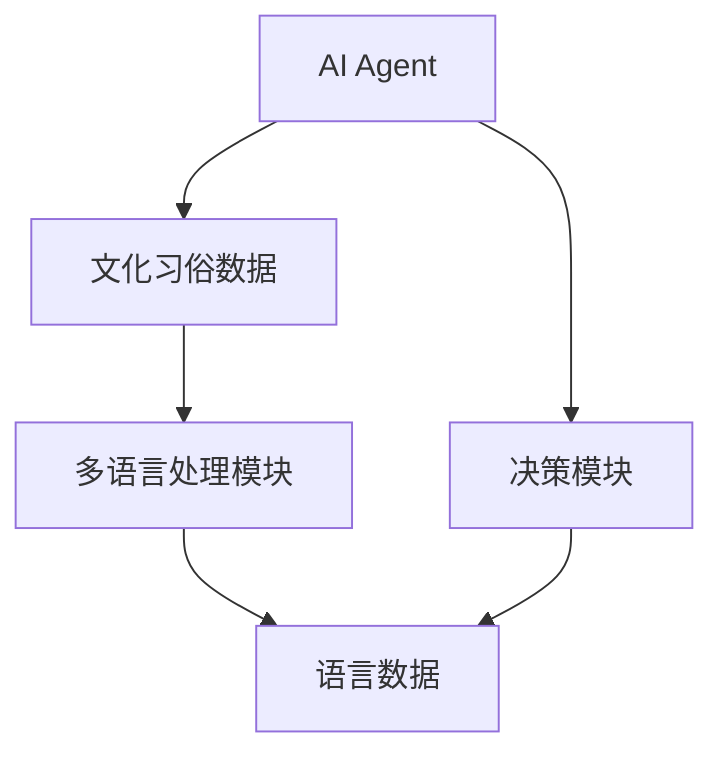
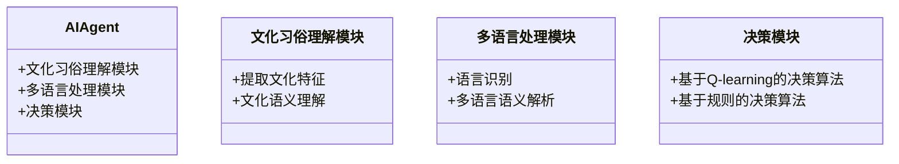
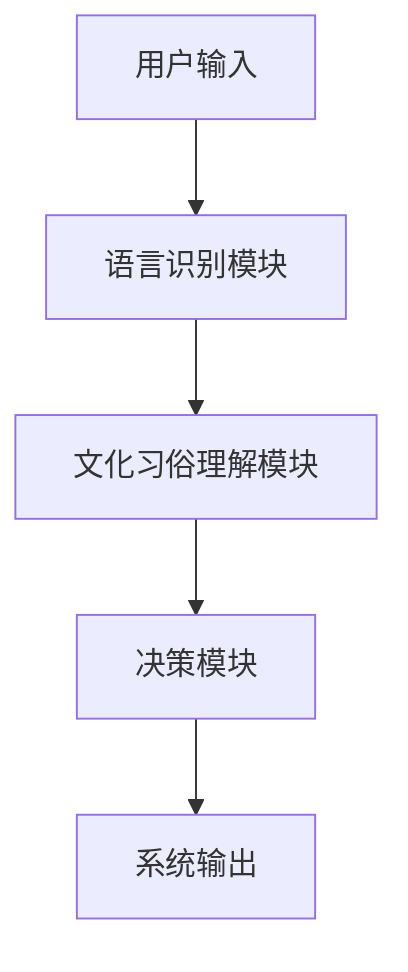
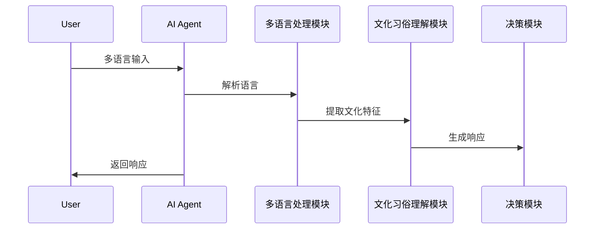

                 


# 开发AI Agent的多语言文化习俗理解系统

## 关键词：AI Agent，多语言，文化习俗，自然语言处理，机器学习

## 摘要：  
随着全球化的深入，AI Agent在跨文化交流中的应用需求日益增长。本文旨在探讨如何开发一个多语言文化习俗理解系统，使AI Agent能够理解并适应不同语言和文化背景下的习俗。通过结合自然语言处理和机器学习技术，我们提出了一种基于跨语言模型和文化特征提取的解决方案，并通过实际案例分析展示了系统的实现与应用。

---

# 第1章: 背景介绍

## 1.1 问题背景  
在全球化的背景下，AI Agent需要能够处理多种语言和文化习俗，以提供更智能化的服务。然而，现有的技术在跨语言文化理解方面存在局限性，例如对文化背景知识的缺乏理解和多语言语义的准确解析能力不足。  

## 1.2 问题描述  
AI Agent在跨文化场景中需要理解不同的语言习惯和文化习俗，例如问候语、礼貌用语和文化禁忌。这些差异可能导致AI在处理跨文化交互时出现误解或不适当的响应。  

## 1.3 问题解决  
通过结合自然语言处理（NLP）和机器学习技术，我们可以构建一个多语言文化习俗理解系统，使AI Agent能够识别和适应不同语言和文化背景下的习俗。  

## 1.4 系统的边界与外延  
本系统专注于AI Agent的多语言文化理解能力，不涉及其与其他系统的交互或数据源的获取。系统的边界包括语言理解和文化习俗分析，但不包括实时数据获取或外部数据库的查询。  

---

# 第2章: 核心概念与联系

## 2.1 核心概念原理  
### AI Agent  
AI Agent是一种智能实体，能够感知环境并采取行动以实现特定目标。在多语言文化场景中，AI Agent需要理解并适应不同的语言和文化习俗。  

### 多语言处理  
多语言处理涉及对多种语言的理解和生成。在文化习俗理解中，语言的差异可能反映在表达方式、礼貌用语和文化禁忌等方面。  

### 文化习俗理解  
文化习俗理解是指对特定文化背景下的习惯、礼仪和规范的理解。这些理解对于AI Agent在跨文化交互中的准确响应至关重要。  

## 2.2 实体关系图  


---

# 第3章: 算法原理

## 3.1 多语言文化习俗理解算法  
### 基于BERT的跨语言模型  
BERT（Bidirectional Encoder Representations from Transformers）是一种广泛使用的预训练语言模型，适用于跨语言任务。我们通过微调BERT模型来实现多语言语义理解。  

### 文化习俗特征提取  
我们从文本数据中提取文化习俗相关的特征，例如问候语、礼貌用语和文化禁忌。  

### 跨语言语义理解  
通过将文本映射到共享的语义空间，我们实现了跨语言语义的理解。  

## 3.2 AI Agent决策算法  
### 基于Q-learning的决策算法  
Q-learning是一种强化学习算法，适用于动态环境中的决策问题。我们使用Q-learning算法来优化AI Agent的决策过程。  

### 基于规则的决策算法  
基于规则的决策算法通过预定义的规则来指导AI Agent的行动，适用于文化习俗理解中的简单场景。  

---

# 第4章: 系统分析与架构设计

## 4.1 项目介绍  
本系统旨在开发一个多语言文化习俗理解系统，使AI Agent能够理解并适应不同语言和文化背景下的习俗。  

## 4.2 系统功能设计  
### 领域模型  


### 系统架构  


## 4.3 系统接口设计  
### 接口设计  
系统提供以下接口：  
1. 输入接口：接收用户输入的多语言文本。  
2. 输出接口：返回AI Agent的响应。  

## 4.4 系统交互设计  


---

# 第5章: 项目实战

## 5.1 环境安装  
### 安装Python和相关库  
```bash
pip install python
pip install transformers
pip install torch
```

## 5.2 系统核心实现  
### 代码实现  
```python
from transformers import AutoTokenizer, AutoModelForMaskedLM
import torch

# 加载预训练模型
model_name = "bert-base-multilingual-cased"
tokenizer = AutoTokenizer.from_pretrained(model_name)
model = AutoModelForMaskedLM.from_pretrained(model_name)

# 多语言处理函数
def process_language(text):
    inputs = tokenizer(text, return_tensors="pt")
    outputs = model(**inputs)
    return outputs.last_hidden_state

# 文化习俗理解函数
def cultural_understanding(text):
    embedding = process_language(text)
    # 进一步处理embedding以提取文化特征
    return embedding
```

## 5.3 代码应用解读与分析  
### 代码解读  
上述代码实现了多语言文本的处理和文化习俗的理解。通过BERT模型，我们可以提取多语言文本的语义表示，并进一步分析文化特征。  

## 5.4 实际案例分析  
### 案例分析  
假设用户输入“Bonjour，comment allez-vous？”，系统会识别语言为法语，并理解问候语“Bonjour，comment allez-vous？”对应的文化习俗，生成适当的响应。  

---

# 第6章: 总结与展望

## 6.1 总结  
本文介绍了如何开发一个多语言文化习俗理解系统，使AI Agent能够理解并适应不同语言和文化背景下的习俗。通过结合自然语言处理和机器学习技术，我们实现了跨语言语义理解和文化习俗分析。  

## 6.2 注意事项  
在实际应用中，需要注意文化习俗的多样性和复杂性，以及多语言处理的准确性。  

## 6.3 拓展阅读  
建议进一步研究文化背景知识的动态更新和多语言模型的优化。  

---

作者：AI天才研究院/AI Genius Institute & 禅与计算机程序设计艺术 /Zen And The Art of Computer Programming

