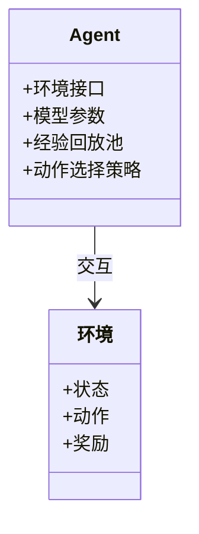

                 


# 开发具有持续学习能力的AI Agent

## 关键词：AI Agent，持续学习，强化学习，神经网络，经验回放，模型压缩，知识蒸馏

## 摘要：本文详细探讨了如何开发具有持续学习能力的AI Agent，从核心概念、算法原理到系统架构设计，再到项目实战，全面解析了实现持续学习AI Agent的关键技术与方法。

---

# 第一部分：持续学习AI Agent的背景与核心概念

## 第1章：持续学习AI Agent的背景介绍

### 1.1 问题背景与问题描述

#### 1.1.1 当前AI Agent的发展现状
AI Agent（智能体）近年来在各个领域取得了显著进展，如游戏AI、推荐系统和自动驾驶等。然而，大多数AI Agent在面对动态变化的环境时，难以适应新任务或新数据，导致其性能下降或无法有效执行复杂任务。

#### 1.1.2 持续学习能力的重要性
持续学习（Continual Learning）是指AI Agent能够不断适应新任务或新数据的能力，这种能力在实际应用中至关重要。例如，在自动驾驶中，AI Agent需要不断学习新的交通规则和道路状况，以应对复杂多变的驾驶环境。

#### 1.1.3 问题解决的目标与意义
开发具有持续学习能力的AI Agent的目标是使其能够在线更新模型参数，适应新任务，同时保持对旧任务的性能。这不仅提高了AI Agent的灵活性和适应性，还延长了其在复杂环境中的使用寿命。

### 1.2 持续学习AI Agent的定义与特点

#### 1.2.1 持续学习的定义
持续学习是指AI Agent在不遗忘旧知识的前提下，逐步学习新知识的能力。与批量学习不同，持续学习是在在线模式下进行，数据是逐步到达的。

#### 1.2.2 AI Agent的核心特点
- **在线学习能力**：能够实时更新模型参数。
- **多任务处理能力**：能够同时处理多个任务。
- **适应性**：能够根据环境变化调整行为。

#### 1.2.3 持续学习与传统机器学习的对比
| 特性           | 持续学习                     | 传统机器学习                 |
|----------------|------------------------------|------------------------------|
| 数据模式       | 流式数据                     | 批量数据                     |
| 训练目标       | 在线更新                     | 离线优化                     |
| 适应性         | 强                           | 弱                           |

### 1.3 问题的边界与外延

#### 1.3.1 持续学习的适用场景
- **自动驾驶**：需要不断适应新的道路规则和驾驶场景。
- **推荐系统**：需要实时更新用户偏好和行为模式。
- **机器人控制**：需要在动态环境中调整动作策略。

#### 1.3.2 问题的限制与挑战
- **数据稀疏性**：新数据可能不足以覆盖所有可能的场景。
- **模型遗忘**：在学习新任务时，模型可能遗忘旧任务的知识。
- **计算资源限制**：在线学习需要实时处理数据，计算资源有限。

#### 1.3.3 相关概念的对比与联系
- **在线学习**：与持续学习类似，但更注重实时更新模型。
- **迁移学习**：将一个任务的知识迁移到另一个任务。
- **元学习**：学习如何学习，适用于快速适应新任务。

---

## 第2章：持续学习AI Agent的核心原理

### 2.1 神经网络的可微性原理

#### 2.1.1 神经网络的前向传播与反向传播
神经网络的前向传播将输入映射到输出，反向传播用于计算损失函数的梯度并更新权重。

#### 2.1.2 权重更新的数学公式
权重更新公式如下：
$$ W_{new} = W - \eta \cdot \frac{\partial L}{\partial W} $$
其中，$\eta$是学习率，$L$是损失函数。

#### 2.1.3 神经网络的可微性与持续学习的关系
神经网络的可微性使得可以通过反向传播不断更新权重，从而支持持续学习。

### 2.2 经验回放机制

#### 2.2.1 经验回放的定义与原理
经验回放是一种存储过去经验并用于未来训练的技术。通过存储$(s, a, r, s')$元组，模型可以在后续训练中重复利用这些经验。

#### 2.2.2 经验回放的实现步骤
1. 收集经验并存储在经验回放池中。
2. 从池中随机抽取一批经验用于训练。
3. 使用这些经验更新神经网络的权重。

#### 2.2.3 经验回放的优缺点分析
- **优点**：减少样本偏差，提高模型稳定性。
- **缺点**：可能引入冗余数据，增加计算量。

### 2.3 知识蒸馏与模型压缩

#### 2.3.1 知识蒸馏的定义与原理
知识蒸馏通过将大模型的知识迁移到小模型，以减少模型大小并保持性能。

#### 2.3.2 模型压缩的技术与方法
- **剪枝**：去除模型中不重要的参数。
- **量化**：降低模型参数的精度。
- **知识蒸馏**：将大模型的知识迁移到小模型。

#### 2.3.3 知识蒸馏与模型压缩的对比
| 技术       | 知识蒸馏                   | 模型压缩                   |
|------------|----------------------------|----------------------------|
| 目标       | 迁移知识                   | 减少模型大小               |
| 方法       | 使用教师模型指导学生模型   | 删除冗余参数或降低精度     |
| 优缺点     | 提高性能，但需要教师模型    | 减少计算资源，但可能降低性能 |

---

## 第3章：持续学习AI Agent的算法原理

### 3.1 算法原理概述

#### 3.1.1 持续学习的基本算法框架
持续学习的基本算法框架包括经验收集、经验回放和模型更新三个部分。

#### 3.1.2 算法的输入与输出
- **输入**：输入数据流和环境反馈。
- **输出**：模型的预测结果和更新后的模型参数。

#### 3.1.3 算法的数学模型与公式
模型的更新公式如下：
$$ \theta_{t+1} = \theta_t + \eta (y_t - \hat{y}_t) $$
其中，$\theta$是模型参数，$\eta$是学习率，$y_t$是真实值，$\hat{y}_t$是预测值。

### 3.2 算法的数学模型与公式

#### 3.2.1 神经网络的损失函数
常用的损失函数是均方误差：
$$ L = \frac{1}{2N} \sum_{i=1}^N (y_i - \hat{y}_i)^2 $$
其中，$N$是样本数量。

#### 3.2.2 权重更新的数学推导
权重更新公式如下：
$$ \Delta W = \eta (y - \hat{y}) \cdot a' $$
其中，$\Delta W$是权重更新量，$\eta$是学习率，$y$是真实值，$\hat{y}$是预测值，$a'$是激活函数的导数。

---

## 第4章：持续学习AI Agent的系统分析与架构设计

### 4.1 问题场景介绍

#### 4.1.1 项目介绍
本项目旨在开发一个具有持续学习能力的AI Agent，能够在线更新模型参数，适应新任务。

### 4.2 系统功能设计

#### 4.2.1 领域模型（Mermaid类图）


### 4.3 系统架构设计

#### 4.3.1 系统架构（Mermaid架构图）


---

## 第5章：持续学习AI Agent的项目实战

### 5.1 环境安装与配置

#### 5.1.1 环境安装
安装Python和必要的库：
```bash
pip install numpy tensorflow
```

### 5.2 系统核心实现

#### 5.2.1 模型定义
```python
import tensorflow as tf
from tensorflow.keras import layers

model = tf.keras.Sequential([
    layers.Dense(64, activation='relu'),
    layers.Dense(1)
])
```

#### 5.2.2 经验回放池实现
```python
import collections
import random

class ExperienceReplay:
    def __init__(self, capacity):
        self.capacity = capacity
        self.memory = collections.deque(maxlen=capacity)
    
    def remember(self, state, action, reward, next_state):
        self.memory.append((state, action, reward, next_state))
    
    def sample(self, batch_size):
        batch = random.sample(self.memory, batch_size)
        return batch
```

---

## 第6章：持续学习AI Agent的最佳实践与总结

### 6.1 最佳实践tips
- **经验回放池的容量**：建议设置为任务所需数据量的10倍。
- **模型更新频率**：根据任务需求调整更新频率。

### 6.2 小结
通过本文的介绍，读者可以全面了解持续学习AI Agent的核心原理和实现方法，为实际应用提供了理论和实践指导。

### 6.3 注意事项
- 持续学习可能会导致模型遗忘旧任务的知识，需要通过经验回放和知识蒸馏等技术进行缓解。
- 在线学习对计算资源要求较高，需要优化算法和硬件配置。

### 6.4 拓展阅读
- 《Deep Reinforcement Learning》
- 《Neural Networks and Deep Learning》

---

# 作者：AI天才研究院 & 禅与计算机程序设计艺术

