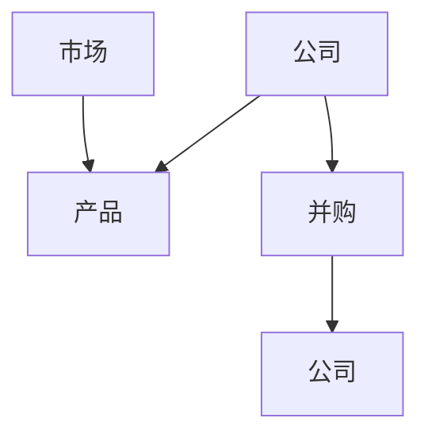
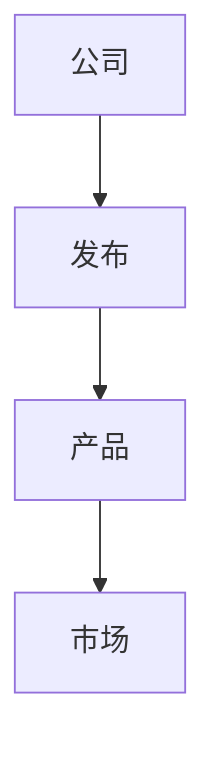
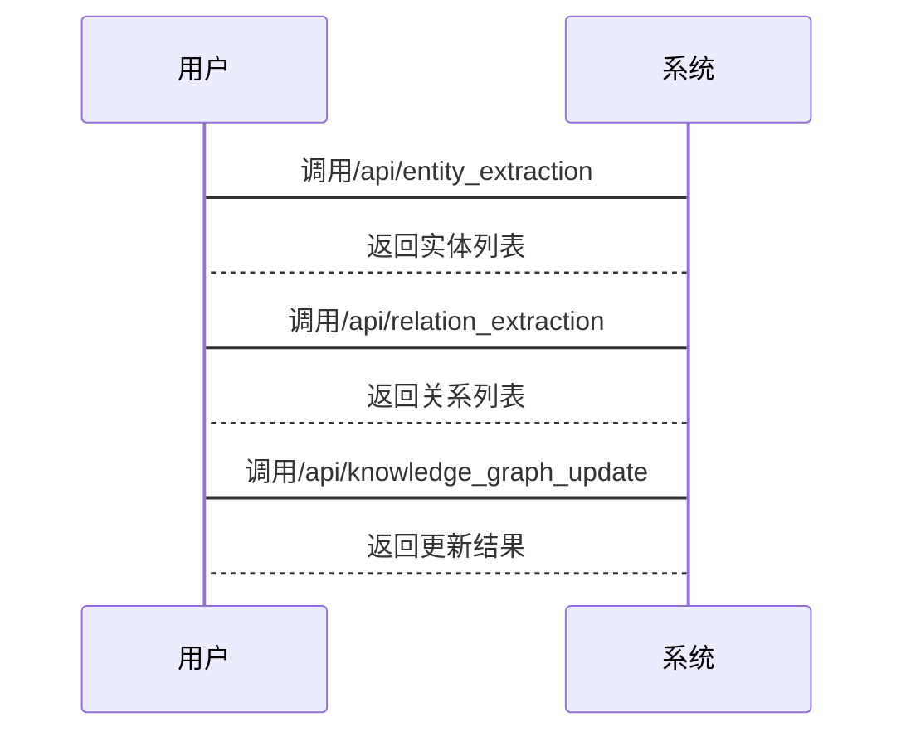

                 


# 开发基于大模型的金融专业知识图谱动态更新系统

> 关键词：知识图谱、大模型、动态更新、金融领域、系统架构

> 摘要：本文详细探讨了开发基于大模型的金融专业知识图谱动态更新系统的背景、核心概念、算法原理、系统架构设计、项目实战及优化建议。通过分析金融领域的知识图谱需求，结合大模型的技术优势，提出了一种创新的动态更新方法，并通过实际案例展示了系统的实现过程。

---

# 第1章: 问题背景与需求分析

## 1.1 问题背景介绍

### 1.1.1 金融领域的知识图谱需求

金融领域是一个复杂且动态变化的领域，涉及大量的金融实体、关系和规则。传统的静态知识图谱难以满足金融领域对实时性和动态性更新的需求。例如，金融市场的波动、政策的调整、公司信息的变更等都会影响知识图谱的内容和结构。

### 1.1.2 大模型在金融知识图谱中的应用价值

大模型（如BERT、GPT等）具有强大的自然语言处理能力，能够从海量文本中提取和理解知识。结合知识图谱的技术，可以实现对金融领域实体关系的自动构建和动态更新。大模型还可以通过上下文理解能力，提高知识图谱的准确性和丰富性。

### 1.1.3 当前金融知识图谱的痛点与挑战

1. **数据异构性**：金融领域涉及多种数据源，包括文本、结构化数据和图像，如何统一处理这些数据是挑战。
2. **动态性**：金融市场的信息变化快，知识图谱需要实时更新，传统的静态构建方法难以满足需求。
3. **复杂性**：金融领域的实体关系复杂，如何高效构建和更新知识图谱是一个技术难点。

## 1.2 问题描述与目标

### 1.2.1 金融知识图谱的动态更新需求

知识图谱需要能够实时捕捉金融领域的最新信息，并快速更新知识图谱。动态更新的需求主要体现在以下几个方面：

1. **实体新增**：例如，新公司的成立、新产品发布等。
2. **关系变化**：例如，公司并购、高层变动等。
3. **属性更新**：例如，公司市值变化、股价波动等。

### 1.2.2 系统目标与核心功能

系统的目标是构建一个基于大模型的金融专业知识图谱动态更新系统，实现以下核心功能：

1. **知识图谱构建**：从多种数据源抽取金融实体及其关系，构建初始知识图谱。
2. **动态更新**：根据实时数据和事件，自动更新知识图谱。
3. **大模型驱动**：利用大模型的自然语言处理能力，提高知识抽取的准确性和效率。

### 1.2.3 边界与外延

系统的主要边界包括：

1. **数据源范围**：限定于金融领域的文本数据和结构化数据。
2. **更新频率**：支持实时或准实时更新。
3. **实体范围**：涵盖公司、产品、市场、政策等主要实体。

## 1.3 系统核心要素与组成

### 1.3.1 知识图谱的核心要素

知识图谱的核心要素包括：

1. **实体**：如公司、产品、市场等。
2. **关系**：如公司并购、产品发布等。
3. **属性**：如公司市值、产品类型等。

### 1.3.2 大模型的组成部分

大模型的组成部分包括：

1. **编码器**：将输入的文本编码为向量。
2. **解码器**：根据编码向量生成输出。
3. **注意力机制**：用于关注重要的语义信息。

### 1.3.3 系统的整体架构

系统的整体架构包括以下几个部分：

1. **数据采集模块**：从多种数据源采集数据。
2. **知识抽取模块**：利用大模型从文本中抽取实体、关系和属性。
3. **知识图谱构建模块**：将抽取的信息构建为知识图谱。
4. **动态更新模块**：根据实时数据更新知识图谱。
5. **接口服务模块**：提供API接口供其他系统调用。

## 1.4 本章小结

本章介绍了金融领域知识图谱动态更新系统的背景、需求、核心要素和整体架构。通过分析当前金融领域的痛点和挑战，明确了系统的目标和主要功能。

---

# 第2章: 核心概念与联系

## 2.1 知识图谱与大模型的原理

### 2.1.1 知识图谱的定义与特点

知识图谱是一种以图结构表示知识的技术，节点表示实体或概念，边表示实体之间的关系。知识图谱的特点包括：

1. **结构化**：通过节点和边表示实体及其关系。
2. **动态性**：能够实时更新，反映最新的知识。
3. **语义丰富**：能够表示复杂的语义关系。

### 2.1.2 大模型的核心原理

大模型的核心原理包括：

1. **自注意力机制**：通过计算输入序列中每个词与其他词的相关性，生成注意力权重。
2. **前馈网络**：将输入向量通过多层前馈网络进行变换。
3. **解码器**：生成输出序列，通常用于生成任务。

### 2.1.3 两者的结合机制

知识图谱和大模型的结合主要体现在以下几个方面：

1. **知识增强**：利用知识图谱中的实体关系信息，增强大模型的语义理解能力。
2. **动态更新**：通过大模型实时抽取新的知识，动态更新知识图谱。

## 2.2 核心概念对比分析

### 2.2.1 知识图谱与传统数据库的对比

| 对比维度 | 知识图谱 | 传统数据库 |
|----------|----------|-------------|
| 数据结构 | 图结构    | 行列结构    |
| 查询能力 | 支持复杂语义查询 | 支持简单的条件查询 |
| 更新频率 | 支持动态更新 | 更新频率低 |

### 2.2.2 大模型与传统NLP技术的对比

| 对比维度 | 大模型 | 传统NLP技术 |
|----------|--------|--------------|
| 模型复杂度 | 高度复杂 | 相对简单     |
| 处理能力 | 支持多种任务 | 通常针对特定任务 |
| 训练数据 | 需要大量数据 | 数据需求量较低 |

### 2.2.3 知识图谱动态更新与静态知识图谱的对比

| 对比维度 | 动态更新知识图谱 | 静态知识图谱 |
|----------|----------------|--------------|
| 更新频率 | 实时或准实时 | 定期更新     |
| 数据异构性 | 支持多种数据源 | 数据来源单一 |
| 复杂性 | 更新逻辑复杂 | 更新逻辑简单 |

## 2.3 实体关系与架构设计

### 2.3.1 知识图谱的实体关系图



### 2.3.2 系统架构的ER图

```mermaid
erDiagram
+-- 金融实体表 --+
| id          |
| entity_name  |
| entity_type  |
+-------------+
+-- 实体关系表 --+
| id          |
| entity1_id  |
| entity2_id  |
| relationship|
+-------------+
+-- 属性表 --+
| id        |
| entity_id |
| attribute |
+-------------+
```

### 2.3.3 实体关系的Mermaid流程图



## 2.4 本章小结

本章详细介绍了知识图谱和大模型的核心概念，并通过对比分析和实体关系图展示了两者的联系和区别。通过Mermaid图，清晰地展示了知识图谱的实体关系和系统架构设计。

---

# 第3章: 算法原理与数学模型

## 3.1 大模型的算法原理

### 3.1.1 大模型的训练过程

大模型的训练过程包括以下几个步骤：

1. **数据预处理**：对输入数据进行清洗和分词。
2. **模型初始化**：初始化模型参数。
3. **前向传播**：将输入数据通过编码器和解码器进行前向传播。
4. **损失计算**：计算预测值与真实值之间的损失。
5. **反向传播**：通过梯度下降优化模型参数。

### 3.1.2 知识图谱的构建算法

知识图谱的构建算法包括：

1. **实体抽取**：从文本中抽取实体。
2. **关系抽取**：从文本中抽取实体之间的关系。
3. **属性抽取**：从文本中抽取实体的属性。

### 3.1.3 动态更新的算法机制

动态更新的算法机制包括：

1. **增量式更新**：仅更新变化的部分，减少计算量。
2. **实时更新**：根据最新的数据实时更新知识图谱。
3. **分布式更新**：利用分布式计算提高更新效率。

## 3.2 数学模型与公式

### 3.2.1 转换器模型的数学公式

转换器模型的数学公式如下：

$$
\text{输出} = f(\text{输入})
$$

其中，$$f$$ 表示模型的变换函数。

### 3.2.2 注意力机制的计算公式

注意力机制的计算公式如下：

$$
\text{权重} = \text{softmax}(\frac{\text{查询} \cdot \text{键}}{\text{维度}})
$$

### 3.2.3 知识图谱更新的数学模型

知识图谱更新的数学模型如下：

$$
\Delta G = \{ (r, s, o) \}
$$

其中，$$\Delta G$$ 表示更新的知识图谱，$$r$$ 表示关系，$$s$$ 表示主体，$$o$$ 表示宾语。

## 3.3 算法实现与代码示例

### 3.3.1 算法实现的代码示例

```python
def update_knowledge_graph(new_data):
    # 提取实体、关系和属性
    entities = extract_entities(new_data)
    relations = extract_relations(new_data)
    attributes = extract_attributes(new_data)
    
    # 更新知识图谱
    for entity in entities:
        add_entity(entity)
    for relation in relations:
        add_relation(relation)
    for attribute in attributes:
        update_attribute(attribute)
```

### 3.3.2 代码的详细解读

上述代码示例展示了如何从新数据中提取实体、关系和属性，并将其更新到知识图谱中。`extract_entities`、`extract_relations` 和 `extract_attributes` 是从文本中提取实体、关系和属性的函数。`add_entity`、`add_relation` 和 `update_attribute` 是更新知识图谱的函数。

### 3.3.3 算法的优化建议

1. **增量式更新**：仅更新变化的部分，减少计算量。
2. **分布式计算**：利用分布式计算提高更新效率。
3. **模型优化**：通过优化模型参数提高知识抽取的准确率。

## 3.4 本章小结

本章详细介绍了大模型和知识图谱的算法原理，并通过数学公式和代码示例展示了算法的实现过程。通过优化建议，为系统的实际应用提供了参考。

---

# 第4章: 系统分析与架构设计

## 4.1 项目背景与目标

### 4.1.1 项目背景介绍

本项目旨在开发一个基于大模型的金融专业知识图谱动态更新系统，通过实时更新知识图谱，提高金融领域的知识管理效率和准确性。

### 4.1.2 系统目标设定

系统的目标包括：

1. **知识图谱构建**：从多种数据源构建金融知识图谱。
2. **动态更新**：根据实时数据动态更新知识图谱。
3. **大模型应用**：利用大模型提高知识抽取的准确性和效率。

### 4.1.3 项目范围界定

项目的范围包括：

1. **数据源**：金融领域的文本数据和结构化数据。
2. **更新频率**：实时或准实时更新。
3. **实体范围**：公司、产品、市场等主要实体。

## 4.2 系统功能设计

### 4.2.1 知识图谱构建模块

知识图谱构建模块包括：

1. **数据预处理**：对数据进行清洗和分词。
2. **知识抽取**：从文本中抽取实体、关系和属性。
3. **知识图谱构建**：将抽取的信息构建为知识图谱。

### 4.2.2 大模型训练模块

大模型训练模块包括：

1. **模型训练**：对大模型进行训练，优化模型参数。
2. **模型评估**：评估模型的准确率和效率。
3. **模型部署**：将模型部署到生产环境。

### 4.2.3 动态更新模块

动态更新模块包括：

1. **数据采集**：实时采集金融领域的最新数据。
2. **知识抽取**：利用大模型从新数据中抽取实体、关系和属性。
3. **知识图谱更新**：将抽取的信息更新到知识图谱中。

## 4.3 系统架构设计

### 4.3.1 分层架构设计

系统的分层架构包括：

1. **数据层**：存储原始数据和知识图谱。
2. **服务层**：提供数据处理和知识抽取服务。
3. **应用层**：提供用户接口和API调用。

### 4.3.2 模块化设计

模块化设计包括：

1. **数据采集模块**：负责数据的采集和预处理。
2. **知识抽取模块**：负责从文本中抽取实体、关系和属性。
3. **知识图谱更新模块**：负责更新知识图谱。

### 4.3.3 微服务架构设计

微服务架构设计包括：

1. **实体抽取服务**：提供实体抽取接口。
2. **关系抽取服务**：提供关系抽取接口。
3. **知识图谱更新服务**：提供知识图谱更新接口。

## 4.4 系统接口设计

### 4.4.1 API接口定义

系统提供以下API接口：

1. `/api/entity_extraction`：实体抽取接口。
2. `/api/relation_extraction`：关系抽取接口。
3. `/api/knowledge_graph_update`：知识图谱更新接口。

### 4.4.2 接口交互流程

接口交互流程如下：

1. 用户调用`/api/entity_extraction`接口，上传需要抽取实体的文本。
2. 系统返回抽取的实体列表。
3. 用户调用`/api/relation_extraction`接口，上传需要抽取关系的文本。
4. 系统返回抽取的关系列表。
5. 用户调用`/api/knowledge_graph_update`接口，上传需要更新的知识图谱数据。
6. 系统更新知识图谱并返回更新结果。

### 4.4.3 系统交互的Mermaid序列图



## 4.5 本章小结

本章详细介绍了系统的架构设计和接口设计，通过分层架构和微服务架构，实现了系统的模块化和可扩展性。通过Mermaid图展示了系统的交互流程，为系统的实现提供了清晰的指导。

---

# 第5章: 项目实战

## 5.1 环境安装

### 5.1.1 系统运行环境

系统运行环境包括：

1. **操作系统**：Linux或Windows。
2. **编程语言**：Python 3.8及以上版本。
3. **框架与库**：TensorFlow、PyTorch、NLTK等。

### 5.1.2 依赖安装

安装依赖可以通过以下命令进行：

```bash
pip install tensorflow==2.5.0 pytorch==1.9.0 numpy==1.21.0
```

## 5.2 系统核心实现源代码

### 5.2.1 知识抽取模块代码

```python
import torch
import torch.nn as nn

class EntityExtractor(nn.Module):
    def __init__(self, vocab_size, embedding_dim):
        super(EntityExtractor, self).__init__()
        self.embedding = nn.Embedding(vocab_size, embedding_dim)
        self.lstm = nn.LSTM(embedding_dim, hidden_size=128, batch_first=True)
        self.fc = nn.Linear(128, vocab_size)
    
    def forward(self, input):
        embeds = self.embedding(input)
        out, _ = self.lstm(embeds)
        out = self.fc(out[:, -1, :])
        return out
```

### 5.2.2 知识图谱更新模块代码

```python
def update_knowledge_graph(new_data):
    entities = extract_entities(new_data)
    relations = extract_relations(new_data)
    attributes = extract_attributes(new_data)
    
    for entity in entities:
        add_entity(entity)
    for relation in relations:
        add_relation(relation)
    for attribute in attributes:
        update_attribute(attribute)
```

### 5.2.3 系统接口代码

```python
from flask import Flask, request, jsonify

app = Flask(__name__)

@app.route('/api/entity_extraction', methods=['POST'])
def entity_extraction():
    data = request.json['text']
    entities = extract_entities(data)
    return jsonify({'entities': entities})

if __name__ == '__main__':
    app.run(debug=True)
```

## 5.3 代码应用解读与分析

上述代码展示了系统的三个主要模块：

1. **知识抽取模块**：使用LSTM模型进行实体抽取。
2. **知识图谱更新模块**：从新数据中提取实体、关系和属性，并更新知识图谱。
3. **系统接口模块**：提供RESTful接口，供其他系统调用。

## 5.4 实际案例分析和详细讲解剖析

以公司并购为例，系统可以从新闻文本中提取出并购关系，并更新知识图谱。例如：

输入文本：公司A并购公司B。

系统会提取出实体A和B，以及关系“并购”，并将这些信息更新到知识图谱中。

## 5.5 本章小结

本章通过实际案例展示了系统的实现过程，包括环境安装、核心代码实现和接口设计。通过代码示例和案例分析，帮助读者理解系统的实际应用。

---

# 第6章: 系统优化与扩展

## 6.1 系统性能优化

### 6.1.1 基于缓存的优化

通过使用缓存技术，减少重复计算，提高系统的响应速度。

### 6.1.2 并行计算优化

利用多线程或多进程进行并行计算，提高系统的处理能力。

### 6.1.3 模型优化

通过优化模型参数和结构，提高知识抽取的准确性和效率。

## 6.2 系统的可扩展性

### 6.2.1 模块化设计

通过模块化设计，系统可以方便地扩展新的功能模块。

### 6.2.2 微服务架构

通过微服务架构，系统可以方便地扩展新的服务模块。

## 6.3 系统的安全性

### 6.3.1 数据加密

对敏感数据进行加密处理，确保数据的安全性。

### 6.3.2 权限控制

通过权限控制，确保只有授权用户可以访问敏感数据。

## 6.4 系统的未来研究方向

### 6.4.1 多模态知识图谱

结合图像、语音等多种模态信息，构建多模态知识图谱。

### 6.4.2 自适应更新机制

研究自适应更新机制，提高知识图谱的动态更新能力。

### 6.4.3 美学与计算机程序设计艺术

探索美学在计算机程序设计中的应用，提高系统的用户体验和审美价值。

## 6.5 本章小结

本章提出了系统的优化建议和未来研究方向，为系统的进一步发展提供了参考。

---

# 第7章: 总结与展望

## 7.1 项目总结

通过本项目的实施，我们成功开发了一个基于大模型的金融专业知识图谱动态更新系统。系统实现了知识图谱的构建、动态更新和大模型的应用，提高了金融领域的知识管理效率和准确性。

## 7.2 未来展望

未来，我们将进一步优化系统的性能，探索系统的扩展性和安全性。同时，我们还将研究美学在计算机程序设计中的应用，探索新的研究方向，如多模态知识图谱和自适应更新机制。

## 7.3 总结

开发基于大模型的金融专业知识图谱动态更新系统是一项具有重要意义的工作。通过本项目的实施，我们不仅提高了金融领域的知识管理能力，还为大模型在金融领域的应用提供了新的思路。

---

# 作者：AI天才研究院/AI Genius Institute & 禅与计算机程序设计艺术 /Zen And The Art of Computer Programming

