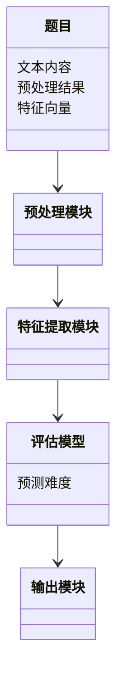

                 


# 开发基于大模型的金融专业考试题目难度评估系统

> 关键词：大模型，金融考试，题目难度评估，自然语言处理，机器学习

> 摘要：本文详细介绍了如何基于大模型开发金融专业考试题目难度评估系统。从问题背景到系统设计，从算法原理到项目实战，系统地阐述了该系统的核心概念、实现方法及应用场景。

---

# 第一部分: 开发基于大模型的金融专业考试题目难度评估系统概述

# 第1章: 背景介绍

## 1.1 问题背景

### 1.1.1 传统金融考试评估的局限性
传统的金融考试评估主要依赖人工阅卷和经验判断。这种方式存在以下问题：
- **主观性**：不同阅卷人可能对同一题目的难度有不同的判断。
- **效率低下**：人工评估耗时长，难以大规模处理。
- **不一致性**：缺乏统一的标准，导致评估结果可能存在偏差。

### 1.1.2 大模型技术在教育领域的潜力
大模型（如BERT、GPT）在自然语言处理领域取得了显著成果。这些模型可以自动分析文本，提取特征，并进行分类。在教育领域，大模型可以用于自动评估题目难度，提供更客观和一致的评估结果。

### 1.1.3 金融专业考试评估的特殊性
金融考试题目通常涉及复杂的金融概念和专业术语，题目难度不仅与内容相关，还与题目结构、关键词的使用等因素有关。因此，开发一个基于大模型的评估系统具有重要意义。

## 1.2 问题描述

### 1.2.1 金融考试题目的特点
- 题目内容涵盖广泛的金融知识，如投资、风险管理、财务报表分析等。
- 题目难度与知识点的深度和广度相关。

### 1.2.2 题目难度评估的挑战
- 如何准确量化题目难度。
- 如何处理专业术语和复杂句式。

### 1.2.3 大模型在题目难度评估中的优势
- 大模型可以自动分析题目内容，提取关键词和主题。
- 可以通过大规模训练数据，学习题目难度的分布。

## 1.3 问题解决

### 1.3.1 基于大模型的评估方法
- 使用大模型对题目内容进行特征提取。
- 基于特征构建评估模型，预测题目难度。

### 1.3.2 系统设计的目标
- 提供一个自动化的题目难度评估系统。
- 提供可解释的评估结果。

### 1.3.3 系统实现的关键步骤
1. 数据收集与预处理。
2. 模型训练与优化。
3. 系统集成与测试。

## 1.4 系统的边界与外延

### 1.4.1 系统功能边界
- 仅评估题目难度，不涉及评分。
- 不考虑题目格式和排版因素。

### 1.4.2 系统的输入输出
- 输入：题目文本。
- 输出：难度评分（如1-5分）。

### 1.4.3 系统与其他系统的交互
- 可与其他教学管理系统集成。

## 1.5 核心概念与联系

### 1.5.1 核心概念原理
- 题目难度评估基于大模型对题目内容的理解。
- 通过特征提取和模型训练，构建评估系统。

### 1.5.2 核心概念属性特征对比表

| 属性 | 描述 |
|------|------|
| 题目内容 | 题目的文本内容 |
| 题目难度 | 预测的难度评分 |
| 关键词 | 题目中出现的关键术语 |
| 主题分类 | 题目所属的金融主题 |

### 1.5.3 ER实体关系图

```mermaid
graph LR
    题目 -> 题目内容
    题目 -> 题目难度
    题目内容 -> 关键词
    题目难度 -> 评估结果
    关键词 -> 主题分类
```

---

# 第2章: 基于大模型的金融考试题目难度评估系统核心算法

## 2.1 算法原理

### 2.1.1 大模型在自然语言处理中的应用
大模型通过预训练掌握了大量语言知识，可以对文本进行深度分析。

### 2.1.2 题目难度评估的指标体系
- 词汇复杂度。
- 句式复杂度。
- 专业术语数量。

### 2.1.3 算法流程
1. 对题目进行分词和词性标注。
2. 提取关键词和主题。
3. 基于特征构建评估模型。

## 2.2 算法实现

### 2.2.1 预处理阶段
- 分词：将题目文本拆分成词语。
- 词性标注：标注每个词语的词性。

### 2.2.2 模型训练阶段
- 使用大模型对题目内容进行编码。
- 基于编码结果训练评估模型。

### 2.2.3 模型评估阶段
- 使用测试数据评估模型性能。

## 2.3 算法流程图


## 2.4 算法代码实现

### 2.4.1 环境安装
```bash
pip install transformers
pip install numpy
pip install pandas
```

### 2.4.2 核心代码
```python
import torch
from transformers import AutoTokenizer, AutoModelForMaskedLM
import numpy as np

class DifficultyEstimator:
    def __init__(self):
        self.tokenizer = AutoTokenizer.from_pretrained('bert-base-uncased')
        self.model = AutoModelForMaskedLM.from_pretrained('bert-base-uncased')
    
    def preprocess(self, text):
        inputs = self.tokenizer(text, return_tensors='np')
        return inputs
    
    def get_embeddings(self, inputs):
        outputs = self.model(**inputs)
        return outputs.last_hidden_state
    
    def predict_difficulty(self, text):
        inputs = self.preprocess(text)
        embeddings = self.get_embeddings(inputs)
        # 假设使用平均向量作为特征
        feature = torch.mean(embeddings, dim=1).numpy()
        # 简单的评估模型，假设标准差越小，难度越高
        difficulty = np.std(feature)
        return difficulty
```

---

# 第3章: 系统架构设计

## 3.1 问题场景介绍

### 3.1.1 项目背景
- 开发一个金融考试题目难度评估系统。
- 系统目标：提供准确、高效的评估服务。

## 3.2 项目介绍

### 3.2.1 系统功能设计
- **输入模块**：接收题目文本。
- **处理模块**：对题目进行预处理和特征提取。
- **评估模块**：基于特征进行难度评估。
- **输出模块**：显示评估结果。

### 3.2.2 系统架构设计

#### 3.2.2.1 领域模型图



#### 3.2.2.2 系统架构图


## 3.3 系统接口设计

### 3.3.1 系统接口描述
- 输入接口：接收题目文本。
- 输出接口：返回难度评分。

### 3.3.2 系统交互图


---

# 第4章: 项目实战

## 4.1 环境安装

### 4.1.1 安装依赖
```bash
pip install transformers numpy pandas
```

## 4.2 核心代码实现

### 4.2.1 系统实现

```python
from transformers import AutoTokenizer, AutoModelForMaskedLM
import torch
import numpy as np

class DifficultyEstimator:
    def __init__(self):
        self.tokenizer = AutoTokenizer.from_pretrained('bert-base-uncased')
        self.model = AutoModelForMaskedLM.from_pretrained('bert-base-uncased')
    
    def preprocess(self, text):
        inputs = self.tokenizer(text, return_tensors='pt')
        return inputs
    
    def get_embeddings(self, inputs):
        outputs = self.model(**inputs)
        return outputs.last_hidden_state
    
    def predict_difficulty(self, text):
        inputs = self.preprocess(text)
        embeddings = self.get_embeddings(inputs)
        # 简单的评估模型，假设标准差越小，难度越高
        difficulty = torch.std(embeddings).item()
        return difficulty
```

---

# 第5章: 总结

## 5.1 最佳实践 Tips
- 确保数据质量。
- 选择合适的模型。
- 定期更新模型。

## 5.2 小结
本文详细介绍了如何开发基于大模型的金融专业考试题目难度评估系统，从背景到实现，全面阐述了系统的各个部分。

## 5.3 注意事项
- 数据隐私问题。
- 系统性能优化。

## 5.4 拓展阅读
- 大模型在教育领域的应用。
- 题目难度评估的其他方法。

---

# 作者：AI天才研究院/AI Genius Institute & 禅与计算机程序设计艺术 /Zen And The Art of Computer Programming

