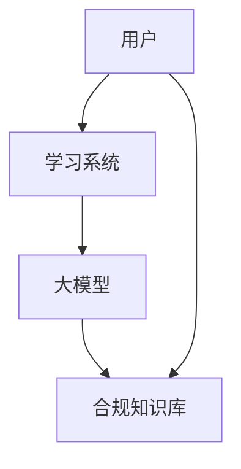
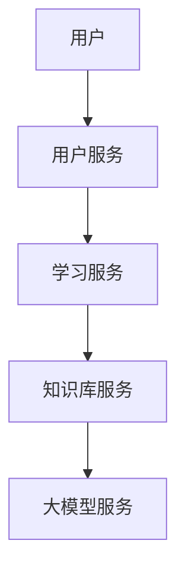

                 


# 开发基于大模型的金融合规培训个性化学习系统

> 关键词：大模型，金融合规，个性化学习，系统架构，算法原理

> 摘要：本文详细探讨了开发基于大模型的金融合规培训个性化学习系统的背景、核心概念、算法原理、系统架构、实现案例及最佳实践。通过系统的分析与设计，结合实际案例，展示了如何利用大模型技术实现金融合规培训的个性化学习，提升学习效果和效率。

---

## 第一部分：开发背景与系统目标

### 第1章：问题背景与系统目标

#### 1.1 问题背景

随着金融行业的快速发展，合规性要求日益严格。金融机构需要员工接受持续的合规培训，以确保其行为符合相关法律法规。然而，传统的合规培训存在以下问题：

- **内容同质化**：传统培训课程通常是标准化的，无法满足不同员工的个性化学习需求。
- **学习效率低**：员工可能需要反复学习某些内容，但缺乏智能化的指导。
- **反馈滞后**：传统的评估方式通常在培训结束后进行，无法及时提供反馈以优化学习过程。

大模型技术的出现，为解决这些问题提供了新的可能性。通过大模型的强大能力，可以实现个性化的学习路径规划、实时的学习反馈和智能化的内容推荐。

#### 1.2 问题描述

金融合规培训的个性化学习需求主要体现在以下几个方面：

1. **个性化学习路径**：根据员工的知识水平和学习风格，制定个性化的学习计划。
2. **智能化内容推荐**：基于员工的学习进度和兴趣，推荐相关的内容。
3. **实时反馈与优化**：通过实时分析学习数据，提供反馈并优化学习过程。

#### 1.3 系统目标

开发一个基于大模型的金融合规培训个性化学习系统，旨在实现以下目标：

1. **提升学习效率**：通过个性化学习路径和内容推荐，减少冗余学习，提升效率。
2. **增强学习效果**：通过实时反馈和优化，确保学习内容的有效性。
3. **降低合规风险**：通过精准的知识传递，减少员工因知识不足导致的合规风险。

---

## 第2章：核心概念与联系

### 2.1 大模型在金融合规中的应用

大模型（如GPT系列）具有强大的自然语言处理能力，能够理解和生成人类语言。在金融合规培训中的应用主要体现在以下几个方面：

- **知识库构建**：利用大模型对大量金融法规和案例进行学习，构建专业的合规知识库。
- **内容生成**：根据员工的学习需求，生成个性化的学习材料。
- **对话交互**：通过大模型提供实时的合规咨询和指导。

### 2.2 核心概念原理

个性化学习系统的核心在于算法的设计和实现。大模型通过以下方式实现个性化学习：

- **用户特征提取**：通过分析用户的学习行为、兴趣和知识水平，提取用户特征。
- **内容推荐算法**：基于用户特征，推荐相关的内容。
- **学习效果评估**：通过实时数据分析，评估学习效果，并调整学习计划。

### 2.3 实体关系图

以下是系统的实体关系图：



---

## 第3章：算法原理讲解

### 3.1 大模型的训练流程

大模型的训练分为三个阶段：

1. **预训练阶段**：利用大规模的数据进行无监督学习，提取语言模型的参数。
2. **微调阶段**：在预训练的基础上，针对金融合规领域进行微调，优化模型的领域适应性。
3. **推理阶段**：根据用户输入，生成相应的学习内容或反馈。

### 3.2 个性化学习算法

个性化学习算法主要包括以下步骤：

1. **用户特征提取**：通过分析用户的学习记录、兴趣和知识水平，提取用户特征。
2. **内容推荐**：基于用户特征，利用推荐算法（如协同过滤、基于内容的推荐）推荐学习内容。
3. **效果评估**：通过实时数据分析，评估学习效果，并优化学习计划。

### 3.3 数学模型与公式

#### 3.3.1 损失函数

在训练过程中，通常使用交叉熵损失函数：

$$ L = -\sum_{i=1}^{n} y_i \log(p_i) $$

其中，\( y_i \) 是真实标签，\( p_i \) 是模型预测的概率。

#### 3.3.2 优化器

常用Adam优化器，其更新规则如下：

$$ \theta_{t+1} = \theta_t - \eta \frac{\rho \nabla L}{1 - \beta_2 + \epsilon} $$

其中，\( \eta \) 是学习率，\( \rho \) 是动量因子，\( \beta_2 \) 是自适应矩估计参数，\( \epsilon \) 是防止除零的小量。

---

## 第4章：系统分析与架构设计

### 4.1 系统功能设计

系统的功能模块包括：

- **用户管理**：管理用户信息，包括注册、登录等。
- **学习管理**：包括学习计划制定、内容推荐、学习记录等。
- **知识库管理**：管理金融合规相关的知识库。
- **模型管理**：包括大模型的训练、微调和部署。

### 4.2 系统架构设计

系统架构采用分层设计：

- **数据层**：存储用户数据、学习记录和知识库。
- **业务逻辑层**：处理用户请求，调用相应的服务。
- **服务层**：包括用户服务、学习服务、知识库服务等。
- **表现层**：包括Web界面和API接口。

### 4.3 接口设计

以下是系统的接口设计：



---

## 第5章：项目实战

### 5.1 环境搭建

开发环境包括：

- **编程语言**：Python 3.8+
- **框架**：TensorFlow或PyTorch
- **大模型库**：Hugging Face的Transformers库

### 5.2 核心代码实现

以下是核心代码示例：

```python
from transformers import AutoTokenizer, AutoModelForCausalLM

tokenizer = AutoTokenizer.from_pretrained("gpt2")
model = AutoModelForCausalLM.from_pretrained("gpt2")

def generate_text(prompt):
    inputs = tokenizer(prompt, return_tensors="pt")
    outputs = model.generate(inputs.input_ids, max_length=50)
    return tokenizer.decode(outputs[0], skip_special_tokens=True)

print(generate_text("解释金融合规中的"))
```

### 5.3 案例分析

通过实际案例分析，验证系统的可行性和效果。例如，假设一名员工需要学习反洗钱的相关知识，系统会根据其学习记录推荐相关的内容，并通过大模型生成个性化的解释。

### 5.4 项目小结

本项目通过大模型技术实现了金融合规培训的个性化学习，提高了学习效率和效果。

---

## 第6章：最佳实践与小结

### 6.1 最佳实践

- **数据质量**：确保知识库的数据质量和多样性。
- **模型优化**：根据具体需求，对大模型进行微调和优化。
- **用户体验**：注重用户界面的设计，提升用户体验。

### 6.2 小结

本文详细探讨了开发基于大模型的金融合规培训个性化学习系统的各个方面，包括背景、核心概念、算法原理、系统架构和项目实战。通过实际案例分析，验证了系统的可行性和效果。

### 6.3 注意事项

- **数据隐私**：确保用户数据和知识库的安全性。
- **模型性能**：根据实际需求，选择合适的模型和参数。

### 6.4 拓展阅读

建议读者进一步阅读以下内容：

- 大模型的优化与调优
- 个性化学习的前沿技术
- 金融合规领域的最新法规

---

## 作者

作者：AI天才研究院/AI Genius Institute  
联系邮箱：contact@aicampus.com  
技术博客：https://www.aicampus.com/

---

希望这篇文章能够为您提供有价值的信息和启发！

