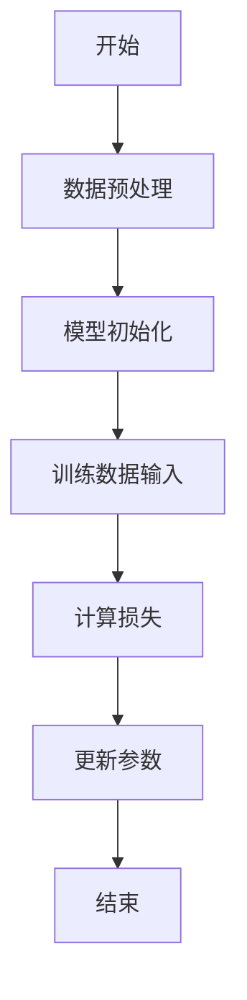
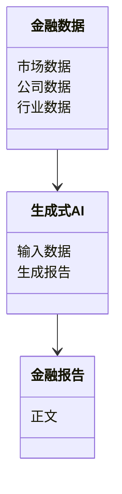
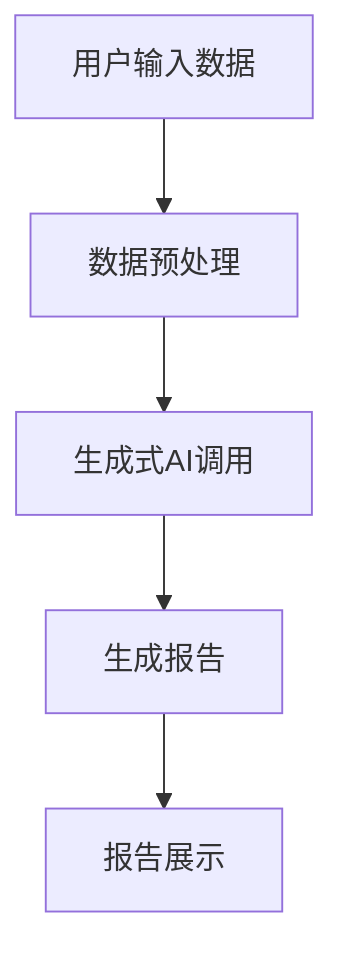
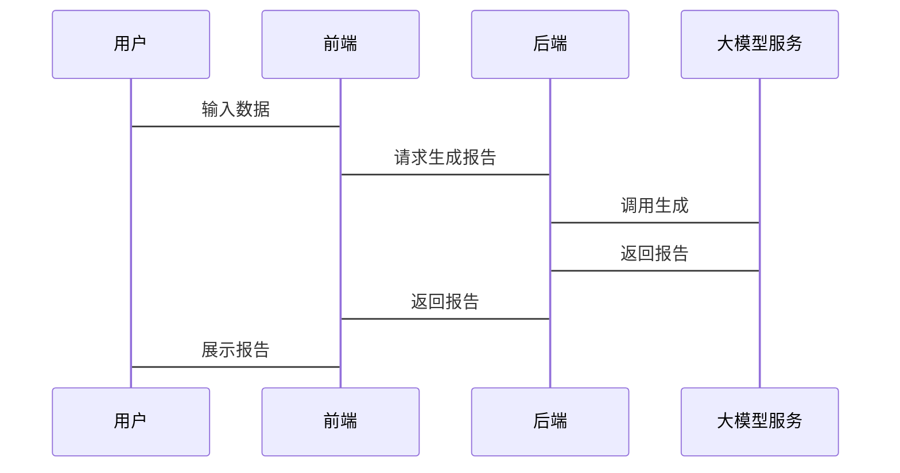

                 


```markdown
# 开发基于大模型的金融研究报告自动生成器

> 关键词：大模型，生成式AI，金融报告，自然语言处理，机器学习，深度学习

> 摘要：本文详细介绍了开发基于大模型的金融研究报告自动生成器的背景、技术原理、系统架构设计和实现方案。通过结合生成式AI和金融领域的专业知识，提出了一种高效、准确的金融报告自动生成方法，为金融行业的自动化研究报告提供了新的思路和解决方案。

---

# 第1章: 问题背景与需求分析

## 1.1 问题背景
### 1.1.1 金融研究报告的现状
随着金融市场的快速发展，金融机构对研究报告的需求日益增加。传统的研究报告依赖人工撰写，效率低、成本高且难以满足大量需求。

### 1.1.2 传统金融研究报告的痛点
- 人工撰写耗时长，难以快速响应市场变化。
- 研究报告的质量依赖于分析师的经验，存在主观性和不一致性。
- 数据量大且复杂，人工处理效率低。

### 1.1.3 大模型技术的引入与优势
大模型技术，尤其是生成式AI，能够通过自然语言处理技术快速生成高质量的文本内容。结合金融领域的专业知识，可以实现研究报告的自动化生成。

## 1.2 问题描述
### 1.2.1 金融研究报告自动生成的目标
开发一个基于大模型的金融研究报告自动生成器，能够根据输入的金融数据和指标，自动生成结构完整、内容准确的金融研究报告。

### 1.2.2 系统需求分析
- 输入：金融市场数据、公司财务报表、行业分析报告等。
- 输出：结构化金融研究报告，包括市场分析、行业趋势、公司分析等部分。

### 1.2.3 边界与外延
系统仅负责生成研究报告的正文部分，不包括图表和数据可视化部分。

## 1.3 问题解决思路
### 1.3.1 大模型在金融领域的应用潜力
生成式AI能够快速处理大量数据，生成高质量的文本内容，适用于金融分析、报告撰写等场景。

### 1.3.2 自动生成研究报告的技术路线
- 数据预处理：清洗和结构化金融数据。
- 模型训练：基于金融领域的数据训练大模型。
- 推理生成：根据输入生成研究报告。

### 1.3.3 系统架构初步设想
- 前端：用户界面，输入数据并展示生成的报告。
- 后端：处理数据和调用大模型进行生成。
- 大模型服务：负责文本生成任务。

## 1.4 核心概念与联系
### 1.4.1 核心概念原理
- 生成式AI：通过概率模型生成文本内容。
- 金融报告：结构化的金融分析文本。

### 1.4.2 核心概念属性特征对比表格
| 属性 | 生成式AI | 金融报告 |
|------|---------|----------|
| 输入 | 文本/数据 | 金融市场数据 |
| 输出 | 文本 | 结构化报告 |
| 应用 | 自动生成内容 | 快速生成研究报告 |

### 1.4.3 ER实体关系图架构的 Mermaid 流程图
```mermaid
er
    entity(金融数据) --[输入]-> entity(生成式AI)
    entity(生成式AI) --[输出]-> entity(金融报告)
```

---

# 第2章: 基于大模型的生成式AI原理

## 2.1 生成式AI的核心原理
### 2.1.1 变量关系与概率论基础
生成式AI通过概率模型预测下一个词的概率分布，从而生成文本内容。

### 2.1.2 损失函数与优化目标
- 损失函数：交叉熵损失函数。
- 优化目标：最小化损失函数，使生成的文本与训练数据分布一致。

### 2.1.3 生成策略与采样方法
- 生成策略：贪心采样、随机采样、束搜索。
- 采样方法：基于概率分布的采样。

## 2.2 大模型的训练与推理流程
### 2.2.1 预训练过程
- 数据清洗与预处理。
- 模型初始化与参数优化。

### 2.2.2 微调过程
- 根据金融领域数据进行微调，提升模型在金融领域的生成能力。

### 2.2.3 推理过程
- 输入金融数据，生成研究报告。

## 2.3 生成式AI的数学模型与公式
### 2.3.1 概率模型公式
$$P(y|x) = \frac{P(x,y)}{P(x)}$$

### 2.3.2 损失函数公式
$$\text{损失} = -\sum_{i=1}^{n} \log P(y_i|x)$$

### 2.3.3 生成策略公式
$$P(y|x) = \text{softmax}(Wx + b)$$

## 2.4 生成式AI的算法实现
### 2.4.1 算法流程图的 Mermaid 绘制


### 2.4.2 Python源代码实现
```python
import torch
import torch.nn as nn

class Generator(nn.Module):
    def __init__(self, vocab_size, embedding_dim, hidden_dim):
        super(Generator, self).__init__()
        self.embedding = nn.Embedding(vocab_size, embedding_dim)
        self.rnn = nn.RNN(embedding_dim, hidden_dim)
        self.fc = nn.Linear(hidden_dim, vocab_size)

    def forward(self, input, hidden):
        embedded = self.embedding(input)
        output, hidden = self.rnn(embedded, hidden)
        output = self.fc(output)
        return output, hidden

# 示例训练代码
vocab_size = 10000
embedding_dim = 256
hidden_dim = 128

generator = Generator(vocab_size, embedding_dim, hidden_dim)
optimizer = torch.optim.Adam(generator.parameters(), lr=0.001)
criterion = nn.CrossEntropyLoss()

for epoch in range(num_epochs):
    for batch in data_loader:
        outputs, _ = generator(batch)
        loss = criterion(outputs, batch)
        optimizer.zero_grad()
        loss.backward()
        optimizer.step()
```

### 2.4.3 代码解读与分析
- `Generator`类：定义生成模型，包含嵌入层、循环层和全连接层。
- 训练过程：通过反向传播和优化器更新参数，最小化损失函数。

---

# 第3章: 金融研究报告生成的系统分析

## 3.1 项目背景与目标
### 3.1.1 项目背景
随着金融市场的数据化和智能化，金融机构对自动化研究报告的需求日益增加。

### 3.1.2 项目目标
开发一个基于大模型的金融研究报告自动生成器，实现高效、准确的报告生成。

### 3.1.3 项目范围
系统仅负责生成报告正文部分，不包括数据收集和图表生成。

## 3.2 系统功能设计
### 3.2.1 领域模型的 Mermaid 类图


### 3.2.2 功能模块划分
- 数据输入模块：接收金融市场数据。
- 模型生成模块：调用大模型生成报告。
- 报告输出模块：展示生成的报告。

### 3.2.3 功能流程图的 Mermaid 绘制


## 3.3 系统架构设计
### 3.3.1 分层架构图的 Mermaid 绘制


### 3.3.2 组件交互关系
- 前端：接收用户输入，调用后端服务。
- 后端：处理数据，调用大模型生成报告。
- 大模型服务：负责文本生成任务。

### 3.3.3 系统接口设计
- 输入接口：接收金融市场数据。
- 输出接口：返回生成的报告。

## 3.4 系统交互
### 3.4.1 交互流程图的 Mermaid 绘制


---

# 第4章: 项目实战

## 4.1 环境安装
### 4.1.1 安装Python
```bash
python --version
```

### 4.1.2 安装相关库
```bash
pip install torch numpy pandas
```

## 4.2 系统核心实现
### 4.2.1 核心代码示例
```python
import torch
import torch.nn as nn
import torch.optim as optim

class FinancialReportGenerator(nn.Module):
    def __init__(self, input_dim, hidden_dim, output_dim):
        super(FinancialReportGenerator, self).__init__()
        self.lstm = nn.LSTM(input_dim, hidden_dim, batch_first=True)
        self.fc = nn.Linear(hidden_dim, output_dim)

    def forward(self, x):
        out, _ = self.lstm(x)
        out = self.fc(out)
        return out

# 示例训练代码
input_dim = 100
hidden_dim = 128
output_dim = 5000

model = FinancialReportGenerator(input_dim, hidden_dim, output_dim)
criterion = nn.CrossEntropyLoss()
optimizer = optim.Adam(model.parameters(), lr=0.001)

for epoch in range(100):
    for batch in data_loader:
        outputs = model(batch)
        loss = criterion(outputs, labels)
        optimizer.zero_grad()
        loss.backward()
        optimizer.step()
```

### 4.2.2 代码解读与分析
- `FinancialReportGenerator`类：定义生成模型，包含LSTM层和全连接层。
- 训练过程：通过反向传播和优化器更新参数，最小化损失函数。

## 4.3 实际案例分析
### 4.3.1 案例描述
假设输入为某公司的财务数据，生成相应的行业分析报告。

### 4.3.2 详细讲解
- 数据预处理：清洗和结构化财务数据。
- 模型调用：调用生成式AI生成报告。
- 报告展示：展示生成的报告内容。

---

# 第5章: 最佳实践与总结

## 5.1 小结
基于大模型的金融研究报告自动生成器能够显著提高报告生成效率，降低成本。

## 5.2 注意事项
- 数据质量对生成结果的影响。
- 模型的可解释性问题。

## 5.3 拓展阅读
推荐阅读相关领域的论文和书籍，深入理解生成式AI和金融分析的结合。

---

# 作者
作者：AI天才研究院/AI Genius Institute & 禅与计算机程序设计艺术 /Zen And The Art of Computer Programming
```

