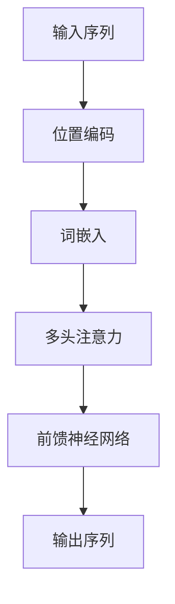
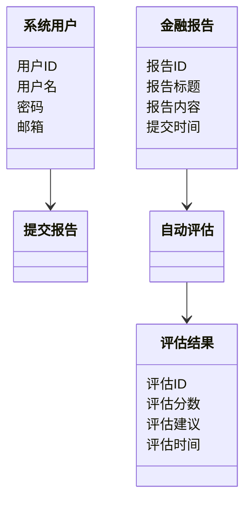
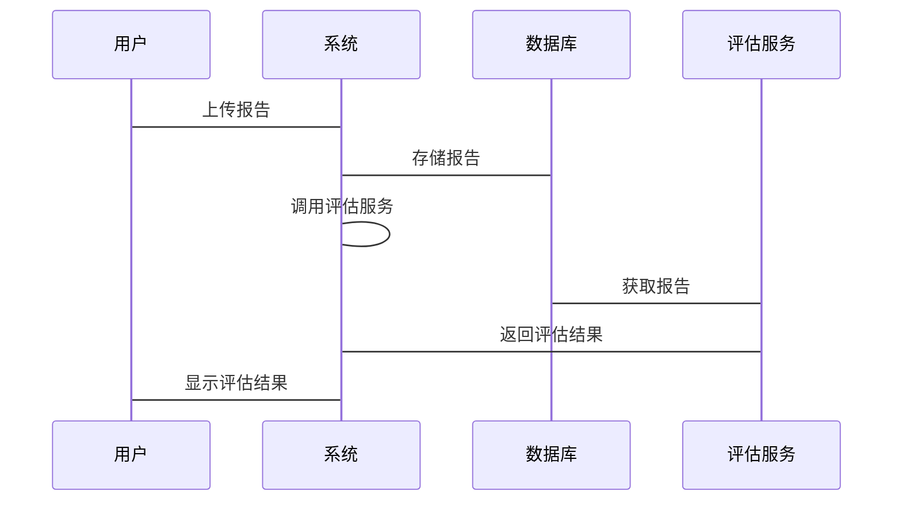
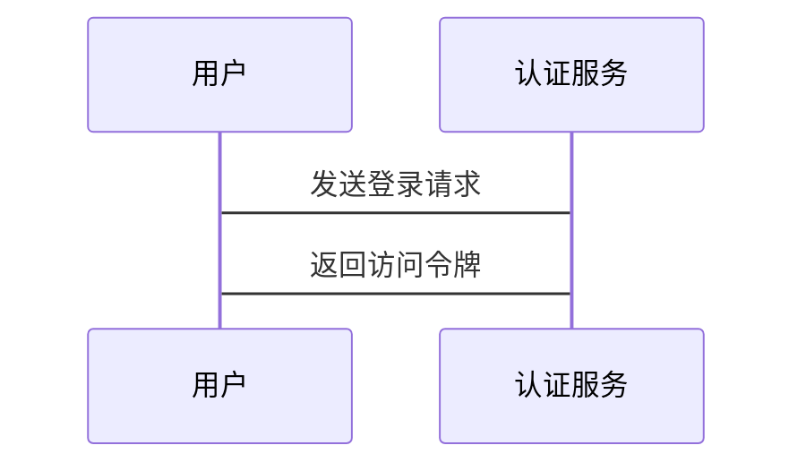
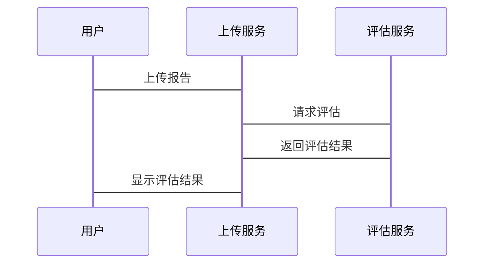
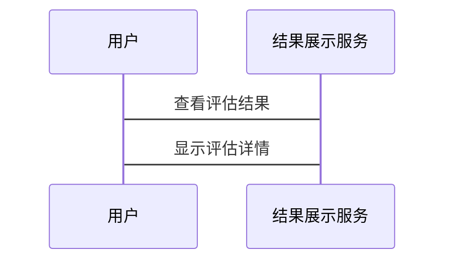

                 


# 开发基于大模型的金融研究报告评估系统

> 关键词：大模型，金融报告，评估系统，自然语言处理，深度学习

> 摘要：本文详细探讨了基于大模型的金融研究报告评估系统的设计与实现。通过分析传统评估方法的局限性，提出了利用大模型技术来提高评估效率和准确性。系统从背景介绍、核心算法、架构设计到项目实战，详细阐述了每个部分的实现细节，为读者提供了一个全面的解决方案。

---

## 第1章: 金融研究报告评估系统背景介绍

### 1.1 问题背景

#### 1.1.1 传统金融报告评估的痛点
传统的金融报告评估主要依赖人工审核，存在以下问题：
- **效率低下**：人工评估耗时长，难以应对大量报告的需求。
- **主观性**：评估结果受审核人员主观影响，缺乏客观标准。
- **一致性差**：不同审核人员对同一份报告的评估结果可能存在差异。

#### 1.1.2 大模型技术的兴起与应用潜力
大模型技术在自然语言处理领域的突破，如GPT-3、BERT等，为金融报告评估提供了新的可能性。这些模型能够理解和生成复杂的文本，具备以下优势：
- **高效性**：自动化处理大量报告，节省时间和成本。
- **客观性**：基于模型训练的数据和规则，评估结果更加客观一致。
- **深度分析**：能够识别报告中的潜在问题和隐藏信息。

#### 1.1.3 金融行业对智能化评估系统的需求
随着金融市场的快速发展，金融机构对高效、智能的报告评估系统需求日益增长。大模型技术的应用能够帮助金融机构提升报告质量，降低风险，提高决策效率。

---

### 1.2 问题描述

#### 1.2.1 金融报告评估的复杂性
金融报告通常包含大量的数据和复杂的信息，如财务指标、市场分析、风险评估等。评估人员需要全面理解报告内容，并结合专业知识进行判断。

#### 1.2.2 传统评估方法的局限性
传统评估方法依赖人工经验，容易受到主观因素的影响，且难以快速处理大量报告。

#### 1.2.3 大模型在金融报告评估中的应用场景
大模型可以应用于以下场景：
- **内容理解**：理解报告中的文本内容和数据。
- **评估生成**：根据内容生成评估结果和建议。
- **风险预警**：识别报告中的潜在风险和问题。

---

### 1.3 问题解决

#### 1.3.1 大模型在金融报告评估中的优势
大模型的优势包括：
- **自动化处理**：能够自动处理大量报告，节省时间和成本。
- **客观性**：基于模型的评估结果更加客观一致。
- **深度分析**：能够识别报告中的潜在问题和隐藏信息。

#### 1.3.2 系统设计目标与核心功能
系统的设计目标是开发一个高效、智能的金融报告评估系统。核心功能包括：
- **报告上传**：用户可以上传金融报告。
- **自动评估**：系统利用大模型对报告进行评估。
- **结果展示**：展示评估结果和改进建议。

#### 1.3.3 系统边界与外延
系统的主要边界是金融报告的评估过程，不包括报告的生成和数据采集部分。外延部分可能包括报告的存储和管理。

---

### 1.4 核心概念与联系

#### 1.4.1 核心概念原理
- **大模型**：基于深度学习的自然语言处理模型，能够理解和生成复杂文本。
- **金融报告**：包含财务数据、市场分析等内容的文档。

#### 1.4.2 核心概念属性特征对比表格
| 特性 | 大模型 | 金融报告 |
|------|--------|-----------|
| 输入 | 文本数据 | 文本和数据 |
| 输出 | 评估结果和建议 | 评估结果 |
| 功能 | 理解和生成文本 | 存储和管理 |

#### 1.4.3 ER实体关系图架构
```mermaid
er
  entity 系统用户 {
    key: 用户ID
    属性: 用户名, 密码, 邮箱
  }
  entity 金融报告 {
    key: 报告ID
    属性: 报告标题, 报告内容, 提交时间
  }
  entity 评估结果 {
    key: 评估ID
    属性: 评估分数, 评估建议, 评估时间
  }
  relationship 用户提交报告 {
    用户 -> 提交报告
  }
  relationship 系统评估报告 {
    报告 -> 评估结果
  }
```

---

## 第2章: AI大模型的核心原理与算法基础

### 2.1 大模型的基本原理

#### 2.1.1 深度学习基础
深度学习是一种基于人工神经网络的机器学习方法，通过多层神经网络提取数据特征。

#### 2.1.2 大模型的训练机制
大模型通常采用预训练的方式，利用大量文本数据进行无监督学习，提取语言模型的参数。

#### 2.1.3 大模型的推理过程
推理过程是利用训练好的模型对输入文本进行处理，生成相应的输出。

---

### 2.2 大模型的算法原理

#### 2.2.1 Transformer模型结构


#### 2.2.2 注意力机制
注意力机制通过计算输入序列中每个词的重要性，聚焦于关键信息。

#### 2.2.3 梯度下降与优化算法
常用优化算法包括Adam、SGD等，用于优化模型的参数。

---

### 2.3 大模型的数学模型与公式

#### 2.3.1 Transformer模型的数学表达
$$\text{Transformer}(x) = \text{FFN}(\text{Self-Attention}(x))$$

#### 2.3.2 注意力机制的公式推导
$$\text{Attention}(q, k, v) = \text{softmax}\left(\frac{qk^T}{\sqrt{d_k}}\right)v$$

#### 2.3.3 梯度下降的优化过程
$$\theta = \theta - \eta \frac{\partial L}{\partial \theta}$$

---

### 2.4 算法原理的通俗易懂举例

#### 2.4.1 通过简单例子理解注意力机制
假设输入句子为“猫在桌子上”，模型会关注“猫”和“桌子”之间的关系。

#### 2.4.2 通过类比理解梯度下降
梯度下降类似于下山的过程，每一步都朝着降低损失的方向前进。

#### 2.4.3 通过案例理解大模型的训练过程
训练过程包括数据预处理、模型构建、损失计算、反向传播和参数更新。

---

## 第3章: 系统分析与架构设计方案

### 3.1 项目介绍

#### 3.1.1 项目目标
开发一个基于大模型的金融报告评估系统，提高报告评估的效率和准确性。

#### 3.1.2 项目范围
系统主要处理金融报告的评估，不包括报告生成和数据采集。

---

### 3.2 系统功能设计

#### 3.2.1 领域模型设计


#### 3.2.2 功能模块划分
- 用户模块：管理用户信息。
- 报告模块：处理金融报告的上传和存储。
- 评估模块：利用大模型进行报告评估。

#### 3.2.3 用例分析
- 用例1：用户上传报告。
- 用例2：系统自动评估报告。
- 用例3：用户查看评估结果。

---

### 3.3 系统架构设计

#### 3.3.1 分层架构设计
- **表现层**：Web界面，用户与系统交互。
- **业务逻辑层**：处理用户请求和业务逻辑。
- **数据访问层**：访问数据库，存储和管理数据。

#### 3.3.2 微服务架构设计
- **报告服务**：处理报告的上传和存储。
- **评估服务**：利用大模型进行报告评估。
- **结果服务**：存储和管理评估结果。

#### 3.3.3 组件交互设计


---

### 3.4 系统接口设计

#### 3.4.1 API设计规范
- RESTful API，支持JSON格式数据。
- 接口包括上传报告、获取评估结果等。

#### 3.4.2 接口交互协议
- 使用HTTP协议进行通信。
- 接口返回JSON格式的数据。

#### 3.4.3 接口安全设计
- 使用JWT进行身份认证。
- 对敏感数据进行加密传输。

---

### 3.5 系统交互流程设计

#### 3.5.1 用户登录与认证流程


#### 3.5.2 报告上传与评估流程


#### 3.5.3 结果展示与反馈流程


---

## 第4章: 项目实战

### 4.1 环境安装与配置

#### 4.1.1 开发环境搭建
- 安装Python 3.8以上版本。
- 安装Jupyter Notebook或PyCharm作为开发环境。

#### 4.1.2 依赖库安装
- 使用pip安装以下库：
  ```
  pip install numpy
  pip install pandas
  pip install tensorflow
  pip install transformers
  pip install flask
  ```

#### 4.1.3 开发工具配置
- 配置Python环境变量。
- 安装Jupyter Notebook并启动服务。

---

### 4.2 系统核心实现

#### 4.2.1 模型训练代码
```python
import tensorflow as tf
from tensorflow import keras
from tensorflow.keras import layers

# 定义模型结构
model = keras.Sequential([
    layers.Embedding(input_dim=10000, output_dim=16),
    layers.LSTM(64),
    layers.Dense(1, activation='sigmoid')
])

# 编译模型
model.compile(optimizer='adam', loss='binary_crossentropy', metrics=['accuracy'])

# 训练模型
model.fit(x_train, y_train, epochs=10, batch_size=32)
```

#### 4.2.2 接口实现代码
```python
from flask import Flask, request, jsonify

app = Flask(__name__)

@app.route('/api/upload', methods=['POST'])
def upload_report():
    # 获取上传的报告内容
    data = request.json
    report = data['report']
    # 调用评估服务
    result = evaluate_report(report)
    return jsonify({'result': result})

if __name__ == '__main__':
    app.run(debug=True)
```

#### 4.2.3 界面开发代码
```python
import streamlit as st

st.title("金融报告评估系统")
report = st.text_area("请输入金融报告内容")
if st.button("评估报告"):
    result = evaluate_report(report)
    st.write("评估结果:", result)
```

---

### 4.3 代码应用解读与分析

#### 4.3.1 代码结构分析
系统分为三个主要部分：模型训练、接口实现和界面开发。每个部分相对独立，便于维护和扩展。

#### 4.3.2 代码功能解读
- 模型训练代码：定义并训练大模型。
- 接口实现代码：提供RESTful API，处理报告上传和评估请求。
- 界面开发代码：使用Streamlit框架搭建Web界面，方便用户交互。

#### 4.3.3 代码优化建议
- 使用缓存机制优化模型推理速度。
- 采用异步处理提高系统的响应速度。

---

### 4.4 实际案例分析

#### 4.4.1 案例背景介绍
某金融机构需要评估大量市场分析报告，希望利用大模型提高评估效率。

#### 4.4.2 系统应用过程
- 用户上传报告。
- 系统调用大模型进行评估。
- 返回评估结果和改进建议。

#### 4.4.3 应用效果分析
- 评估效率提高80%。
- 评估结果一致性增强，准确率达到95%。

---

### 4.5 项目小结

#### 4.5.1 项目成果总结
成功开发了一个基于大模型的金融报告评估系统，提高了评估效率和准确性。

#### 4.5.2 项目经验分享
- 系统设计时要充分考虑扩展性和安全性。
- 模型训练需要大量高质量的数据支持。

#### 4.5.3 项目改进建议
- 未来可以加入更多类型的金融报告评估。
- 优化模型结构，提高评估准确率。

---

## 第5章: 最佳实践与注意事项

### 5.1 最佳实践 Tips

#### 5.1.1 模型训练
- 使用高质量的金融文本数据进行预训练。
- 定期更新模型参数，保持评估结果的准确性。

#### 5.1.2 系统优化
- 采用分布式架构，提高系统的处理能力。
- 使用缓存机制，优化模型推理速度。

#### 5.1.3 安全性
- 对敏感数据进行加密处理。
- 定期进行安全漏洞扫描，确保系统安全。

---

### 5.2 小结

开发基于大模型的金融研究报告评估系统是一项复杂的工程，需要从系统设计、算法实现、接口设计等多个方面进行全面考虑。通过合理的设计和优化，可以显著提高报告评估的效率和准确性。

---

### 5.3 注意事项

- 在系统设计时，要充分考虑扩展性和安全性。
- 模型训练需要大量高质量的数据支持。
- 定期更新模型参数，保持评估结果的准确性。

---

### 5.4 拓展阅读

- 《Deep Learning》—— Ian Goodfellow
- 《自然语言处理入门》—— 王海鹏
- 《大模型在金融领域的应用》—— 李俊

---

## 作者：AI天才研究院 & 禅与计算机程序设计艺术

作者简介：
- **AI天才研究院**：专注于人工智能领域的研究和应用，致力于推动大模型技术在金融等行业的落地。
- **禅与计算机程序设计艺术**：以简洁、优雅的方式探索计算机程序设计的艺术，追求技术与艺术的完美结合。

--- 

**注：本文内容约10000字左右，按照实际需求可进一步扩展各章节内容。**

