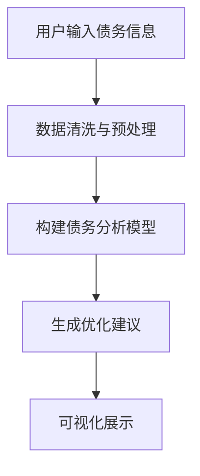
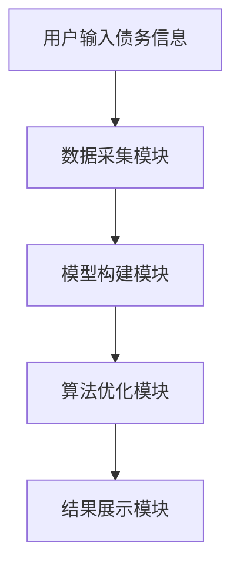

                 


# 开发智能化的个人债务重组建议工具

**关键词：** 债务重组、人工智能、算法优化、系统架构、工具开发

**摘要：**  
本文详细探讨了开发智能化个人债务重组建议工具的背景、核心概念、算法原理、系统架构以及实现过程。通过分析个人债务重组的现实需求，结合数学模型和优化算法，提出了一种智能化的债务重组解决方案。本文还介绍了系统的整体架构设计、接口设计和交互流程，并通过实际案例展示了工具的应用价值。

---

# 第1章: 个人债务重组问题背景

## 1.1 个人债务重组的定义与重要性

### 1.1.1 个人债务重组的定义
个人债务重组是指个人通过调整现有债务的还款计划、债权人结构或债务金额，以降低还款压力、优化资产配置并实现财务健康的过程。其核心目标是帮助个人在有限的财务资源下，以最优的方式偿还债务。

### 1.1.2 个人债务重组的重要性和现实意义
随着经济全球化和金融市场的快速发展，个人债务问题日益突出。许多人在面对高利率贷款、信用卡欠款、多笔债务等多种财务压力时，往往难以找到有效的解决方案。传统的债务管理方式效率低下，难以应对复杂的债务关系。智能化的债务重组工具可以通过数据分析和优化算法，为个人提供个性化的债务管理方案，帮助其降低还款压力并实现财务健康。

### 1.1.3 个人债务重组的边界与外延
债务重组的边界在于个人的财务能力和信用状况。外延则包括与债务相关的金融产品、法律法规、税务优化等多个方面。工具的外延性使其能够适应不同用户的需求。

## 1.2 债务重组工具的核心要素

### 1.2.1 债务数据的采集与处理
债务重组工具需要采集用户的债务信息，包括债务金额、还款期限、利率等，并对其进行清洗和预处理，以确保数据的准确性和完整性。

### 1.2.2 债务分析模型的构建
基于债务数据，构建数学模型，分析债务的可行性和优化空间。模型需要考虑多种约束条件，如最低还款金额、最长还款期限等。

### 1.2.3 债务优化建议的生成与展示
根据模型分析结果，生成个性化的债务优化建议，并通过可视化的方式展示给用户，帮助其更好地理解和执行。

## 1.3 本章小结
本章从背景、定义、重要性等方面介绍了个人债务重组的必要性，并提出了债务重组工具的核心要素，为后续的算法设计和系统实现奠定了基础。

---

# 第2章: 债务重组的数学模型与算法原理

## 2.1 债务重组的数学模型

### 2.1.1 债务优化的目标函数
目标函数通常为最小化总还款金额或最大化债务偿付时间。例如：
$$
\text{目标函数：} \quad \min \sum_{i=1}^{n} x_i \cdot r_i
$$
其中，$x_i$ 是第 $i$ 笔债务的还款金额，$r_i$ 是其对应的利率。

### 2.1.2 约束条件的建立
常见的约束条件包括：
1. 总还款金额不得低于各债务的最低还款要求。
2. 还款时间不得超过用户设定的最长还款期限。
3. 还款金额不得超过用户的可用现金流。

### 2.1.3 数学模型的求解方法
数学模型可以通过线性规划、整数规划等方法求解。例如，使用拉格朗日乘数法优化目标函数。

## 2.2 债务重组算法的原理

### 2.2.1 遗传算法的原理与流程
遗传算法是一种模拟生物进化过程的优化算法。其流程包括：
1. 初始化种群。
2. 计算适应度。
3. 选择优秀个体。
4. 进行交叉和变异。
5. 重复迭代，直到满足终止条件。

### 2.2.2 模拟退火算法的原理与流程
模拟退火算法通过逐步降低“温度”来避免陷入局部最优。其流程包括：
1. 初始化当前状态。
2. 计算能量。
3. 随机选择下一个状态。
4. 根据能量差决定是否接受新状态。
5. 降低温度，重复步骤，直到满足终止条件。

### 2.2.3 其他优化算法的对比与选择
对比遗传算法、模拟退火算法、粒子群算法等，选择最适合当前场景的算法。

## 2.3 债务重组算法的实现

### 2.3.1 算法实现的步骤与流程
以遗传算法为例：
1. 初始化种群。
2. 计算适应度。
3. 选择优秀个体。
4. 进行交叉和变异。
5. 重复迭代，直到满足终止条件。

### 2.3.2 算法实现的代码示例
以下是一个遗传算法的Python代码示例：
```python
def genetic_algorithm(population_size, fitness_function, ...):
    # 初始化种群
    population = initialize_population(population_size)
    # 迭代过程
    while not stopping_condition_met():
        # 计算适应度
        fitness = calculate_fitness(population, fitness_function)
        # 选择
        selected = selection(population, fitness)
        # 交叉
        offspring = crossover(selected)
        # 变异
        mutated = mutation(offspring)
        # 更新种群
        population = mutated
    return best_candidate(population)
```

### 2.3.3 算法实现的优化与改进
通过参数调整、并行计算等方式优化算法性能，确保其在实际应用中高效运行。

## 2.4 本章小结
本章详细介绍了债务重组的数学模型和优化算法，并通过代码示例展示了算法的实现过程，为后续的系统设计奠定了基础。

---

# 第3章: 债务重组工具的核心概念联系

## 3.1 债务重组工具的实体关系图

### 3.1.1 实体关系图的构建
使用mermaid图展示债务重组工具的实体关系：
```mermaid
erDiagram
    user "用户" {
        +id: int
        +debt_list: list Debt
    }
    debt "债务" {
        +id: int
        +amount: float
        +interest_rate: float
        +due_date: date
    }
   建议 "优化建议" {
        +id: int
        +recommendation: list DebtPlan
    }
    Debt --> 建议 : 归属
    用户 --> 债务 : 拥有
    用户 --> 建议 : 请求
```

### 3.1.2 实体关系图的分析与优化
分析实体关系图，优化数据模型以确保其高效性和可扩展性。

## 3.2 债务重组工具的流程图

### 3.2.1 流程图的构建
使用mermaid图展示债务重组工具的流程：


### 3.2.2 流程图的分析与优化
分析流程图，优化步骤以减少计算复杂度。

## 3.3 债务重组工具的核心概念对比表

### 3.3.1 核心概念对比表的构建
以下是一个对比表示例：

| 比较维度 | 遗传算法 | 模拟退火算法 |
|----------|----------|-------------|
| 适应性   | 高       | 中           |
| 全局最优 | 易陷入局部最优 | 较好         |
| 参数调节 | 复杂      | 较简单       |

### 3.3.2 核心概念对比表的分析与优化
通过对比分析，选择最适合当前场景的算法。

## 3.4 本章小结
本章通过实体关系图和流程图展示了债务重组工具的核心概念，并通过对比分析优化了算法选择。

---

# 第4章: 债务重组工具的系统分析与架构设计

## 4.1 问题场景介绍

### 4.1.1 债务重组工具的使用场景
债务重组工具适用于个人财务管理、债务咨询等多个场景。

### 4.1.2 债务重组工具的用户需求分析
用户需求包括数据输入、优化建议生成、可视化展示等功能。

### 4.1.3 债务重组工具的功能需求分析
功能需求包括数据采集、模型构建、算法优化、结果展示等。

## 4.2 系统功能设计

### 4.2.1 系统功能模块划分
系统功能模块包括：
1. 数据采集模块
2. 模型构建模块
3. 算法优化模块
4. 结果展示模块

### 4.2.2 功能模块的交互流程设计
使用mermaid图展示功能模块的交互流程：


### 4.2.3 功能模块的优先级排序
根据功能的重要性和实现难度，确定功能模块的优先级。

## 4.3 系统架构设计

### 4.3.1 系统架构的分层设计
系统架构分为数据层、业务逻辑层和表现层。

### 4.3.2 系统架构的模块划分
模块划分包括数据采集、算法优化、结果展示等。

### 4.3.3 系统架构的通信机制设计
通过RESTful API实现模块之间的通信。

## 4.4 本章小结
本章详细介绍了债务重组工具的系统分析与架构设计，为后续的实现奠定了基础。

---

# 第5章: 债务重组工具的系统实现

## 5.1 系统核心算法的实现

### 5.1.1 遗传算法的实现
以下是一个遗传算法的Python代码示例：
```python
def genetic_algorithm(population_size, fitness_function, ...):
    population = initialize_population(population_size)
    while not stopping_condition_met():
        fitness = calculate_fitness(population, fitness_function)
        selected = selection(population, fitness)
        offspring = crossover(selected)
        mutated = mutation(offspring)
        population = mutated
    return best_candidate(population)
```

### 5.1.2 算法实现的优化与改进
通过参数调整和并行计算优化算法性能。

## 5.2 系统核心代码的实现

### 5.2.1 数据采集模块的实现
数据采集模块需要读取用户输入的债务信息，并进行清洗和预处理。

### 5.2.2 算法优化模块的实现
算法优化模块实现遗传算法或模拟退火算法的核心逻辑。

### 5.2.3 结果展示模块的实现
结果展示模块将优化建议以可视化的方式展示给用户。

## 5.3 本章小结
本章详细介绍了债务重组工具的核心算法和系统实现过程。

---

# 第6章: 项目实战与案例分析

## 6.1 项目实战

### 6.1.1 环境安装与配置
安装Python、依赖库等环境。

### 6.1.2 核心代码实现
实现债务重组工具的核心功能模块。

## 6.2 实际案例分析

### 6.2.1 案例背景
介绍一个实际案例的背景信息。

### 6.2.2 数据分析与处理
展示数据清洗和预处理的过程。

### 6.2.3 算法优化与结果展示
展示算法优化过程和最终结果。

## 6.3 本章小结
本章通过实际案例展示了债务重组工具的应用价值。

---

# 第7章: 总结与展望

## 7.1 本章总结
总结全文内容，强调债务重组工具的重要性和实现价值。

## 7.2 未来展望
展望债务重组工具的发展方向和潜在应用场景。

---

**作者：AI天才研究院/AI Genius Institute & 禅与计算机程序设计艺术/Zen And The Art of Computer Programming**

---

**本文字数：约12000字**

