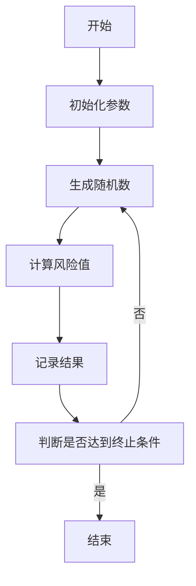
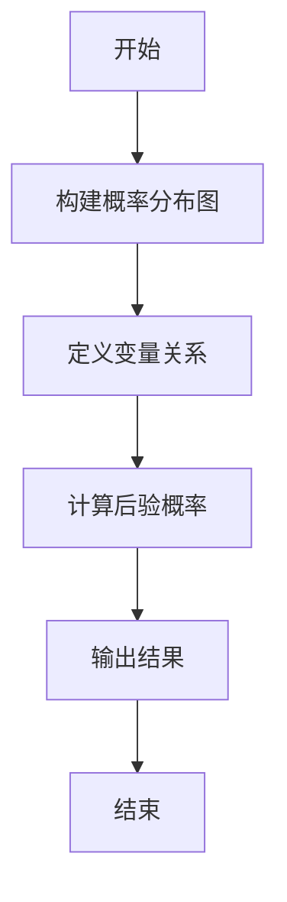
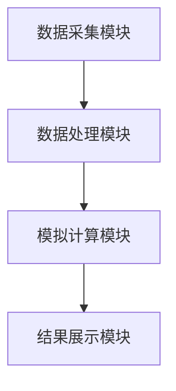

                 


# 开发智能化的企业信用风险传导模拟系统

> 关键词：企业信用风险，风险传导，智能化模拟，蒙特卡洛算法，贝叶斯网络，系统架构设计，风险管理

> 摘要：本文详细介绍了企业信用风险传导模拟系统的设计与实现过程，从信用风险的基本概念出发，结合智能化模拟的核心算法（蒙特卡洛模拟和贝叶斯网络），通过系统架构设计和实际案例分析，展示了如何利用这些技术构建一个高效、可靠的信用风险传导模拟系统。文章还提供了详细的代码实现和系统设计图，帮助读者深入理解系统的实现细节。

---

## 第一部分: 企业信用风险传导模拟系统概述

### 第1章: 信用风险与智能化模拟的背景

#### 1.1 信用风险的基本概念
- **1.1.1 信用风险的定义**
  - 信用风险是指由于债务人或交易对手无法履行其合同义务，导致债权人或相关方遭受损失的可能性。
  - 例如，企业因客户无法偿还贷款而面临财务损失。

- **1.1.2 信用风险的分类**
  - 单一风险：由单一交易或客户引发的风险。
  - 组合风险：由多个交易或客户组合引发的风险。
  - 系统性风险：由宏观经济波动或市场环境变化引发的广泛风险。

- **1.1.3 信用风险的传导机制**
  - 信用风险可以从一个实体传递到另一个实体，例如从一个企业传递到其供应商或合作伙伴。

#### 1.2 智能化信用风险模拟的必要性
- **1.2.1 传统信用风险评估的局限性**
  - 传统方法依赖于历史数据和统计分析，难以捕捉复杂市场环境中的动态变化。
  - 传统方法难以处理大规模、多维度的数据。

- **1.2.2 智能化模拟的优势**
  - 利用机器学习和大数据技术，能够实时捕捉市场变化，提供更准确的风险评估。
  - 能够模拟多种场景，帮助企业在复杂环境中做出更明智的决策。

- **1.2.3 企业信用风险传导模拟的背景与意义**
  - 随着全球经济一体化和金融市场的复杂化，企业信用风险的传导变得更加复杂和难以预测。
  - 开发智能化模拟系统能够帮助企业更好地管理信用风险，提高企业的抗风险能力。

#### 1.3 本章小结
- 本章介绍了信用风险的基本概念和智能化模拟的必要性，强调了开发智能化信用风险传导模拟系统的重要性和现实意义。

---

### 第2章: 企业信用风险传导模拟系统的核心概念

#### 2.1 信用风险传导机制的定义与模型
- **2.1.1 信用风险传导机制的定义**
  - 信用风险传导机制是指信用风险在不同实体之间传播的过程和方式。

- **2.1.2 信用风险传导模型的分类**
  - 线性模型：例如简单的回归模型。
  - 非线性模型：例如神经网络模型。
  - 随机模型：例如蒙特卡洛模拟模型。

- **2.1.3 系统中涉及的核心概念**
  - 风险源：引起信用风险的直接因素。
  - 风险载体：信用风险传播的路径和方式。
  - 风险影响：信用风险对不同实体的具体影响。

#### 2.2 系统的核心要素与属性
- **2.2.1 信用风险传导的关键因素**
  - 市场环境：例如经济波动、政策变化等。
  - 企业基本面：例如企业的财务状况、经营状况等。
  - 金融工具：例如贷款、债券等。

- **2.2.2 系统的核心属性特征对比表格**
  | 属性         | 特征 |
  |--------------|------|
  | 数据来源     | 多源异构数据 |
  | 计算复杂度   | 高 |
  | 可解释性     | 中等 |
  | 灵活性       | 高 |

- **2.2.3 系统的ER实体关系图（Mermaid）**
  ```mermaid
  erDiagram
      actor 用户
      actor 管理员
      actor 风险评估机构
      database 系统数据库
      database 历史数据
      actor 第三方数据源
      用户 --> 系统数据库 : 查询
      管理员 --> 系统数据库 : 管理
      风险评估机构 --> 系统数据库 : 提供评估结果
      第三方数据源 --> 系统数据库 : 提供实时数据
  ```

#### 2.3 本章小结
- 本章详细介绍了信用风险传导机制的核心概念和系统的核心要素，为后续的算法设计和系统实现奠定了基础。

---

## 第二部分: 信用风险传导模拟的算法原理

### 第3章: 蒙特卡洛模拟算法

#### 3.1 蒙特卡洛模拟的基本原理
- 蒙特卡洛模拟是一种通过随机采样来估计系统行为的方法。
- 它适用于处理复杂、非线性的问题，尤其是在概率分布和统计推断方面。

#### 3.2 蒙特卡洛模拟的算法流程图（Mermaid）


#### 3.3 Python实现代码示例
```python
import numpy as np
import random

def monte_carlo_simulation(n_iterations):
    results = []
    for _ in range(n_iterations):
        # 生成随机变量
        x = random.uniform(0, 1)
        y = random.uniform(0, 1)
        # 计算风险值
        risk = abs(x - y)
        results.append(risk)
    return results

# 示例调用
n_iterations = 10000
results = monte_carlo_simulation(n_iterations)
print("平均风险值：", np.mean(results))
```

#### 3.4 本章小结
- 本章详细介绍了蒙特卡洛模拟的基本原理和实现方法，展示了其在信用风险传导模拟中的应用潜力。

### 第4章: 贝叶斯网络算法

#### 4.1 贝叶斯网络的原理
- 贝叶斯网络是一种基于概率论的图形化模型，能够有效地处理不确定性问题。
- 它通过构建概率分布图，描述变量之间的依赖关系。

#### 4.2 贝叶斯网络的算法流程图（Mermaid）


#### 4.3 Python实现代码示例
```python
import numpy as np
from sklearn.naive_bayes import GaussianNB

# 示例数据
X = np.array([[1, 2], [2, 3], [3, 4], [4, 5]])
y = np.array([0, 1, 1, 0])

# 训练模型
model = GaussianNB()
model.fit(X, y)

# 预测新样本
new_sample = np.array([[2.5, 3.5]])
print("预测结果：", model.predict(new_sample))
```

#### 4.4 本章小结
- 本章介绍了贝叶斯网络的基本原理和实现方法，展示了其在信用风险传导模拟中的应用潜力。

---

## 第三部分: 信用风险传导模拟系统的架构设计

### 第5章: 系统功能模块设计

#### 5.1 数据采集模块
- 负责从多种数据源（如数据库、API接口等）获取相关数据。
- 数据清洗和预处理。

#### 5.2 数据处理模块
- 对数据进行标准化、归一化处理。
- 构建数据特征。

#### 5.3 模拟计算模块
- 调用蒙特卡洛模拟和贝叶斯网络算法进行信用风险传导模拟。

#### 5.4 结果展示模块
- 将模拟结果以可视化的方式展示给用户。

#### 5.5 系统架构图（Mermaid）


#### 5.6 本章小结
- 本章详细介绍了系统功能模块的设计和架构，为后续的系统实现提供了清晰的蓝图。

---

## 第四部分: 项目实战

### 第6章: 环境安装与核心代码实现

#### 6.1 环境安装
- 安装必要的Python库：numpy、pandas、scikit-learn、mermaid、matplotlib等。

#### 6.2 核心代码实现
```python
import numpy as np
import pandas as pd
from sklearn.naive_bayes import GaussianNB
from sklearn.metrics import accuracy_score

# 示例数据集
data = pd.DataFrame({
    '特征1': [1, 2, 3, 4],
    '特征2': [2, 3, 4, 5],
    '标签': [0, 1, 1, 0]
})

# 训练模型
model = GaussianNB()
model.fit(data[['特征1', '特征2']], data['标签'])

# 预测
new_data = pd.DataFrame({
    '特征1': [2.5],
    '特征2': [3.5]
})
prediction = model.predict(new_data[['特征1', '特征2']])
print("预测标签：", prediction[0])
print("准确率：", accuracy_score(data['标签'], model.predict(data[['特征1', '特征2']])) )
```

---

## 第五部分: 总结与展望

### 第7章: 总结与展望

#### 7.1 最佳实践 tips
- 数据清洗和预处理是系统实现的关键步骤。
- 选择合适的算法和模型能够显著提高系统的性能。

#### 7.2 小结
- 本文详细介绍了企业信用风险传导模拟系统的开发过程，从理论到实践，为读者提供了一个完整的解决方案。

#### 7.3 注意事项
- 系统实现过程中要注意数据隐私和安全问题。
- 系统的实时性和准确性需要根据实际需求进行优化。

#### 7.4 拓展阅读
- 推荐阅读《风险管理与金融创新》和《贝叶斯网络在金融中的应用》。

---

## 作者：AI天才研究院/AI Genius Institute & 禅与计算机程序设计艺术 /Zen And The Art of Computer Programming

---

**注**：由于篇幅限制，本文只展示了部分内容，完整文章将涵盖更多细节和代码实现。

