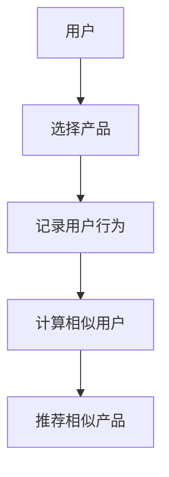
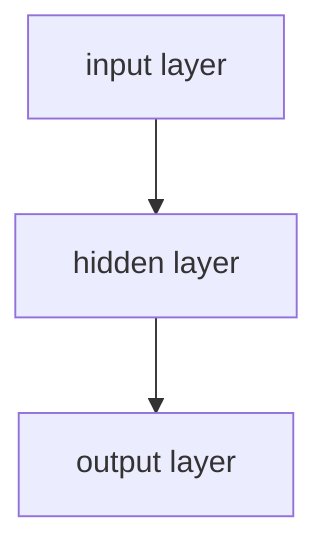
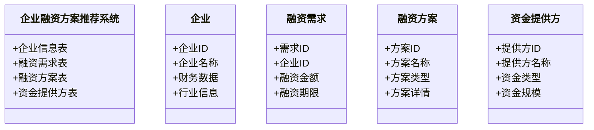
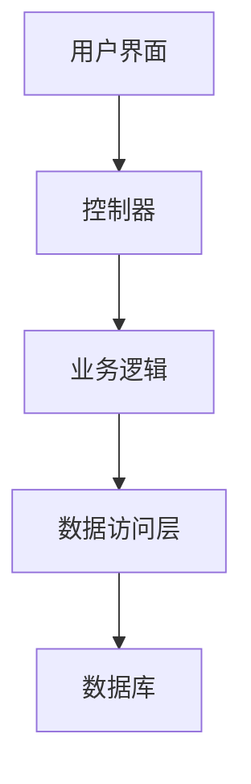
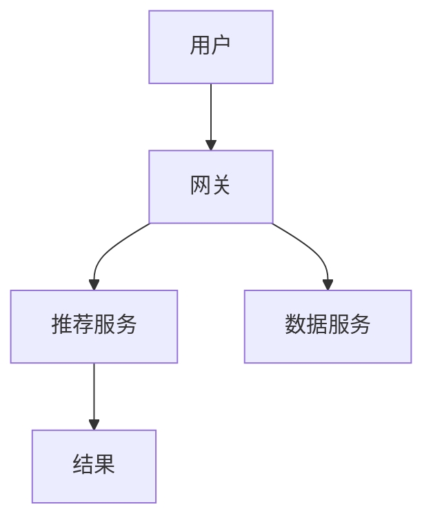
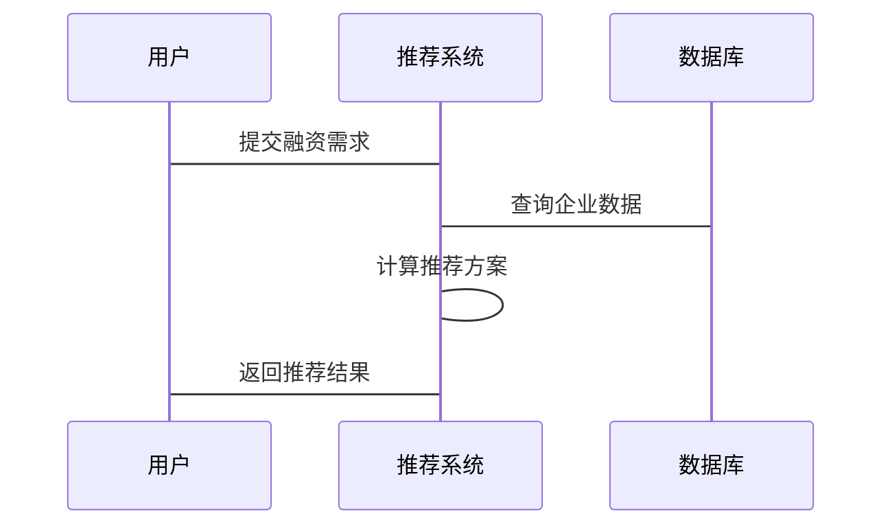
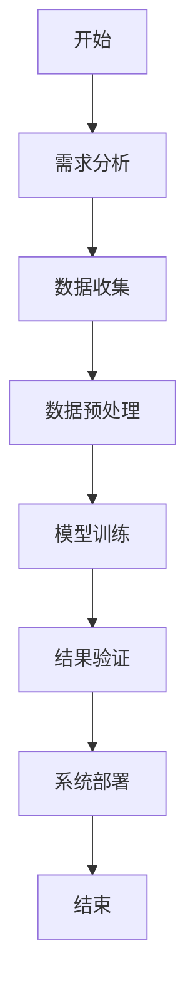

                 


# 开发智能化的企业融资方案推荐系统

> 关键词：智能化融资推荐系统，机器学习，深度学习，自然语言处理，企业融资方案，推荐算法

> 摘要：本文详细探讨了开发智能化企业融资方案推荐系统的背景、核心概念、算法原理、系统架构以及项目实战。通过结合机器学习、自然语言处理和深度学习等技术，本文提出了一个高效的企业融资方案推荐系统设计方案，并给出了具体的实现步骤和代码示例。

---

## 第1章 企业融资方案推荐系统的背景与问题

### 1.1 企业融资的现状与挑战

#### 1.1.1 传统企业融资方式的局限性
传统的企业融资方式主要包括银行贷款、股权投资、债券融资等。这些方式存在以下问题：
- **信息不对称**：企业与资金提供者之间的信息不透明，导致融资效率低下。
- **人工审核成本高**：传统融资需要大量人工审核，效率低且容易出错。
- **融资渠道有限**：企业难以快速找到合适的融资渠道。

#### 1.1.2 数字化与智能化融资的需求
随着人工智能和大数据技术的发展，企业融资方式正在向数字化和智能化方向转变。智能化融资推荐系统可以通过分析企业的财务数据、市场数据和行业趋势，快速为企业匹配合适的融资方案。

#### 1.1.3 企业融资推荐系统的价值与意义
智能化融资推荐系统能够帮助企业快速找到适合的融资方案，降低融资成本，提高融资效率。同时，金融机构也可以通过该系统更精准地匹配潜在客户，提升服务效率。

### 1.2 智能化推荐系统的概念与特点

#### 1.2.1 智能化推荐系统的定义
智能化推荐系统是一种基于人工智能技术的推荐系统，能够根据用户的行为、偏好和历史数据，智能推荐相关内容或产品。

#### 1.2.2 智能化推荐系统的核心特点
- **数据驱动**：基于大量数据进行分析和预测。
- **实时性**：能够实时更新推荐结果。
- **个性化**：根据用户需求提供个性化推荐。
- **可扩展性**：能够处理大规模数据和用户。

#### 1.2.3 企业融资推荐系统的独特性
企业融资推荐系统需要结合企业的财务数据、行业趋势和市场环境，提供精准的融资方案推荐。这使得其在推荐系统中具有独特性。

### 1.3 本章小结
本章介绍了企业融资的现状与挑战，以及智能化推荐系统的概念与特点。接下来的章节将深入探讨智能化企业融资推荐系统的实现细节。

---

## 第2章 核心概念与系统架构

### 2.1 核心概念原理

#### 2.1.1 机器学习在融资推荐中的应用
机器学习可以通过对企业历史数据的分析，预测企业的信用风险和还款能力。常用算法包括逻辑回归、随机森林和神经网络等。

#### 2.1.2 自然语言处理在融资需求分析中的作用
自然语言处理（NLP）可以用于分析企业的财务报告、商业计划书等文本数据，提取关键信息用于融资需求分析。

#### 2.1.3 数据挖掘在融资方案匹配中的应用
数据挖掘技术可以用于发现数据中的模式和关联，帮助企业匹配最适合的融资方案。

### 2.2 核心概念对比与ER实体关系图

#### 2.2.1 核心概念属性特征对比表
以下是对机器学习、自然语言处理和数据挖掘的核心概念属性特征的对比：

| 特性          | 机器学习          | 自然语言处理          | 数据挖掘          |
|---------------|-------------------|-----------------------|-------------------|
| 数据类型      | 结构化数据        | 文本数据              | 结构化和非结构化数据 |
| 核心任务      | 预测和分类        | 文本理解和生成        | 数据模式发现      |
| 代表性算法    | 线性回归、决策树   | 分词、情感分析         | 聚类、关联规则     |

#### 2.2.2 ER实体关系图

```mermaid
erd
 企业管理层 --> 融资需求表: 提交融资需求
 融资需求表 --> 融资方案表: 匹配融资方案
 融资方案表 --> 资金提供方: 提供融资方案
```

### 2.3 本章小结
本章详细介绍了智能化企业融资推荐系统的核心概念及其应用，并通过对比分析和ER实体关系图展示了系统的整体架构。接下来的章节将探讨系统的算法原理和实现细节。

---

## 第3章 算法原理与数学模型

### 3.1 算法原理

#### 3.1.1 基于机器学习的推荐算法
基于机器学习的推荐算法包括协同过滤、基于内容的推荐和基于模型的推荐。以下是协同过滤算法的流程图：



#### 3.1.2 基于深度学习的推荐算法
基于深度学习的推荐算法通常使用神经网络模型，如深度神经网络（DNN）和卷积神经网络（CNN）。以下是DNN的结构图：



#### 3.1.3 混合推荐算法
混合推荐算法结合了协同过滤和深度学习的优势，能够提高推荐的准确性和多样性。

### 3.2 数学模型与公式

#### 3.2.1 相似度计算公式
协同过滤中常用的相似度计算公式为：

$$
相似度 = \frac{\sum (x_i - \mu_x)(y_i - \mu_y)}{\sqrt{\sum (x_i - \mu_x)^2} \cdot \sqrt{\sum (y_i - \mu_y)^2}}
$$

其中，\(x_i\) 和 \(y_i\) 分别是用户i对商品x和y的评分，\(\mu_x\) 和 \(\mu_y\) 分别是商品x和y的平均评分。

#### 3.2.2 损失函数与优化算法
常用的损失函数是均方误差（MSE）：

$$
L = \frac{1}{n}\sum_{i=1}^{n}(y_i - \hat{y_i})^2
$$

优化算法通常使用梯度下降法：

$$
\theta := \theta - \alpha \frac{\partial L}{\partial \theta}
$$

其中，\(\alpha\) 是学习率，\(\theta\) 是模型参数。

#### 3.2.3 推荐模型的评估指标
常用的评估指标包括准确率、召回率、F1分数等：

$$
准确率 = \frac{TP}{TP + FP}
$$

$$
召回率 = \frac{TP}{TP + FN}
$$

$$
F1分数 = \frac{2TP}{2TP + FP + FN}
$$

### 3.3 本章小结
本章详细介绍了智能化企业融资推荐系统的算法原理和数学模型，包括协同过滤、深度学习和混合推荐算法。接下来的章节将探讨系统的架构设计和实现细节。

---

## 第4章 系统分析与架构设计

### 4.1 问题场景介绍

#### 4.1.1 企业融资需求分析
企业需要根据自身的财务状况和市场环境，确定融资需求。例如，某企业需要资金扩展生产线，可以选择银行贷款或股权投资。

#### 4.1.2 融资方案推荐的业务流程
融资方案推荐的业务流程包括：
1. 用户提交融资需求。
2. 系统分析企业数据。
3. 系统匹配合适的融资方案。
4. 系统推荐融资方案。
5. 用户确认或反馈。

#### 4.1.3 系统目标与约束条件
系统目标是实现智能化的融资方案推荐。约束条件包括数据隐私、计算效率和系统可扩展性。

### 4.2 系统功能设计

#### 4.2.1 领域模型设计
以下是领域模型设计图：



#### 4.2.2 功能模块划分
系统功能模块包括：
1. 用户模块：用户提交融资需求。
2. 数据模块：存储企业数据和融资需求。
3. 推荐模块：基于算法推荐融资方案。
4. 管理模块：管理用户和系统设置。

#### 4.2.3 用户角色与权限设计
用户角色包括：
- 企业用户：提交融资需求。
- 管理员：管理系统设置和用户权限。

### 4.3 系统架构设计

#### 4.3.1 模块化架构设计
以下是模块化架构设计图：



#### 4.3.2 微服务架构设计
以下是微服务架构设计图：



#### 4.3.3 系统交互流程设计
以下是系统交互流程图：



### 4.4 本章小结
本章详细介绍了智能化企业融资推荐系统的架构设计，包括功能模块划分、用户角色与权限设计以及系统交互流程设计。接下来的章节将探讨系统的实现细节。

---

## 第5章 项目实战与实现

### 5.1 环境安装与配置

#### 5.1.1 开发环境搭建
推荐使用Python 3.8及以上版本，安装Jupyter Notebook和IDE（如PyCharm）。

#### 5.1.2 依赖库安装
安装以下依赖库：

```bash
pip install numpy
pip install pandas
pip install scikit-learn
pip install spacy
pip install tensorflow
```

#### 5.1.3 数据集准备
数据集包括企业信息表、融资需求表和融资方案表。数据格式为CSV或Excel。

### 5.2 系统核心实现源代码

#### 5.2.1 数据预处理代码

```python
import pandas as pd

# 读取数据
df = pd.read_csv('企业信息.csv')

# 数据清洗
df.dropna(inplace=True)
df = df[~df['行业'].isnull()]
```

#### 5.2.2 模型训练代码

```python
from sklearn.model import LogisticRegression

# 训练模型
model = LogisticRegression()
model.fit(X_train, y_train)

# 预测结果
y_pred = model.predict(X_test)
```

#### 5.2.3 系统交互代码

```python
import requests

# 提交融资需求
response = requests.post('http://localhost:8000/submit_request', json=request_data)
```

### 5.3 本章小结
本章通过具体的代码实现，展示了智能化企业融资推荐系统的开发过程。接下来的章节将总结系统的最佳实践和注意事项。

---

## 附录

### 附录A 常用算法对比表

| 算法类型         | 优点                     | 缺点                     |
|------------------|--------------------------|--------------------------|
| 协同过滤         | 实现简单                 | 对新用户的cold start问题 |
| 基于内容的推荐   | 内容丰富                 | 需要高质量内容           |
| 基于模型的推荐   | 准确性高                 | 实现复杂                 |

### 附录B 推荐系统开发流程图



### 附录C 作者信息

作者：AI天才研究院/AI Genius Institute & 禅与计算机程序设计艺术/Zen And The Art of Computer Programming

---

通过以上章节的详细讲解，我们系统地探讨了智能化企业融资方案推荐系统的开发过程，从背景分析到算法实现，再到系统架构设计和项目实战，为读者提供了一个全面的解决方案。

