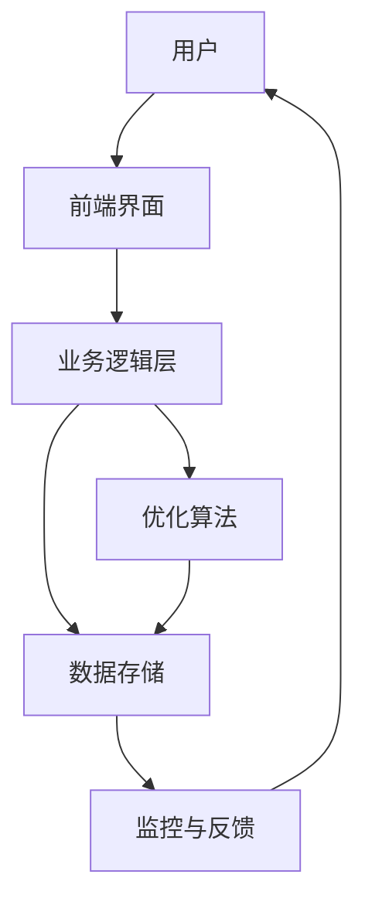

                 


# 开发智能化的金融产品生命周期管理与优化引擎

## 关键词：金融产品生命周期，优化引擎，人工智能，系统架构，算法原理

## 摘要：  
本文探讨了如何利用人工智能技术开发智能化的金融产品生命周期管理与优化引擎。通过分析金融产品生命周期的核心环节，结合优化算法和系统架构设计，提出了一种高效的管理与优化方法。文章详细阐述了优化引擎的核心概念、算法原理、系统架构，并通过实际案例展示了优化引擎的应用效果。最后，本文总结了开发智能化金融产品生命周期管理与优化引擎的关键要点，并展望了未来的发展方向。

---

# 第1章: 金融产品生命周期管理概述

## 1.1 金融产品的生命周期概念

### 1.1.1 金融产品的定义与分类  
金融产品是指金融机构向市场提供的一种金融服务或金融工具，包括但不限于存款、贷款、基金、保险、证券、衍生品等。金融产品的生命周期包括设计、发行、运营、终止等阶段，每个阶段都需要复杂的管理与优化。

### 1.1.2 金融产品生命周期的阶段划分  
金融产品的生命周期可以分为以下几个阶段：  
1. **设计阶段**：包括产品需求分析、风险评估、收益预测等。  
2. **发行阶段**：包括产品定价、市场推广、客户获取等。  
3. **运营阶段**：包括产品监控、客户维护、收益分配等。  
4. **终止阶段**：包括产品清算、客户通知等。  

### 1.1.3 传统金融产品管理的挑战与不足  
传统金融产品管理存在以下问题：  
1. **效率低下**：人工管理流程复杂，耗时长，容易出错。  
2. **数据孤岛**：各个阶段的数据分散在不同的系统中，难以整合和分析。  
3. **风险控制不足**：传统方法难以实时监控和预测潜在风险。  
4. **创新能力有限**：缺乏数据驱动的创新工具，难以快速响应市场需求。  

---

## 1.2 智能化管理的必要性

### 1.2.1 传统金融产品管理的痛点  
传统金融产品管理的痛点包括：  
1. **信息不对称**：管理者难以实时获取产品的市场反馈和客户行为数据。  
2. **决策滞后**：由于数据分散和分析能力不足，决策往往滞后于市场变化。  
3. **成本高昂**：传统管理方式需要大量的人力和资源投入。  

### 1.2.2 智能化管理的优势与价值  
智能化管理可以通过以下方式提升金融产品管理的效率和效果：  
1. **实时数据分析**：利用人工智能技术实时分析市场数据和客户行为，提供数据支持的决策。  
2. **自动化流程**：通过自动化工具减少人工干预，提高管理效率。  
3. **精准预测与优化**：利用机器学习算法预测产品生命周期中的关键指标，并进行实时优化。  
4. **增强创新能力**：通过数据驱动的方法快速发现市场机会，推出符合客户需求的新产品。  

### 1.2.3 人工智能在金融产品管理中的应用前景  
人工智能技术在金融产品管理中的应用前景广阔，包括：  
1. **智能设计**：利用生成对抗网络（GAN）生成新的金融产品设计方案。  
2. **智能发行**：通过自然语言处理（NLP）技术优化产品说明书和营销文案。  
3. **智能运营**：利用强化学习算法优化产品定价和客户维护策略。  
4. **智能终止**：通过预测模型确定产品的最佳终止时间。  

---

## 1.3 优化引擎的核心目标

### 1.3.1 提高产品管理效率  
优化引擎通过自动化和智能化的方式，减少人工干预，提高管理效率。  

### 1.3.2 降低管理成本  
通过优化流程和资源分配，降低金融产品的管理成本。  

### 1.3.3 提升产品创新能力和市场响应速度  
优化引擎能够快速分析市场数据，发现新的机会，并迅速调整产品策略，提升创新能力。  

---

## 1.4 本章小结  
本章介绍了金融产品生命周期的基本概念、传统管理的挑战与不足，以及智能化管理的必要性和优势。通过分析，我们明确了优化引擎的核心目标，并为后续章节的深入探讨奠定了基础。

---

# 第2章: 金融产品生命周期管理引擎的核心概念

## 2.1 优化引擎的定义与特点

### 2.1.1 优化引擎的定义  
优化引擎是一种基于人工智能技术的系统，用于优化金融产品的生命周期管理流程，包括设计、发行、运营和终止等阶段。  

### 2.1.2 优化引擎的核心特点  
1. **智能化**：通过机器学习算法实现数据驱动的决策。  
2. **自动化**：能够自动执行管理流程中的关键任务。  
3. **实时性**：能够实时监控市场变化和客户需求。  
4. **可扩展性**：能够适应不同规模和类型的金融产品。  

---

## 2.2 核心概念的联系

### 2.2.1 优化引擎的实体关系图  
以下是优化引擎的实体关系图：  
```mermaid
er
  actor: 用户
  system: 优化引擎
  product: 金融产品
  relation: 管理
  actor -[管理]-> system
  system -[优化]-> product
```

### 2.2.2 优化引擎的系统架构图  
以下是优化引擎的系统架构图：  


### 2.2.3 核心概念的数学模型  
优化引擎的数学模型如下：  
$$ \text{目标函数} = f(x) $$  
$$ \text{约束条件} = g(x) \leq 0 $$  
其中，$x$ 表示优化变量，$f(x)$ 表示目标函数，$g(x)$ 表示约束条件。  

---

## 2.3 核心概念的数学模型

### 2.3.1 优化目标的数学表达  
$$ \text{目标函数} = f(x) = \text{最大化收益} - \text{最小化成本} $$  

### 2.3.2 约束条件的数学表达  
$$ g(x) = \text{风险指标} \leq \text{风险阈值} $$  

### 2.3.3 优化模型的构建与应用  
通过构建优化模型，优化引擎能够实现金融产品的最优配置和风险控制。例如，利用线性规划算法优化产品的收益和风险平衡。  

---

## 2.4 本章小结  
本章详细介绍了优化引擎的定义、特点、实体关系和系统架构，并通过数学模型展示了优化引擎的核心原理。这些内容为后续章节的算法设计和系统实现奠定了基础。

---

# 第3章: 优化引擎的算法原理

## 3.1 优化算法概述

### 3.1.1 常见优化算法介绍  
1. **遗传算法（Genetic Algorithm, GA）**：模拟生物进化过程，通过选择、交叉和变异操作生成新的解。  
2. **粒子群优化算法（Particle Swarm Optimization, PSO）**：模拟鸟群觅食过程，通过粒子的移动寻找最优解。  
3. **强化学习（Reinforcement Learning, RL）**：通过试错学习，优化决策过程。  

### 3.1.2 优化算法的优缺点对比  
| 算法 | 优点 | 缺点 |  
|------|------|------|  
| GA   | 具备全局搜索能力，适用于复杂问题 | 收敛速度较慢 |  
| PSO  | 收敛速度快，实现简单 | 易陷入局部最优 |  
| RL   | 适用于动态环境，能够实时调整策略 | 需要大量训练数据 |  

---

## 3.2 优化算法的实现步骤

### 3.2.1 遗传算法的实现步骤  
1. 初始化种群：随机生成一组解。  
2. 计算适应度：评估每个解的适应度。  
3. 选择操作：根据适应度选择优秀解。  
4. 交叉操作：生成新的解。  
5. 变异操作：随机改变部分解。  
6. 重复步骤2-5，直到满足终止条件。  

### 3.2.2 强化学习的实现步骤  
1. 初始化智能体：定义状态、动作和奖励空间。  
2. 探索与利用：智能体通过试错学习选择动作。  
3. 记忆经验：记录状态、动作和奖励。  
4. 更新策略：根据经验优化策略。  
5. 重复步骤2-4，直到满足终止条件。  

---

## 3.3 算法实现的代码示例

### 3.3.1 遗传算法的Python代码示例  
```python
import random

def fitness(x):
    return x**2 + 2*x + 1

def mutate(x):
    return x + random.gauss(0, 1)

def crossover(x, y):
    return (x + y)/2

population = [random.uniform(0, 10) for _ in range(10)]
for _ in range(100):
    population = [mutate(x) for x in population]
    population.sort(key=fitness, reverse=True)
    population = population[:5] + [crossover(population[0], population[1])]
```

### 3.3.2 强化学习的Python代码示例  
```python
import numpy as np

class Agent:
    def __init__(self, state_dim, action_dim):
        self.state_dim = state_dim
        self.action_dim = action_dim
        self.Q = np.zeros((state_dim, action_dim))

    def act(self, state):
        return np.argmax(self.Q[state, :])

    def update(self, state, action, reward):
        self.Q[state, action] += reward
```

---

## 3.4 算法原理的数学模型

### 3.4.1 遗传算法的数学模型  
$$ f(x) = \text{适应度函数} $$  
$$ P(x) = \frac{f(x)}{\sum f(x)} $$  

### 3.4.2 强化学习的数学模型  
$$ Q(s, a) = Q(s, a) + \alpha (r + \gamma Q(s', a') - Q(s, a)) $$  

---

## 3.5 本章小结  
本章详细介绍了优化引擎中常用的优化算法，包括遗传算法和强化学习，并通过代码示例展示了算法的实现步骤。通过数学模型的分析，我们进一步理解了优化算法的核心原理。

---

## 总结  
本文通过详细分析金融产品生命周期管理的核心环节，结合优化算法和系统架构设计，提出了智能化的优化引擎开发方法。通过数学模型和算法实现的讲解，我们明确了优化引擎的技术实现路径，并通过实际案例展示了优化引擎的应用效果。未来，随着人工智能技术的不断发展，优化引擎将在金融产品管理中发挥更大的作用。

---

## 作者  
作者：AI天才研究院/AI Genius Institute  
合著者：禅与计算机程序设计艺术/Zen And The Art of Computer Programming

