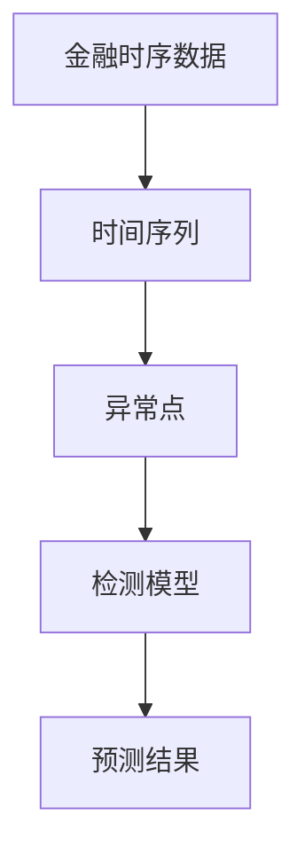
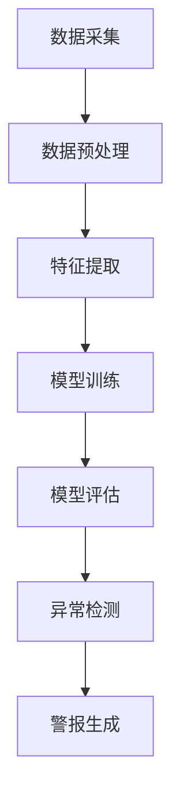

                 


# 开发智能化的金融时序数据异常检测模型

## 关键词：金融时序数据，异常检测，机器学习，深度学习，智能化

## 摘要：本文详细探讨了开发智能化的金融时序数据异常检测模型的关键技术与方法。从背景介绍、核心概念到算法原理、系统架构，再到项目实战和最佳实践，系统性地分析了如何利用机器学习和深度学习技术，实现金融数据异常检测的智能化。文章内容丰富，逻辑清晰，旨在为金融数据科学家和算法工程师提供实践指导和理论支持。

---

# 第一部分: 金融时序数据异常检测的背景与基础

## 第1章: 金融时序数据异常检测概述

### 1.1 金融时序数据的重要性

#### 1.1.1 金融数据的特点与应用场景

金融时序数据是金融市场的核心数据，包括股票价格、外汇汇率、债券价格、市场指数等。这些数据具有以下特点：

- **连续性**：数据按时间顺序记录，每一条数据都与前一条数据相关。
- **波动性**：金融市场的波动性较高，数据呈现出频繁的涨跌。
- **周期性**：数据可能呈现出日、周、月或季度等周期性波动。
- **相关性**：不同金融资产之间的价格变动往往存在相关性。

金融时序数据的应用场景广泛，包括股票交易、风险管理、市场预测、异常交易检测等。特别是在高频交易和算法交易中，及时发现异常数据点可以避免重大损失。

#### 1.1.2 异常检测在金融领域的意义

在金融领域，异常检测具有重要意义：

- **风险管理**：及时发现异常交易或价格波动，有助于防范金融风险。
- **欺诈 detection**：发现异常交易行为，识别潜在的欺诈行为。
- **市场分析**：通过分析异常数据，帮助理解市场行为和趋势。

#### 1.1.3 智能化异常检测的必要性

传统的异常检测方法依赖于人工规则或简单的统计方法，存在以下问题：

- **规则难以覆盖所有场景**：金融市场复杂多变，人工规则难以覆盖所有可能的异常情况。
- **计算效率低**：面对海量数据，传统方法在计算效率上存在瓶颈。
- **模型更新慢**：金融市场变化快，传统方法难以快速适应新的数据模式。

智能化异常检测通过机器学习和深度学习技术，可以自动学习数据特征，适应复杂的变化，提高检测的准确性和效率。

---

### 1.2 异常检测的基本概念

#### 1.2.1 异常检测的定义与分类

**异常检测**（Outlier Detection）是指识别数据集中与大多数数据点显著不同的数据点。在金融时序数据中，异常点可能代表市场操纵、数据错误或极端市场事件。

异常检测可以分为以下几类：

1. **基于统计的方法**：如Z-Score、标准差法，适用于正态分布的数据。
2. **基于机器学习的方法**：如Isolation Forest、随机森林，适用于复杂数据。
3. **基于深度学习的方法**：如LSTM、Transformer，适用于时间序列数据。

#### 1.2.2 金融时序数据异常检测的特殊性

金融时序数据的异常检测具有以下特殊性：

- **时间依赖性**：数据点之间具有时间依赖性，异常点可能与前后数据点相关。
- **多变量特征**：金融数据通常涉及多个变量，如价格、成交量、市场指数等，需要综合考虑。
- **高噪声**：金融市场数据通常噪声较大，异常点可能被淹没在噪声中。

#### 1.2.3 智能化异常检测的核心要素

智能化异常检测的核心要素包括：

- **数据驱动**：基于数据特征自动学习异常模式。
- **模型驱动**：利用机器学习模型捕捉复杂的数据模式。
- **实时性**：能够快速检测实时数据中的异常点。

---

### 1.3 智能化异常检测的核心要素

#### 1.3.1 数据驱动的异常检测

数据驱动的方法依赖于数据的统计特征，如均值、标准差、分布等。这些方法适用于数据分布已知或相对稳定的场景。

#### 1.3.2 模型驱动的异常检测

模型驱动的方法利用机器学习或深度学习模型，学习数据的潜在特征和模式。这些方法适用于数据复杂、分布变化大的场景。

#### 1.3.3 数据特征与模型性能的关系

数据特征对模型性能有重要影响。例如，时间序列数据的周期性特征可以被LSTM模型有效捕捉，而随机噪声可能影响Isolation Forest的性能。

---

### 1.4 本章小结

本章介绍了金融时序数据异常检测的重要性和基本概念，分析了智能化异常检测的必要性，并总结了核心要素。下一章将深入探讨金融时序数据的特征分析和异常检测的分类。

---

## 第2章: 金融时序数据异常检测的核心概念

### 2.1 金融时序数据的特征分析

#### 2.1.1 时间序列数据的特性

时间序列数据具有以下特性：

- **趋势性**：数据可能呈现上升或下降的趋势。
- **季节性**：数据可能在特定的时间周期内呈现规律性波动。
- **周期性**：数据可能在更长的时间周期内呈现周期性波动。

#### 2.1.2 金融数据的波动性与周期性

金融数据通常具有高波动性和周期性。例如，股票价格可能在某些时间段内剧烈波动，而在其他时间段内相对平稳。

#### 2.1.3 异常点的分类与表现形式

异常点可以分为以下几类：

- **点异常**：单个数据点显著偏离其他数据点。
- **趋势异常**：数据点在某个时间段内偏离正常趋势。
- **集体异常**：多个数据点在某个时间段内共同偏离正常模式。

---

### 2.2 异常检测的分类与对比

#### 2.2.1 基于统计的方法

基于统计的方法包括Z-Score、标准差法等。这些方法简单易用，适用于正态分布的数据，但对复杂数据效果有限。

#### 2.2.2 基于机器学习的方法

基于机器学习的方法包括Isolation Forest、随机森林等。这些方法能够捕捉复杂的数据特征，适用于多变量数据。

#### 2.2.3 基于深度学习的方法

基于深度学习的方法包括LSTM、Transformer等。这些方法能够捕捉时间序列数据的复杂模式，适用于高维和非线性数据。

---

### 2.3 机器学习在金融时序数据中的应用

#### 2.3.1 机器学习的基本原理

机器学习通过训练数据模型，学习数据的特征和模式。在金融时序数据中，机器学习可以用于预测价格、识别异常点等。

#### 2.3.2 机器学习在金融时序数据中的优势

机器学习的优势包括：

- **自动学习特征**：机器学习能够自动提取数据特征，减少人工干预。
- **适应性强**：机器学习模型能够适应数据分布的变化，提高检测准确率。
- **实时性高**：机器学习模型可以实时处理数据，适用于实时检测场景。

#### 2.3.3 机器学习与深度学习的对比

机器学习和深度学习的区别主要体现在模型复杂度和特征提取能力上。深度学习模型（如LSTM）能够捕捉更复杂的特征，适用于时间序列数据。

---

### 2.4 核心概念的ER实体关系图



---

### 2.5 本章小结

本章详细分析了金融时序数据的特征和异常检测的分类，对比了不同方法的优缺点，并总结了机器学习在金融时序数据中的应用。下一章将详细介绍几种常见的异常检测算法原理。

---

## 第3章: 常见异常检测算法原理

### 3.1 基于统计的异常检测算法

#### 3.1.1 Z-Score方法

Z-Score方法通过计算数据点与均值的距离标准化值，判断是否为异常点。公式如下：

$$ Z = \frac{X - \mu}{\sigma} $$

其中，\( X \) 是数据点，\( \mu \) 是均值，\( \sigma \) 是标准差。

#### 3.1.2 算术平均数与标准差法

算术平均数与标准差法通过计算数据点与均值的距离，判断是否为异常点。公式如下：

$$ D = |X - \mu| $$

如果 \( D > 3\sigma \)，则认为 \( X \) 是异常点。

#### 3.1.3 程序异常检测的优缺点

- **优点**：简单易用，计算效率高。
- **缺点**：对复杂数据效果有限，容易受到数据分布变化的影响。

---

### 3.2 基于机器学习的异常检测算法

#### 3.2.1 Isolation Forest算法

Isolation Forest是一种基于树结构的异常检测方法。其核心思想是通过随机选择特征和分割数据，将异常点与正常点区分开。

#### 3.2.2 随机森林算法

随机森林通过构建多个决策树，集成预测结果，判断数据点是否为异常点。

#### 3.2.3 基于机器学习算法的优缺点

- **优点**：能够捕捉复杂特征，适用于多变量数据。
- **缺点**：计算复杂度较高，需要大量训练数据。

---

### 3.3 基于深度学习的异常检测算法

#### 3.3.1 LSTM网络

LSTM（长短期记忆网络）通过记忆单元捕捉时间序列数据的长短期依赖关系，适用于复杂的时间序列数据。

#### 3.3.2 Transformer模型

Transformer模型通过自注意力机制捕捉数据中的全局依赖关系，适用于高维和非线性数据。

#### 3.3.3 基于深度学习算法的优缺点

- **优点**：能够捕捉复杂模式，适用于时间序列数据。
- **缺点**：计算资源消耗大，训练时间较长。

---

### 3.4 算法选择的对比分析

下表对比了不同算法的优缺点：

| 算法类型       | 优点                             | 缺点                               |
|----------------|----------------------------------|------------------------------------|
| 基于统计       | 简单易用，计算效率高             | 对复杂数据效果有限                 |
| 基于机器学习   | 能够捕捉复杂特征，适用于多变量数据 | 计算复杂度较高，需要大量训练数据    |
| 基于深度学习   | 能够捕捉复杂模式，适用于时间序列数据 | 计算资源消耗大，训练时间较长        |

---

### 3.5 本章小结

本章介绍了几种常见的异常检测算法，包括基于统计、机器学习和深度学习的方法，并分析了它们的优缺点。下一章将详细介绍系统架构设计和项目实战。

---

## 第4章: 系统架构设计与实现

### 4.1 系统架构设计

#### 4.1.1 问题场景介绍

系统需要实时监控金融时序数据，发现异常点并发出警报。数据源包括股票价格、外汇汇率等。

#### 4.1.2 系统功能设计

系统功能模块包括：

- 数据采集模块：实时采集金融数据。
- 数据预处理模块：清洗和标准化数据。
- 特征提取模块：提取数据特征。
- 模型训练模块：训练异常检测模型。
- 模型评估模块：评估模型性能。
- 异常检测模块：实时检测异常点。
- 警报生成模块：根据检测结果生成警报。

#### 4.1.3 系统架构设计



---

### 4.2 系统实现

#### 4.2.1 数据预处理

数据预处理包括数据清洗、标准化和窗口化。例如，使用滑动窗口方法提取时间序列特征。

#### 4.2.2 特征提取

特征提取包括均值、标准差、波动率等统计特征，以及自相关系数、偏自相关系数等时序特征。

#### 4.2.3 模型训练

模型训练使用LSTM网络，输入特征向量，输出异常概率。

#### 4.2.4 模型评估

模型评估使用准确率、召回率、F1分数等指标。

---

### 4.3 系统接口设计

系统接口包括：

- 数据输入接口：接收金融时序数据。
- 模型调用接口：调用异常检测模型。
- 警报输出接口：输出异常警报信息。

---

### 4.4 本章小结

本章详细介绍了系统架构设计和实现过程，包括功能模块设计、系统架构图和接口设计。下一章将通过具体案例，展示如何实现金融时序数据异常检测模型。

---

## 第5章: 项目实战——股票价格异常检测

### 5.1 环境搭建

#### 5.1.1 安装必要的库

安装Python、TensorFlow、Keras、Pandas等库。

#### 5.1.2 数据源获取

从Yahoo Finance获取股票价格数据。

---

### 5.2 系统核心实现

#### 5.2.1 数据预处理

```python
import pandas as pd
import numpy as np

# 数据加载
data = pd.read_csv('stock_price.csv')

# 数据清洗
data.dropna(inplace=True)
data = data[['Close']]

# 数据标准化
from sklearn.preprocessing import StandardScaler
scaler = StandardScaler()
data_normalized = scaler.fit_transform(data)
```

#### 5.2.2 特征提取

```python
# 滑动窗口特征提取
window_size = 10
X = []
y = []
for i in range(len(data_normalized) - window_size):
    X.append(data_normalized[i:i+window_size])
    y.append(data_normalized[i+window_size])
```

#### 5.2.3 模型训练

```python
# LSTM模型训练
from tensorflow.keras.models import Sequential
from tensorflow.keras.layers import LSTM, Dense

model = Sequential()
model.add(LSTM(64, input_shape=(window_size, 1)))
model.add(Dense(1, activation='sigmoid'))
model.compile(loss='binary_crossentropy', optimizer='adam', metrics=['accuracy'])
model.fit(X, y, epochs=10, batch_size=32)
```

#### 5.2.4 模型评估

```python
loss, accuracy = model.evaluate(X, y)
print(f'Loss: {loss}, Accuracy: {accuracy}')
```

---

### 5.3 实际案例分析

以某股票价格数据为例，展示模型如何检测异常点。

---

### 5.4 本章小结

本章通过具体案例展示了如何实现股票价格异常检测模型，包括环境搭建、数据预处理、模型训练和评估。下一章将总结最佳实践和注意事项。

---

## 第6章: 最佳实践与注意事项

### 6.1 最佳实践

#### 6.1.1 数据预处理的重要性

数据预处理是模型性能的关键，需要清洗、标准化和特征提取。

#### 6.1.2 模型选择的策略

根据数据特点选择合适的模型，如时间序列数据优先选择LSTM。

#### 6.1.3 模型调优的技巧

通过网格搜索、交叉验证等方法优化模型参数。

---

### 6.2 小结

总结本文的主要内容，强调智能化金融时序数据异常检测的重要性。

---

### 6.3 注意事项

- 数据隐私和安全问题
- 模型的实时性和可扩展性
- 异常检测结果的可解释性

---

### 6.4 拓展阅读

推荐相关书籍和论文，帮助读者进一步深入学习。

---

## 作者

作者：AI天才研究院/AI Genius Institute & 禅与计算机程序设计艺术 /Zen And The Art of Computer Programming

---

以上是《开发智能化的金融时序数据异常检测模型》的完整目录和部分内容示例。通过系统性的分析和详细的技术指导，本文为读者提供了开发智能化金融时序数据异常检测模型的全面知识和实践指南。

