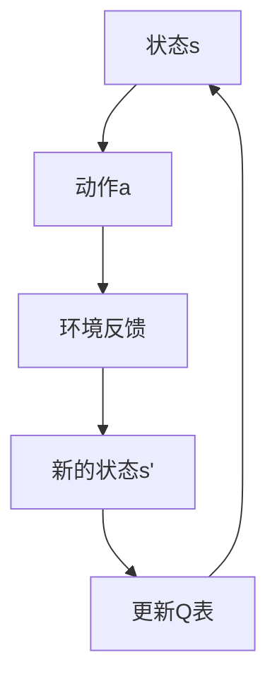
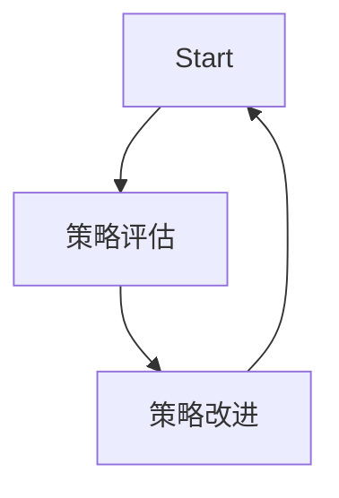
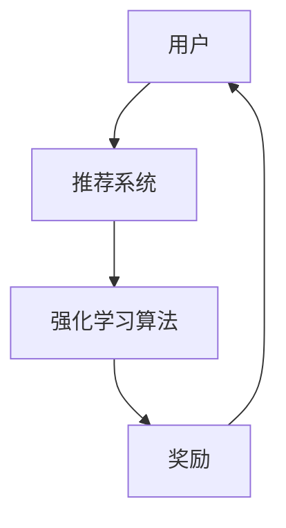

                 


# 强化学习在AI Agent个性化推荐中的应用

> **关键词**: 强化学习, AI Agent, 个性化推荐, 推荐系统, 机器学习, 人工智能

> **摘要**:  
个性化推荐是人工智能领域的重要应用之一，而强化学习在其中发挥着越来越重要的作用。本文从强化学习的基本原理出发，结合AI Agent的核心概念，深入分析强化学习在个性化推荐中的应用场景、算法实现以及系统架构。通过具体案例，探讨如何利用强化学习提升推荐系统的性能和用户体验。文章内容涵盖强化学习与AI Agent的基础知识、推荐系统的挑战与解决方案、强化学习算法的数学模型与公式、系统架构设计，以及实际项目的实现与优化。

---

# 第一部分: 强化学习与AI Agent基础

## 第1章: 强化学习与AI Agent概述

### 1.1 强化学习的基本概念

#### 1.1.1 强化学习的定义与特点

强化学习（Reinforcement Learning, RL）是一种机器学习范式，通过智能体与环境的交互，学习最优策略以最大化累积奖励。其核心在于通过试错（trial and error）的方式，让智能体在动态环境中做出最优决策。

- **定义**: 强化学习通过智能体与环境的交互，智能体通过执行动作（action）获得奖励（reward），并根据奖励调整策略（policy）以最大化累积奖励。
- **特点**:
  - 延时奖励（Delayed Reward）: 智能体无法立即知道其动作的最终效果。
  - 动态环境（Dynamic Environment）: 环境状态可能随时间变化。
  - 探索与利用（Exploration vs Exploitation）: 智能体需要在探索新策略和利用已知策略之间找到平衡。

#### 1.1.2 AI Agent的基本概念与类型

AI Agent（人工智能代理）是一种能够感知环境并采取行动以实现目标的智能体。它可以简单到自动回复消息的聊天机器人，复杂到自动驾驶汽车。

- **类型**:
  - **基于模型（Model-based）**: 基于对环境的建模进行决策，如动态规划（Dynamic Programming）。
  - **基于无模型（Model-free）**: 不依赖环境模型，直接通过经验学习策略，如Q-learning。

#### 1.1.3 强化学习在AI Agent中的作用

强化学习为AI Agent提供了自适应和优化决策的能力，使其能够根据实时反馈调整行为，从而在动态环境中实现目标。

### 1.2 强化学习的核心原理

#### 1.2.1 马尔可夫决策过程（MDP）

MDP（Markov Decision Process）是强化学习的基本模型，描述了智能体在环境中的决策过程。

- **状态（State）**: 智能体所处的环境情况。
- **动作（Action）**: 智能体可以执行的操作。
- **转移概率（Transition Probability）**: 执行某个动作后，环境从当前状态转移到下一个状态的概率。
- **奖励（Reward）**: 智能体执行动作后获得的反馈，通常表现为数值形式。

MDP的目标是找到一个策略，使得智能体在长期的累计奖励（Return）最大化。

#### 1.2.2 状态、动作与奖励的定义

- **状态（State）**: 例如，在推荐系统中，用户的点击、购买行为可以作为状态。
- **动作（Action）**: 比如推荐某一个商品或内容。
- **奖励（Reward）**: 例如用户的点击、购买或评分。

#### 1.2.3 策略与价值函数的介绍

- **策略（Policy）**: 定义智能体在每个状态下选择动作的概率分布。策略的目标是最大化累计奖励。
- **价值函数（Value Function）**: 表示智能体在当前状态下采取某种策略后的期望累计奖励。

---

## 第2章: 强化学习在个性化推荐中的应用

### 2.1 个性化推荐的背景与挑战

个性化推荐的目标是根据用户的偏好，实时推荐符合其需求的内容或产品。然而，传统的推荐算法（如协同过滤、基于内容的推荐）存在以下问题：

- **数据稀疏性**: 用户行为数据不足，导致推荐准确性降低。
- **动态偏好**: 用户的偏好可能随时间变化，传统推荐算法难以捕捉这种动态变化。
- **实时性要求**: 在线推荐需要快速响应，传统算法难以满足实时性要求。

### 2.2 强化学习在推荐系统中的优势

强化学习通过动态调整推荐策略，能够有效应对个性化推荐中的挑战。

- **动态适应性**: 强化学习能够根据用户实时反馈调整推荐策略。
- **长期目标优化**: 强化学习通过累计奖励机制，优化推荐系统的长期目标（如用户满意度、购买率）。
- **探索与利用平衡**: 强化学习能够在探索新内容和利用已知偏好之间找到平衡，避免推荐过于单一或盲目。

### 2.3 个性化推荐的挑战与解决方案

#### 2.3.1 数据稀疏性问题

解决方案: 使用强化学习结合用户行为建模，通过探索新内容来缓解数据稀疏性。

#### 2.3.2 动态用户偏好捕捉

解决方案: 强化学习通过实时反馈调整推荐策略，捕捉用户的动态偏好。

#### 2.3.3 鲁棒性与实时性要求

解决方案: 使用在线强化学习算法，确保推荐系统的实时性和鲁棒性。

---

## 第3章: 强化学习算法的数学模型与公式

### 3.1 Q-learning算法

#### 3.1.1 Q-learning的数学模型

Q-learning是一种经典的强化学习算法，通过更新Q值表（Q-table）来逼近最优策略。

$$ Q(s, a) = Q(s, a) + \alpha \left[ r + \gamma \max_{a'} Q(s', a') - Q(s, a) \right] $$

其中:
- \( Q(s, a) \): 状态-动作对的Q值。
- \( \alpha \): 学习率。
- \( r \): 奖励。
- \( \gamma \): 折扣因子。
- \( s' \): 新状态。
- \( a' \): 新动作。

#### 3.1.2 Q-learning的流程图



### 3.2 策略评估与策略迭代

#### 3.2.1 策略评估的数学模型

$$ V_{\pi}(s) = E_{\pi}[R_t | S_t = s] $$

其中:
- \( V_{\pi}(s) \): 策略π下的状态s的价值函数。
- \( R_t \): 奖励。
- \( S_t \): 当前状态。

#### 3.2.2 策略迭代的流程图



---

## 第4章: 个性化推荐系统的设计与实现

### 4.1 系统架构设计

#### 4.1.1 系统功能模块

- **用户建模**: 根据用户行为数据构建用户画像。
- **环境建模**: 模拟用户与推荐系统之间的交互环境。
- **推荐策略**: 基于强化学习算法生成推荐结果。
- **反馈机制**: 实时收集用户反馈，更新推荐策略。

#### 4.1.2 系统架构图



---

## 第5章: 项目实战——基于强化学习的推荐系统

### 5.1 项目背景

本项目旨在设计一个基于强化学习的个性化推荐系统，解决传统推荐算法的局限性。

### 5.2 核心代码实现

```python
import numpy as np

class QLearningAgent:
    def __init__(self, state_space, action_space):
        self.state_space = state_space
        self.action_space = action_space
        self.Q = np.zeros((state_space, action_space))
    
    def get_action(self, state, epsilon=0.1):
        if np.random.random() < epsilon:
            return np.random.randint(self.action_space)
        else:
            return np.argmax(self.Q[state])
    
    def update_Q(self, current_state, action, reward, next_state, alpha=0.1, gamma=0.9):
        self.Q[current_state, action] = self.Q[current_state, action] + alpha * (reward + gamma * np.max(self.Q[next_state, :]) - self.Q[current_state, action])

# 示例场景：电商推荐系统
# 状态：用户浏览历史、用户点击行为
# 动作：推荐商品A、商品B、商品C
# 奖励：点击或购买后获得奖励

agent = QLearningAgent(5, 3)
agent.update_Q(0, 0, 1, 1)
```

### 5.3 项目总结

通过强化学习算法实现个性化推荐系统，能够有效提高推荐的准确性和用户的满意度。在实际应用中，需要根据具体场景调整算法参数，优化推荐策略。

---

## 第6章: 最佳实践与注意事项

### 6.1 算法调优

- **学习率α**: 过大的学习率可能导致不稳定，过小的学习率可能导致收敛速度慢。
- **折扣因子γ**: 控制未来奖励的影响，通常取值在0.8到0.9之间。

### 6.2 模型评估

- **准确率**: 推荐内容与用户兴趣的匹配程度。
- **召回率**: 推荐内容覆盖用户潜在需求的能力。
- **用户满意度**: 用户对推荐结果的反馈。

### 6.3 注意事项

- **数据隐私**: 注意保护用户数据隐私，避免数据泄露。
- **计算资源**: 强化学习算法对计算资源要求较高，需要优化算法复杂度。

---

## 第7章: 结语

强化学习为个性化推荐系统提供了新的思路和方法。通过动态调整推荐策略，强化学习能够有效提升推荐系统的性能和用户体验。未来，随着AI技术的不断发展，强化学习在个性化推荐中的应用将更加广泛和深入。

---

**作者：AI天才研究院 & 禅与计算机程序设计艺术**

