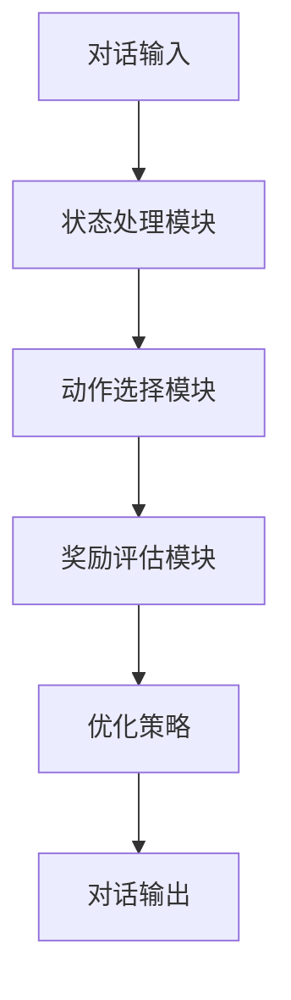

                 


# 强化学习在AI Agent对话生成中的创新应用

## 关键词：强化学习，对话生成，AI Agent，深度学习，自然语言处理，马尔可夫决策过程，策略梯度

## 摘要：本文深入探讨了强化学习在AI Agent对话生成中的创新应用，结合深度学习和自然语言处理技术，提出了一种基于马尔可夫决策过程的对话生成模型，利用策略梯度方法优化对话策略，显著提升了对话的多样性和相关性。文章详细分析了强化学习的基本原理、算法实现、系统架构，并通过具体案例展示了如何将理论应用于实践。

---

## 第一部分：背景介绍

### 第1章：强化学习与对话生成概述

#### 1.1 强化学习的基本概念

- 1.1.1 从监督学习到强化学习的演进
  - 监督学习依赖于标注数据，而强化学习通过环境反馈进行学习。
- 1.1.2 强化学习的核心特点
  - 基于反馈的奖励机制，目标是最大化累积奖励。
- 1.1.3 强化学习与其它机器学习方法的对比
  - 与监督学习和无监督学习的区别在于学习信号的来源。

#### 1.2 对话生成的基本概念

- 1.2.1 对话生成的定义与分类
  - 对话生成是指让模型生成自然语言回复的过程。
  - 分为基于规则、统计模型和深度学习模型。

#### 1.3 强化学习在对话生成中的作用

- 1.3.1 强化学习如何提升对话生成的质量
  - 通过奖励机制优化生成策略。
- 1.3.2 强化学习在对话生成中的独特优势
  - 能够处理复杂决策过程，提升对话的自然性和相关性。

### 第2章：强化学习的基本原理

#### 2.1 马尔可夫决策过程（MDP）

- 2.1.1 定义与构成要素
  - 状态、动作、奖励、转移概率。
- 2.1.2 MDP在对话生成中的应用
  - 将对话过程建模为MDP，状态为当前对话上下文，动作为回复。

#### 2.2 基于策略梯度的强化学习

- 2.2.1 策略梯度方法的核心思想
  - 直接优化策略，通过梯度上升方法最大化奖励。
- 2.2.2 常见策略梯度算法
  - REINFORCE算法、Actor-Critic算法。

### 第3章：对话生成的挑战与强化学习的解决方案

#### 3.1 对话生成的主要挑战

- 3.1.1 对话的多样性和相关性
  - 生成回复需要符合上下文，同时保持多样性。
- 3.1.2 长期依赖和上下文记忆
  - 需要处理多轮对话中的上下文信息。

#### 3.2 强化学习如何解决这些挑战

- 3.2.1 利用强化学习优化回复策略
  - 通过奖励机制，引导模型生成更合适的回复。
- 3.2.2 增量式学习和策略优化
  - 在线更新策略，适应对话过程中的变化。

---

## 第二部分：强化学习在对话生成中的创新应用

### 第4章：基于强化学习的对话生成模型

#### 4.1 基于MDP的对话生成模型

- 4.1.1 模型结构
  - 状态空间、动作空间、奖励函数的设计。
- 4.1.2 对话生成过程中的状态表示
  - 使用词向量或注意力机制表示当前对话上下文。

#### 4.2 增量式强化学习策略

- 4.2.1 增量式学习的核心思想
  - 在对话过程中逐步优化生成策略。
- 4.2.2 动态奖励机制的设计
  - 根据对话历史调整奖励函数。

### 第5章：对话生成系统的架构与实现

#### 5.1 系统功能设计

- 5.1.1 对话生成模块
  - 输入对话历史，输出回复。
- 5.1.2 奖励评估模块
  - 根据规则或模型评估回复的奖励值。

#### 5.2 系统架构设计

- 5.2.1 基于强化学习的对话生成系统架构
  - 包括状态处理模块、动作选择模块、奖励评估模块。
- 5.2.2 系统模块之间的交互流程
  - 从输入对话上下文到生成回复的过程。

### 第6章：项目实战

#### 6.1 项目环境与工具安装

- 6.1.1 开发环境的选择
  - Python 3.8及以上版本，TensorFlow或PyTorch框架。
- 6.1.2 必要库的安装
  - gym、numpy、matplotlib等。

#### 6.2 对话生成系统的核心实现

- 6.2.1 状态表示的实现
  - 使用词嵌入表示对话上下文。
- 6.2.2 动作选择模块的实现
  - 基于策略网络选择回复动作。
- 6.2.3 奖励评估模块的实现
  - 根据预定义规则或模型评估奖励。

#### 6.3 实际案例分析与解读

- 6.3.1 案例背景与需求分析
  - 设计一个简单的对话生成任务。
- 6.3.2 系统实现与代码解读
  - 详细解释代码实现的关键部分。
- 6.3.3 实验结果与分析
  - 对比不同方法的对话生成效果。

---

## 第三部分：数学模型与公式

### 第7章：数学模型与公式解析

#### 7.1 状态转移模型

- 7.1.1 状态转移概率公式
  - $$P(s' | s, a)$$
- 7.1.2 状态值函数的定义
  - $$V(s) = \max_a Q(s,a)$$

#### 7.2 奖励函数设计

- 7.2.1 基于对话相关性的奖励函数
  - $$r(s, a) = \text{similarity}(a, s)$$
- 7.2.2 基于生成回复多样性的奖励函数
  - $$r(s, a) = \text{diversity}(a, s)$$

#### 7.3 策略梯度方法的数学推导

- 7.3.1 REINFORCE算法的推导
  - 目标函数：$$J(\theta) = \mathbb{E}_{\tau}[\sum_{t} r_t]$$
  - 梯度计算：$$\nabla J = \mathbb{E}[\sum_{t} \nabla \log \pi_\theta(a_t|s_t) r_t]$$
- 7.3.2 Actor-Critic算法的推导
  - 策略网络和价值网络的联合优化。

---

## 第四部分：系统架构与设计

### 第8章：系统架构设计

#### 8.1 系统功能模块设计

- 8.1.1 对话上下文处理模块
  - 使用循环神经网络处理对话历史。
- 8.1.2 动作选择模块
  - 基于策略网络生成回复。

#### 8.2 系统架构图



#### 8.3 系统接口设计

- 8.3.1 输入接口
  - 接收对话历史和当前状态。
- 8.3.2 输出接口
  - 返回生成的回复和奖励值。

---

## 第五部分：项目实战与分析

### 第9章：项目实战

#### 9.1 环境安装与配置

- 安装Python和必要的库：```bash
pip install gym numpy matplotlib
```

#### 9.2 对话生成系统的实现

- 使用强化学习算法实现对话生成模块，代码如下：

```python
import numpy as np
import tensorflow as tf

# 定义状态空间和动作空间
state_space = ...  # 对话上下文表示
action_space = ...  # 可能的回复动作

# 定义策略网络
class PolicyNetwork:
    def __init__(self):
        self.model = tf.keras.Sequential([
            tf.keras.layers.Dense(64, activation='relu'),
            tf.keras.layers.Dense(len(action_space), activation='softmax')
        ])
    
    def call(self, state):
        return self.model(state)

# 定义奖励函数
def reward_function(state, action):
    # 根据状态和动作计算奖励
    return similarity_score(state, action)

# 强化学习算法实现
class REINFORCE:
    def __init__(self, policy):
        self.policy = policy
        self.states = []
        self.actions = []
        self.rewards = []
    
    def remember(self, state, action, reward):
        self.states.append(state)
        self.actions.append(action)
        self.rewards.append(reward)
    
    def train(self):
        # 计算梯度并更新策略
        with tf.GradientTape() as tape:
            total_loss = self._compute_loss()
        gradients = tape.gradient(total_loss, self.policy.model.trainable_weights)
        self.policy.model.optimizer.apply_gradients(zip(gradients, self.policy.model.trainable_weights))
        self.states = []
        self.actions = []
        self.rewards = []

    def _compute_loss(self):
        # 计算损失函数
        pass

# 实现对话生成系统
class DialogueSystem:
    def __init__(self):
        self.policy = PolicyNetwork()
        self.agent = REINFORCE(self.policy)
    
    def generate_response(self, state):
        # 根据策略生成回复
        pass
```

#### 9.3 实验结果与分析

- 通过实验对比不同强化学习算法的对话生成效果，分析其优缺点，总结经验教训。

---

## 第六部分：总结与展望

### 第10章：总结与展望

#### 10.1 总结

- 强化学习在对话生成中的应用显著提升了对话的质量和自然性。
- 通过策略梯度方法优化对话策略，能够更好地适应对话过程中的复杂变化。

#### 10.2 展望

- 未来的优化方向包括更复杂的奖励机制和更高效的训练方法。
- 强化学习与其他技术的结合将进一步推动对话生成的发展。

---

## 作者：AI天才研究院 & 禅与计算机程序设计艺术

---

以上内容涵盖了从基础概念到系统实现的详细讲解，结合理论与实践，系统地分析了强化学习在AI Agent对话生成中的创新应用。通过这篇文章，读者可以深入了解如何将强化学习应用于对话生成，并掌握实际的实现方法。

