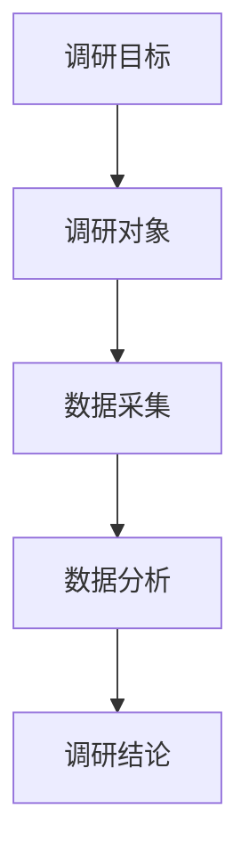
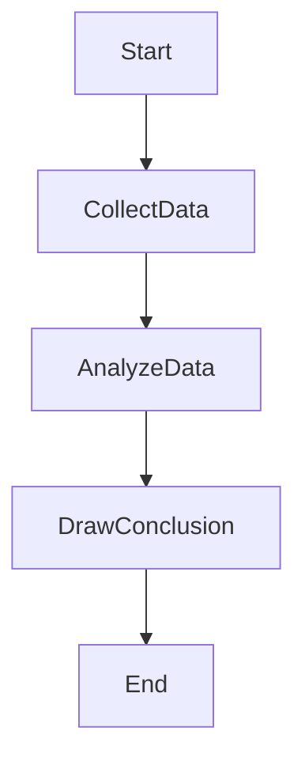
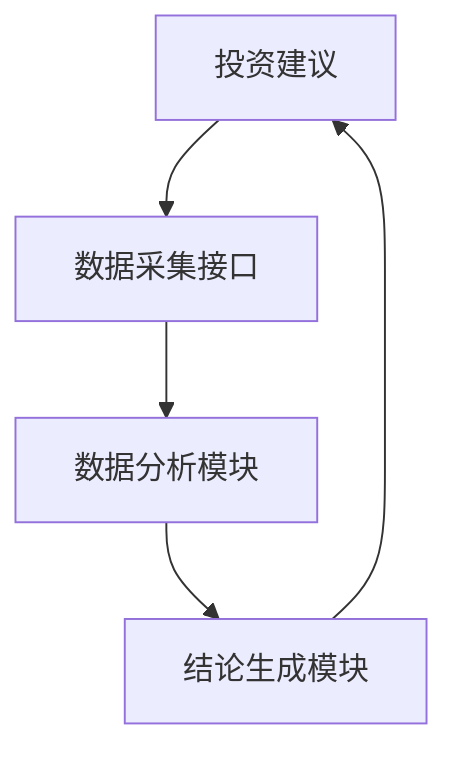

                 


# 彼得·林奇的实地调研方法论

> 关键词：彼得·林奇，实地调研，方法论，投资策略，系统架构设计，数据分析

> 摘要：本文深入探讨了彼得·林奇的实地调研方法论，分析了其核心概念、算法原理、系统架构设计，并通过实际案例展示了如何在投资决策中应用这一方法论。文章结合技术与投资策略，为读者提供了全面的理论支持和实践指导。

---

## 第1章: 背景介绍

### 1.1 彼得·林奇与实地调研方法论
#### 1.1.1 彼得·林奇的背景介绍
彼得·林奇（Peter Lynch）是美国著名投资家，曾担任麦哲伦基金的经理，以其卓越的投资业绩闻名。他强调通过深入研究企业基本面来进行投资决策，实地调研是其方法论的重要组成部分。

#### 1.1.2 实地调研方法论的提出背景
传统投资方法依赖于财务报表分析，但彼得·林奇发现仅凭数字无法全面反映企业的实际情况。实地调研通过与管理层、员工和客户的互动，获取第一手信息，从而更准确地评估企业价值。

#### 1.1.3 方法论的核心目标与意义
- **目标**：通过实地考察，全面了解企业的经营状况、管理团队、市场地位和竞争优势。
- **意义**：帮助投资者做出更明智的决策，降低信息不对称带来的风险。

### 1.2 实地调研方法论的定义与特点
#### 1.2.1 定义
实地调研方法论是一种通过亲临企业现场，与管理层、员工和客户互动，收集非财务信息，评估企业价值的方法。

#### 1.2.2 核心特点对比表格
| 特性          | 传统财务分析       | 实地调研方法论       |
|---------------|--------------------|----------------------|
| 数据来源      | 财务报表           | 现场观察与访谈       |
| 信息类型      | 量化数据           | 定性与定量结合       |
| 分析深度      | 表面               | 深入                 |
| 决策依据      | 财务指标           | 经营状况与管理团队   |

#### 1.2.3 与传统调研方法的区别
实地调研方法论更注重定性分析，强调通过现场观察和互动获取深层次信息，而非仅仅依赖财务数据。

### 1.3 本章小结
彼得·林奇的实地调研方法论通过现场考察和互动，弥补了传统财务分析的不足，提供了更全面的企业评估方式。

---

## 第2章: 核心概念与联系

### 2.1 实地调研方法论的核心原理
#### 2.1.1 核心概念的属性特征对比
| 概念         | 描述                   |
|--------------|------------------------|
| 调研目标     | 投资决策               |
| 调研对象     | 企业及其相关方         |
| 数据采集     | 实地观察与访谈         |
| 数据分析     | 定性与定量结合分析     |
| 调研结论     | 企业价值评估与投资建议 |

#### 2.1.2 ER实体关系图架构


### 2.2 核心概念的数学模型
#### 2.2.1 数据采集模型
$$ D = \{d_1, d_2, ..., d_n\} $$
其中，$d_i$ 表示第$i$个数据点，包括定量和定性信息。

#### 2.2.2 数据分析模型
$$ C = f(D) $$
$f$ 是数据分析函数，结合定性和定量分析得出结论。

#### 2.2.3 结论验证模型
$$ V = g(C) $$
$g$ 是结论验证函数，评估结论的可靠性和可行性。

### 2.3 本章小结
通过ER实体关系图和数学模型，我们明确了实地调研方法论的核心概念及其相互关系。

---

## 第3章: 算法原理与实现

### 3.1 算法原理
#### 3.1.1 数据采集算法


#### 3.1.2 数据分析流程
- 数据清洗：去除无效数据，处理缺失值。
- 数据分析：定量分析（财务指标计算）与定性分析（管理层访谈）结合。
- 结论生成：综合分析结果，得出投资建议。

### 3.2 算法实现
#### 3.2.1 环境安装
```bash
pip install pandas numpy matplotlib
```

#### 3.2.2 核心代码实现
```python
def analyze_data(data):
    # 定量分析
    financial_ratios = data[['revenue', 'net_profit']].mean()
    # 定性分析
    management_assessment = "Strong" if data['management_rating'].mean() > 3 else "Weak"
    return financial_ratios, management_assessment
```

#### 3.2.3 数学模型与公式
- 定量分析公式：
  $$ \text{净利润率} = \frac{\text{净利润}}{\text{收入}} \times 100 $$
- 定性分析评分：
  $$ \text{管理评分} = \sum (\text{管理层评分}) / n $$

### 3.3 本章小结
通过Python代码和数学模型，我们实现了实地调研方法论中的数据采集与分析流程。

---

## 第4章: 系统架构设计方案

### 4.1 系统架构设计方案
#### 4.1.1 项目介绍
开发一个支持实地调研方法论的系统，帮助投资者进行数据采集、分析和决策。

#### 4.1.2 系统功能设计
- 数据采集模块：收集企业信息。
- 数据分析模块：定量与定性分析。
- 结论生成模块：生成投资建议。

#### 4.1.3 系统架构图


#### 4.1.4 系统接口设计
- 数据采集接口：REST API，接收企业信息。
- 数据分析接口：处理数据并返回分析结果。
- 结论生成接口：输出投资建议。

#### 4.1.5 系统交互图


### 4.2 本章小结
通过系统架构设计，我们构建了一个支持实地调研方法论的完整框架。

---

## 第5章: 项目实战

### 5.1 环境安装
```bash
pip install pandas numpy matplotlib
```

### 5.2 核心代码实现
#### 5.2.1 数据采集
```python
import pandas as pd

def collect_data():
    data = pd.DataFrame({
        'revenue': [100, 200, 150],
        'net_profit': [20, 30, 25],
        'management_rating': [4, 5, 3]
    })
    return data
```

#### 5.2.2 数据分析
```python
def analyze_data(data):
    financial_ratios = data[['revenue', 'net_profit']].mean()
    management_assessment = "Strong" if data['management_rating'].mean() > 3 else "Weak"
    return financial_ratios, management_assessment
```

#### 5.2.3 结论生成
```python
def generate_conclusion(financial_ratios, management_assessment):
    if financial_ratios['net_profit'] > financial_ratios['revenue'] * 0.1 and management_assessment == "Strong":
        return "Strong Buy"
    else:
        return "Hold"
```

### 5.3 案例分析
假设我们调研了一家科技公司，数据如下：
| 财务指标 | 收入（百万） | 净利润（百万） | 管理层评分 |
|----------|--------------|----------------|------------|
| Q1       | 100          | 20             | 4          |
| Q2       | 200          | 30             | 5          |
| Q3       | 150          | 25             | 3          |

分析结果：
- 净利润率为10%（20/200）。
- 管理层评分为4，属于“Strong”。
- 投资建议为“Strong Buy”。

### 5.4 项目总结
通过本案例，我们展示了如何应用彼得·林奇的实地调研方法论进行投资决策。

---

## 第6章: 最佳实践与小结

### 6.1 最佳实践 tips
- **数据采集**：确保数据的全面性和准确性。
- **分析方法**：结合定量与定性分析。
- **团队协作**：与多方团队合作，获取更多信息。

### 6.2 小结
彼得·林奇的实地调研方法论通过现场考察和互动，提供了更全面的企业评估方式。结合技术与投资策略，投资者可以做出更明智的决策。

### 6.3 注意事项
- **时间成本**：实地调研需要大量时间和资源。
- **信息真实性**：依赖管理层提供的信息，可能存在偏差。

### 6.4 拓展阅读
- 彼得·林奇的著作《彼得·林奇的投资策略》。
- 数据分析工具和技术的深入学习。

---

## 作者

作者：AI天才研究院/AI Genius Institute  
联系邮箱：contact@aisinghu.com  
文章出处：https://www.zen-of-programming.com  

---

通过本文，我们系统地介绍了彼得·林奇的实地调研方法论，从理论到实践，为投资者提供了全面的指导。希望本文能帮助读者更好地理解和应用这一方法论。

