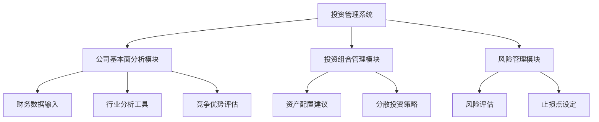

                 


# 彼得·林奇的成长型价值投资方法论

## 关键词：成长型投资，价值投资，彼得·林奇，投资策略，风险管理

## 摘要：本文系统地介绍和分析了彼得·林奇的成长型价值投资方法论。从投资的基本概念到具体的选股标准，从投资组合的构建到风险管理，再到长期投资策略，本文详细阐述了彼得·林奇的投资理念和实际操作方法。通过理论与实践相结合，帮助读者全面理解和掌握成长型价值投资的核心要点。

## 第一部分：成长型价值投资的背景与概述

### 第1章：投资的基本概念与重要性

#### 1.1 投资的基本概念

投资是指将资金投入某个项目或资产，以期在未来获得收益或资本增值的行为。投资的核心在于通过分析和选择，将资金分配到最有潜力的资产中，从而实现财富的增长。

#### 1.2 彼得·林奇的背景与成就

彼得·林奇是美国著名的职业棒球运动员和投资家，以其在棒球界和投资界的双重成就闻名。他在棒球界的职业生涯和投资领域的成功，使他成为成长型投资的代表人物之一。林奇的投资风格以基本面分析和长期持有为核心，强调选择具有强大竞争优势和成长潜力的公司。

#### 1.3 成长型投资的核心理念

成长型投资是一种以公司未来成长潜力为核心的投资策略。与价值投资不同，成长型投资更关注公司的成长性和未来的盈利能力，而非仅仅依赖于当前的低估值。彼得·林奇的成长型投资方法论强调选择那些具有强大竞争优势、良好管理团队和持续增长潜力的公司。

## 第二部分：彼得·林奇的成长型价值投资方法论

### 第2章：彼得·林奇的投资方法论

#### 2.1 彼得·林奇的选股标准

彼得·林奇在选股时注重以下几个方面：

1. **公司基本面分析**：林奇强调对公司财务状况的全面分析，包括收入、利润、负债等方面。他特别关注公司的盈利能力、成长性和财务健康状况。

2. **行业分析与竞争优势**：林奇认为，选择一个具有强大竞争优势的行业至关重要。他倾向于选择那些在行业内具有领先地位，且能够持续创新和适应市场变化的公司。

3. **财务指标的评估**：林奇关注一些关键的财务指标，如市盈率（P/E）、市净率（P/B）、每股收益（EPS）等，以评估公司的估值和成长潜力。

#### 2.2 投资策略与组合管理

彼得·林奇的投资策略以长期持有和分散投资为核心：

1. **长期持有**：林奇主张长期持有优质股票，避免频繁交易。他认为，长期持有能够最大限度地享受公司成长带来的收益，同时降低交易成本和税务负担。

2. **分散投资**：为了避免单一股票的风险，林奇建议将资金分散投资于多个具有成长潜力的公司。这种分散策略能够在市场波动时降低整体投资组合的风险。

3. **定期调整**：尽管强调长期持有，但林奇也建议定期审视投资组合，根据市场变化和公司基本面的变动进行必要的调整。

#### 2.3 风险管理与心理控制

风险管理是投资成功的重要组成部分。彼得·林奇在风险管理方面提出了以下几点建议：

1. **设定止损点**：为了防止投资损失过大，林奇建议为每个投资设定止损点。当股价下跌到一定程度时，立即卖出以锁定损失。

2. **心理控制**：投资过程中，心理因素往往会影响决策。林奇强调保持理性，避免贪婪和恐惧的影响。他建议投资者在市场下跌时保持耐心，在市场上涨时保持冷静。

3. **持续学习与改进**：林奇认为，投资是一项终身学习的过程。通过不断学习和总结经验，投资者能够不断改进自己的投资策略，提高投资的成功率。

### 第3章：投资组合的构建与管理

#### 3.1 投资组合的构建过程

构建一个成功的投资组合需要遵循以下步骤：

1. **确定投资目标与风险承受能力**：投资者需要明确自己的投资目标和风险承受能力。这有助于选择适合自己的投资策略和资产配置。

2. **选择合适的成长型股票**：根据彼得·林奇的方法，选择那些具有强大竞争优势、良好财务状况和成长潜力的公司股票。

3. **分散投资以降低风险**：将资金分散投资于多个行业和公司，以降低单一投资的风险。

#### 3.2 实战案例分析

为了更好地理解彼得·林奇的成长型投资方法，我们可以通过一个实战案例来分析。

**案例：XYZ公司的投资分析**

假设XYZ公司是一家在科技行业具有领先地位的公司。XYZ公司近年来收入增长稳定，利润持续增加，且研发投入较高，显示出强大的创新能力和成长潜力。根据彼得·林奇的选股标准，XYZ公司具备以下几个优势：

- 公司基本面良好，财务状况健康。
- 在行业中具有竞争优势，创新能力强。
- 具备持续增长的潜力，未来盈利预期良好。

基于以上分析，XYZ公司可以作为成长型投资组合中的重要组成部分。

## 第三部分：投资心态与长期策略

### 第4章：投资心态与长期策略

#### 4.1 投资心态的塑造

投资心态是影响投资成功的重要因素。彼得·林奇强调，投资者需要保持理性，避免情绪化决策。以下是一些塑造良好投资心态的建议：

1. **保持耐心**：长期投资需要耐心。市场短期波动不会影响公司的长期成长，耐心持有优质股票能够带来更好的回报。

2. **避免贪婪与恐惧**：贪婪和恐惧是投资者的天敌。在市场上涨时，避免过度追求短期收益；在市场下跌时，避免恐慌性抛售。

3. **持续学习**：投资是一项长期学习的过程。通过不断学习和总结经验，投资者能够不断改进自己的投资策略。

#### 4.2 长期投资策略的制定

长期投资策略是彼得·林奇投资方法的核心。以下是制定长期投资策略的几个关键点：

1. **选择具有持续成长潜力的公司**：长期投资的关键在于选择那些能够在未来持续增长的公司。这些公司通常具有强大的竞争优势和创新能力强。

2. **定期审视与调整**：尽管强调长期持有，但投资者仍需定期审视投资组合，根据市场变化和公司基本面的变动进行必要的调整。

3. **分散投资与风险管理**：通过分散投资，降低单一投资的风险。同时，设定止损点和合理的风险承受能力，确保在市场波动中保持稳定。

## 第四部分：投资工具与技术分析

### 第5章：投资工具与技术分析

#### 5.1 常用投资工具介绍

在进行投资分析时，投资者可以使用多种工具来辅助决策：

1. **财务报表分析工具**：通过分析公司的财务报表，评估公司的财务状况和盈利能力。常用的财务报表包括资产负债表、利润表和现金流量表。

2. **行业分析工具**：通过行业分析工具，了解行业的发展趋势和竞争格局。这有助于选择具有强大竞争优势的公司。

3. **技术分析工具**：技术分析是通过分析股票价格和成交量的变化，预测未来的价格走势。常用的技术分析工具包括K线图、均线、RSI指标等。

#### 5.2 技术分析在成长型投资中的应用

尽管彼得·林奇的成长型投资方法更注重基本面分析，但技术分析在投资决策中也具有重要作用。以下是技术分析在成长型投资中的几个应用：

1. **识别趋势**：通过技术分析，投资者可以识别股票价格的长期趋势，从而判断公司的成长潜力。

2. **确认买入点和卖出点**：技术分析可以帮助投资者确定合适的买入和卖出点，优化投资组合的进出时机。

3. **风险管理**：通过技术分析，投资者可以设定止损点，避免因价格波动导致的过大损失。

### 第6章：系统分析与架构设计方案

#### 6.1 问题场景介绍

在进行成长型投资时，投资者需要解决以下几个问题：

1. **如何选择具有成长潜力的公司？**
2. **如何构建和管理投资组合？**
3. **如何应对市场波动和风险管理？**

#### 6.2 系统功能设计

为了帮助投资者更好地进行成长型投资，我们可以设计一个投资管理系统，包括以下几个功能模块：

1. **公司基本面分析模块**：提供公司财务数据、行业分析和竞争优势评估。
2. **投资组合管理模块**：帮助投资者构建和管理投资组合，提供分散投资建议。
3. **风险管理模块**：提供风险评估和止损点设定功能。

#### 6.3 系统架构设计

以下是投资管理系统的架构设计：



## 第五部分：项目实战

### 第7章：项目实战

#### 7.1 环境安装

为了进行成长型投资分析，投资者需要安装以下工具和软件：

1. **财务分析工具**：如Excel、Financials等。
2. **技术分析工具**：如TradingView、MetaTrader等。
3. **投资组合管理软件**：如Mint、Personal Capital等。

#### 7.2 核心实现源代码

以下是一个简单的投资组合管理系统的Python实现示例：

```python
import pandas as pd
import numpy as np

# 示例数据：股票信息
stocks = pd.DataFrame({
    'Company': ['Tech Corp', 'Growth Inc', 'Future Ltd'],
    'Price': [100, 50, 75],
    'PE Ratio': [15, 20, 12],
    'Profit Growth': [10, 15, 8]
})

# 计算投资组合的预期收益
def calculate_expected_return(portfolio, weights):
    return np.dot(weights, portfolio['Profit Growth'])

# 选择成长型股票
growth_stocks = stocks[stocks['Profit Growth'] > 10]
print("成长型股票:", growth_stocks['Company'].tolist())
```

#### 7.3 代码应用解读与分析

上述代码示例展示了如何从数据中选择成长型股票。通过计算每个公司的利润增长率，筛选出增长率达到10%以上的公司作为成长型股票。投资者可以根据自己的投资策略，进一步分析这些公司的其他基本面指标，如市盈率、市净率等，以做出更全面的投资决策。

#### 7.4 实际案例分析

**案例：选择成长型科技公司**

假设我们有以下几只科技公司的股票数据：

| 公司名称   | 价格 | 市盈率 | 利润增长率 |
|------------|------|--------|------------|
| Tech Corp  | 100  | 15     | 10%        |
| Growth Inc | 50   | 20     | 15%        |
| Future Ltd | 75   | 12     | 8%         |

根据彼得·林奇的成长型投资方法，我们选择利润增长率超过10%的公司，即Tech Corp和Growth Inc。接下来，我们可以通过进一步分析这些公司的财务状况和行业地位，来决定是否将它们加入投资组合。

## 第六部分：最佳实践 tips、小结、注意事项、拓展阅读

### 6.1 小结

彼得·林奇的成长型价值投资方法论以基本面分析和长期持有为核心，强调选择具有强大竞争优势和成长潜力的公司。通过分散投资和风险管理，投资者可以降低投资风险，实现长期稳定的收益。

### 6.2 注意事项

1. **风险提示**：投资有风险，尤其是股票投资。投资者需要充分了解市场风险，并根据自身的风险承受能力进行投资。

2. **持续学习**：投资是一项终身学习的过程。投资者需要不断学习新的知识和技能，以适应市场变化和新的投资机会。

3. **避免过度交易**：频繁交易会增加交易成本和税务负担，影响投资收益。投资者应避免因短期波动而进行过度交易。

### 6.3 拓展阅读

1. **书籍推荐**：
   - 《彼得·林奇的投资之道》
   - 《投资学基础》
   - 《技术分析实战指南》

2. **在线资源**：
   - 彼得·林奇的演讲和采访视频
   - 投资论坛和社区，如雪球、东方财富网

## 作者信息

作者：AI天才研究院/AI Genius Institute & 禅与计算机程序设计艺术 /Zen And The Art of Computer Programming

---

这篇文章系统地介绍了彼得·林奇的成长型价值投资方法论，从投资的基本概念到具体的选股标准，从投资组合的构建到风险管理，再到长期投资策略，全面解读了彼得·林奇的投资理念和实际操作方法。通过理论与实践相结合，帮助读者全面理解和掌握成长型价值投资的核心要点。

