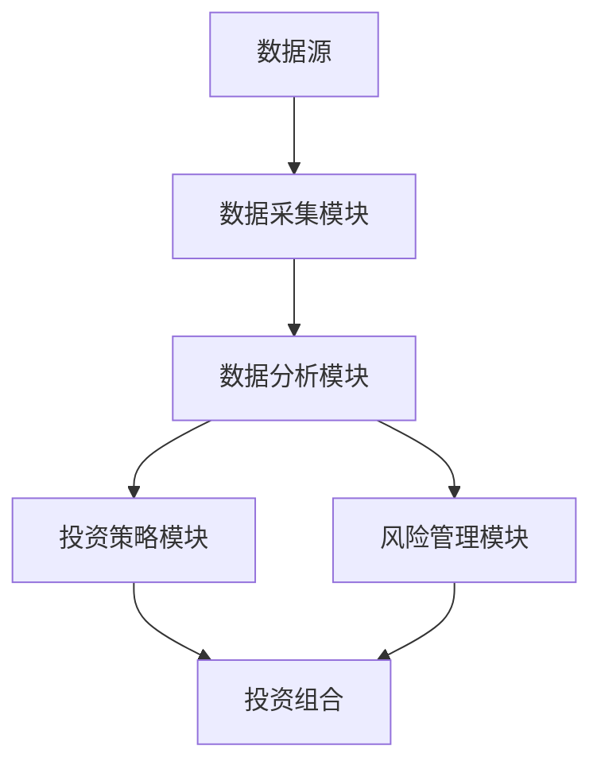

                 


# 彼得·林奇的新兴市场投资策略

> **关键词**：彼得·林奇，新兴市场，投资策略，风险管理，基本面分析，量化模型  
> **摘要**：本文深入分析了彼得·林奇在新兴市场投资中的策略，从基本面分析、行业选择、风险管理到数学模型构建，全面解析其投资哲学，并结合实际案例和系统设计，为投资者提供深度见解。

---

# 第一部分：新兴市场的定义与特点

## 第1章：新兴市场的概念与背景

### 1.1 新兴市场的定义与背景

**1.1.1 新兴市场的定义**  
新兴市场是指那些经济快速增长、但尚未完全工业化的国家或地区。这些市场通常具有较大的发展潜力，但也伴随着较高的风险。

**1.1.2 新兴市场的历史发展**  
新兴市场的发展始于20世纪60年代，随着拉丁美洲、亚洲和东欧国家的经济改革，这些市场逐渐吸引了全球投资者的关注。

**1.1.3 新兴市场的经济特征**  
新兴市场通常具有以下特征：  
- 经济增速快，但波动性较大。  
- 产业结构多元化，但制造业和服务业占据主导地位。  
- 政治和经济政策不稳定，但改革潜力大。

### 1.2 彼得·林奇的投资理念

**1.2.1 彼得·林奇的个人背景**  
彼得·林奇是美国著名基金经理，曾管理富达麦哲伦基金，创造了年化13.5%的超额收益。他的投资风格以基本面分析和长期持有著称。

**1.2.2 林奇的投资哲学**  
林奇强调：  
1. **价值投资**：寻找被低估的公司，关注基本面指标如PE、PB等。  
2. **行业选择**：重点投资高增长行业，如科技、消费等。  
3. **风险管理**：分散投资，避免过度集中。

---

## 第2章：新兴市场的投资机会与风险

### 2.1 新兴市场的投资机会

**2.1.1 新兴市场的增长潜力**  
新兴市场的人口红利和工业化进程为其提供了巨大的增长空间。

**2.1.2 新兴市场的行业分布**  
新兴市场的行业结构通常较为多元化，涵盖科技、消费、金融等多个领域。

**2.1.3 新兴市场的创新动力**  
新兴市场的科技公司往往具有较强的创新能力，尤其是在人工智能、5G等领域。

### 2.2 新兴市场的投资风险

**2.2.1 经济波动风险**  
新兴市场受全球经济波动影响较大，容易出现剧烈波动。

**2.2.2 政治风险**  
政策变化和政治不稳定可能对市场产生重大影响。

**2.2.3 市场流动性风险**  
新兴市场的流动性通常较低，尤其是在市场下跌时，投资者可能难以快速变现。

---

## 第3章：彼得·林奇的投资策略

### 3.1 林奇的投资方法论

**3.1.1 基本面分析**  
林奇强调对公司基本面的深入研究，包括财务指标（如ROE、净利润率）和行业地位。

**3.1.2 行业分析**  
林奇倾向于投资高增长行业，如科技和消费，同时避免周期性过强的行业。

**3.1.3 公司分析**  
林奇关注公司的竞争优势、管理团队和财务健康状况。

### 3.2 林奇的投资组合管理

**3.2.1 资产配置**  
林奇注重分散投资，通常将资金分配到多个行业和公司，以降低风险。

**3.2.2 风险控制**  
林奇通过设定止损点和动态调整持仓来控制风险。

**3.2.3 动态调整**  
根据市场变化和公司基本面，定期审视和调整投资组合。

---

## 第4章：新兴市场的具体投资策略

### 4.1 行业选择策略

**4.1.1 高成长行业**  
优先选择科技、消费和医疗等高成长行业的公司。

**4.1.2 周期性行业**  
谨慎对待周期性行业，如能源和材料，需关注宏观经济走势。

**4.1.3 防御性行业**  
在市场波动较大时，投资防御性行业，如公用事业和金融。

### 4.2 公司选择策略

**4.2.1 财务指标分析**  
关注PE、PB、ROE等指标，寻找被低估的公司。

**4.2.2 管理团队评估**  
重视公司管理层的稳定性、能力和战略眼光。

**4.2.3 竞争优势分析**  
寻找具有独特竞争优势的公司，如专利、品牌或技术。

### 4.3 市场进入策略

**4.3.1 直接投资**  
通过购买个股或ETF直接投资新兴市场。

**4.3.2 通过基金间接投资**  
选择专业的新兴市场基金，降低直接投资的风险。

**4.3.3 股票与债券组合**  
根据市场环境，动态调整股票和债券的比例。

---

## 第5章：彼得·林奇投资策略的数学模型与算法

### 5.1 投资组合优化模型

**5.1.1 Markowitz现代投资组合理论**  
Markowitz理论通过优化风险和收益，构建最优投资组合。

**5.1.2 林奇投资策略的数学表达**  
林奇策略可以表示为：  
$$ \text{收益最大化} = \sum_{i=1}^{n} w_i r_i $$  
$$ \text{风险最小化} = \sum_{i=1}^{n} \sum_{j=1}^{n} w_i w_j \sigma_i \sigma_j $$  

其中，\( w_i \)为权重，\( r_i \)为收益，\( \sigma_i \)为波动率。

### 5.2 行业选择的量化分析

**5.2.1 行业PE/PB分析**  
计算各行业的PE和PB值，寻找低估行业。

**5.2.2 行业增长潜力评估**  
通过GDP增速、行业增长率等指标评估行业潜力。

**5.2.3 行业风险系数计算**  
使用CAPM模型计算行业风险系数。

### 5.3 公司估值模型

**5.3.1 市盈率（PE）分析**  
$$ \text{PE} = \frac{\text{股价}}{\text{每股收益}} $$  

**5.3.2 市净率（PB）分析**  
$$ \text{PB} = \frac{\text{股价}}{\text{每股净资产}} $$  

**5.3.3 内在价值评估**  
使用现金流折现模型（DCF）评估公司内在价值。

---

## 第6章：系统分析与架构设计方案

### 6.1 投资分析系统框架

**6.1.1 系统功能模块划分**  
- 数据采集模块  
- 数据分析模块  
- 投资策略模块  
- 风险管理模块  

**6.1.2 系统数据流图**  


**6.1.3 系统架构设计**  


### 6.2 系统接口设计

**6.2.1 数据接口**  
- 数据输入接口：接收市场数据。  
- 数据输出接口：输出投资建议和风险评估。

**6.2.2 系统交互设计**  
```mermaid
sequenceDiagram
    actor 投资者
    participant 系统
    投资者->系统：输入投资目标
    系统->投资者：返回投资组合建议
```

---

## 第7章：项目实战

### 7.1 环境安装

**7.1.1 安装Python**  
```bash
# 安装Python和pip
sudo apt-get update
sudo apt-get install python3 python3-pip
```

**7.1.2 安装数据处理库**  
```bash
pip install pandas numpy matplotlib
```

### 7.2 核心实现源代码

**7.2.1 数据分析代码**  
```python
import pandas as pd
import numpy as np

# 假设df是包含股票数据的DataFrame
df['PE'] = df['股价'] / df['每股收益']
df['PB'] = df['股价'] / df['每股净资产']
df['低估股票'] = df['PE'] < 15 & df['PB'] < 2
```

**7.2.2 可视化代码**  
```python
import matplotlib.pyplot as plt

plt.figure(figsize=(10,6))
plt.plot(df['日期'], df['股价'], label='股价')
plt.xlabel('日期')
plt.ylabel('股价')
plt.title('股票走势分析')
plt.legend()
plt.show()
```

### 7.3 案例分析

**7.3.1 案例背景**  
假设我们分析一家新兴市场的科技公司，其PE为12，PB为1.5，ROE为18%。

**7.3.2 数据分析与解读**  
- 公司PE和PB均低于行业平均水平，表明其股价可能被低估。  
- ROE较高，说明公司盈利能力强。

**7.3.3 投资建议**  
建议投资者关注该公司，考虑逐步建仓。

### 7.4 项目小结

通过Python代码和数据分析，我们可以量化评估新兴市场的投资机会，帮助投资者做出更明智的决策。

---

## 第8章：总结与展望

### 8.1 总结

彼得·林奇的新兴市场投资策略强调基本面分析、行业选择和风险管理。通过量化模型和系统设计，我们可以更科学地应用这些策略。

### 8.2 展望

未来，随着人工智能和大数据技术的发展，新兴市场的投资策略将更加精准和高效。投资者需要不断学习和适应，以抓住新兴市场的机遇。

---

## 第9章：注意事项与最佳实践

### 9.1 注意事项

- **风险控制**：新兴市场波动大，需设定止损点。  
- **分散投资**：避免过度集中，降低风险。  
- **持续学习**：市场变化快，需不断更新知识和策略。

### 9.2 最佳实践

- **定期复盘**：分析投资组合的表现和风险。  
- **关注行业动态**：及时了解新兴市场的行业趋势。  
- **结合量化工具**：利用数据分析和量化模型辅助决策。

---

## 第10章：小结

彼得·林奇的新兴市场投资策略为投资者提供了宝贵的思路。通过基本面分析、行业选择和风险管理，结合量化模型和系统设计，我们可以更好地把握新兴市场的投资机会。

---

**作者**：AI天才研究院/AI Genius Institute & 禅与计算机程序设计艺术 /Zen And The Art of Computer Programming

