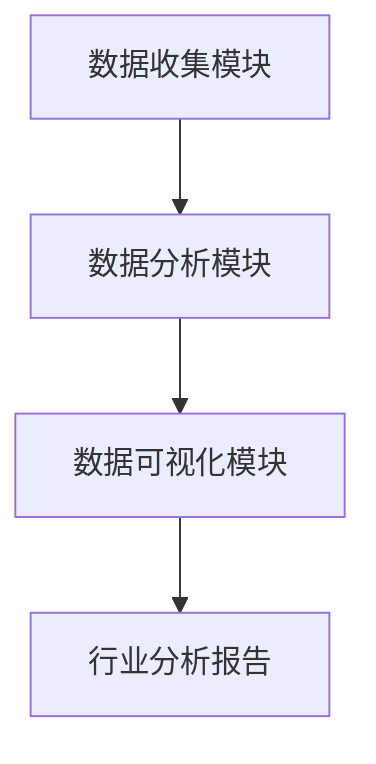
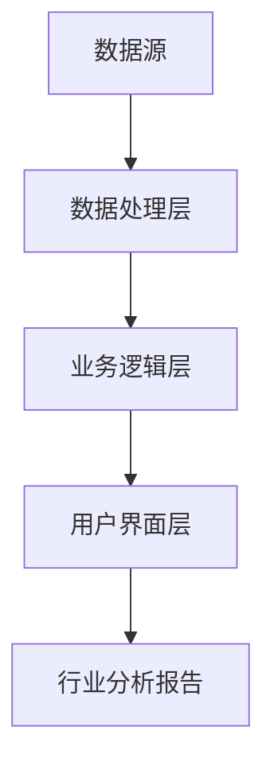
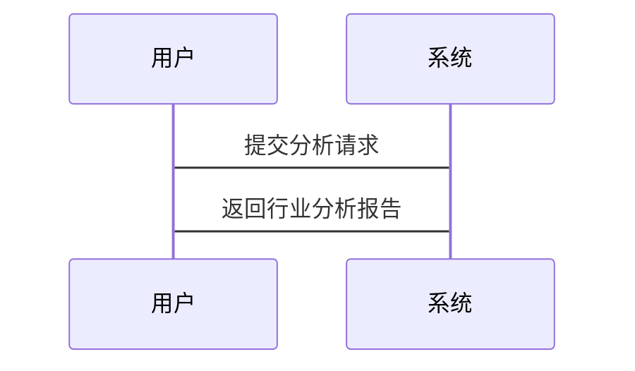

                 

# 彼得·林奇的行业分析方法论

## 关键词：行业分析，彼得·林奇，投资方法，财务分析，竞争结构

## 摘要：本文系统地介绍了彼得·林奇的行业分析方法论，从基本概念、核心框架到数学模型、系统设计，详细阐述了如何通过行业分析进行投资决策。文章结合实际案例，展示了如何应用这些方法进行项目实战，并提供了丰富的工具和资源，帮助读者掌握这一方法。

---

# 第1章：行业分析的背景与重要性

## 1.1 行业分析的核心概念

### 1.1.1 行业分析的定义

行业分析是通过研究特定行业内的市场结构、竞争状况、财务表现等因素，评估行业的发展潜力和投资价值的过程。它是投资决策的重要组成部分，帮助投资者识别行业中的优势企业。

### 1.1.2 行业分析的背景与意义

随着经济全球化和市场的不断细分，投资者需要更深入地了解所投资的行业。行业分析能够帮助投资者识别行业风险、把握行业趋势，从而做出更明智的投资决策。

### 1.1.3 行业分析的核心要素

- **市场规模**：行业的总收入、用户数量等。
- **竞争结构**：行业的竞争程度，主要竞争对手分析。
- **财务指标**：行业的盈利能力、成长性等。

## 1.2 彼得·林奇与行业分析

### 1.2.1 彼得·林奇的生平简介

彼得·林奇是美国著名投资经理，以其在共同基金领域的成功著称。他的投资哲学强调深入研究行业和公司基本面，寻找具有长期增长潜力的企业。

### 1.2.2 彼得·林奇的投资哲学

林奇主张通过深入研究行业趋势和公司基本面，寻找那些被市场低估的投资机会。他强调长期投资和价值发现，反对短期市场波动的干扰。

### 1.2.3 彼得·林奇的行业分析方法论

林奇的行业分析方法论包括行业生命周期分析、竞争结构分析和财务指标分析等。他特别关注行业的增长潜力和公司的竞争优势。

## 1.3 本书的核心内容与目标

### 1.3.1 本书的核心目标

系统介绍彼得·林奇的行业分析方法，提供可操作的步骤和工具，帮助读者掌握这一方法。

### 1.3.2 本书的结构安排

从行业分析的基本概念到数学模型，再到系统设计和项目实战，层层深入，全面覆盖。

### 1.3.3 本书的适用读者

适用于投资者、金融从业者以及对行业分析感兴趣的学生和研究者。

---

# 第2章：彼得·林奇行业分析方法的核心框架

## 2.1 行业分析的基本框架

### 2.1.1 行业的生命周期分析

行业生命周期分为导入期、成长期、成熟期和衰退期。林奇强调识别行业所处的生命周期阶段，以判断其增长潜力。

### 2.1.2 行业的竞争结构分析

使用五力模型（波特五力分析）来评估行业内的竞争程度，包括新进入者的威胁、现有竞争者之间的竞争程度等。

### 2.1.3 行业的财务指标分析

通过分析行业的财务指标，如利润率、增长率等，评估行业的盈利能力和发展潜力。

## 2.2 彼得·林奇的核心分析方法

### 2.2.1 "烟圈"投资法

寻找那些具有独特竞争优势、市场地位稳固的企业，这些企业能够在行业变化中保持优势。

### 2.2.2 行业拐点的识别

通过分析行业数据和趋势，识别行业的转折点，判断行业的未来走势。

### 2.2.3 竞争对手分析法

深入研究行业内主要竞争对手的优劣势，评估公司在行业中的位置和竞争优势。

## 2.3 行业分析的步骤与流程

### 2.3.1 确定分析目标

明确分析的目的，是评估行业的投资潜力，还是寻找潜在的投资机会。

### 2.3.2 收集行业数据

收集与行业相关的数据，包括市场规模、竞争结构、财务指标等。

### 2.3.3 分析行业趋势

通过数据分析，识别行业的主要趋势和驱动因素。

### 2.3.4 评估行业风险

识别行业中的潜在风险，如政策变化、技术进步等。

### 2.3.5 得出分析结论

综合分析结果，得出行业的投资价值和潜在风险。

---

# 第3章：行业分析的核心要素与指标

## 3.1 行业市场规模分析

### 3.1.1 市场规模的定义与计算

市场规模是指行业内所有企业的总收入或用户数量。计算市场规模需要考虑行业的产品价格、销售量等因素。

### 3.1.2 影响市场规模的主要因素

- 市场需求：消费者对产品或服务的需求量。
- 行业价格：产品的价格水平。
- 行业结构：行业的集中度和竞争程度。

### 3.1.3 市场规模的预测方法

使用增长率模型预测市场规模，如CAGR（复合年均增长率）。

## 3.2 行业竞争结构分析

### 3.2.1 五力模型在行业分析中的应用

五力模型包括潜在进入者的威胁、现有竞争者之间的竞争程度、替代品的威胁、供应商的议价能力和买家的议价能力。

### 3.2.2 行业集中度分析

分析行业内主要企业的市场份额，评估行业的集中程度。

### 3.2.3 竞争对手分析的技巧

通过分析竞争对手的市场份额、产品差异化、成本结构等，评估其竞争优势。

## 3.3 行业财务指标分析

### 3.3.1 主要财务指标的定义

- 利润率：净利润率、毛利率等。
- 增长率：收入增长率、利润增长率等。
- 财务健康度：资产负债率、流动比率等。

### 3.3.2 财务指标与行业分析的关系

通过对比行业内的财务指标，评估企业的财务健康状况和盈利能力。

### 3.3.3 财务指标的行业比较分析

将行业内企业的财务指标与行业平均水平进行比较，识别异常值和潜在问题。

---

# 第4章：彼得·林奇行业分析方法的数学模型与算法

## 4.1 行业增长潜力评估模型

### 4.1.1 模型的数学表达式

$$\text{行业增长潜力} = \frac{\text{行业增长率} \times \text{行业规模}}{\text{行业竞争程度}}$$

其中，行业增长率可以用年增长率表示，行业规模可以用总收入表示，行业竞争程度可以用CR4（前四家企业的市场份额）表示。

### 4.1.2 模型的适用场景

用于评估行业的整体增长潜力，帮助投资者判断行业是否值得进一步研究。

### 4.1.3 案例分析

假设某行业的年增长率为10%，市场规模为100亿美元，CR4为60%。根据公式，行业增长潜力为：

$$\frac{10\% \times 100}{60\%} = 1.67$$

这意味着该行业的增长潜力为1.67倍，具有较高的投资价值。

## 4.2 竞争对手分析算法

### 4.2.1 算法的数学表达式

$$\text{竞争对手优势度} = \frac{\text{竞争对手市场份额} + \text{竞争对手产品差异化}}{\text{行业平均市场份额} + \text{行业平均产品差异化}}$$

### 4.2.2 算法的实现步骤

1. 收集行业内主要竞争对手的市场份额和产品差异化指标。
2. 计算行业平均市场份额和平均产品差异化。
3. 计算竞争对手的优势度。

### 4.2.3 案例分析

假设行业有四家企业，市场份额分别为30%、25%、20%、15%，产品差异化分别为0.8、0.7、0.6、0.5。行业平均市场份额为20%，平均产品差异化为0.6。计算竞争对手的优势度：

$$\text{竞争对手优势度} = \frac{30\% + 0.8}{20\% + 0.6} = \frac{30.8}{20.6} \approx 1.5$$

这意味着该竞争对手在市场份额和产品差异化方面具有较高的优势。

## 4.3 行业风险评估模型

### 4.3.1 模型的数学表达式

$$\text{行业风险指数} = \sum_{i=1}^{n} w_i \times r_i$$

其中，\(w_i\) 是风险因素的权重，\(r_i\) 是风险因素的实际风险值。

### 4.3.2 模型的实现步骤

1. 确定影响行业的主要风险因素，如政策风险、技术风险、市场风险等。
2. 确定每个风险因素的权重。
3. 评估每个风险因素的实际风险值。
4. 计算行业风险指数。

### 4.3.3 案例分析

假设行业风险因素包括政策风险（权重30%）、技术风险（权重20%）、市场风险（权重25%）、供应风险（权重25%）。实际风险值分别为0.7、0.6、0.8、0.5。计算行业风险指数：

$$\text{行业风险指数} = 0.3 \times 0.7 + 0.2 \times 0.6 + 0.25 \times 0.8 + 0.25 \times 0.5 = 0.21 + 0.12 + 0.2 + 0.125 = 0.655$$

这意味着该行业的整体风险指数为0.655，属于中等风险水平。

---

# 第5章：系统分析与架构设计

## 5.1 系统功能设计

### 5.1.1 功能模块

- 数据收集模块：收集行业数据，包括市场规模、竞争结构、财务指标等。
- 数据分析模块：对收集的数据进行处理和分析，生成行业分析报告。
- 数据可视化模块：将分析结果以图表形式展示，便于用户理解。

### 5.1.2 系统功能图

## 5.2 系统架构设计

### 5.2.1 系统架构图

## 5.3 系统接口设计

### 5.3.1 数据接口

- 数据输入接口：接收行业数据。
- 数据输出接口：生成行业分析报告。

### 5.3.2 用户接口

- 用户输入界面：用户输入分析需求。
- 用户输出界面：展示分析结果。

## 5.4 系统交互设计

### 5.4.1 交互流程图

---

# 第6章：项目实战

## 6.1 项目背景与目标

### 6.1.1 项目背景

选择一个具体的行业，如科技行业，进行深入分析。

### 6.1.2 项目目标

通过实际案例，展示如何应用彼得·林奇的行业分析方法进行投资决策。

## 6.2 数据收集与处理

### 6.2.1 数据来源

- 行业报告：如IDC、Gartner等。
- 公司财报：获取上市公司的财务数据。
- 新闻报道：了解行业动态和政策变化。

### 6.2.2 数据清洗

去除无效数据，处理缺失值和异常值，确保数据的准确性和完整性。

## 6.3 数据分析与建模

### 6.3.1 行业增长潜力评估

使用第4章中的模型，评估科技行业的增长潜力。

### 6.3.2 竞争对手分析

分析行业内主要竞争对手的优势和劣势。

### 6.3.3 风险评估

评估科技行业的整体风险水平。

## 6.4 数据可视化

### 6.4.1 可视化工具

使用Tableau、Power BI等工具，将分析结果以图表形式展示。

## 6.5 结果展示与解读

### 6.5.1 分析结果

展示行业的增长潜力、竞争优势和潜在风险。

### 6.5.2 投资建议

基于分析结果，给出具体的投资建议。

---

# 第7章：总结与展望

## 7.1 总结

彼得·林奇的行业分析方法论提供了一套系统化的分析工具和方法，帮助投资者更好地理解和把握行业趋势，做出更明智的投资决策。

## 7.2 未来展望

随着大数据和人工智能技术的发展，行业分析将更加精准和高效。未来的研究可以进一步结合这些技术，提升分析的深度和广度。

---

# 附录：工具与资源

## 10.1 数据收集工具

- **网络爬虫**：用于从网页上抓取数据。
- **API接口**：通过API获取实时数据。
- **数据库**：利用行业数据库获取历史数据。

## 10.2 数据分析工具

- **Python**：使用Pandas、NumPy等库进行数据处理。
- **R**：用于统计分析和数据建模。
- **Excel**：简单的数据处理和可视化。

## 10.3 可视化工具

- **Tableau**：强大的数据可视化工具。
- **Power BI**：微软的商业智能工具。
- **Matplotlib**：Python中的绘图库。

## 10.4 行业报告来源

- **IDC**：国际数据公司。
- **Gartner**：信息技术研究和咨询公司。
- **Forrester**：著名的技术研究公司。

---

# 作者：AI天才研究院/AI Genius Institute & 禅与计算机程序设计艺术 /Zen And The Art of Computer Programming

---

以上是《彼得·林奇的行业分析方法论》的技术博客文章，涵盖了从基本概念到数学模型、系统设计再到项目实战的全过程。通过详细讲解每一步骤和方法，帮助读者掌握这一行业的分析技巧，并能够在实际中灵活应用。

