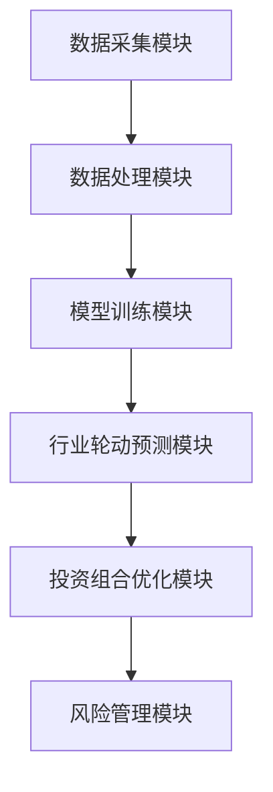
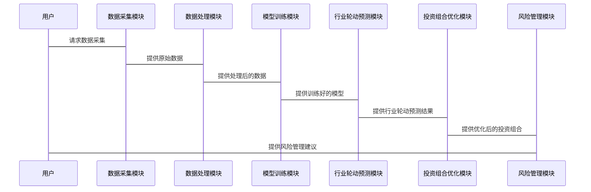

                 


# 彼得·林奇的行业轮动投资策略

**关键词**：行业轮动投资策略，彼得·林奇，经济周期，行业轮动，投资策略

**摘要**：本文详细探讨了彼得·林奇提出的行业轮动投资策略，从基本概念到算法原理，再到系统设计与项目实战，系统地分析了该策略的理论基础、实现方法及其在实际投资中的应用效果。文章通过丰富的案例和详细的代码实现，帮助读者全面理解并掌握行业轮动投资策略的应用技巧。

---

# 第一部分: 行业轮动投资策略概述

## 第1章: 行业轮动投资策略的背景与概念

### 1.1 行业轮动的基本概念

#### 1.1.1 行业轮动的定义

行业轮动（Industry Rotation）是一种投资策略，指投资者根据经济周期和行业发展趋势的变化，动态调整投资组合中各行业资产的比例，以捕捉不同行业在不同经济阶段的收益机会。

#### 1.1.2 行业轮动的背景与重要性

行业轮动投资策略的背景可以追溯到经济周期理论。经济周期的波动直接影响不同行业的表现，因此通过行业轮动，投资者可以在不同经济阶段选择表现最佳的行业进行投资，从而优化投资组合的收益与风险比。

#### 1.1.3 彼得·林奇与行业轮动投资策略

彼得·林奇是美国著名投资经理人，曾管理富达麦哲伦基金多年，取得了卓越的投资业绩。他提出行业轮动投资策略的核心思想是，通过分析宏观经济环境和行业基本面，选择那些在当前经济环境下表现较好的行业进行投资。

### 1.2 行业轮动的理论基础

#### 1.2.1 经济周期理论

经济周期通常分为复苏、过热、滞胀和衰退四个阶段。在每个阶段，不同行业的表现会有显著差异。例如，在经济衰退阶段，公用事业和防御性行业表现较好，而在经济复苏阶段，原材料和工业品行业可能表现更好。

#### 1.2.2 行业生命周期理论

行业生命周期包括幼稚期、成长期、成熟期和衰退期。行业在不同生命周期阶段的表现不同，投资者应选择处于成长期或成熟期初期的行业进行投资。

#### 1.2.3 市场情绪与行业轮动的关系

市场情绪（Market Sentiment）是指投资者对市场的看法和行为，通常可以通过市场估值指标（如市盈率、市净率等）来衡量。市场情绪的变化会影响行业轮动的节奏和方向。

### 1.3 行业轮动的分类与特点

#### 1.3.1 垂直行业轮动

垂直行业轮动是指在同一行业中，根据具体子行业的表现进行轮动。例如，在科技行业内部，可以根据芯片、软件、互联网等子行业的表现进行轮动。

#### 1.3.2 水平行业轮动

水平行业轮动是指在不同行业中，根据行业表现进行轮动。例如，在经济复苏阶段，投资者可以选择工业、材料等周期性较强的行业进行投资。

#### 1.3.3 行业轮动的周期性特征

行业轮动的周期性特征是指不同行业在经济周期中的表现具有一定的规律性。例如，周期性行业在经济过热阶段表现较好，而在衰退阶段表现较差。

### 1.4 本章小结

本章主要介绍了行业轮动的基本概念、理论基础以及彼得·林奇的行业轮动投资策略。通过分析经济周期、行业生命周期和市场情绪，投资者可以更好地理解行业轮动的内在逻辑和应用方法。

---

# 第二部分: 行业轮动投资策略的核心概念与联系

## 第2章: 行业轮动的核心原理

### 2.1 经济周期与行业轮动的关系

#### 2.1.1 经济周期的阶段划分

经济周期通常分为以下几个阶段：

1. **衰退阶段**：GDP增长放缓，企业盈利下降，市场情绪悲观。
2. **复苏阶段**：经济开始复苏，企业盈利逐步恢复，市场情绪逐渐改善。
3. **过热阶段**：经济增长过快，通货膨胀上升，市场情绪乐观。
4. **滞胀阶段**：经济增长停滞，通货膨胀高企，市场情绪悲观。

#### 2.1.2 不同经济周期阶段的行业表现

- **衰退阶段**：防御性行业（如公用事业、医疗保健）表现较好。
- **复苏阶段**：周期性行业（如工业、材料）表现较好。
- **过热阶段**：金融、房地产等行业表现较好。
- **滞胀阶段**：防御性行业和资源行业表现较好。

#### 2.1.3 经济周期对行业轮动的影响

经济周期的变化直接影响行业的表现，投资者需要根据经济周期的变化，动态调整投资组合中的行业配置。

### 2.2 行业轮动的驱动因素

#### 2.2.1 宏观经济因素

宏观经济因素包括GDP增长率、通货膨胀率、利率、汇率等。这些因素直接影响行业的需求和供给。

#### 2.2.2 行业基本面因素

行业基本面因素包括行业竞争格局、盈利能力、成长性等。例如，盈利能力较高的行业通常在经济衰退阶段表现较好。

#### 2.2.3 市场情绪与行业轮动的关系

市场情绪通过影响投资者的行为和市场估值，间接影响行业轮动。例如，在市场情绪乐观时，投资者倾向于投资周期性较强的行业。

### 2.3 行业轮动的模式与规律

#### 2.3.1 历史上的行业轮动案例分析

通过分析历史上的行业轮动案例，可以总结出一些规律。例如，在2008年全球金融危机后，防御性行业表现较好，而在2010年经济复苏阶段，周期性行业表现较好。

#### 2.3.2 行业轮动的周期性规律

行业轮动的周期性规律是指不同行业在经济周期中的表现具有一定的周期性。例如，周期性行业在经济过热阶段表现较好，而在衰退阶段表现较差。

#### 2.3.3 行业轮动的预测模型

通过建立行业轮动的预测模型，投资者可以更好地预测行业轮动的方向和节奏。常见的预测模型包括时间序列分析和多元回归分析。

### 2.4 本章小结

本章主要分析了经济周期与行业轮动的关系、行业轮动的驱动因素以及行业轮动的模式与规律。通过理解这些内容，投资者可以更好地把握行业轮动的内在逻辑和应用方法。

---

# 第三部分: 行业轮动投资策略的算法原理

## 第3章: 行业轮动的预测与分析方法

### 3.1 行业轮动预测的数学模型

#### 3.1.1 时间序列分析模型

时间序列分析模型（Time Series Analysis）是一种常用的行业轮动预测方法。通过对历史行业表现数据进行建模，可以预测未来行业表现的趋势。

#### 3.1.2 多元回归分析模型

多元回归分析模型（Multiple Regression Analysis）是一种通过多个变量预测行业表现的方法。例如，可以通过GDP增长率、通货膨胀率等多个变量来预测行业表现。

#### 3.1.3 主成分分析（PCA）模型

主成分分析（Principal Component Analysis, PCA）是一种降维技术，可以通过提取主要影响行业表现的因素，简化模型的复杂性。

### 3.2 行业轮动预测的算法实现

#### 3.2.1 数据预处理与特征提取

数据预处理包括数据清洗、标准化等步骤。特征提取是指从原始数据中提取对行业轮动预测有重要意义的特征，例如行业估值指标、行业盈利指标等。

#### 3.2.2 基于机器学习的行业轮动预测

基于机器学习的行业轮动预测方法包括支持向量机（SVM）、随机森林（Random Forest）等。这些方法可以通过训练数据，学习行业轮动的模式，从而进行预测。

#### 3.2.3 基于统计学的行业轮动预测

基于统计学的行业轮动预测方法包括时间序列分析和多元回归分析。这些方法通常需要假设数据服从某种分布，并基于统计假设进行预测。

### 3.3 行业轮动预测的数学公式

#### 3.3.1 时间序列模型公式

时间序列模型可以通过ARIMA（自回归积分滑动平均模型）来表示：

$$ ARIMA(p, d, q) $$

其中，p为自回归阶数，d为差分阶数，q为滑动平均阶数。

#### 3.3.2 多元回归模型公式

多元回归模型的通用公式为：

$$ y = \beta_0 + \beta_1 x_1 + \beta_2 x_2 + \ldots + \beta_k x_k + \epsilon $$

其中，$y$ 是因变量，$x_i$ 是自变量，$\beta_i$ 是回归系数，$\epsilon$ 是误差项。

#### 3.3.3 主成分分析公式

主成分分析的数学公式较为复杂，主要包括特征值分解和正交变换等步骤，用于提取主要影响因素。

### 3.4 本章小结

本章详细介绍了行业轮动预测的数学模型和算法实现方法，包括时间序列分析、多元回归分析和主成分分析等。通过这些方法，投资者可以更好地预测行业轮动的方向和节奏。

---

# 第四部分: 行业轮动投资策略的系统分析与架构设计

## 第4章: 行业轮动投资系统的构建

### 4.1 系统需求分析

#### 4.1.1 投资目标与策略

系统需求分析包括明确投资目标、风险偏好和收益预期等。例如，投资者可以选择在经济衰退阶段投资防御性行业，在经济复苏阶段投资周期性行业。

#### 4.1.2 数据来源与处理

数据来源包括历史行业表现数据、宏观经济指标、行业基本面数据等。数据处理包括数据清洗、特征提取和标准化等步骤。

#### 4.1.3 系统功能需求

系统功能需求包括数据采集、模型训练、行业轮动预测、投资组合优化和风险管理等功能。

### 4.2 系统架构设计

#### 4.2.1 系统功能模块划分

系统功能模块包括数据采集模块、模型训练模块、行业轮动预测模块、投资组合优化模块和风险管理模块。

#### 4.2.2 系统架构图

以下是系统架构图的Mermaid表示：



### 4.3 系统接口设计

系统接口设计包括数据接口和模型接口。数据接口用于获取实时数据，模型接口用于调用预测模型。

### 4.4 系统交互序列图

以下是系统交互序列图的Mermaid表示：



### 4.5 本章小结

本章详细介绍了行业轮动投资系统的构建过程，包括系统需求分析、架构设计、接口设计和交互设计。通过构建这样的系统，投资者可以更高效地实施行业轮动策略。

---

# 第五部分: 行业轮动投资策略的项目实战

## 第5章: 行业轮动投资策略的项目实战

### 5.1 环境安装与配置

#### 5.1.1 数据采集工具

常用的数据采集工具包括Python的requests库、pandas库等。

#### 5.1.2 数据处理工具

数据处理工具包括Python的pandas、numpy库，以及数据可视化工具matplotlib。

#### 5.1.3 模型训练工具

模型训练工具包括Python的scikit-learn库、xgboost库，以及深度学习框架如TensorFlow和PyTorch。

### 5.2 系统核心实现源代码

以下是一个简单的行业轮动预测模型的Python代码示例：

```python
import pandas as pd
import numpy as np
from sklearn.linear_model import LinearRegression
from sklearn.metrics import mean_squared_error

# 数据加载
data = pd.read_csv('industry_data.csv')

# 数据处理
X = data.drop('target', axis=1)
y = data['target']

# 模型训练
model = LinearRegression()
model.fit(X, y)

# 预测
y_pred = model.predict(X)

# 评估
mse = mean_squared_error(y, y_pred)
print(f'Mean Squared Error: {mse}')
```

### 5.3 代码应用解读与分析

上述代码示例展示了如何使用线性回归模型进行行业轮动预测。首先，加载数据并进行数据处理，然后训练模型，最后进行预测和评估。实际应用中，可能需要使用更复杂的模型，例如随机森林或XGBoost模型。

### 5.4 实际案例分析

以下是一个实际案例分析：

假设当前经济处于衰退阶段，根据彼得·林奇的行业轮动策略，投资者可以选择防御性行业进行投资，例如公用事业和医疗保健行业。通过行业轮动预测模型，投资者可以进一步确定具体行业的表现，并动态调整投资组合。

### 5.5 项目小结

本章通过实际案例展示了如何应用行业轮动投资策略。从环境安装到代码实现，再到案例分析，帮助读者更好地理解行业轮动策略的实际应用。

---

# 第六部分: 行业轮动投资策略的最佳实践与小结

## 第6章: 行业轮动投资策略的最佳实践

### 6.1 最佳实践 tips

- **定期评估与调整**：行业轮动策略需要根据经济环境和市场变化进行定期评估和调整。
- **分散投资**：通过分散投资不同行业，降低投资风险。
- **风险管理**：设定止损点和止盈点，控制投资风险。

### 6.2 小结

行业轮动投资策略是一种有效的投资方法，通过动态调整投资组合中的行业配置，捕捉不同经济阶段下的收益机会。彼得·林奇的行业轮动策略为我们提供了一个很好的理论框架，但在实际应用中，需要结合具体情况灵活调整。

### 6.3 注意事项

- 行业轮动策略的有效性依赖于对经济周期的准确判断。
- 市场情绪的变化可能会影响行业轮动的节奏和方向。
- 需要结合具体行业的基本面分析，避免盲目跟从市场趋势。

### 6.4 拓展阅读

- 《彼得·林奇的投资策略》
- 《行业轮动与经济周期》
- 《机器学习在投资中的应用》

---

**作者：AI天才研究院/AI Genius Institute & 禅与计算机程序设计艺术 /Zen And The Art of Computer Programming**

---

以上就是《彼得·林奇的行业轮动投资策略》的技术博客文章的完整内容。文章从基本概念到算法实现，再到系统设计和项目实战，全面分析了行业轮动投资策略的各个方面，帮助读者更好地理解和应用这一策略。

