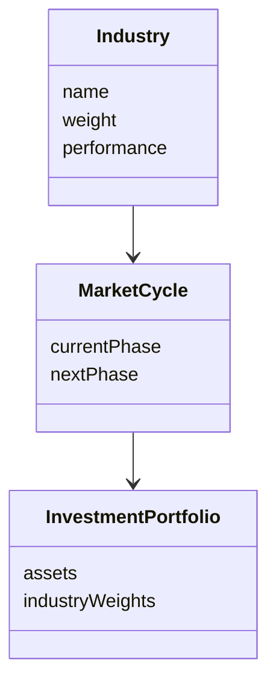
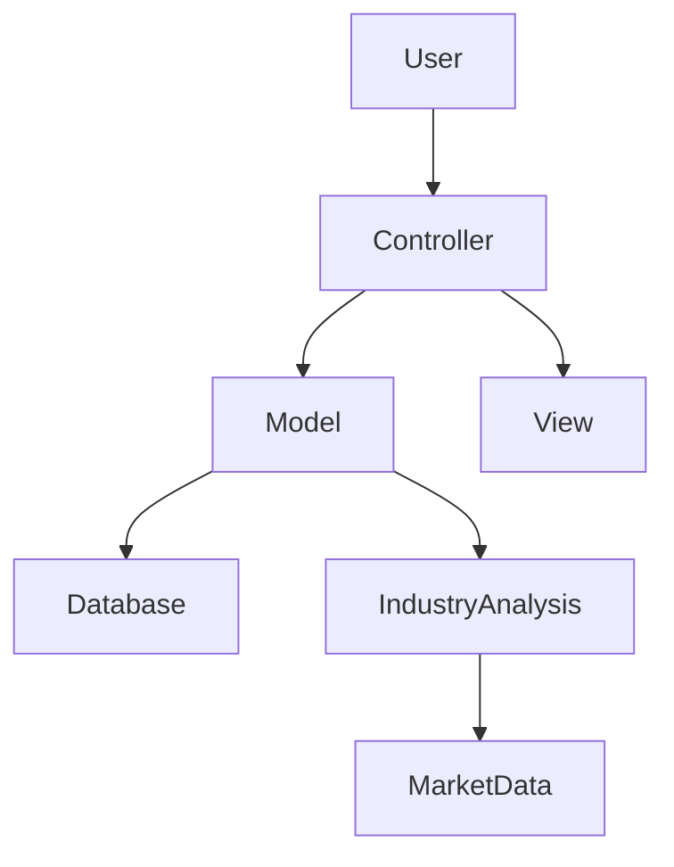

                 


# 彼得·林奇的行业轮动策略

---

## 关键词：
- 行业轮动策略
- 彼得·林奇
- 投资策略
- 市场周期
- 技术分析

---

## 摘要：
本文详细介绍了彼得·林奇的行业轮动策略，分析了其理论基础、数学模型和系统架构，结合实际案例进行讲解。文章从行业轮动的基本概念出发，深入探讨了策略的核心要素、实施步骤和优化方法，旨在为读者提供一个全面而系统的理解框架。

---

## 第一部分: 行业轮动策略的基本概念

### 第1章: 行业轮动策略的定义

#### 1.1 行业轮动的定义
行业轮动策略是一种投资策略，旨在通过分析不同行业在市场周期中的表现，动态调整投资组合中各行业的权重，以最大化收益并降低风险。

#### 1.2 彼得·林奇的投资理念
彼得·林奇是美国著名的基金经理，以其成功的投资业绩和独特的投资策略闻名。他主张通过深入研究行业和公司基本面，选择具有长期增长潜力的股票。

#### 1.3 行业轮动策略的重要性
行业轮动策略能够帮助投资者在不同市场环境下优化资产配置，捕捉行业间的轮动机会，从而实现超额收益。

---

## 第二部分: 行业轮动策略的理论基础

### 第2章: 行业轮动策略的数学模型

#### 2.1 行业轮动的数学公式
行业轮动策略的核心是根据市场周期的变化，动态调整各行业的权重。公式如下：

$$
w_i = \frac{p_i}{\sum p_j}
$$

其中，$w_i$ 是行业 $i$ 的权重，$p_i$ 是行业 $i$ 的预测收益。

#### 2.2 行业权重的计算方法
通过分析各行业的基本面和技术面指标，计算其相对于市场的相对表现，进而确定其权重。

#### 2.3 动态调整模型
根据市场变化实时调整行业权重，以适应市场波动。

---

## 第三部分: 行业轮动策略的系统架构设计

### 第3章: 系统功能设计

#### 3.1 领域模型（Mermaid 类图）


#### 3.2 系统架构图（Mermaid）


---

## 第四部分: 行业轮动策略的实战分析

### 第4章: 项目实战

#### 4.1 环境安装
需要安装Python和相关库（如pandas、numpy）。

#### 4.2 核心实现代码
```python
import pandas as pd
import numpy as np

def calculate_weights(industries, market_phase):
    # 根据市场阶段计算行业权重
    weights = {}
    for industry in industries:
        if market_phase == 'expansion':
            weights[industry] = 0.3 + np.random.normal(0, 0.1)
        elif market_phase == 'recession':
            weights[industry] = 0.1 + np.random.normal(0, 0.05)
    return weights

# 示例数据
industries = ['Technology', 'Healthcare', 'Finance']
market_phase = 'expansion'
weights = calculate_weights(industries, market_phase)
print(weights)
```

#### 4.3 案例分析
假设市场处于扩张周期，技术行业权重较高，而金融行业权重较低。通过动态调整权重，优化投资组合表现。

---

## 第五部分: 总结与扩展阅读

### 第5章: 总结
彼得·林奇的行业轮动策略是一种有效的投资方法，通过动态调整行业权重，捕捉市场机会。然而，实际应用中需结合市场环境和公司基本面进行优化。

### 5.1 小结
- 理论基础：市场周期与行业分析
- 实践应用：动态权重调整与系统架构设计
- 注意事项：行业轮动需结合市场环境和公司基本面

### 5.2 注意事项
- 行业轮动策略需根据市场变化及时调整
- 需结合技术分析和基本面分析

### 5.3 拓展阅读
- 《彼得·林奇的成功投资》
- 《投资学基础》

---

## 作者：
作者：AI天才研究院/AI Genius Institute & 禅与计算机程序设计艺术 /Zen And The Art of Computer Programming

