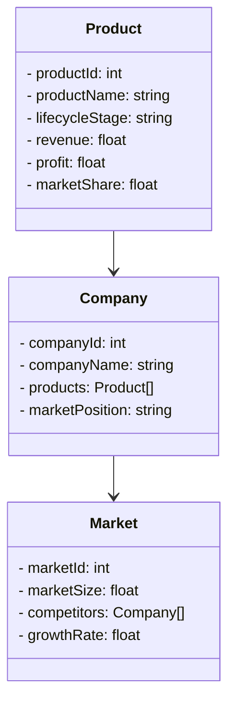
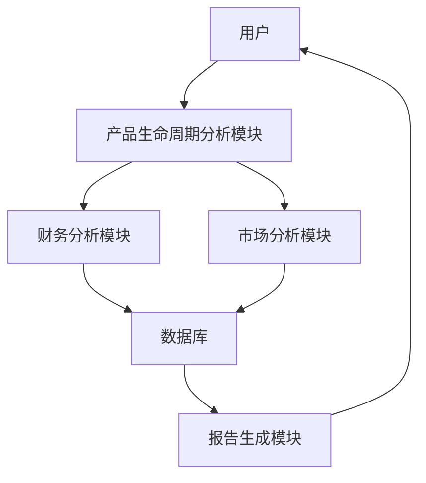
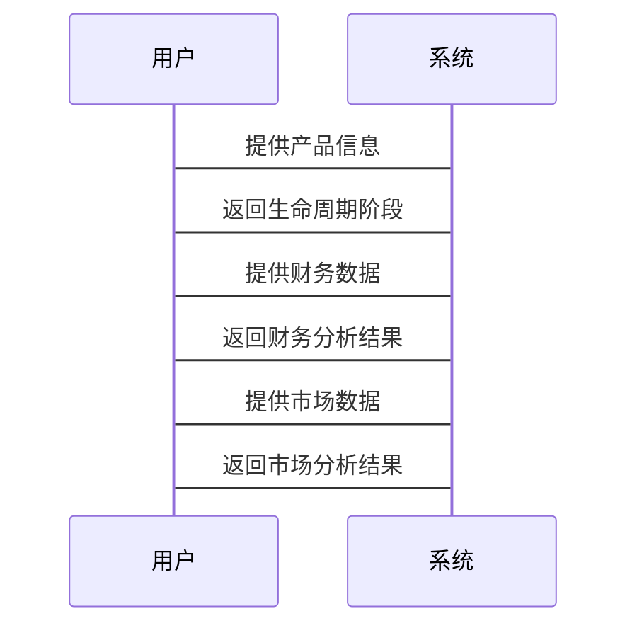

                 


# 彼得林奇如何分析公司的产品生命周期

> 关键词：彼得·林奇，产品生命周期，投资分析，公司分析，财务指标

> 摘要：本文深入探讨彼得·林奇如何通过分析公司的产品生命周期来评估投资价值。结合技术背景，文章详细讲解了产品生命周期的定义、阶段特征，以及林奇的分析方法和工具，包括财务指标、风险评估和系统架构设计，通过案例分析和实战项目展示其应用。

---

# 第一部分: 引言

# 第1章: 引言

## 1.1 彼得·林奇的背景介绍

### 1.1.1 彼得·林奇的生平简介

彼得·林奇（Peter Lynch）是全球著名投资专家，以其对基金投资的卓越成绩闻名。他管理麦哲伦基金期间取得了非凡的回报，平均年回报率超过29%。林奇的投资策略以基本面分析著称，尤其擅长分析公司的产品生命周期，以评估其投资价值。

### 1.1.2 他的投资理念与风格

林奇强调长期投资和深入分析，认为市场短期波动不应影响长期价值判断。他的分析方法注重公司基本面，特别是产品生命周期，这帮助他识别出具有长期增长潜力的企业。

### 1.1.3 产品生命周期分析的重要性

产品生命周期分析是评估公司投资价值的关键。通过了解产品所处阶段，投资者可以预测其收入、利润和市场表现，从而做出更明智的投资决策。

## 1.2 本书的目的与结构

### 1.2.1 本书的核心目标

本文旨在解释彼得·林奇如何分析公司产品生命周期，提供系统的分析框架和工具，帮助投资者评估公司投资价值。

### 1.2.2 目录结构概述

文章分为引言、产品生命周期概述、林奇的分析方法、案例分析、系统架构设计、项目实战和总结七个部分，涵盖从理论到实践的全过程。

### 1.2.3 预备知识与读者对象

读者应具备基础的财务知识和投资概念，适合投资专业人士、学生及对产品生命周期分析感兴趣的人群。

---

# 第二部分: 产品生命周期概述

# 第2章: 产品生命周期的定义与特点

## 2.1 产品生命周期的基本概念

### 2.1.1 产品生命周期的定义

产品生命周期指产品从引入市场到退出市场的过程，分为引入、成长、成熟和衰退四个阶段。

### 2.1.2 产品生命周期的阶段划分

- **引入阶段**：产品首次进入市场，需求低，成本高。
- **成长阶段**：市场需求增加，收入和利润上升。
- **成熟阶段**：市场趋于饱和，竞争激烈，利润稳定。
- **衰退阶段**：需求下降，利润减少，产品逐渐退出市场。

### 2.1.3 每个阶段的特征与挑战

| 阶段 | 特征 | 挑战 |
|------|------|------|
| 引入 | 低需求，高成本 | 市场推广困难，利润率低 |
| 成长 | 高增长，高竞争 | 进入壁垒高 |
| 成熟 | 饱和市场，利润稳定 | 竞争加剧，利润压缩 |
| 衰退 | 需求下降，利润减少 | 处理过剩库存 |

### 2.1.4 生命周期模型的图形表示


---

# 第3章: 产品生命周期对企业的影响

## 3.1 对企业利润的影响

- 引入阶段：初期投资大，利润低。
- 成长阶段：收入和利润迅速增长。
- 成熟阶段：利润稳定，增速放缓。
- 衰退阶段：利润下降，成本上升。

## 3.2 对企业战略的影响

企业需根据产品生命周期阶段调整战略。例如，引入阶段需加大营销投入，衰退阶段则考虑退出策略。

## 3.3 对企业投资决策的影响

投资者应根据产品生命周期阶段判断公司的增长潜力和投资价值。成熟阶段公司适合追求稳定收益，而成长阶段公司适合长期增长投资。

---

# 第三部分: 彼得·林奇的分析方法

# 第3章: 彼得·林奇的分析框架

## 3.1 林奇的分析方法概述

### 3.1.1 他的核心分析理念

林奇强调基本面分析，关注公司产品生命周期、财务状况和市场地位。

### 3.1.2 他使用的工具与方法

- 财务报表分析：收入、利润、市场份额。
- 市场分析：竞争对手分析，市场趋势预测。
- 竞争地位分析：市场份额，品牌影响力。

### 3.1.3 他分析的步骤与流程

1. **了解产品生命周期阶段**：确定产品处于引入、成长、成熟还是衰退阶段。
2. **评估财务指标**：分析收入、利润、成本结构。
3. **市场分析**：研究市场需求，竞争对手分析。
4. **风险评估**：识别各阶段风险，制定应对策略。
5. **投资决策**：基于分析结果，决定投资策略。

---

# 第4章: 林奇的分析工具与技巧

## 4.1 财务报表分析

### 4.1.1 收入与利润分析

- 收入：总收入增长情况。
- 利润：净利润、毛利率、营业利润率。

### 4.1.2 市场份额分析

- 市场份额：公司产品在市场中的占比。
- 市场增长：市场整体增长趋势。

### 4.1.3 成本结构分析

- 成本构成：原材料、人工、运营成本。
- 成本控制：比较不同阶段的成本变化。

---

## 4.2 产品生命周期的风险评估

### 4.2.1 每个阶段的风险特征

| 阶段 | 风险 | 解决策略 |
|------|------|----------|
| 引入 | 高风险，低回报 | 加大营销投入，优化产品 |
| 成长 | 高风险，高回报 | 抢占市场，建立品牌 |
| 成熟 | 中风险，稳定回报 | 提升效率，降低成本 |
| 衰退 | 低风险，低回报 | 撤退策略，资产变现 |

### 4.2.2 风险评估的方法

- 定性分析：评估市场、竞争环境。
- 定量分析：财务指标分析。

### 4.2.3 风险管理策略

- 成长阶段：积极扩展市场，建立竞争优势。
- 衰退阶段：逐步退出，减少损失。

---

# 第四部分: 案例分析

# 第4章: 案例分析

## 4.1 某公司的产品生命周期分析

### 4.1.1 公司背景介绍

假设某公司生产智能手机，已进入成熟阶段。

### 4.1.2 分析过程

1. **产品生命周期阶段**：成熟阶段。
2. **财务指标分析**：收入稳定，利润下降，市场份额稳定。
3. **市场分析**：竞争激烈，创新需求增加。
4. **风险评估**：市场竞争加剧，技术更新换代快。
5. **投资决策**：建议投资者关注技术创新和成本控制。

### 4.1.3 分析结果与投资建议

建议投资者保持谨慎，关注公司技术创新和成本控制能力，考虑在成熟阶段寻找价值低估的机会。

---

# 第五部分: 系统分析与架构设计

# 第5章: 系统分析与架构设计

## 5.1 系统功能设计

### 5.1.1 领域模型



### 5.1.2 系统架构设计



---

## 5.2 系统接口设计

- 用户输入：产品名称、公司名称、市场数据。
- 接口：API用于数据查询、分析结果返回。

---

## 5.3 系统交互设计



---

# 第六部分: 项目实战

# 第6章: 项目实战

## 6.1 环境安装

### 6.1.1 安装Python

```bash
python --version
pip install --upgrade pip
```

### 6.1.2 安装必要的库

```bash
pip install pandas numpy matplotlib
```

## 6.2 核心代码实现

### 6.2.1 数据处理

```python
import pandas as pd

# 读取数据
data = pd.read_csv('productLifecycle.csv')

# 数据清洗
data.dropna(inplace=True)
data = data[~data['revenue'].isin([0])]
```

### 6.2.2 可视化分析

```python
import matplotlib.pyplot as plt

# 绘制产品生命周期阶段分布
data['lifecycleStage'].value_counts().plot(kind='bar')
plt.title('Product Lifecycle Stage Distribution')
plt.show()
```

### 6.2.3 财务分析

```python
# 计算各个阶段的平均利润
stage_avg_profit = data.groupby('lifecycleStage')['profit'].mean()
print(stage_avg_profit)
```

## 6.3 案例分析与解读

### 6.3.1 数据分析结果

- 引入阶段平均利润低，但成长阶段利润显著增长。
- 成熟阶段利润稳定，衰退阶段利润下降。

### 6.3.2 投资建议

- 成长阶段公司具有高增长潜力，值得长期投资。
- 衰退阶段公司应关注成本控制和市场退出策略。

---

# 第七部分: 总结与最佳实践

# 第7章: 总结

## 7.1 最佳实践 tips

- 定期更新分析模型，适应市场变化。
- 结合多种分析方法，全面评估公司价值。
- 关注行业趋势和技术创新，及时调整分析策略。

## 7.2 小结

彼得·林奇的产品生命周期分析方法为投资者提供了强大的工具，帮助识别投资机会和风险。通过深入分析产品生命周期，投资者可以做出更明智的投资决策。

## 7.3 注意事项

- 数据准确性是分析的关键，确保数据来源可靠。
- 结合宏观经济环境和行业趋势，全面评估公司价值。
- 定期复盘和调整分析模型，以适应市场变化。

## 7.4 拓展阅读

- 《彼得·林奇的投资哲学》：深入理解林奇的投资理念。
- 《技术分析实战》：学习更多技术分析工具和方法。

---

# 作者：AI天才研究院/AI Genius Institute & 禅与计算机程序设计艺术/Zen And The Art of Computer Programming

---

本文通过详细分析彼得·林奇的产品生命周期分析方法，结合技术背景，为投资者提供了系统的分析框架和工具。希望读者能够通过本文，掌握如何应用这些方法，做出明智的投资决策。

