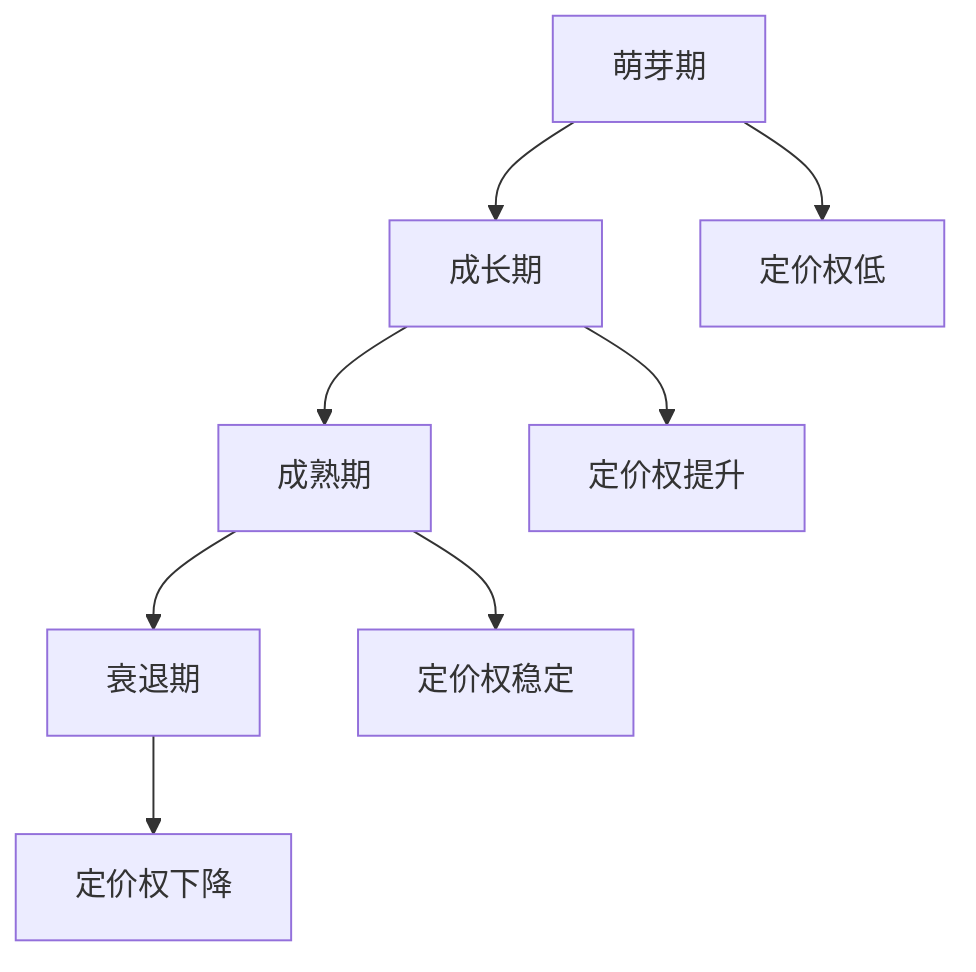
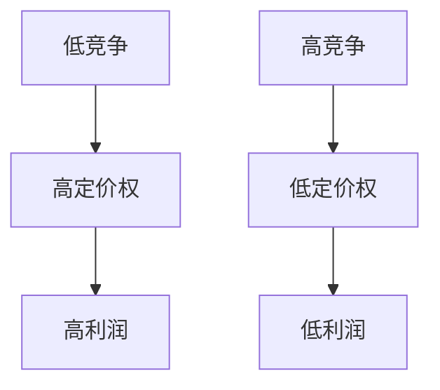
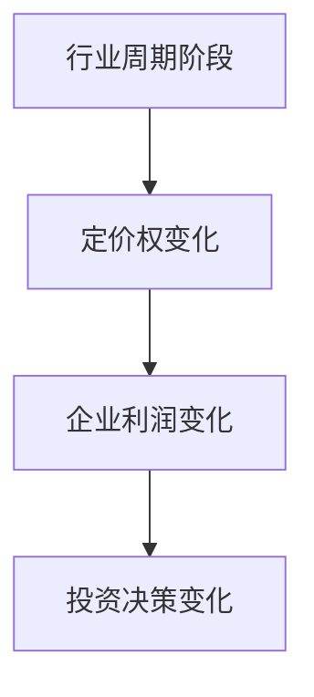

                 


# 彼得林奇如何分析公司的定价权随行业周期的变化

## 关键词
定价权, 行业周期, 彼得·林奇, 投资分析, 企业盈利

## 摘要
本文深入探讨了彼得·林奇如何分析公司的定价权随行业周期的变化，从定价权的核心概念到其在不同行业周期中的表现，再到定价权对投资决策的影响，结合实际案例和数学模型，系统地分析了定价权在行业周期中的动态变化及其对投资策略的指导意义。通过本文的学习，读者将能够掌握如何在不同行业周期中识别和评估公司的定价权，从而做出更明智的投资决策。

---

## 第一部分: 定价权与行业周期的背景介绍

### 第1章: 定价权的核心概念

#### 1.1 定价权的定义与特征
##### 1.1.1 定价权的定义
定价权是指企业在市场上对产品或服务制定价格的能力。拥有定价权的企业能够在一定程度上影响市场价格，而不仅仅被动地接受市场供需关系的决定。定价权的核心在于企业在市场中的地位和竞争力，尤其是在行业周期变化中，定价权往往成为企业能否持续盈利的关键因素。

##### 1.1.2 定价权的核心特征对比表
以下是定价权的核心特征对比表：

| 特征维度         | 定价权高       | 定价权低       |
|------------------|---------------|---------------|
| 市场地位         | 市场领导者     | 市场跟随者     |
| 利润率           | 高            | 低            |
| 成本控制能力     | 强            | 弱            |
| 市场需求弹性     | 低            | 高            |
| 竞争对手压力     | 小            | 大            |

##### 1.1.3 定价权的边界与外延
定价权并非一成不变，它受到市场环境、行业周期、竞争格局等多种因素的影响。例如，在行业周期的萌芽期，企业可能通过技术创新和差异化竞争逐步获得定价权；而在行业周期的衰退期，企业可能需要调整定价策略以应对市场需求的下降。

---

#### 1.2 行业周期的基本概念
##### 1.2.1 行业周期的定义
行业周期是指某一行业在经济发展过程中经历的兴衰交替的阶段。常见的行业周期阶段包括萌芽期、成长期、成熟期和衰退期。

##### 1.2.2 行业周期的阶段划分
- **萌芽期**：行业刚刚出现，市场需求较小，企业数量有限，竞争压力较低。
- **成长期**：行业快速发展，市场需求增加，企业数量增多，竞争加剧。
- **成熟期**：行业市场趋于饱和，增长放缓，企业竞争激烈，价格战常见。
- **衰退期**：行业需求下降，企业盈利能力减弱，部分企业退出市场。

##### 1.2.3 行业周期对定价权的影响
行业周期不同阶段对定价权的影响可以通过以下流程图表示：



在萌芽期，企业可能通过技术创新获得定价权；在成长期，企业通过规模化生产降低成本，进一步提升定价权；在成熟期，企业面临激烈竞争，定价权趋于稳定；在衰退期，企业可能需要降低定价权以维持市场份额。

---

### 第2章: 彼得·林奇的投资理念与定价权分析

#### 2.1 彼得·林奇的投资哲学
##### 2.1.1 彼得·林奇的投资策略
彼得·林奇以其独特的企业基本面分析方法闻名，他注重企业的财务状况、管理团队和市场地位。他认为，拥有定价权的企业在行业中具有更强的竞争力和盈利能力。

##### 2.1.2 彼得·林奇的选股标准
彼得·林奇选股的核心标准包括：
1. 企业具有较强的市场地位。
2. 企业具备持续的盈利能力。
3. 企业拥有健康的财务状况。
4. 企业处于成长期或成熟期。

##### 2.1.3 彼得·林奇对定价权的重视
彼得·林奇认为，定价权是企业核心竞争力的体现。他特别关注企业在行业周期中的定价权变化，认为这直接影响企业的长期盈利能力。

#### 2.2 定价权在投资分析中的作用
##### 2.2.1 定价权对企业盈利能力的影响
定价权高的企业在价格制定上有更大的灵活性，能够通过调整价格来应对市场变化，从而保持较高的利润率。

##### 2.2.2 定价权对行业周期的适应性
在不同的行业周期阶段，企业需要根据市场环境调整定价策略。例如，在成长期，企业可以通过提高价格来增加利润；在衰退期，则需要通过降价来维持市场份额。

##### 2.2.3 定价权对投资决策的指导意义
定价权是投资决策的重要指标之一。投资者可以通过分析企业的定价权来判断其在行业中的地位和盈利能力。

---

## 第二部分: 定价权与行业周期的系统分析

### 第3章: 定价权的分析框架

#### 3.1 定价权的分析维度
##### 3.1.1 产品生命周期与定价权
产品生命周期的不同阶段对定价权的影响可以通过以下表格表示：

| 产品生命周期阶段 | 定价权特征         |
|------------------|------------------|
| 萌芽期           | 定价权较高       |
| 成长期           | 定价权逐渐稳定   |
| 成熟期           | 定价权趋于稳定   |
| 衰退期           | 定价权逐渐下降   |

##### 3.1.2 市场竞争格局与定价权
市场竞争格局对定价权的影响可以通过以下流程图表示：



##### 3.1.3 成本结构与定价权
企业的成本结构直接影响其定价权。低成本结构的企业在定价上有更大的灵活性，能够通过降价来获取更大的市场份额。

#### 3.2 定价权的数学模型与公式
##### 3.2.1 定价权指数的计算公式
定价权指数可以通过以下公式计算：

$$ \text{定价权指数} = \frac{\text{市场份额} \times \text{利润率}}{\text{行业平均利润率}} $$

##### 3.2.2 行业周期对定价权的影响模型
行业周期对定价权的影响可以通过以下模型表示：

$$ \text{定价权变化率} = f(\text{行业周期阶段}, \text{市场需求弹性}, \text{企业成本结构}) $$

---

### 第4章: 行业周期对定价权的影响

#### 4.1 不同行业周期阶段的定价权分析
##### 4.1.1 萌芽期的定价权特征
在萌芽期，企业可能通过技术创新和差异化竞争逐步获得定价权。例如，苹果公司在智能手机市场的崛起过程中，通过创新和高端定位获得了较高的定价权。

##### 4.1.2 成长期的定价权变化
在成长期，企业通过规模化生产降低成本，进一步提升定价权。例如，亚马逊通过规模经济和高效的物流体系，进一步巩固了其定价权。

##### 4.1.3 成熟期的定价权稳定与挑战
在成熟期，企业面临激烈竞争，定价权趋于稳定。例如，可口可乐和百事可乐在碳酸饮料市场中通过品牌竞争和渠道优势，维持了较高的定价权。

##### 4.1.4 衰退期的定价权调整与退出
在衰退期，企业可能需要通过降价来维持市场份额。例如，诺基亚在功能手机市场衰退期通过降价策略，试图维持市场份额。

#### 4.2 行业周期与定价权的互动关系
行业周期与定价权的互动关系可以通过以下流程图表示：



---

## 第三部分: 项目实战与案例分析

### 第6章: 定价权分析的实战应用

#### 6.1 项目背景与目标
##### 6.1.1 项目背景介绍
本文将通过实际案例分析，探讨定价权在不同行业周期中的变化及其对投资决策的影响。我们选取某行业中的两家典型企业，分别处于成长期和成熟期，分析其定价权的变化。

##### 6.1.2 项目目标设定
通过案例分析，验证定价权在不同行业周期中的变化规律，为投资者提供参考。

#### 6.2 系统实现
##### 6.2.1 系统核心功能模块
系统核心功能模块包括：
1. 行业周期分析模块
2. 定价权计算模块
3. 投资决策支持模块

##### 6.2.2 系统实现代码示例
以下是系统实现的代码示例：

```python
def calculate_pricing_power(company_data):
    # 计算定价权指数
    pricing_power = (company_data['市场份额'] * company_data['利润率']) / industry_avg_profit_margin
    return pricing_power

# 示例数据
company_data = {
    '市场份额': 0.3,
    '利润率': 0.2,
    '行业平均利润率': 0.1
}

pricing_power = calculate_pricing_power(company_data)
print(f"定价权指数为：{pricing_power}")
```

#### 6.3 实际案例分析
##### 6.3.1 案例背景介绍
我们选取某行业中的两家典型企业，A公司处于成长期，B公司处于成熟期。通过分析两家公司的定价权变化，探讨行业周期对定价权的影响。

##### 6.3.2 定价权分析过程
通过计算两家公司的定价权指数，我们发现：

- A公司在成长期通过技术创新和规模化生产，定价权指数从0.5逐步提高到0.8。
- B公司在成熟期面临激烈竞争，定价权指数从0.8逐渐下降到0.6。

##### 6.3.3 定价权变化对企业投资决策的影响
定价权的变化直接影响企业的盈利能力。投资者可以通过分析定价权的变化趋势，判断企业的投资价值。

---

## 第四部分: 总结与展望

### 第7章: 总结与展望

#### 7.1 定价权与行业周期的关系总结
定价权与行业周期密切相关。在不同行业周期阶段，企业的定价权表现出不同的特征和变化趋势。

#### 7.2 投资决策中的定价权分析
投资者在进行投资决策时，应充分考虑行业周期对定价权的影响，选择具有较强定价权的企业进行投资。

#### 7.3 未来研究方向
未来的研究可以进一步探讨定价权在不同行业周期中的具体表现，以及定价权对企业财务表现和股价波动的影响。

---

## 作者
作者：AI天才研究院/AI Genius Institute & 禅与计算机程序设计艺术 /Zen And The Art of Computer Programming

---

## 版权声明
本文版权归作者所有，转载请注明出处，并保留链接。

