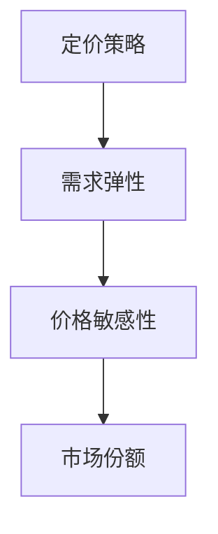
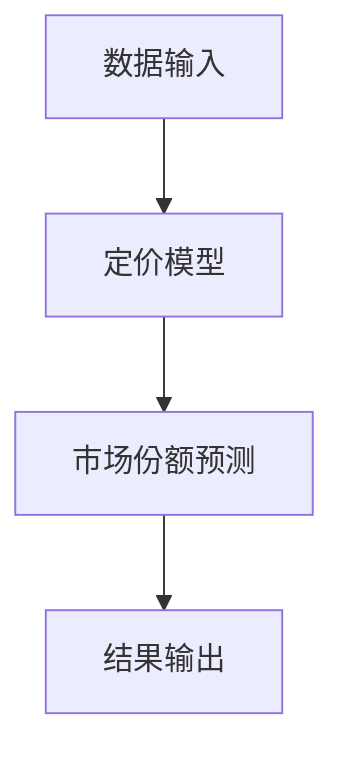

                 


# 彼得林奇如何分析公司的定价策略对市场份额的影响

> 关键词：定价策略、市场份额、彼得林奇、投资分析、定价模型、价格弹性、成本加成

> 摘要：本文深入分析了彼得·林奇如何通过定价策略来影响市场份额，从定价策略的基本概念、定价模型、数学原理到实际案例分析，详细阐述了定价策略对市场份额的影响。通过本文，读者可以了解彼得·林奇的定价策略分析方法，并掌握如何在实际投资中应用这些策略。

---

# 第一部分: 背景介绍

## 第1章: 定价策略与市场份额概述

### 1.1 定价策略的核心概念

#### 1.1.1 什么是定价策略
定价策略是企业制定产品或服务价格的一系列方法和规则。有效的定价策略能够平衡成本、市场需求和竞争环境，从而实现利润最大化或市场份额目标。

#### 1.1.2 定价策略的分类
定价策略可以分为以下几类：
1. 成本加成定价：基于成本加成一定比例确定价格。
2. 市场导向定价：根据市场需求和竞争情况确定价格。
3. 品牌溢价定价：通过品牌价值提升价格。
4. 动态定价：根据市场变化实时调整价格。

#### 1.1.3 定价策略的目标与边界
定价策略的目标通常包括利润最大化、市场份额最大化、品牌形象维护等。边界包括成本限制、市场需求弹性、竞争环境等。

### 1.2 彼得·林奇的投资理念

#### 1.2.1 彼得·林奇的背景介绍
彼得·林奇是美国著名的投资家，曾任富达投资的经理人。他以深入分析公司基本面和定价策略闻名。

#### 1.2.2 林奇的定价策略分析方法
林奇通过分析公司的定价策略，评估其市场竞争力和盈利能力。他关注价格弹性、成本结构和市场需求。

#### 1.2.3 林奇定价策略的核心思想
林奇认为，合理的定价策略能够平衡成本、需求和竞争，从而在市场中获得优势。

## 第2章: 市场份额的影响因素

### 2.1 市场份额的定义与测量
市场份额是指一家公司在某个市场中的销售量占总市场的比例。测量市场份额通常通过销售额、销量或用户数量来实现。

### 2.2 影响市场份额的关键因素
1. 产品差异化：独特的产品设计或功能可以吸引更多的消费者。
2. 价格敏感性：价格过高可能导致市场份额流失，价格过低可能影响利润。
3. 竞争对手的定价策略：竞争产品的定价直接影响市场份额。

### 2.3 定价策略对市场份额的长期影响
1. 高价策略：可能导致市场份额较低，但利润较高。
2. 中间价策略：平衡市场份额和利润。
3. 低价策略：可能增加市场份额，但利润较低。

---

# 第二部分: 核心概念与联系

## 第3章: 定价策略与市场份额的核心模型

### 3.1 定价模型的基本原理

#### 3.1.1 需求函数与价格弹性
需求函数描述了价格变化对需求量的影响。价格弹性表示需求量对价格变化的敏感程度。

#### 3.1.2 成本加成定价法
成本加成定价法是通过在成本基础上加成一定比例来确定价格。公式为：
$$ P = C + (C \times m) $$
其中，$C$ 是单位成本，$m$ 是加成比例。

#### 3.1.3 市场领导者定价法
市场领导者通过制定价格标准影响整个市场的定价。

### 3.2 彼得·林奇定价策略的分析框架

#### 3.2.1 林奇定价策略的核心要素
1. 成本分析：评估公司的生产成本。
2. 需求分析：了解市场需求和价格弹性。
3. 竞争分析：研究竞争对手的定价策略。

#### 3.2.2 定价策略与市场份额的关系模型
$$ Q = a - bP $$
其中，$Q$ 是需求量，$P$ 是价格，$a$ 和 $b$ 是常数。

#### 3.2.3 定价策略的数学模型
利润最大化条件：
$$ MR = MC $$

### 3.3 核心概念对比分析

#### 3.3.1 不同定价策略的对比表格
| 定价策略 | 优点 | 缺点 |
|----------|------|------|
| 高价策略 | 高利润 | 市场份额低 |
| 中间价策略 | 平衡利润和市场份额 | 适中 |
| 低价策略 | 市场份额高 | 利润低 |

#### 3.3.2 定价策略与市场份额的ER实体关系图


---

# 第三部分: 定价策略的数学模型与算法原理

## 第4章: 定价策略的数学模型

### 4.1 需求函数与价格弹性
需求函数：
$$ Q = a - bP $$
价格弹性公式：
$$ E = \frac{\% \Delta Q}{\% \Delta P} $$

### 4.2 成本加成定价法
定价公式：
$$ P = C + (C \times m) $$

### 4.3 利润最大化模型
利润最大化条件：
$$ MR = MC $$

## 第5章: 定价策略的算法实现

### 5.1 需求函数与价格弹性的Python实现
```python
def demand_function(price, a, b):
    return a - b * price

a = 100
b = 2
price = 50
demand = demand_function(price, a, b)
print(f"需求量为: {demand}")
```

### 5.2 成本加成定价法的Python实现
```python
def cost_plus_pricing(cost, markup):
    return cost + (cost * markup)

cost = 50
markup = 0.3
price = cost_plus_pricing(cost, markup)
print(f"定价为: {price}")
```

---

# 第四部分: 系统分析与架构设计

## 第6章: 系统分析与架构设计方案

### 6.1 问题场景介绍
通过分析公司定价策略，评估其对市场份额的影响。

### 6.2 系统功能设计
- 数据收集：市场需求、成本、竞争数据。
- 数据分析：定价策略、市场份额预测。
- 系统架构：数据输入、模型计算、结果输出。

### 6.3 系统架构设计


---

# 第五部分: 项目实战

## 第7章: 项目实战

### 7.1 环境安装
安装Python和必要的库。

### 7.2 核心实现源代码
```python
def calculate_profit(revenue, cost):
    return revenue - cost

revenue = 1000
cost = 600
profit = calculate_profit(revenue, cost)
print(f"利润为: {profit}")
```

### 7.3 实际案例分析
分析某公司的定价策略，预测市场份额变化。

---

# 第六部分: 总结与展望

## 第8章: 总结与展望

### 8.1 最佳实践
- 结合市场数据进行定价策略分析。
- 定期调整定价策略以适应市场变化。

### 8.2 小结
本文详细分析了彼得·林奇的定价策略，并通过数学模型和实际案例展示了其对市场份额的影响。

### 8.3 注意事项
- 定价策略需要结合市场环境和公司目标。
- 定期监控和调整定价策略。

### 8.4 拓展阅读
推荐相关书籍和论文，进一步深入学习定价策略和投资分析。

---

# 作者：AI天才研究院/AI Genius Institute & 禅与计算机程序设计艺术 /Zen And The Art of Computer Programming

通过本文的系统分析，读者可以深入了解彼得·林奇的定价策略分析方法，并将其应用到实际投资分析中。希望本文能为读者提供有价值的见解和实践指导。

