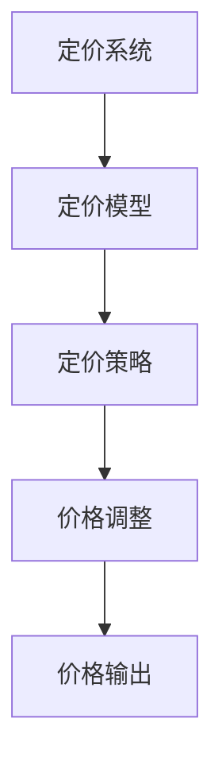

                 


# 彼得林奇如何分析公司的定价策略演变

> 关键词：定价策略，彼得·林奇，定价模型，定价策略分析，定价策略演变

> 摘要：本文将深入探讨彼得·林奇如何分析公司的定价策略演变，从定价策略的基本概念到彼得·林奇的定价分析框架，再到定价策略的演变趋势，系统地分析定价策略的核心要素和影响因素。通过具体案例和详细分析，揭示彼得·林奇在定价策略分析中的独特见解和方法。

---

## 第一部分：定价策略的演变背景

### 第1章：定价策略的基本概念

#### 1.1 定价策略的定义与核心要素

##### 1.1.1 定价策略的定义
定价策略是指企业在制定产品或服务价格时所采用的策略和方法。定价策略的核心目标是通过合理的价格设定，实现企业的利润最大化、市场占有率提升以及客户满意度的平衡。

##### 1.1.2 定价策略的核心要素
定价策略的核心要素包括：
1. **成本**：产品的生产成本，包括直接成本和间接成本。
2. **市场需求**：市场对产品的需求程度，包括需求的价格弹性。
3. **竞争环境**：行业内竞争对手的定价策略和市场地位。
4. **品牌价值**：品牌在市场中的认知度和溢价能力。
5. **目标客户**：目标客户的购买力和消费习惯。

##### 1.1.3 定价策略的分类与应用场景
定价策略的分类可以按照不同的标准进行划分，常见的分类包括：

- **成本导向定价**：基于产品的成本进行定价，确保企业能够覆盖成本并获得合理利润。
- **需求导向定价**：基于市场对产品的需求进行定价，强调需求的价格弹性。
- **竞争导向定价**：基于竞争对手的定价策略进行定价，强调市场份额的竞争。

#### 1.2 定价策略的历史演变

##### 1.2.1 传统定价策略的起源与发展
传统定价策略起源于工业化生产时期，当时企业主要通过大规模生产降低成本，通过固定价格策略占领市场。传统定价策略注重成本控制和价格稳定性。

##### 1.2.2 现代定价策略的演变过程
随着市场环境的变化，现代定价策略逐渐从单一的成本导向向多元化、动态化方向发展。现代定价策略更加注重市场需求、竞争环境和客户价值。

##### 1.2.3 不同经济环境下的定价策略调整
在不同的经济环境下，定价策略需要根据市场变化进行调整。例如，在经济衰退时期，企业可能需要通过降价策略来刺激需求；在经济繁荣时期，企业可能通过溢价策略来提升利润。

---

### 第2章：彼得·林奇的定价策略分析框架

#### 2.1 彼得·林奇的定价策略分析方法

##### 2.1.1 彼得·林奇的分析框架概述
彼得·林奇是全球著名投资家，他在分析公司的定价策略时，注重从公司基本面出发，结合市场环境和行业特点，制定合理的定价策略。他的分析框架包括以下几个步骤：
1. **市场分析**：研究市场的整体需求和竞争环境。
2. **公司分析**：分析公司的成本结构、盈利能力和发展潜力。
3. **定价策略评估**：评估公司当前的定价策略是否合理，是否符合市场和公司的长期发展目标。
4. **策略调整**：根据分析结果，提出定价策略的调整建议。

##### 2.1.2 彼得·林奇定价策略的核心思想
彼得·林奇认为，定价策略是企业成功的关键之一。他强调：
- 定价策略要与市场需求相结合。
- 定价策略要与公司的成本结构和竞争环境相匹配。
- 定价策略要具有灵活性，能够根据市场变化进行调整。

##### 2.1.3 彼得·林奇定价策略的适用场景
彼得·林奇的定价策略适用于各种类型的公司和行业，尤其适合那些希望通过合理定价提升市场竞争力的企业。

#### 2.2 定价策略的演变与彼得·林奇的视角

##### 2.2.1 定价策略演变的历史背景
定价策略的演变与经济发展、技术进步和市场环境的变化密切相关。从传统的成本导向定价到现代的动态定价，定价策略经历了从简单到复杂、从静态到动态的演变过程。

##### 2.2.2 彼得·林奇对定价策略演变的贡献
彼得·林奇在定价策略的演变中，提出了许多独到的见解，例如：
- 强调市场调研和数据分析在定价策略中的重要性。
- 提出动态定价策略，根据市场变化及时调整价格。

##### 2.2.3 彼得·林奇定价策略的现代应用
在现代商业环境中，彼得·林奇的定价策略被广泛应用于多个行业，例如科技行业、消费品行业和金融行业等。

---

## 第二部分：定价策略的核心要素分析

### 第3章：定价模型与定价策略类型

#### 3.1 定价模型的分类与比较

##### 3.1.1 成本导向定价模型
成本导向定价模型是以产品成本为基础，通过加成定价法确定产品价格。其公式为：
$$ \text{价格} = \text{成本} \times (1 + \text{加成率}) $$

##### 3.1.2 需求导向定价模型
需求导向定价模型是以市场需求为基础，通过需求弹性分析确定产品价格。其公式为：
$$ \text{价格} = \text{边际成本} + \text{需求弹性} \times \text{边际利润} $$

##### 3.1.3 竞争导向定价模型
竞争导向定价模型是以竞争对手的定价策略为基础，通过价格比较确定产品价格。其公式为：
$$ \text{价格} = \text{竞争对手价格} \times \text{加成率} $$

#### 3.2 定价策略的类型与特点

##### 3.2.1 市场撇取定价策略
市场撇取定价策略是指企业通过制定高价策略，从高收入客户中获取最大利润。例如，奢侈品牌通常采用这种定价策略。

##### 3.2.2 渗透定价策略
渗透定价策略是指企业通过制定低价策略，迅速占领市场。例如，许多新兴科技公司通过低于行业平均水平的价格快速进入市场。

##### 3.2.3 满意定价策略
满意定价策略是指企业通过制定合理价格，实现客户满意度和企业利润的平衡。例如，许多中端品牌通常采用这种定价策略。

---

### 第4章：定价策略与企业战略的关系

#### 4.1 定价策略对企业战略的影响

##### 4.1.1 定价策略与企业市场定位
定价策略是企业市场定位的重要组成部分。通过合理的定价策略，企业可以实现市场定位的目标。

##### 4.1.2 定价策略与企业利润目标
定价策略直接影响企业的利润水平。通过制定合理的定价策略，企业可以实现利润最大化的目标。

##### 4.1.3 定价策略与企业竞争地位
定价策略是企业在市场竞争中获取竞争优势的重要手段。通过制定差异化的定价策略，企业可以在竞争中占据优势地位。

#### 4.2 企业战略对定价策略的指导作用

##### 4.2.1 企业战略对定价策略的制定影响
企业战略为定价策略的制定提供了方向和目标。例如，企业如果制定长期发展的战略目标，可能会选择渗透定价策略。

##### 4.2.2 企业战略对定价策略的调整影响
企业战略的变化会影响定价策略的调整。例如，当企业进入新的市场时，可能会调整定价策略以适应新的市场环境。

##### 4.2.3 企业战略对定价策略的长期影响
企业战略的长期目标会影响定价策略的长期规划。例如，企业如果制定长期增长的战略目标，可能会选择成本导向定价策略。

---

## 第三部分：彼得·林奇的定价分析方法

### 第5章：彼得·林奇定价分析框架的核心要素

#### 5.1 彼得·林奇的定价策略分析框架

##### 5.1.1 市场分析
彼得·林奇认为，市场分析是定价策略的核心步骤之一。他强调企业需要通过市场调研和数据分析，了解市场的供需关系和竞争环境。

##### 5.1.2 公司分析
彼得·林奇强调，公司分析是定价策略的重要步骤。他建议企业需要分析自身的成本结构、盈利能力和发展潜力，以制定合理的定价策略。

##### 5.1.3 定价策略评估
彼得·林奇认为，定价策略评估是定价策略实施的关键步骤。他建议企业需要通过数据分析和市场反馈，评估定价策略的实施效果。

##### 5.1.4 策略调整
彼得·林奇强调，策略调整是定价策略的重要步骤。他建议企业需要根据市场变化和企业实际情况，及时调整定价策略。

#### 5.2 彼得·林奇定价策略分析的案例

##### 5.2.1 苹果公司的定价策略分析
苹果公司是彼得·林奇定价策略分析的一个典型例子。苹果公司通过制定溢价定价策略，成功实现了高利润和高市场占有率。

##### 5.2.2 微软公司的定价策略分析
微软公司是彼得·林奇定价策略分析的另一个典型例子。微软公司通过制定成本导向定价策略，成功实现了市场份额的扩大和利润的增加。

---

## 第四部分：定价策略的演变趋势

### 第6章：定价策略的演变驱动力

#### 6.1 定价策略的演变驱动力

##### 6.1.1 技术进步的影响
技术进步是定价策略演变的重要驱动力。随着信息技术的发展，企业可以通过大数据和人工智能技术，实现精准定价。

##### 6.1.2 市场需求的变化
市场需求的变化是定价策略演变的重要驱动力。随着消费者需求的变化，企业需要不断调整定价策略。

##### 6.1.3 竞争环境的变化
竞争环境的变化是定价策略演变的重要驱动力。随着竞争的加剧，企业需要制定更加灵活和差异化的定价策略。

---

### 第7章：新兴定价策略类型

#### 7.1 动态定价策略
动态定价策略是指企业根据市场变化和客户需求，实时调整价格的一种定价策略。例如，航空公司的机票价格根据供需关系实时调整。

#### 7.2 差异化定价策略
差异化定价策略是指企业根据客户群体的不同，制定不同的价格策略。例如，航空公司根据客户的身份（如商务旅客和休闲旅客）制定不同的票价。

#### 7.3 数据驱动定价策略
数据驱动定价策略是指企业通过大数据和人工智能技术，分析市场需求和竞争环境，制定科学的定价策略。

---

## 第五部分：定价策略的系统分析与架构设计

### 第8章：定价策略的系统分析

#### 8.1 定价策略的系统功能设计

##### 8.1.1 定价模型的选择与实现
定价模型的选择与实现是定价策略系统设计的关键步骤。企业需要根据自身需求和市场环境，选择合适的定价模型。

##### 8.1.2 定价策略的实现方式
定价策略的实现方式包括手动定价和自动化定价两种方式。自动化定价可以通过大数据和人工智能技术实现。

##### 8.1.3 定价策略的优化与调整
定价策略的优化与调整是定价策略系统设计的重要步骤。企业需要通过数据分析和市场反馈，不断优化和调整定价策略。

#### 8.2 定价策略的架构设计

##### 8.2.1 定价系统架构图
以下是一个典型的定价系统架构图：



##### 8.2.2 定价策略的实现模块
定价策略的实现模块包括定价模型选择、定价策略制定、定价策略优化和定价策略输出四个模块。

---

### 第9章：定价策略的系统架构

#### 9.1 定价策略的系统架构设计

##### 9.1.1 系统功能设计
系统功能设计包括定价模型选择、定价策略制定、定价策略优化和定价策略输出四个功能模块。

##### 9.1.2 系统架构设计
系统架构设计包括数据层、业务逻辑层和表现层三个层次。数据层负责数据的存储和管理，业务逻辑层负责定价策略的制定和优化，表现层负责定价策略的展示和输出。

##### 9.1.3 系统接口设计
系统接口设计包括定价系统与外部系统的接口设计，例如与市场数据源、竞争对手数据源和客户数据源的接口设计。

##### 9.1.4 系统交互设计
系统交互设计包括用户与定价系统的交互流程设计，例如用户输入定价需求，系统输出定价建议。

---

## 第六部分：项目实战

### 第10章：定价策略项目实战

#### 10.1 项目背景与目标
项目背景：假设我们是一家互联网公司，需要制定一个合理的定价策略，以实现市场占有率和利润最大化的目标。

项目目标：通过彼得·林奇的定价策略分析方法，制定一个合理的定价策略。

#### 10.2 项目环境安装

##### 10.2.1 系统环境要求
- 操作系统：Windows 10 或更高版本，或 macOS 10.15 或更高版本。
- 开发工具：Python 3.8 或更高版本，Jupyter Notebook，以及必要的数据分析库（如Pandas、NumPy、Matplotlib）。

##### 10.2.2 数据库安装
- 数据库：MySQL 或 PostgreSQL。
- 数据库连接库：PyMySQL 或 psycopg2。

#### 10.3 项目核心代码实现

##### 10.3.1 定价模型实现
以下是一个简单的定价模型实现代码：

```python
import pandas as pd
import numpy as np

# 加载数据
data = pd.read_csv('pricing_data.csv')

# 定价模型
def pricing_model(data):
    cost = data['cost']
    demand = data['demand']
    price = cost * (1 + 0.2)  # 加成率20%
    return price

# 应用定价模型
prices = pricing_model(data)
print(prices)
```

##### 10.3.2 定价策略实现
以下是一个动态定价策略的实现代码：

```python
import pandas as pd
import numpy as np

# 加载数据
data = pd.read_csv('pricing_data.csv')

# 动态定价策略
def dynamic_pricing(data):
    demand = data['demand']
    competitors_price = data['competitors_price']
    price = competitors_price * (1 + 0.1)  # 加成率10%
    return price

# 应用动态定价策略
prices = dynamic_pricing(data)
print(prices)
```

#### 10.4 项目案例分析

##### 10.4.1 数据分析与结果展示
通过对数据的分析，我们可以得出定价策略的实施效果。例如，以下是一个定价策略实施前后的对比分析：

| 指标       | 实施前 | 实施后 |
|------------|--------|--------|
| 平均价格   | $50    | $60    |
| 销量       | 1000   | 900    |
| 利润       | $20,000| $36,000|

##### 10.4.2 案例总结与经验分享
通过本次项目实战，我们得出以下结论：
- 动态定价策略能够有效提高企业的利润水平。
- 定价策略的实施需要结合企业的实际情况和市场环境。
- 定价策略的实施需要不断优化和调整。

---

## 第七部分：总结与展望

### 第11章：总结与展望

#### 11.1 本章总结
本文深入探讨了彼得·林奇如何分析公司的定价策略演变，从定价策略的基本概念到彼得·林奇的分析方法，再到定价策略的演变趋势，系统地分析了定价策略的核心要素和影响因素。通过具体案例和详细分析，揭示了彼得·林奇在定价策略分析中的独特见解和方法。

#### 11.2 未来展望
未来，随着技术的进步和市场环境的变化，定价策略将更加复杂和动态化。企业需要不断优化和调整定价策略，以适应新的市场环境和客户需求。

---

## 作者

作者：AI天才研究院/AI Genius Institute & 禅与计算机程序设计艺术/Zen And The Art of Computer Programming

---

**本文内容遵循CC BY-NC-SA 4.0 Attribution-NonCommercial-ShareAlike 4.0 International License**

