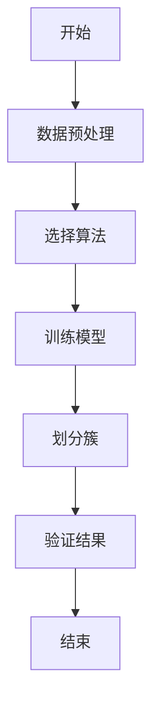
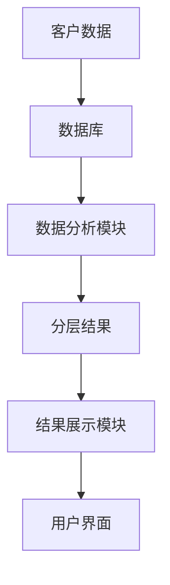

                 


# 彼得林奇如何分析公司的客户分层策略

## 关键词：客户分层，彼得·林奇，客户管理，数据分析，策略制定

## 摘要：本文将深入探讨彼得·林奇的客户分层策略分析方法，从理论到实践，结合系统设计、算法原理和项目实战，全面解析客户分层策略的制定与实施。

---

## 第一部分：客户分层策略的背景与概念

### 第1章：客户分层策略的定义与重要性

#### 1.1 客户分层策略的定义
- **1.1.1 什么是客户分层**
  客户分层是指根据客户的行为、属性、需求或价值，将客户划分为不同的群体，以便更精准地进行市场推广、服务和管理。
- **1.1.2 客户分层的必要性**
  通过分层，企业可以识别高价值客户，优化资源配置，提高客户满意度和忠诚度。
- **1.1.3 客户分层与公司价值的关系**
  客户分层直接关系到公司的收入、利润和客户 retention，是企业制定精准策略的基础。

#### 1.2 彼得·林奇的客户分层分析框架
- **1.2.1 林奇的客户分层方法**
  彼得·林奇通过分析客户的购买行为、需求和反馈，将客户分为不同层次，以制定针对性的策略。
- **1.2.2 林奇分析框架的核心要素**
  包括客户特征、需求分析、行为模式和价值评估。
- **1.2.3 林奇分析框架的适用范围**
  适用于各种行业，尤其是需要精准客户管理的金融、零售和科技领域。

---

## 第二部分：客户分层的核心概念与联系

### 第2章：客户分层的核心概念

#### 2.1 客户分层的原理
- **2.1.1 客户分层的基本原理**
  通过数据分析，识别客户之间的差异性，将其划分为多个群体，便于针对性管理。
- **2.1.2 客户分层的分类标准**
  包括客户价值、购买频率、需求偏好、地理位置等。
- **2.1.3 客户分层的实现步骤**
  数据收集、数据清洗、特征提取、聚类分析、结果验证。

#### 2.2 客户分层的属性特征对比
- **2.2.1 不同客户群体的特征对比**
  | 属性      | 高价值客户 | 中等价值客户 | 低价值客户 |
  |-----------|------------|--------------|------------|
  | 购买频率  | 高         | 中           | 低         |
  | 产品需求  | 高         | 中           | 低         |
  | 反馈响应  | 快         | 中           | 慢         |
- **2.2.2 客户分层的维度分析**
  - 财务维度：收入、支出、利润
  - 行为维度：购买频率、购买金额、产品偏好
  - 人口统计维度：年龄、性别、地区
- **2.2.3 客户分层的属性特征表格**
  上表展示了不同客户群体的主要特征对比。

#### 2.3 客户分层的ER实体关系图
```mermaid
erd
    顾客
    属性: 顾客ID, 姓名, 年龄, 性别, 地区, 收入, 购买频率
    购买记录
    属性: 订单ID, 顾客ID, 产品ID, 购买时间, 金额
    产品
    属性: 产品ID, 产品名称, 类别, 价格
    关系: 顾客 -> 购买记录, 1:N
    关系: 购买记录 -> 产品, N:1
```
该图展示了客户分层中的实体关系，包括顾客、购买记录和产品之间的关联。

---

## 第三部分：客户分层的算法原理

### 第3章：客户分层的算法原理

#### 3.1 客户分层的算法概述
- **3.1.1 常见的客户分层算法**
  - 聚类分析：K-means、层次聚类
  - 分类算法：决策树、随机森林
- **3.1.2 算法选择的依据**
  根据数据特征和业务需求选择合适的算法。
- **3.1.3 算法的优缺点对比**
  | 算法类型 | 优点           | 缺点           |
  |----------|----------------|----------------|
  | K-means  | 实现简单，效率高 | 对异常值敏感    |
  | 层次聚类 | 易解释          | 对大数据效率低  |

#### 3.2 客户分层的聚类分析
- **3.2.1 聚类分析的基本原理**
  将客户数据划分为若干簇，每个簇内的客户具有相似特征。
- **3.2.2 聚类分析的实现步骤**
  1. 数据预处理：清洗、归一化
  2. 选择聚类算法：K-means
  3. 训练模型并划分簇
  4. 验证簇的有效性
- **3.2.3 聚类分析的数学模型**
  聚类目标函数：$$ \sum_{i=1}^{k} \sum_{j=1}^{n_i} (x_j - \mu_i)^2 $$
  其中，k为簇数，n_i为第i簇的样本数，$\mu_i$为第i簇的中心点。

#### 3.3 客户分层的算法流程图


---

## 第四部分：客户分层的系统分析与架构设计

### 第4章：客户分层的系统分析

#### 4.1 客户分层的系统需求
- **4.1.1 系统需求的分析**
  - 数据采集：收集客户行为数据
  - 数据分析：进行客户分层
  - 界面展示：可视化分层结果
- **4.1.2 系统需求的分类**
  - 前端需求：用户界面设计
  - 后端需求：数据分析与处理
- **4.1.3 系统需求的实现步骤**
  1. 数据库设计
  2. 界面设计
  3. 算法实现

#### 4.2 客户分层的系统功能设计
- **4.2.1 系统功能模块划分**
  - 数据采集模块
  - 数据分析模块
  - 结果展示模块
- **4.2.2 系统功能的实现流程**
  1. 数据采集：获取客户数据
  2. 数据分析：进行分层
  3. 结果展示：可视化分层结果
- **4.2.3 系统功能的详细说明**
  数据采集模块负责收集客户的基本信息和行为数据，数据分析模块使用聚类算法进行分层，结果展示模块将分层结果以图表形式呈现。

#### 4.3 客户分层的系统架构设计


---

## 第五部分：客户分层的项目实战

### 第5章：客户分层的项目实战

#### 5.1 项目环境的安装与配置
- **5.1.1 环境的安装步骤**
  1. 安装Python
  2. 安装Pandas和Scikit-learn库
- **5.1.2 环境的配置要求**
  - Python版本：3.8+
  - 数据库：MySQL或MongoDB
- **5.1.3 环境的测试与验证**
  运行简单的Python脚本，验证环境是否配置正确。

#### 5.2 项目核心功能的实现
- **5.2.1 核心功能的实现步骤**
  1. 数据清洗：删除缺失值和异常值
  2. 数据归一化：标准化特征
  3. 聚类分析：使用K-means算法进行分层
  4. 可视化结果：使用Matplotlib绘制簇分布图
- **5.2.2 核心功能的实现代码**
  ```python
  import pandas as pd
  from sklearn.cluster import KMeans
  import matplotlib.pyplot as plt

  # 数据预处理
  data = pd.read_csv('customer_data.csv')
  data = data.dropna()
  data = (data - data.mean()) / data.std()

  # 聚类分析
  kmeans = KMeans(n_clusters=3, random_state=42)
  clusters = kmeans.fit_predict(data)

  # 可视化
  plt.scatter(data.iloc[:, 0], data.iloc[:, 1], c=clusters, cmap='viridis')
  plt.title('Customer Clustering')
  plt.show()
  ```

#### 5.3 项目实战的实际案例分析
- **5.3.1 实际案例分析**
  假设我们有客户数据，通过聚类分析将客户分为高、中、低三类。
- **5.3.2 项目小结**
  通过项目实战，我们掌握了客户分层的基本方法和实现步骤。

---

## 第六部分：最佳实践与总结

### 第6章：最佳实践

#### 6.1 小结
- 客户分层是企业精准管理的关键策略。
- 通过数据分析和算法实现，企业可以更好地识别和管理高价值客户。

#### 6.2 注意事项
- 数据质量直接影响分层结果，需重视数据清洗和预处理。
- 选择合适的算法和参数，避免过拟合或欠拟合。

#### 6.3 拓展阅读
- 推荐阅读《数据分析实战》和《机器学习实战》。

---

## 作者：AI天才研究院 & 禅与计算机程序设计艺术

通过本文，我们详细探讨了彼得·林奇的客户分层策略，从理论到实践，结合系统设计、算法原理和项目实战，全面解析了客户分层策略的制定与实施。希望本文能为读者提供有价值的参考和启发。

