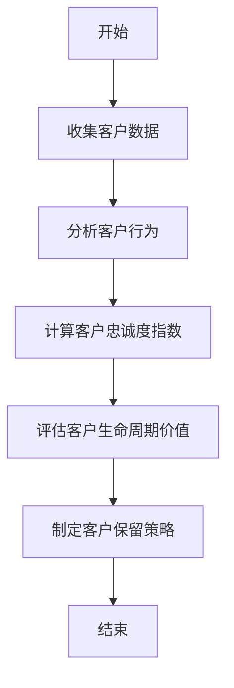
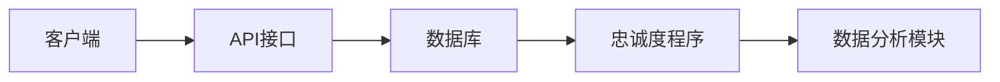

                 


# 彼得林奇如何分析公司的客户忠诚度程序

## 关键词：
- 彼得林奇
- 客户忠诚度
- 程序分析
- 投资策略
- 企业价值

## 摘要：
本文将探讨彼得·林奇如何通过分析客户的忠诚度程序来评估公司的长期价值。通过详细分析客户忠诚度的核心概念、衡量指标、与企业价值的关系以及彼得林奇的分析框架，本文将提供一套系统化的分析方法，帮助投资者和企业管理者更好地理解客户忠诚度程序对公司价值的影响。结合实际案例和系统设计，本文将深入剖析如何通过客户忠诚度程序来优化投资决策和企业战略。

---

# 第一部分：客户忠诚度程序的背景与重要性

## 第1章：客户忠诚度程序的定义与重要性

### 1.1 客户忠诚度程序的定义

#### 1.1.1 什么是客户忠诚度程序
客户忠诚度程序是指企业通过各种手段和策略，如积分奖励、会员体系、个性化服务等，来提高客户对品牌的忠诚度和满意度的一系列措施。

#### 1.1.2 客户忠诚度程序的核心要素
- **积分系统**：客户通过消费积累积分，积分可以兑换商品或服务。
- **会员等级**：客户根据消费金额或频率被划分到不同的会员等级，享受不同的优惠。
- **个性化服务**：基于客户行为数据分析，提供定制化的产品推荐和服务。

#### 1.1.3 客户忠诚度程序与客户满意度的关系
客户忠诚度程序不仅仅是提高客户满意度，更重要的是通过持续的互动和奖励机制，培养客户的长期忠诚。

---

### 1.2 客户忠诚度程序的重要性

#### 1.2.1 客户忠诚度对企业价值的影响
- **客户保留率**：高客户忠诚度意味着客户更可能重复购买，降低客户获取成本。
- **客户生命周期价值**：忠诚的客户为企业创造的长期收入和利润更高。
- **品牌影响力**：忠诚的客户更可能推荐品牌给他人，扩大品牌影响力。

#### 1.2.2 客户忠诚度程序在企业经营中的作用
- **提高客户保留率**：通过奖励机制和个性化服务，降低客户流失率。
- **增加客户粘性**：通过积分和会员体系，增强客户对品牌的依赖感。
- **提升客户满意度**：通过数据分析和个性化推荐，提高客户满意度。

#### 1.2.3 客户忠诚度程序与企业长期发展的关系
- 长期客户关系管理：客户忠诚度程序是企业长期发展的基石。
- 市场竞争力：高客户忠诚度可以提升企业的市场竞争力。

---

### 1.3 彼得林奇的客户忠诚度分析方法

#### 1.3.1 彼得林奇的分析框架
彼得·林奇通过分析客户忠诚度程序，评估公司的客户保留能力、客户满意度和客户生命周期价值，从而判断公司的长期盈利能力。

#### 1.3.2 客户忠诚度程序在投资决策中的应用
- **客户保留率分析**：通过客户忠诚度程序，评估公司的客户保留能力。
- **客户满意度分析**：通过客户反馈和数据分析，评估客户的满意度。
- **客户生命周期价值分析**：通过客户忠诚度程序，预测客户的长期价值。

#### 1.3.3 彼得林奇分析方法的优缺点
- 优点：能够通过客户忠诚度程序，评估公司的长期盈利能力。
- 缺点：需要大量的客户数据支持，且分析过程较为复杂。

---

## 第2章：客户忠诚度程序的核心概念与联系

### 2.1 客户忠诚度的衡量指标

#### 2.1.1 客户保留率
客户保留率是指在一定时间内，客户继续使用企业产品或服务的比例。客户保留率越高，说明客户忠诚度越高。

#### 2.1.2 客户满意度
客户满意度是客户对产品或服务的满意程度的衡量指标。高客户满意度通常意味着客户忠诚度较高。

#### 2.1.3 客户生命周期价值
客户生命周期价值是指客户在生命周期内为企业带来的总收入和利润。高客户生命周期价值通常与高客户忠诚度相关。

---

### 2.2 客户忠诚度与企业价值的关系

#### 2.2.1 客户忠诚度对企业利润的影响
高客户忠诚度可以降低客户获取成本，增加重复购买，从而提高企业利润。

#### 2.2.2 客户忠诚度与企业市场地位的关系
高客户忠诚度可以增强企业的市场地位，提高品牌影响力和市场份额。

#### 2.2.3 客户忠诚度与企业创新发展的关系
高客户忠诚度可以为企业提供稳定的客户基础，支持企业进行产品和服务创新。

---

### 2.3 客户忠诚度程序的ER实体关系图

```mermaid
erDiagram
    customer [客户] {
        id : int
        name : string
        email : string
        phone : string
    }
    transaction [交易] {
        id : int
        date : date
        amount : decimal
        customer_id : int
    }
    loyalty_program [忠诚度程序] {
        id : int
        name : string
        points : int
        tier : string
        customer_id : int
    }
    customer -> loyalty_program : 参与
    customer -> transaction : 进行
    loyalty_program -> transaction : 记录积分
```

---

## 第3章：客户忠诚度程序的算法原理

### 3.1 客户忠诚度的量化分析

#### 3.1.1 客户忠诚度指数的计算公式
$$ \text{客户忠诚度指数} = \frac{\text{客户保留率} + \text{客户满意度}}{2} $$

#### 3.1.2 客户生命周期价值的预测模型
$$ \text{客户生命周期价值} = \text{客户平均消费金额} \times \text{客户生命周期长度} $$

---

### 3.2 客户忠诚度程序的流程分析



---

### 3.3 客户忠诚度程序的Python实现

#### 3.3.1 核心代码实现
```python
def calculate_customer Loyalty(customer_data):
    retention_rate = customer_data['retention_rate']
    satisfaction_score = customer_data['satisfaction_score']
    loyalty_index = (retention_rate + satisfaction_score) / 2
    return loyalty_index

def predict_life_time_value(customer_data):
    average_revenue = customer_data['average_revenue']
    lifetime = customer_data['lifetime']
    lifetime_value = average_revenue * lifetime
    return lifetime_value
```

---

## 第4章：客户忠诚度程序的系统分析与架构设计

### 4.1 系统功能设计

#### 4.1.1 客户数据管理
- 收集和存储客户数据，包括客户ID、姓名、联系方式等。

#### 4.1.2 交易记录管理
- 记录客户的交易记录，包括交易金额、时间等。

#### 4.1.3 忠诚度积分管理
- 根据客户的交易记录计算积分，并更新客户的忠诚度等级。

---

### 4.2 系统架构设计



---

## 第5章：客户忠诚度程序的项目实战

### 5.1 案例分析

#### 5.1.1 案例背景
以某零售企业为例，分析其客户忠诚度程序的设计和实施效果。

#### 5.1.2 环境安装
- 安装Python和相关数据分析库（如Pandas、NumPy）。
- 安装数据库管理系统（如MySQL）。

#### 5.1.3 核心代码实现
```python
import pandas as pd
import numpy as np

# 数据导入
customer_data = pd.read_csv('customer.csv')

# 忠诚度指数计算
customer_data['loyalty_index'] = (customer_data['retention_rate'] + customer_data['satisfaction_score']) / 2

# 终生价值预测
customer_data['lifetime_value'] = customer_data['average_revenue'] * customer_data['lifetime']
```

---

## 第6章：客户忠诚度程序的最佳实践

### 6.1 小结

- 客户忠诚度程序是企业长期发展的关键因素。
- 彼得林奇的分析方法可以帮助投资者和企业管理者更好地评估客户忠诚度程序的价值。

### 6.2 注意事项

- 数据分析需要准确性和全面性。
- 客户忠诚度程序的设计需要结合企业的实际情况。

### 6.3 拓展阅读

- 《彼得·林奇的成功投资策略》
- 《客户忠诚度管理的实战技巧》

---

# 作者：AI天才研究院/AI Genius Institute & 禅与计算机程序设计艺术 /Zen And The Art of Computer Programming

